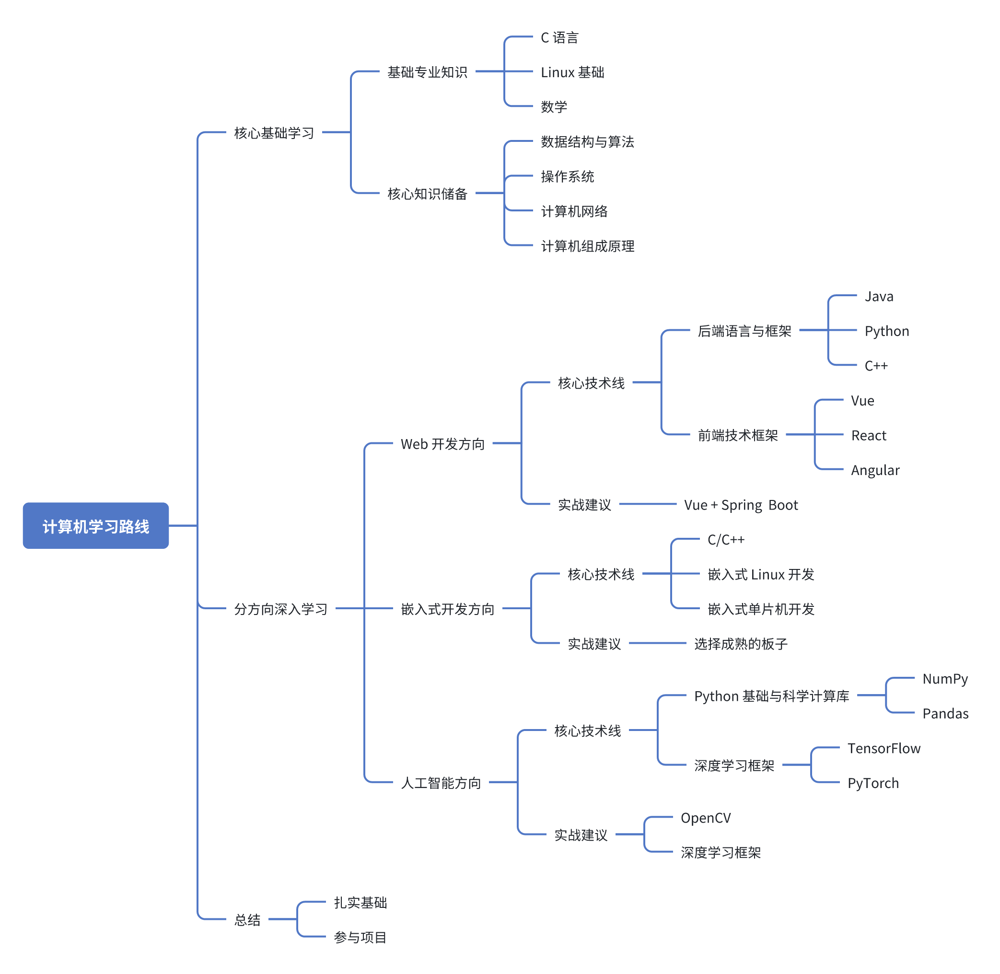

# 让后来者少走弯路

程序员的悲哀是什么？程序员出去创业以后发现，99%的问题都不是技术问题，技术没想象的那么重要；

程序员干的越久越发现，自己不懂的技术越来越多；程序员的世界全都是代码，当你离开这个岗位以后会发现，99%的世界其实跟编程没关系。

程序员的悲哀就是，想吃技术饭，想做架构师，想要走专家路线，但是国内软件开发绝大多数是应用开发，对技术的要求不高，对专家的需求很少。

最后才发现，自己的技术也没达到一定的高度，也没赚到钱，然后突然想明白了，我们都是普通人，我们都是打工人，这就是大多数程序员的现状。

在程序说明中，[] 并不是孤立使用的，它和一套符号体系配合，让语法一目了然：

| 符号       | 含义           | 示例                       |
| ---------- | -------------- | -------------------------- |
| `[ ]`      | 可选           | `ls [-l]` 表示 `-l` 可省略 |
| `< >`      | 必填的占位符   | `cp <source> <dest>`       |
| `{x \| y}` | 多选一（必填） | `{start\|stop}`            |
| `[x \| y]` | 多选一（可选） | `[-a\|-b]`                 |
| `...`      | 可重复         | `[file...]`                |
