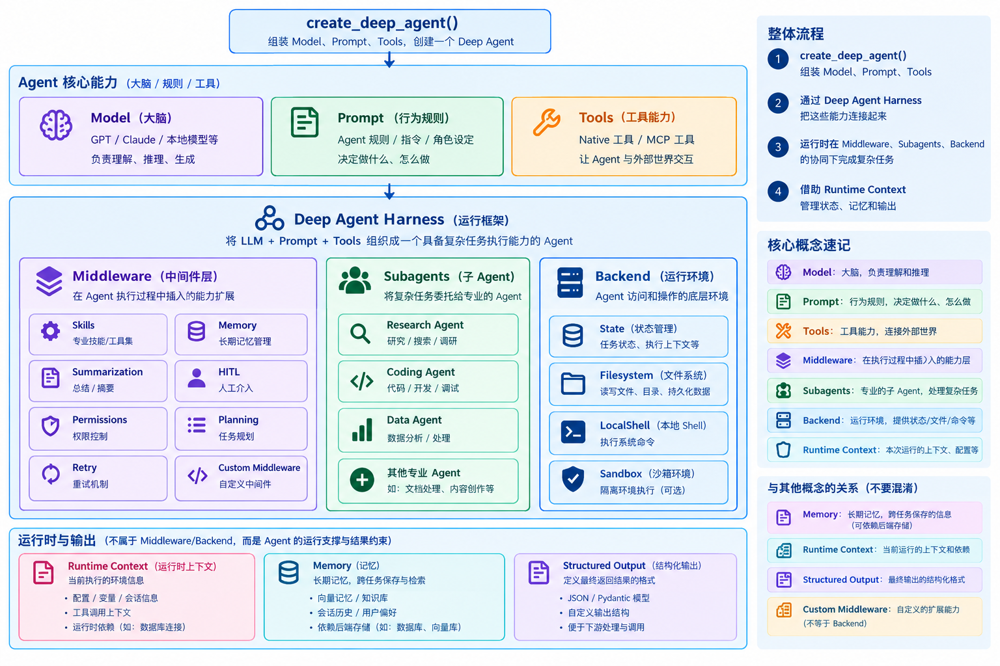

# DeepAgents-2-定制组装

```bash
create_deep_agent(...)
        │
        ▼
   Deep Agent Harness
        │
        │ agent.ainvoke(...)
        ▼
   Agent Runtime
        │
        ├── Runtime Context
        ├── Middleware
        ├── Subagents
        ├── Tools
        └── Execution Environment

# Runtime Context 是运行时提供/携带的上下文和依赖，不是 Harness 执行完之后产生的结果。
```

- Model: 想，
- Prompt: 规定怎么想，
- Tools: 让它做事，
- Middleware: 在 Agent 执行过程中插入能力，
- Subagents: 帮它分工，
- Backend: 某些能力背后的资源/数据访问实现；
- Runtime Context: 提供本次运行的信息，
- Memory: 保存长期信息，
- Structured Output: 规定最终怎么返回。

- Filesystem Tools = Agent 实际看到并调用的文件工具
- State / Store / Filesystem = Backend 后面的数据落点

- create_deep_agent(): 负责把 Model、Prompt、Tools 组装成 Deep Agent；
- Deep Agent Harness: 给普通 Agent 加上 Deep Agent 的能力(通过 Middleware、Subagents、Backend 等机制，让这个 Agent 从“会调用工具的 LLM”升级成“能够长期、复杂、自主完成任务的 Agent”。)
- Agent Runtime = 真正跑起来
- Agent Loop = LLM → 判断 → Tool/Middleware/Subagent → 再 LLM → …

- 真正应该记住的“7句话”
  1. ① create_deep_agent():
  2. ② model: Agent 的大脑。
  3. ③ tools: Agent 的手。
  4. ④ subagents: 把复杂任务拆给专业 Agent。
  5. ⑤ middleware: 在 Agent 执行链中插入能力/控制逻辑。
  6. ⑥ backend + filesystem: 给 Agent 一个可以保存和操作中间产物的工作空间。
  7. ⑦ skills + memory: Skills 告诉它“怎么做”，Memory 告诉它“需要知道什么”。

## 文档明确列出了 create_deep_agent 的主要可定制参数，包括

- model
- system_prompt
- tools
- memory: 启动时加载 AGENTS.md 文件
- skills
- backend: Deep Agent 的“文件存储层”
- permissions: 文件系统的路径级访问控制
- subagents
- middleware
- interrupt_on: 在工具请求人工批准之前请稍等片刻
- response_format
- state_schema: Agent自己运行过程中产生/维护的状态
- context_schema: 调用 Agent 时给它的运行上下文
- profiles: 给不同模型“定制默认配置”

这其实就是 Deep Agents 的“能力插槽”。

### Skills：不是 Tool，而是“能力说明书”

Tool = 你能做什么
Skill = 你应该怎么做

例如：

```bash
  tools/
      read_file
      write_file

  skills/
      coding/
          SKILL.md
      sql/
          SKILL.md
      research/
          SKILL.md
```

- 为什么 Skills 不全部塞进 System Prompt？
  为 Deep Agents 使用：Progressive Disclosure (渐进式呈现)

即：

```bash
  Agent启动
   ↓
  只看到 Skill 的目录/元信息
   ↓
  用户任务来了
   ↓
  判断需要 SQL Skill
   ↓
  才加载 SQL Skill
```

这样可以：

- 减少 Token
- 减少 Context
- 减少干扰
- 提高 Agent 专业能力

文档明确指出 Skills 是在 Agent 判断需要时才加载。

### Memory：给 Agent 一份长期规则

- Memory 和 Skills 的区别

  |          | Memory                    | Skills                       |
  | -------- | ------------------------- | ---------------------------- |
  | 作用     | 告诉 Agent“背景/长期规则” | 告诉 Agent“怎么完成某类任务” |
  | 典型内容 | 项目规范                  | SQL操作指南                  |
  | 示例     | AGENTS.md                 | skills/sql/SKILL.md          |
  | 加载     | Memory                    | 按需                         |
  | 核心     | Context                   | Capability                   |

Memory = 你需要知道什么
Skill = 你需要怎么做

### Backend：Deep Agent 的“文件存储层”

- 值：
  - StateBackend: 默认 (当前 Thread (对话)临时空间)
  - FilesystemBackend: 用本地磁盘(不同用户容易串)
  - LocalShellBackend
  - StoreBackend: 跨 Thread 持久空间
  - ContextHubBackend
  - CompositeBackend:

- StateBackend类似于

  ```bash
    Thread A、B (A、B是2次具体对话)
       ↓
    LangGraph Checkpoint
       ↓
    StateBackend
       ↓
    Virtual Files
  ```

#### Sandbox(沙盒)：真正让 Agent“执行代码”

- Sandbox 可以让 Agent：
  - 写文件
  - 安装依赖
  - 执行命令
  - 在隔离环境运行

### middleware

- 可以做：
  - 日志
  - Retry
  - 权限
  - PII 检测
  - Human-in-the-loop
  - Prompt 修改
  - Summarization
  - Tool Call 拦截
  - 统计
  - 审计

  文档明确说 Deep Agents 支持 LangChain middleware，以及自己的 middleware

- 默认情况下，Deep Agents 会自动组装类似：

```bash
  SkillsMiddleware
          ↓
  FilesystemMiddleware
          ↓
  SubAgentMiddleware
          ↓
  SummarizationMiddleware
          ↓
  PatchToolCallsMiddleware
          ↓
  AsyncSubAgentMiddleware
          ↓
  你的 Middleware
          ↓
  Profile Middleware
          ↓
  Prompt Cache
          ↓
  MemoryMiddleware
          ↓
  HumanInTheLoop
```

### Middleware 🆚 Profiles

Middleware = Agent能力/执行流程的扩展
Profile = 针对某个模型的默认配置


