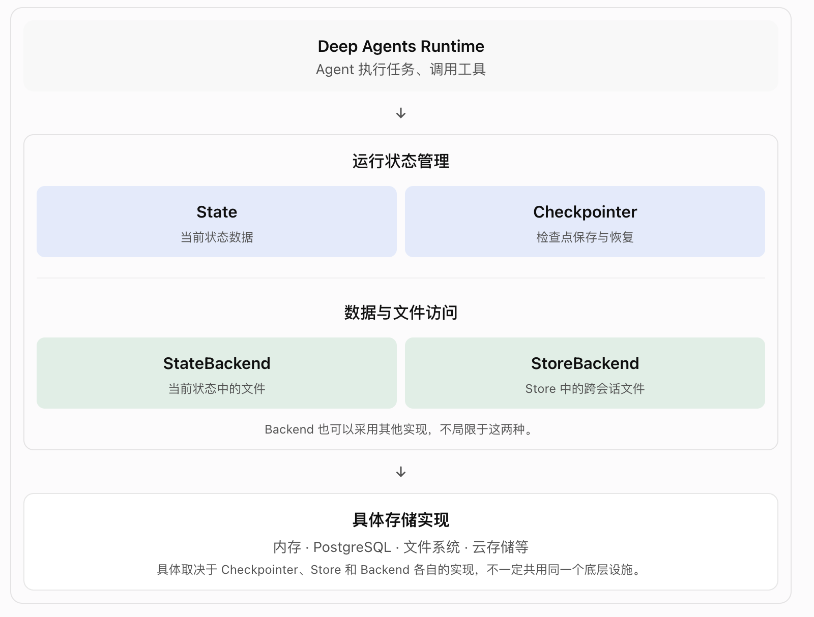

# DeepAgents-4.2-执行环境-后台

Backend 不是 Agent 的“工具”，而是 Agent 文件系统工具背后的“存储/执行实现”。

```bash
                                Deep Agent
                                    │
                              Agent Runtime
                        ┌───────────┴───────────┐
                        ▼                       ▼
              Execution Environment            。。。。
                        │
             ┌──────────┼───────────┐
             ▼          ▼           ▼
       localShell   Filesystem    Sandbox
                        │
                        ▼
              Filesystem Middleware
                        │ 提供
                        ▼
        ┌───────────────┴───────────────┐
        │       filesystem tools        │
        │                               │
        │ ls / read_file / write_file   │
        │ edit / delete / glob / grep   │
        └───────────────┬───────────────┘
                        │ 操作通过 Backend 执行
                        ▼
                     Backend (Filesystem Tools 操作的实际数据层适配器)
                        │
       ┌────────────────┼─────────────────┐
       ↓                ↓                 ↓
 StateBackend     FilesystemBackend   StoreBackend
 (当前 thread 的工作文件)               (长期记忆 / 共享文件)
       ↓                ↓                 ↓
 LangGraph State   本地真实磁盘       LangGraph Store
                                          ↓
                                     持久化存储实现(例 PostgreSQL)

 # Backend 不是“Filesystem Middleware 的下一层运行环境”
 # 也就是说：read_file() 并不直接决定“去哪里读文件”，而是通过 Backend 抽象决定数据落在哪里。
 # 1. Backend 决定 Agent 如何操作文件；
 # 2. State / Store 决定数据通过什么机制管理；
 # 3. 数据库等基础设施决定数据如何持久化。
 # ======= 简化 =======================================================================
 Agent 想操作文件
      ↓
 filesystem tools
      ↓
 Backend
      ↓
 具体存储介质
# -------------------------------------------
 LLM
 │ tool call
 ↓
read_file("/workspace/a.py")
 │
 ↓
Filesystem Middleware
 │
 ↓
filesystem Tools
 │
 ↓
Backend.read("/workspace/a.py")
 │
 ├── StateBackend --> LangGraph State
 │
 ├── FilesystemBackend  --> 本地磁盘
 │
 ├── StoreBackend --> LangGraph Store  --> 底层持久化实现（可选）
 │
 └── CustomBackend --> 自定义存储介质(S3 / OSS / DB / NAS ...)
```

## Filesystem Tools 是什么？

| Tool         | 作用            |
| ------------ | --------------- |
| `ls`         | 查看目录        |
| `read_file`  | 读取文件        |
| `write_file` | 创建/写入文件   |
| `edit_file`  | 修改文件        |
| `delete`     | 删除            |
| `glob`       | 按模式搜索文件  |
| `grep`       | 搜索文件内容    |
| `execute`    | 执行 Shell 命令 |

## Backend 到底是什么?

文件系统工具背后的“文件操作适配器”。

- Backend作用: 把“文件操作”和“文件存储”解耦, 是文件系统工具背后的实现.

❗ Tool API 不变，Backend 可以换。这是这篇文章最核心的架构思想。

1. StateBackend:(默认) Deep Agent 默认没有操作你电脑真实文件系统。
   - 不同对话相互隔离

   StateBackend = 当前对话/Thread 的文件；
   StoreBackend = 可以跨对话共享的持久文件；

2. StoreBackend: 跨 Thread 持久化。

   ❗StoreBackend 的 namespace 非常重要: Backend 决定存哪里，namespace 决定谁能看到。

   ```bash
      Store
       ├── user-A
       │     └── memories
       │
       ├── user-B
       │     └── memories
       │
       └── user-C
             └── memories
   ```

3. FilesystemBackend: 是真实磁盘

   ```bash
     FilesystemBackend(
         root_dir=".", # 项目根目录,
         virtual_mode=False # 1. 默认False: Agent 可通过路径操作触及 root 之外的内容。 2. 明确设置True: Agent只能在项目根目录下活动
     )
   ```

4. LocalShellBackend: 在 FilesystemBackend 基础上再增加：execute

   LocalShellBackend + virtual_mode=True 仍然不能当真正 Sandbox: 因为 Shell 本身可以绕过文件路径限制。

5. Sandbox = 隔离执行环境
   - LocalShellBackend --> 你的机器 --> 直接执行 Shell
   - Sandbox --> 隔离环境 --> 执行 Shell

   - LocalShell = 能执行，但不隔离
   - Sandbox = 能执行 + 隔离

6. Custom Backend: 实现 BackendProtocol 即可，这就是经典的：面向接口编程 / Adapter Pattern

   Backend Protocol 就是一个抽象接口

7. CompositeBackend = Backend 路由器

- Backend → 数据/文件放哪里？
- Permission → Agent 能不能碰？
- Sandbox → Agent 在哪里执行？
- Memory → 哪些信息跨 Thread 保留？

### StoreBackend vs CustomBackend

```bash
StoreBackend:  复用框架提供的数据访问机制
  ↓
LangGraph Store: 统一的存取接口、namespace、键值数据管理
  ↓
具体 Store 实现及其底层存储: 例如内存或支持的数据库实现
# --------------------------------------------------------
CustomBackend: 你自己实现文件操作和存储适配
  ↓
自定义读写逻辑: 路径解析、权限校验、文件读写、异常处理等
  ↓
你选择的存储系统: 自有数据库、S3、OSS、NAS 等
```

### CompositeBackend: 本质就是 Backend Router

```bash
   request path
        │
        ↓
   CompositeBackend
        │
        ├── /memories/*  --> StoreBackend
        │
        ├── /workspace/*  --> FilesystemBackend
        │
        └── 其他 -->  StateBackend
# -------------------------------------------------
                    Deep Agent
                        │
                CompositeBackend
                        │
            ┌───────────┴───────────┐
            │                       │
       default                   route
            │                       │
            ↓                       ↓
      StateBackend          FilesystemBackend
            │                       │
            ↓                       ↓
      Agent内部数据              项目代码
```

### ContextHubBackend: 把 Agent 的 filesystem 放进 LangSmith Context Hub

## 为什么失败不允许直接 raise exception？

LLM 需要“看到工具失败”，然后 Agent 可以自己决定，所以：Backend 的错误是 Agent Loop 的正常信息，而不是直接把整个 Agent 打崩。

## Permissions vs Backend

Permission = 能不能操作
Backend = 怎么操作 / 存在哪里

```bash
                         Agent Runtime
                              │
                              ▼
                             LLM
                              │
                              ▼
                       Filesystem Tool
                              │
                              ▼
                        Policy Wrapper
                        （策略包装层）
                              │
                              ▼
                         Permission
                         （权限控制）
                              │
                              ▼
                   FilesystemPermission
                       （文件权限规则）
                              │
                       ┌──────┴──────┐
                       ▼             ▼
                     允许           拒绝
                       │             │
                       ▼             ▼
                    Backend      返回拒绝结果
                       │
                       ▼
                    文件写入
```

## 存储模型



```bash
                      Deep Agent
                           │
                           ▼
                    Agent Runtime
                           │
             ┌─────────────┴─────────────┐
             ▼                           ▼
       Runtime State               File Operations
             │                           │
      ┌──────┴──────┐             ┌──────┴──────┐
      ▼             ▼             ▼             ▼
 LangGraph     Checkpointer  StateBackend  StoreBackend
   State            │             │             │
      │             ▼             ▼             ▼
      │        Checkpoint      LangGraph     LangGraph
      │        Persistence       State         Store
      │
      └───────┐
              ▼
       State 中的文件数据
```

- LangGraph State: 是 “运行时状态数据(数据本身)”;
- Checkpointer: 是“保存和恢复这些数据的机制”；
- LangGraph Store: 跨 thread 的数据存取机制;
- Backend: Agent 操作文件的抽象接口及其具体实现。
- 数据库 / 文件系统 / 云存储：具体的底层存储设施。

* Checkpoint Persistence 和 Deep Agents Backend 是两套独立的机制。
  1. Checkpoint Persistence: 由 LangGraph 的 Checkpointer 负责，把图执行状态保存起来。
  2. Backend: 由 Deep Agents 使用，为 Agent 提供 ls、read_file、write_file 等文件操作能力。
  3. 虽然两套机制相互独立，但 StateBackend 默认可以把文件内容写入 LangGraph State，而 Checkpointer 又可以保存包含这些文件内容的 State。  
     因此，Backend 不会直接调用 Checkpointer 来持久化文件，但它写入 State 的数据，可能随着 Checkpointer 的保存而被持久化。

* 可以记成：
  1. Backend → State：决定文件数据写到哪里。
  2. Checkpointer → State：决定图状态如何保存和恢复。
  3. StoreBackend → Store：决定文件如何存取到跨 thread 的数据空间。

## =======================
