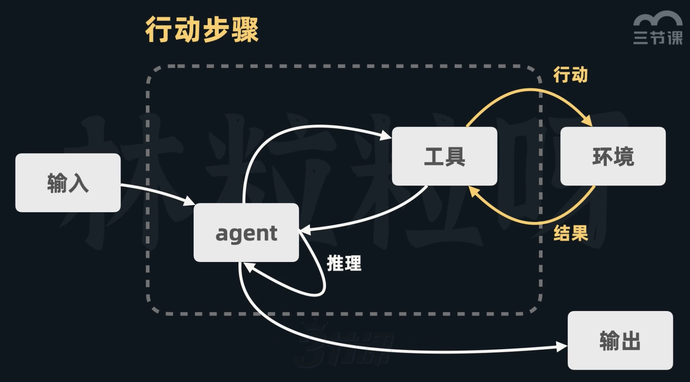
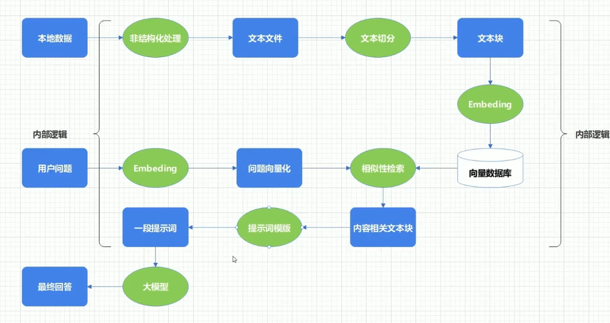
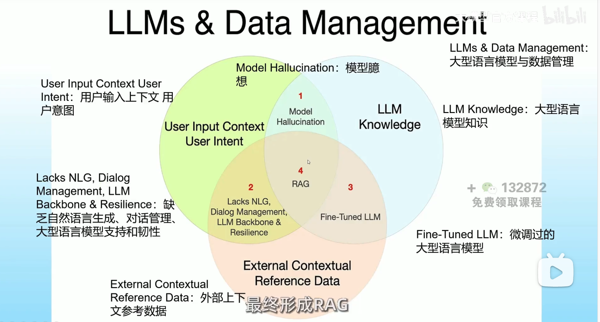
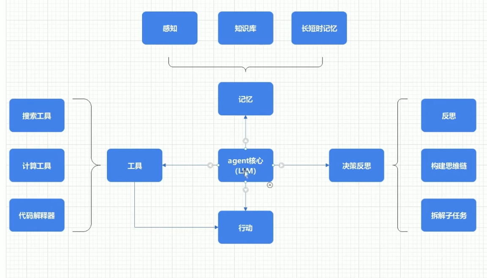
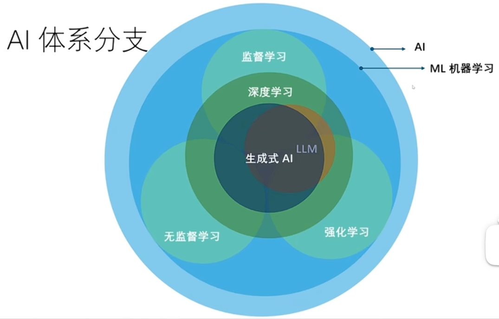
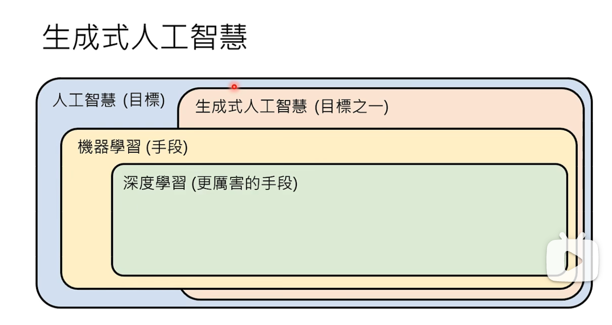

# AI

AI 原生应用的 11 个关键要素，涵盖模型、框架、提示词、RAG、记忆、工具、数据、评估、安全与合规、监控与运维、用户体验设计等方面

## 名词

1. 通用人工智能（AGI）
2. 大语言模型（LLM-Large Language Model）:如 GPT-3、GPT-4 等。
3. GPT（Generative Pre-trained Transformer）：生成式预训练 Transformer
4. GAI（Generative AI-生成式 AI）：一种能够生成新内容的 AI 技术，如文本生成、图像生成等。

   1. GAI 生成的内容就是 AIGC。
   2. 如 chatGPT、DALL-E 等。

5. AIGC（AI-Generated Content）： AI 生成的内容（例文本、图像、视频等）。

6. 分词化（Tokenization） 与 词表映射

   - 颗粒度：类似总结的笔记中的知识点；

7. Prompt（提示词）： 是用户向 AI 模型提供的输入指令，用于引导模型生成期望的输出。

   - 它可以是一个具体的问题、一段描述、一组关键词，或是相关的上下文信息，其核心作用是告知模型用户期望获得什么样的内容。
   - Prompt 的载体也不仅限于自然语言文本，还可以包含代码片段、数据格式说明，甚至是图像与文字相结合的多模态输入。
   - Prompt 质量 = 输出质量

8. Agent(智能体)：可被视为“具备自主智能的实体”;

   - 有聪明的大脑（模型）、丰富的经验和记忆（数据）、灵巧的双手（工具），并且基于设定的角色协同完成任务;
   - 当单 Agent 无法完成复杂任务的时候，可以协同多 Agent 编排完成复杂任务；

   AI 既能根据用户的输入以及环境进行动态推理，也能基于推理采取合理的行动，并且在需要的时候借助合适的外部工具，通过结合不同的工具来增强模型的功能和效率，我们把这个能理解用户的查询或指令进行推理并执行特定任务，最后输出响应的服务叫做 agent（智能体或代理）

   

   

   

   

9. Memory（记忆）： AI 应用的记忆能力提升了用户体验，实现了跨会话连贯性、个性化和基于历史的深度推理。

   - 短期记忆，也被称为工作记忆或上下文记忆，指的是模型在单次、连续的交互会话中所能直接访问的信息。
   - 长期记忆旨在解决短期记忆的局限，让 AI 能够记住跨越不同会话，甚至数天数月前的信息，如用户偏好、历史项目经验、关键事实等。

10. 工具(Tools)： 工具调用扩展了大模型的能力，使其能主动与外部世界交互，突破知识静态性的限制。

    - 方式一：MCP 协议: 是为大模型与外部数据、应用和服务之间的通信提供一种安全且标准化的语言;
    - 方式二：FuncationCalling: 是模型与外部世界进行交互的协议，它定义了模型如何调用外部工具，以及如何处理工具调用的响应。

11. RAG（Retrieval Augmented Generation - 检索增强生成）

    检索增强生成：提供外部文档，让模型访问外部知识库，获得实时且正确的数据，生成更可靠和准确的回答；当用户提出和外部知识相关的问题后，AI 可以结合知识库里的内容，进行回答；

    - 大模型: 输入--》大模型--》输出
    - RAG:【输入--》检索（根据问题找相似文本）】--》大模型--》输出

    1. 准备外部数据；外部文档要先加载出来，并且切分成一个个文本块（因为大语言模型的上下文窗口有限，即一次能接收的文本长度有限），然后每个文本块会被转成一系列的向量（可以把向量看作一串固定长度的数字），文本块并不能随便转成数字，向量中要包含文本之间的语法语义等关系（例：相似的文本所对应的嵌入向量，在向量空间里的距离更近，而一些没关系的文本之间的距离就更远）；这有助于模型基于数学，计算向量空间里的距离，去捕捉不同文本在语义和语法等方面的相似； 这些向量都要被储存进向量数据库里，现在外部数据就准备好了；
    2. 搜索；当用户提出问题时，这个提示也会被转换为向量，然后查找向量数据库里和用户的查询向量距离最近的段落向量（距离近就表示他们内容相似）；
    3. 询问；上一步中和用户查询最为接近的段落被提取了出来，于是，这个段落会和用户的查询组合到一起，一块传给 AI 模型，这样 AI 就能把外部文档的段落作为上下文，基于里面的信息，返回更准确的回答；
    4. 因此，借助 RAG，用户可以对外部文档里任何内容进行提问，即使 AI 模型从来没有受到过那些内容的训练； RAG 有利于搭建企业知识库或个人知识库

12. 模型上下文协议（MCP）
13. 微调（Fine-tuning）：优化现有模型（对现有模型，用“特定数据”进行训练，来适应 特定任务）
14. 网关：AI 网关作为应用与大模型、工具之间的智能调度中心，解决了模型切换、Token 管理、语义缓存等 AI 原生需求。

    - 统一的模型接入与厂商解耦；
    - 融合存量系统与 AI；
    - 智能路由与故障转移；
    - 精细化的成本控制与优化；
    - 企业级安全与合规；
    - 数据、观测与优化

15. 运行时：AI 原生应用运行时承载动态业务逻辑、智能体协作与数据流管理，是区别于传统应用的新型执行环境。
16. 可观测：AI 应用的可观测性体系需覆盖全链路追踪、全栈观测和自动化评估，保障系统稳定性与安全性。
17. 评估：AI 应用的评估体系需适应非确定性输出，采用 LLM-as-a-Judge 等新范式，贯穿全生命周期。
18. 安全：AI 原生应用的开放性和自主性带来新的安全挑战，需从应用、模型、数据、身份和基础设施多维度构建纵深防御体系。

- 

在此架构之上，构建的 AI 原生应用，是以大模型为认知基础，以 Agent 为编排和执行单元，以数据作为决策和个性化基础，通过工具感知和执行的智能应用。

## Prompt--》Agent--》Function Call--》RAG--》Fine tune--》垂直行业 LLM

1. 非结构化处理：读取文字、图片等 信息，转化为文本文件(例：pdf、word --> txt)；
2. 提示词模版：将用 系统提示、用户输入 和 内容相关文本块 组合生成一段提示词；

1. 模型臆想（大模型幻觉）：大模型没有这方面知识储备（胡乱回答）；
2. 企业问题：用 RAG（解决 90%） + 微调（解决 10%）

## Agent 设计模式（Agent 框架与策略）

1. ChainofThought（思维链）：

   核心思想：让模型在回答前，把推理过程一步步写出来。不是一口气报出答案，而是把整个推理过程展示出来。

2. Self-Ask（自问自答）：

   核心思想：让模型在回答时学会“反问自己”，把大问题拆成多个小问题，然后逐个回答。

3. ReAct（推理 + 行动）：

   核心思想：在推理（Reasoning）和外部行动（Acting，比如调用搜索引擎或 API）之间交替进行。

4. Plan-and-Execute（计划与执行）：

   核心思想：把任务拆成两个阶段，先生成计划（Planning），再逐步执行（Execution）。

5. TreeofThoughts（ToT，树状思维）：

   核心思想：不是单线思维，而是生成多条思路分支，像树一样展开，再通过评估机制选出最佳分支。

6. Reflexion/IterativeRefinement（反思与迭代优化）

   核心思想：Agent 具备自我纠错的能力，犯错后会总结失败原因，再带着反思尝试下一次。

7. Role-playingAgents（角色扮演式智能体或者机器是多智能体协作）

   核心思想：把任务拆分给不同角色的 Agent，每个 Agent 都有专属职责，通过对话协作完成任务。

##

1. tiktoken：计算 token 数量；

## 模型分类

模型的三个不同维度：

1. 精度（体积/压缩率）：满血版 vs. 量化版
2. 功能（训练阶段）：Base 版 vs. Chat 版
3. 架构与格式：MoE、Long、GGUF 等

- 第一维度：精度与体积（“满血”还是“压缩”）

  1. 满血版 / 完整版 (Full / FP16 / BF16)

     - 别名：FP16, BF16, Reference.
     - 比喻：4K 蓝光原盘电影。画质无损，但文件巨大，对播放设备要求高。
     - 体积最大：比如一个 7B（70 亿参数）的模型，满血版大约需要 14GB 显存。

  2. 量化版 (Quantized / Int8 / Int4)
     - 别名：Int4, Int8, Q4_K_M, GPTQ, AWQ.
     - 比喻：1080P 在线高清视频。虽然压缩了，但看着跟原盘差不多，而且手机也能流畅播。

- 第二维度：功能（训练阶段）：基础版、Chat 版

- 第三维度：架构与格式：MoE、Long、GGUF 等

  1. GGUF 版 (CPU/苹果专用)
  2. Long / 128k / 1M (长文本版)

     - 场景：你需要丢给模型一本几百页的书让它总结。

  3. MoE (混合专家模型)

     - 看起来参数很大（比如 47B），但推理时每次只激活一小部分参数（比如 13B）
     - “满血”通常指 所有专家都可用；“残血”可能限制激活专家数以省资源。

  4. Uncensored / Abliterated (无审查版)

     - 社区修改版：去除了原版模型的“道德安全限制”。

  5. 蒸馏版（Distilled）

     - 用大模型教小模型（如 Phi-3-mini 蒸馏自更大模型）。
     - 参数少、速度快，但能力弱于原版。

  6. 多模态版

## 了解 AI（引入 AI）

### NLP、NLU、NLG

- NLP(自然语言处理-Natural Language Processing)：处理语言形式和结构（如分词）
- NLU(自然语言理解-Natural Language Understanding)：理解语义和上下文
- NLG(自然语言生成-Natural Language Generation)：生成人类语言
- 计算机视觉（CV）：让机器“看懂”图像或视频。

### AI 体系分支

## 总结与比喻

大模型的入口是一个应用程序编程接口（API），而我们的输入在被传入之前，会被精心地“包装”和“格式化”。

| 步骤            | 实际情况                                                                             | 比喻                                                     |
| --------------- | ------------------------------------------------------------------------------------ | -------------------------------------------------------- |
| 1. 你输入问题   | 在网页或 App 里输入 Prompt。                                                         | 顾客点菜：“我要一份宫保鸡丁。”                           |
| 2. 结构化封装   | 客户端将你的输入封装成包含模型、消息历史、参数的 JSON 请求。                         | 服务员写单：在标准点菜单上勾选“宫保鸡丁（中份、微辣）”。 |
| 3. Tokenization | 将文本转换成模型能理解的 Token ID 数字序列。                                         | 翻译成行话：服务员向后厨喊：“12 号菜，B 规格！”          |
| 4. 模型计算     | 神经网络根据输入 Token 和自身参数，计算并输出下一个 Token 的概率分布，循环生成结果。 | 厨房做菜：厨师根据“12 号菜，B 规格”的指令开始烹饪。      |
| 5. 返回结果     | 将输出的 Token ID 转换回文本，通过 API 响应返回并展示给用户。                        | 上菜：服务员将做好的菜端给你。                           |

## 课程

### 知乎

- Prompt--》Agent--》Function Calling--》RAG--》Fine tune--》垂直行业 LLM
- Embedding：将不同长度的话，转化为等长的向量

#### 知乎--🔥 课程全新升级！🚀

- ✅ 8 大核心模块，构建完整技术体系：

  1. 模块 1：从提示工程到 RAG，从 Agent 到多模态，构建大模型知识与交互基础
  2. 模块 2：RAG 全链路实战 - Embedding、向量数据库、多模态数据处理、系统调优
  3. 模块 3：Agent 深度开发 - Function Calling、自主规划、搜索感知记忆能力构建
  4. 模块 4：开发框架精通 - LangChain、LlamaIndex、HuggingFace 生态实战
  5. 模块 5：模型训练与微调 - LLM 微调原理、数据工程、模型蒸馏、视觉多模态
  6. 模块 6：企业级部署 - 硬件选型、高并发原理、vLLM、SGLang 深度优化
  7. 模块 7：低代码平台 - Coze、Dify 本地化部署与企业级集成
  8. 模块 8：工程提效 - AI 编程、智能测试、Text-to-SQL、ChatBI 开发

- ✅ 带走多个工业级项目源码：

  ⦿ 企业知识库（RAG 大赛冠军方案）
  ⦿ OpenManus AI 写作助手
  ⦿ AI 工业质检系统
  ⦿ ChatBI 智能分析平台
  ⦿ 智能客服系统
  ⦿ SQL Copilot 引擎

- ✅ 覆盖主流技术栈：

  ▸ RAG 全链路：Faiss、Milvus、Query 改写、混合检索
  ▸ Agent 开发：Function Calling、MCP、ReAct、思维链
  ▸ 多模态处理：PDF 解析、视频理解、图文生成
  ▸ 模型微调：LoRA、QLoRA、模型蒸馏、评估体系

#### 知乎--课程-- AI 大模型

1. 第 1 节开班典礼----直播·11-07 20:00 开播
2. 第 2 节 AI 大模型基本原理及 API 使用----直播·11-08 20:00 开播
3. 第 3 节 DeepSeek 使用与 Prompt 工程----直播·11-12 20:00 开播
4. 第 4 节 Cursor 编程-从入门到精通----直播·11-15 20:00 开播
5. 第 5 节 Coze 工作原理与应用实例吉愣 41-10
6. 第 6 节 Agent 进阶实战与插件开发----直播·11-22 20:00 开播
7. 第 7 节 Dify 本地化部署和应用----直播·11-26 20:00 开擂
8. 第 8 节 分析式 AI 基础----直播·11-29 20:00 开播
9. 第 9 节 不同领域的 AI 算法----直播·12-03 20:00 开播
10. 第 10 节 时间序列大赛----直播·12-06 20:00 开播
11. 第 11 节 神经网络基础与 Tensorflow 实战----直播·12-10 20:00 开播
12. 第 12 节 Pytorch 与视觉检测----直播·12-13 20:00 开播
13. 第 13 节 Embeddings 和向量数据库----直播·12-18 20:00 开播
14. 第 14 节 RAG(Retrieval AugmentedGeneration)技术与应用----直播·12-21 20:00 开播
15. 第 15 节 RAG 的高级技巧----直播·12-25 20:00 开播
16. 第 16 节 Text2SQL:自助式数据报表开发----直播·12-28 20:00 开播
17. 第 17 节 LangChain:多任务应用开发----直播·12-30 20:00 开播
18. 第 18 节 Function Calling 与智能 Agent 开发----直播·01-04 20:00 开播
19. 第 19 节 MCP 与 A2A 的应用----直播·01-08 20:00 开播
20. 第 20 节 Agent 智能体系统的设计与应用----直播·01-11 20:00 开播
21. 第 21 节 视觉大模型与多模态理解----直播·01-15 20:00 开播
22. 第 22 节 Fine-tuning 微调艺术----直播·01-18 20:00 开播
23. 第 23 节 Fine-tuning 实操----直播·01-22 20:00 开播
24. 第 24 节"项目实战:企业知识库(企业 RAG 大赛冠军项目)"----直播·01-25 20:00 开播
25. 第 25 节"项目实战:交互式 BI 报表(AI 量化交易助手)"----直播·01-29 20:00 开播
26. 第 26 节 项目实战:AI 智慧运营助手(百万客群经营)----直播·02-0120:00 开播
27. 第 27 节"项目实战:AI 搜索类应用(知乎直答)"----直播·02-05 20:00 开播

### 赋范

### 本地课程
