# AI

思维导图： xmind；流程图： ProcessOn/draw.io；组织架构图：Visio/Lucidchart

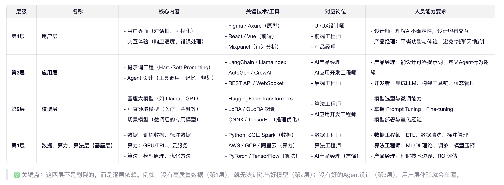


## 了解 AI（引入 AI）

### 名词

- GPT（Generative Pre-trained Transformer）：生成式预训练 Transformer
- GAI（Generative AI-生成式 AI）：一种能够生成新内容的 AI 技术，如文本生成、图像生成等。

  1. GAI 生成的内容就是 AIGC。
  2. 如 chatGPT、DALL-E 等。

- AIGC（AI-Generated Content）： AI 生成的内容（例文本、图像、视频等）。

- LLM（Large Language Model）：大型语言模型，如 GPT-3、GPT-4 等。

- 分词化（Tokenization） 与 词表映射

  - 颗粒度：类似总结的笔记中的知识点；

- RAG（Retrieval Augmented Generation - 检索增强生成）

  应用空间：小众细分领域，例：公司内部数据、个人私密文件等；

  检索增强生成：提供外部文档，让模型访问外部知识库，获得实时且正确的数据，生成更可靠和准确的回答；当用户提出和外部知识相关的问题后，AI 可以结合知识库里的内容，进行回答；

  1. 准备外部数据；外部文档要先加载出来，并且切分成一个个文本块（因为大语言模型的上下文窗口有限，即一次能接收的文本长度有限），然后每个文本块会被转成一系列的向量（可以把向量看作一串固定长度的数字），文本块并不能随便转成数字，向量中要包含文本之间的语法语义等关系（例：相似的文本所对应的嵌入向量，在向量空间里的距离更近，而一些没关系的文本之间的距离就更远）；这有助于模型基于数学，计算向量空间里的距离，去捕捉不同文本在语义和语法等方面的相似； 这些向量都要被储存进向量数据库里，现在外部数据就准备好了；
  2. 搜索；当用户提出问题时，这个提示也会被转换为向量，然后查找向量数据库里和用户的查询向量距离最近的段落向量（距离近就表示他们内容相似）；
  3. 询问；上一步中和用户查询最为接近的段落被提取了出来，于是，这个段落会和用户的查询组合到一起，一块传给 AI 模型，这样 AI 就能把外部文档的段落作为上下文，基于里面的信息，返回更准确的回答；
  4. 因此，借助 RAG，用户可以对外部文档里任何内容进行提问，即使 AI 模型从来没有受到过那些内容的训练； RAG 有利于搭建企业知识库或个人知识库

- ReAct（Reason and Action - 推理和行动）

  AI 局限性：大模型天然受到训练数据日期的影响 - 知识截断；

  模型持续更新：ReAct（推理和行动） 核心：让模型进行“动态推理”，并采取行动与外界环境互动；也就是我们会引导模型进行推理，并且让它知道可以根据外界环境采取哪些行动。

  为了让模型实现 ReAct，我们可以借助思维链，用小样本提示展示给模型一个推理与行动结合框架；也就是针对问题 把步骤进行拆分，每个步骤要经过 推理、行动、观察；
  推理：是针对问题或上一步观察的思考；
  行动：是基于推理与外部环境的一些交互；例用搜索引擎对关键字进行搜索；
  观察：是对行动得到的结果进行查看；

  推理和行动：AI 模型可以基于当前状态，推理出下一步的行动，并执行这个行动；

- agent（智能体） 执行器

  AI 既能根据用户的输入以及环境进行动态推理，也能基于推理采取合理的行动，并且在需要的时候借助合适的外部工具，通过结合不同的工具来增强模型的功能和效率，我们把这个能理解用户的查询或指令进行推理并执行特定任务，最后输出响应的服务叫做 agent（智能体或代理）

  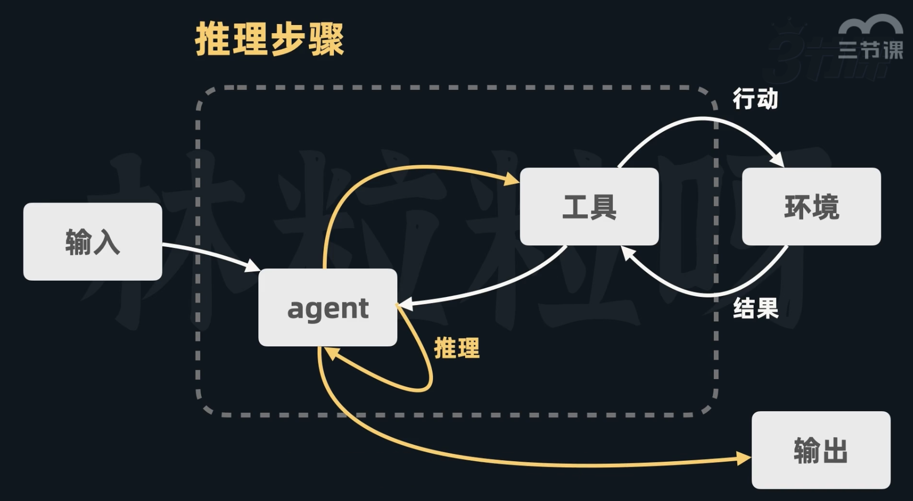

  

  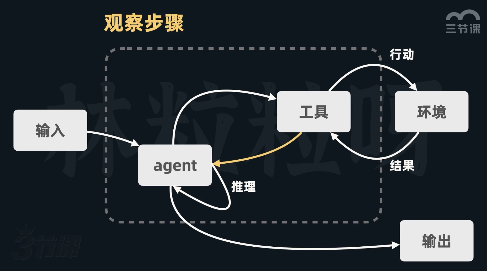

  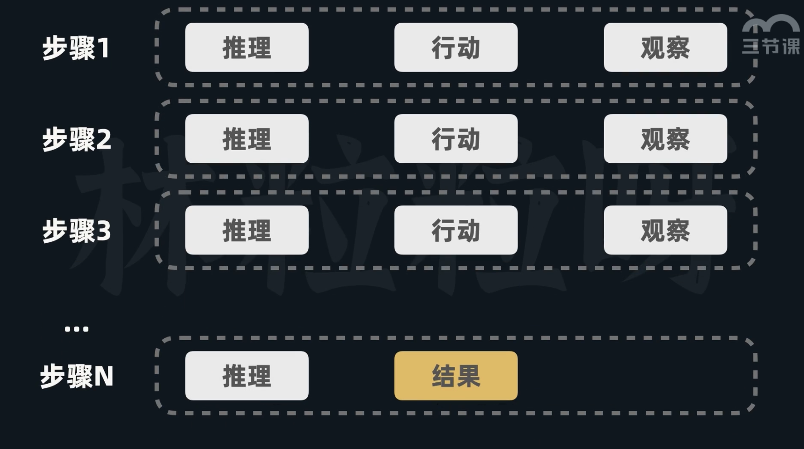

### NLP、NLU、NLG

- NLP(自然语言处理-Natural Language Processing)：处理语言形式和结构（如分词）
- NLU(自然语言理解-Natural Language Understanding)：理解语义和上下文
- NLG(自然语言生成-Natural Language Generation)：生成人类语言
- 计算机视觉（CV）：让机器“看懂”图像或视频。

### AI 体系分支

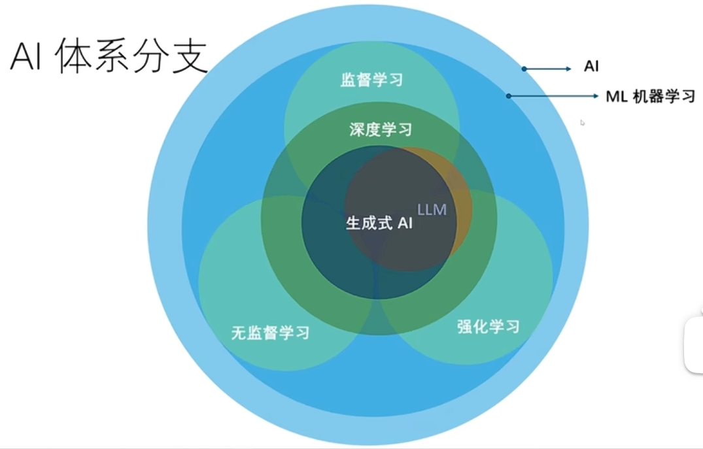
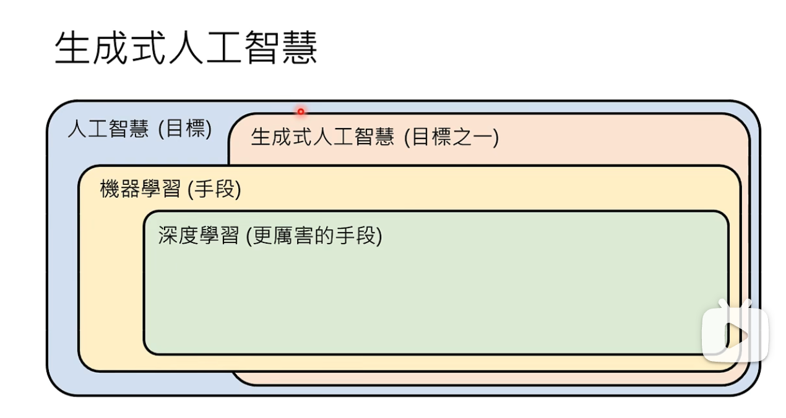
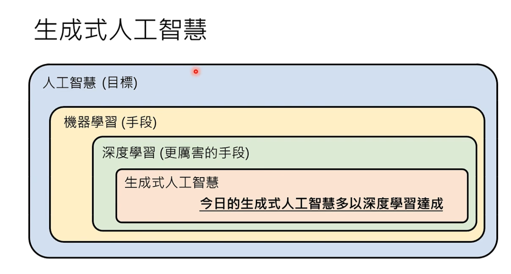
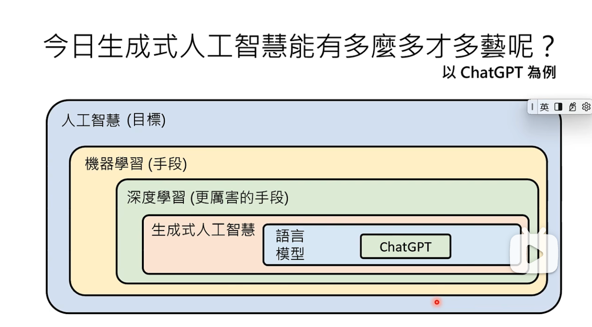

## AI 模型

### AI 模型就是个（大量参数的）函数：输入参数，返回结果

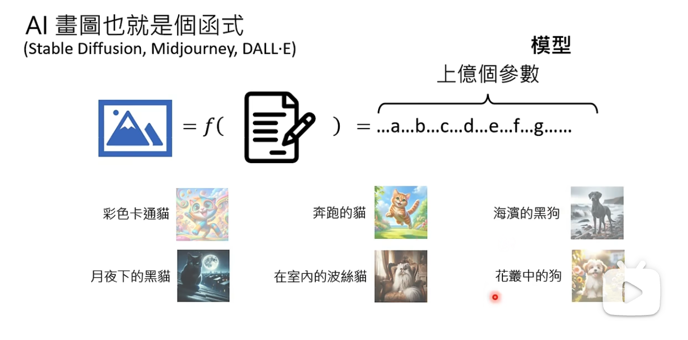
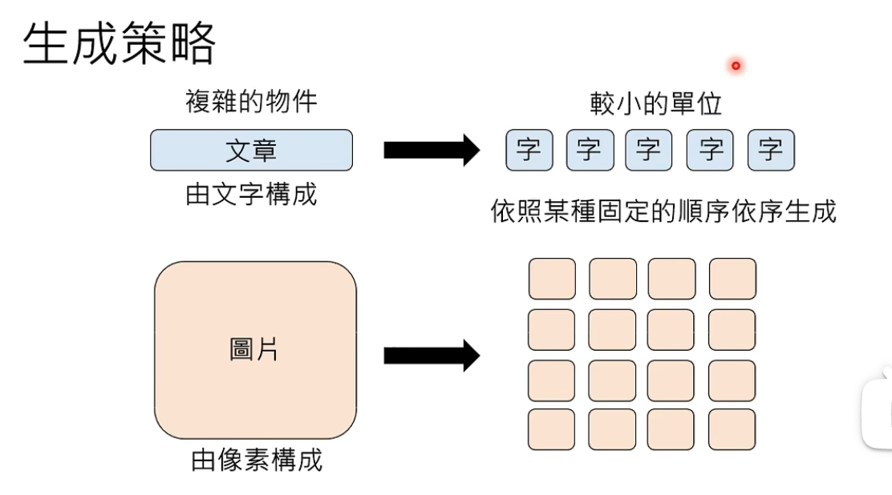
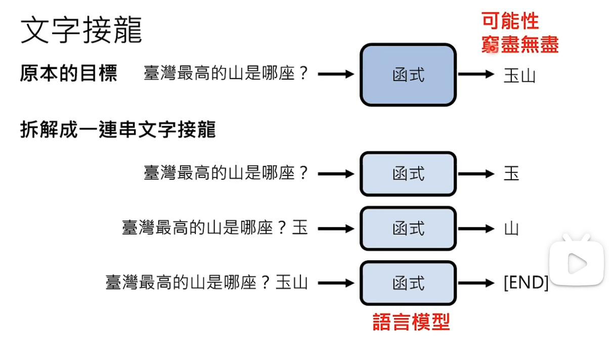
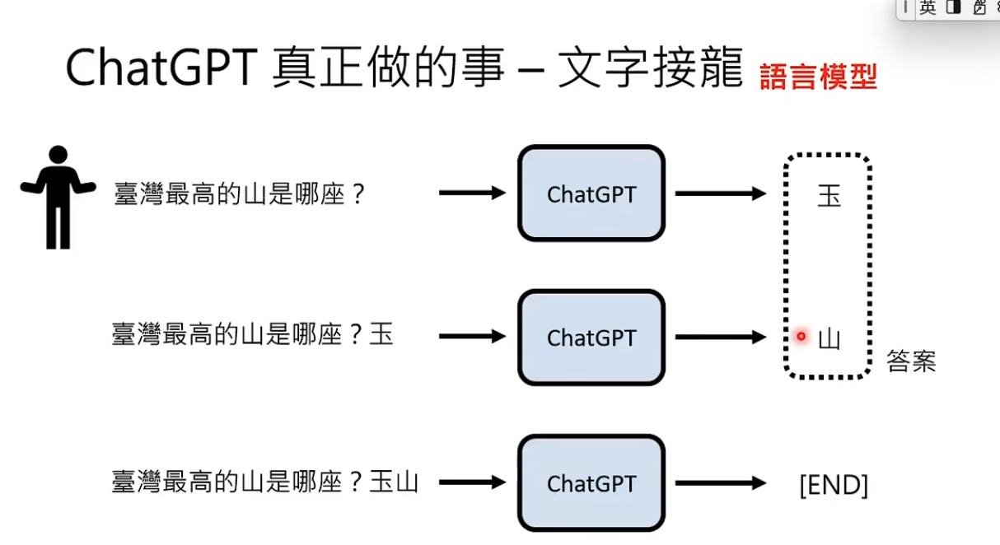
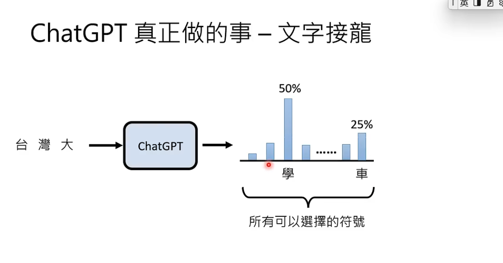

生成文字/像素：就像掷骰子一样，随机取一个字/像素；字/像素出现的概率，通过大量（文本）学习排序的

### 生成式 AI 目前只能用深度学习实现；未来有可能其他方式实现（目前看不到）

1. 人工智能（AI）：让计算机系统模拟人类智能，从而解决问题和完成任务；

   - 计算机科学下的一个学科；

2. 机器学习（Machine Learning）：核心：不需要人类做显式编程，而是让计算机通过算法，自行学习和改进，去识别模式、做出预测和决策；

   - 是 AI 的一个子集；
   - 示例：给电脑大量玫瑰和向日葵的图片，让电脑自行识别模式、总结规律，从而能能对没见过的图片进行预测和判断；
   - 类型：
     1. 无监督学习：从“无标注数据”中发现模式（如聚类）。
     2. 监督学习：用“标注数据”训练模型（如图像分类）。
     3. 强化学习（RL）：通过“奖励机制”训练智能体（如 AlphaGo）。

3. 深度学习：核心在于使用人工神经网络，模仿人脑处理信息的方式，通过层次化的方法，提取和表述数据特征；

   - 是机器学习的一个方法；
   - 核心：多层神经网络；
   - 典型应用：
     1. GAN（生成对抗网络）
     2. Transformer 架构
     3. LLM（大语言模型）Í

   * 神经网络：有许多基本的计算和存储单元组成；
   * 这些单元被称为神经源；这些神经元通过层层连接起来处理数据，并且深度学习模型通常有很多层（称为深度），每一层都会对数据进行处理和转换，从而提取出更高层次的特征；

- GAI（生成式 AI）：是深度学习的一个应用，能够生成新内容，如文本、图像、视频等；
- LLM（大语言模型）：是深度学习的一个应用，专门用于自然语言处理任务；（特征“大”，GPT、LLaMA）

#### 机器学习（Machine Learning）

- 监督学习（Supervised Learning）: 机器学习算法会接收有标签的训练数据，

  例：苹果和香蕉的特征输入给 AI 模型，再拿一个水果输入特征自动识别；

  1. 标签就是期望的输出值；
  2. 每个训练数据点都包含输入特征和期望的输出值；
  3. 算法的目标是：学习输入和输出之间的映射关系，从而在给“新的输入特征”后能准确预测书相应的输出；

  - 数据集--》监督员打标签（模型训练）--》机器学习算法--》模型
  - 输入测试数据集--》模型--》预测输出

  应用：回归（预测房价）、分类

- 无监督学习：学习的数据是没有标签的；

  1. 算法的任务：自主发现数据里的模式或者规律；

  - AI 算法自动提取特征，自动分类；
  - 原始数据（无标签）--》机器学习算法（寻找规则）--》模型--》归类
  - 可以调整 机器学习算法 按不同规则输出

  应用：聚类（根据颜色/形状分类）、关联规则（推荐算法）

- 强化学习：让模型在环境中采取行动，获得结果反馈，从反馈里学习，从而能在给定情况下采取最佳行动，来最大化奖励或最小化损失；

  1. 机器学习算法自动学习，没有标签，只有奖励和惩罚（采纳和丢弃）；
  2. 逐渐向奖励方向倾斜；
  3. 专注于让智能体（Agent）通过与环境交互学习最优策略，以最大化累积奖励。其核心思想是“试错学习”，类似于人类或动物通过经验改进行为的过程。

  机器学习效果苹果：欠拟合（未达到效果）、最佳拟合、过拟合（没有泛化能力，只能基于训练数据）

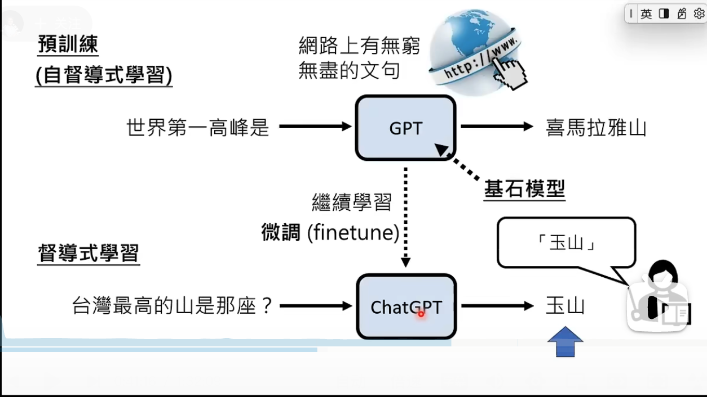


#### 深度学习（模仿人类思维）

一种机器学习架构，使用多层人工神经网络，模仿人脑的工作方式来解决复杂的模式识别问题。能够从图像、语音、自然语言中自动提取高层次的特征。

分为：

- Transformer：一种基于`自‘注意力’机制`的深度学习模型，用于处理序列数据。它能够并行处理数据，并且能够捕捉长距离的依赖关系，因此在自然语言处理、计算机视觉等领域取得了显著的成果。
  1、从 “片段记忆” 到 “全局记忆”；
  2、从 “串行处理” 到 “高效并行”；
- CNNs （卷积神经网络）：一种用于处理图像数据的深度学习模型，能够自动提取图像中的特征，并生成新的图像。
- RNNs （循环神经网络）：一种用于处理序列数据的深度学习模型，能够处理时间序列数据，并生成新的序列。

### LLM -- 大型语言模型（的训练）

预训练 --》监督微调（SFT）--》RLHF（基于人类反馈的强化学习）
类似：小学到大学的全面学习（不管 用不用得上）--》为找工作进行的专业学习--》面试或工作中的成长

1. 第一阶段：（预训练）：无监督学习

   - 数据：海量无标注文本，数据清洗和去重（借助海量数据，模型能更好的了解单词与上下文之间的关系，从而更好地理解文本的含义，并生成更准确地预测）；
   - 核心目标：学习语言基础知识，预测下一个词；
   - 产出：基础模型（掌握了语法、句法、大量事实知识，并具备了一定的逻辑推理和泛化能力。但它还不知道如何与人类进行有效、安全的对话）；

2. 第二阶段：(微调)：监督学习 参数数量也是巨大；参数是模型内部的变量，可以理解为是模型在训练过程中学到的知识；

   - 数据：相对较小（几万到十几万条），高质量“指令-回复”对；
   - 核心目标：学会遵循指令和对话（从“预测下一个词”变成了 “在给定指令下，生成最符合期望的回复”）；
   - 产出：SFT 模型（模型学会了遵循指令、进行多轮对话、拒绝不当请求等技能）

3. 第三阶段：RLHF（人类反馈强化学习）：强化学习

   - 数据：人类对回答的排序
   - 核心目标：对齐人类价值观和偏好
   - 产出：最终、对齐的模型（经过 RLHF 训练的模型，其回答在安全性、有用性和无害性上通常远优于仅经过 SFT 的模型）

   - RLHF 是一个复杂的过程，主要包括三个步骤：

     1. 收集人类偏好数据：

        - 针对同一个指令，让 SFT 模型生成多个（通常是 4 个）不同的回答。
        - 人类标注员 对这些回答从好到坏进行排序。例如，回答 A > 回答 C > 回答 D > 回答 B。这构成了一个偏好数据集。

     2. 训练奖励模型：

        - 这是一个独立的、较小的模型，其任务是学习预测人类更喜欢哪个回答。
        - 输入是：指令和模型的一个回答，输出：是一个“奖励分数”。奖励模型的目标是：对于人类排序更高的回答，它应该给出更高的分数。

     3. 使用强化学习优化 SFT 模型：

        - 将 SFT 模型作为智能体，将其生成文本的行为视为动作。
        - 将训练好的奖励模型作为环境，它提供奖励。
        - 使用强化学习算法（最常用的是 PPO），让 SFT 模型学习如何生成能获得最高奖励分数的文本。
        - 关键点： 为了防止模型“作弊”（例如，为了高分而生成无意义的、过度恭维的语句），需要在奖励中加入一个“偏离惩罚”，确保模型的输出不会过于偏离 SFT 模型的基础能力。

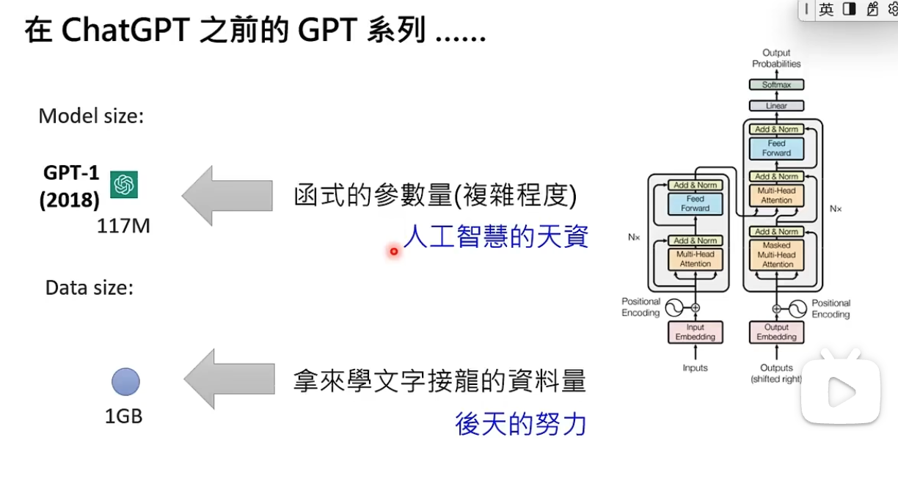

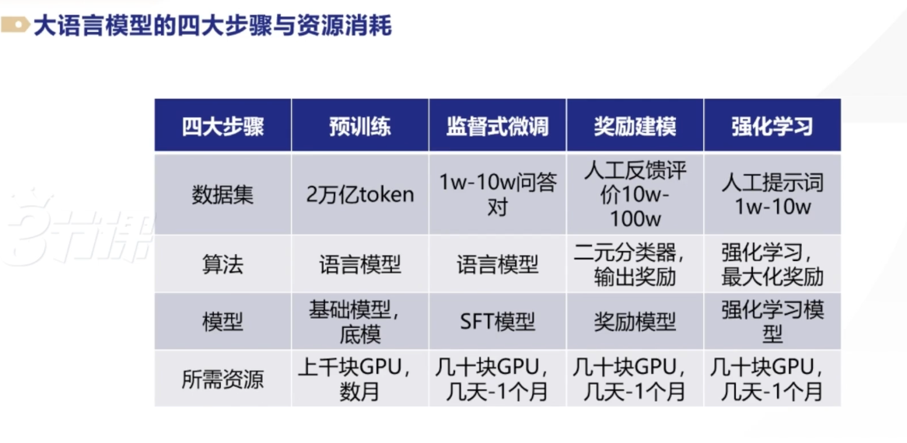

### 如何训练出一个 AI 聊天助手

1. 通过大量文本进行无监督学习预训练，得到一个能进行文本生成的“基座模型”；
2. 通过一些人类撰写的高质量的对话数据，对基座模型进行监督微调，得到一个“微调后的模型”。此时的模型 除了能续写文本之外，也会具备更好的对话能力；
3. 用“问题和多个对应回答”的数据，让人类标注员对“回答”进行质量排序，然后基于这些数据，训练出一个 `能对回答 进行评分预测的“奖励模型”`；
4. 让第 2 步得到的模型对问题生成回答，用奖励模型对回答进行评分，利用评分作为反馈，进行强化学习训练，就这样 chart GPT 就诞生了；

- 详细

1. 需要海量文本语料库 用来训练；
2. 分词化（token）：大语言模型的基本文本单位；短的英文单词 1 个词 1 个 token，长的英文单词可能被分为多个 token；中文 1 个字可能需要 1 个或者更多 token 来表示；
3. 预训练最烧钱，需要大量数据，大量算力；
4. 基座模型 --微调--》微调后的模型（sft 模型）--（奖励模型）强化--》
5. 奖励模型：提示词--》sft 模型--》生成多个答案，人类对答案进行质量排序，训练出一个奖励模型；

## 系统与平台层

### 提示词工程

1. 使用最新的模型；
2. 把指令放在提示的开头，并且用###或者“”“来分割指令和上下文；例：“”“文本”“”；
3. 尽可能对上下文和输出的长度、格式、风格等给出具体、描述性、详情的要求；
4. 通过一些例子来阐明想要的输出“格式”；
5. 先从零样本提示开始，效果不好，则用小样本提示；
   - 零样本：不给 AI 任何示范；
   - 小样本：给 AI 一些参考例子；
6. 减少空洞和不严谨的描述；
7. 告诉应该做什么，而不是：不能做什么

- 限定输出格式：
- 小样本提示：给出一些例子，让 AI 按例子回答；、
- 思维链与分步骤思考：一步一步引导 AI 思考；

#### 提示词，正确率提升

1. 叫模型思考：让一步一步想
2. 让模型解释一下自己的答案
3. 对模型情绪勒索：这件事真的很重要
4. 直接要求：模型要做什么

### 工作流程


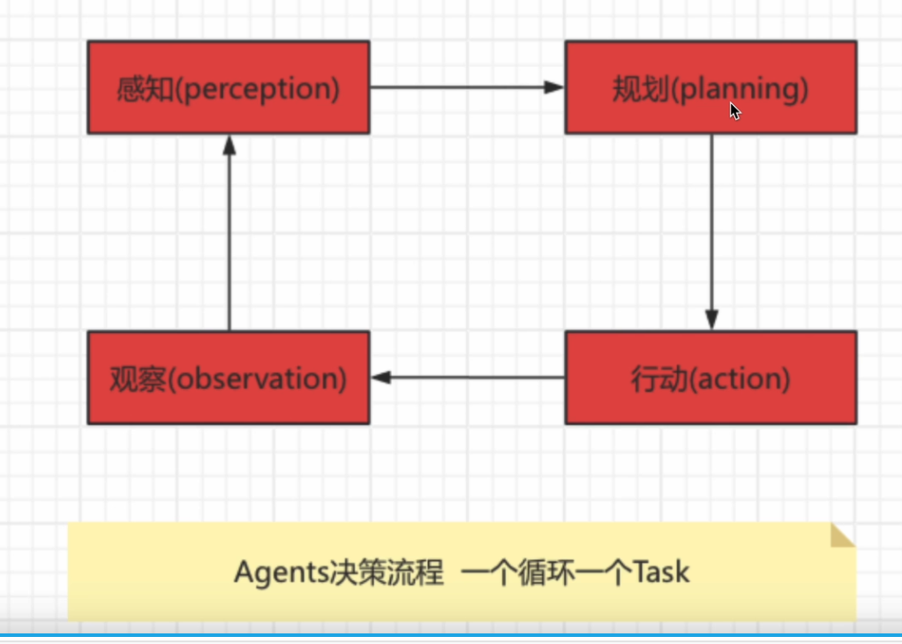

## 应用

- R1： 复杂问题推理、数学/代码求解（学术研究、技术分析、代码开发）
- v3： 多轮对话、指令理解、任务执行（客服、日常对话、内容生成）

- vscode + cline 插件 + 硅基流动

### key : openai / 通义千问（Qwen 阿里云兼容 openai）

1. 密钥保存本地：

   - win: 电脑--》属性--》高级系统设置--》环境变量--》系统变量--》新建：OPENAI_API_KEY:"密钥";
   - mac: 终输入 ps -p $$ ; 查看 CMD 是 bash？还是 zsh？
     1. bash：配置类别位于: ~/.bash_profile “/” zsh：配置类别位于: ~/.zshrc
     1. 打开配置文件，添加：export OPENAI_API_KEY="密钥"
     1. source ~/.zshrc “/” source ~/.bash_profile

2. tiktoken：计算 token 数量；

   ```python
   import tiktoken
   encoding = tiktoken.encoding_for_model("gpt-3.5-turbo")
   len(encoding.encode("内容"))  ## 长度就是token个数；
   ```

### AI 技术栈全景图

基础设施层 --》模型层 --》应用层

1. 基础设施层：PyTorch / SiliconFlow --》模型训练框架；
2. 模型层：DeepSeek / GPT（openAI） --》模型服务（LLM 服务）；
3. 应用层：LangChain （RAG / ReAct / PAL） --》应用开发（智能应用）；

### 常见组合用例

1. 用 PyTorch 或 硅基流动（框架） 训练模型 → 用 DeepSeek（模型） 的 API 调用大模型 → 通过 LangChain 集成到聊天机器人中。
   PyTorch/SiliconFlow --训练模型-->DeepSeek --提供模型能力-->LangChain--构建应用-->终端产品

   - PyTorch/SiliconFlow 是底层框架；LangChain 是上层工具；它们均可服务于 OpenAI 或 DeepSeek 的模型应用。
   - 地缘因素（如国产化需求）可能推动 DeepSeek + SiliconFlow 的组合替代 OpenAI + PyTorch。

   * 模型开发层：使用 PyTorch/SiliconFlow 训练模型（如 DeepSeek 的基座模型）。
   * 模型服务层：DeepSeek 将训练好的大模型封装为服务（开源或 API）。
   * 应用构建层：LangChain 集成 DeepSeek 的模型，并添加业务逻辑（如连接客户数据库）。

2. 最佳实践路径

   1.数据准备 → 2. 基座模型选择 → 3. RAG/微调 → 4. LangChain 集成 → 5. Agent 部署

3. 为什么需要三者协作？

   - PyTorch/SiliconFlow 解决“如何造模型”的问题。
   - DeepSeek 解决“用什么模型”的问题（避免从零训练）。
   - LangChain 解决“如何用模型”的问题（快速落地应用）。

4. 模型广场：小爱 ai(国外模型)、硅基流动、百炼平台

## 总结与比喻

大模型的入口是一个应用程序编程接口（API），而我们的输入在被传入之前，会被精心地“包装”和“格式化”。

| 步骤            | 实际情况                                                                             | 比喻                                                     |
| --------------- | ------------------------------------------------------------------------------------ | -------------------------------------------------------- |
| 1. 你输入问题   | 在网页或 App 里输入 Prompt。                                                         | 顾客点菜：“我要一份宫保鸡丁。”                           |
| 2. 结构化封装   | 客户端将你的输入封装成包含模型、消息历史、参数的 JSON 请求。                         | 服务员写单：在标准点菜单上勾选“宫保鸡丁（中份、微辣）”。 |
| 3. Tokenization | 将文本转换成模型能理解的 Token ID 数字序列。                                         | 翻译成行话：服务员向后厨喊：“12 号菜，B 规格！”          |
| 4. 模型计算     | 神经网络根据输入 Token 和自身参数，计算并输出下一个 Token 的概率分布，循环生成结果。 | 厨房做菜：厨师根据“12 号菜，B 规格”的指令开始烹饪。      |
| 5. 返回结果     | 将输出的 Token ID 转换回文本，通过 API 响应返回并展示给用户。                        | 上菜：服务员将做好的菜端给你。                           |

## 知乎

Prompt--》Agent--》Function Call--》RAG--》Fine tune--》垂直行业 LLM

### 知乎--🔥 课程全新升级！🚀

✅ 8 大核心模块，构建完整技术体系：

1. 模块 1：从提示工程到 RAG，从 Agent 到多模态，构建大模型知识与交互基础
2. 模块 2：RAG 全链路实战 - Embedding、向量数据库、多模态数据处理、系统调优
3. 模块 3：Agent 深度开发 - Function Calling、自主规划、搜索感知记忆能力构建
4. 模块 4：开发框架精通 - LangChain、LlamaIndex、HuggingFace 生态实战
5. 模块 5：模型训练与微调 - LLM 微调原理、数据工程、模型蒸馏、视觉多模态
6. 模块 6：企业级部署 - 硬件选型、高并发原理、vLLM、SGLang 深度优化
7. 模块 7：低代码平台 - Coze、Dify 本地化部署与企业级集成
8. 模块 8：工程提效 - AI 编程、智能测试、Text-to-SQL、ChatBI 开发

✅ 带走多个工业级项目源码： ⦿ 企业知识库（RAG 大赛冠军方案） ⦿ OpenManus AI 写作助手 ⦿ AI 工业质检系统 ⦿ ChatBI 智能分析平台 ⦿ 智能客服系统 ⦿ SQL Copilot 引擎

✅ 覆盖主流技术栈： ▸ RAG 全链路：Faiss、Milvus、Query 改写、混合检索 ▸ Agent 开发：Function Calling、MCP、ReAct、思维链 ▸ 多模态处理：PDF 解析、视频理解、图文生成 ▸ 模型微调：LoRA、QLoRA、模型蒸馏、评估体系

### 知乎--课程-- AI 大模型

第 1 节开班典礼----直播·11-07 20:00 开播
第 2 节 AI 大模型基本原理及 API 使用----直播·11-08 20:00 开播
第 3 节 DeepSeek 使用与 Prompt 工程----直播·11-12 20:00 开播
第 4 节 Cursor 编程-从入门到精通----直播·11-15 20:00 开播
第 5 节 Coze 工作原理与应用实例吉愣 41-10
第 6 节 Agent 进阶实战与插件开发----直播·11-22 20:00 开播
第 7 节 Dify 本地化部署和应用----直播·11-26 20:00 开擂
第 8 节分析式 AI 基础----直播·11-29 20:00 开播
第 9 节 不同领域的 AI 算法----直播·12-03 20:00 开播
第 10 节 时间序列大赛----直播·12-06 20:00 开播
第 11 节 神经网络基础与 Tensorflow 实战----直播·12-10 20:00 开播
第 12 节 Pytorch 与视觉检测----直播·12-13 20:00 开播
第 13 节 Embeddings 和向量数据库----直播·12-18 20:00 开播
第 14 节 RAG(Retrieval AugmentedGeneration)技术与应用----直播·12-21 20:00 开播
第 15 节 RAG 的高级技巧----直播·12-25 20:00 开播
第 16 节 Text2SQL:自助式数据报表开发----直播·12-28 20:00 开播
第 17 节 LangChain:多任务应用开发----直播·12-30 20:00 开播
第 18 节 Function Calling 与智能 Agent 开发----直播·01-04 20:00 开播
第 19 节 MCP 与 A2A 的应用----直播·01-08 20:00 开播
第 20 节 Agent 智能体系统的设计与应用----直播·01-11 20:00 开播
第 21 节 视觉大模型与多模态理解----直播·01-15 20:00 开播
第 22 节 Fine-tuning 微调艺术----直播·01-18 20:00 开播
第 23 节 Fine-tuning 实操----直播·01-22 20:00 开播
第 24 节"项目实战:企业知识库(企业 RAG 大赛冠军项目)"----直播·01-25 20:00 开播
第 25 节"项目实战:交互式 BI 报表(AI 量化交易助手)"----直播·01-29 20:00 开播
第 26 节 项目实战:AI 智慧运营助手(百万客群经营)----直播·02-0120:00 开播
第 27 节"项目实战:AI 搜索类应用(知乎直答)"----直播·02-05 20:00 开播

### 录过的课程

1. A1-知平 1 2025-10-30.wmv
2. AI-知乎 2 2025-10-31 数智先锋王老师 大模型应用的技术架构.wmv
3. 图灵 2025-11-05 惊蛰老师 -节课带你搞懂 AI 大模型-RAG 知识库开发(半路).wmv
4. 图灵 2025-11-06 惊蛰老师 -节课带你搞懂 AI 大模型-PEFT 微调.wmv
5. 图灵 2025-11-07 大鱼老师 大模型技术落地与商业应用实战.wmv
6. 图灵 2025-11-10 大鱼老师 大模型技术落地与商业应用实战(半路).wmv
7. 图灵 2025-11-14 惊蛰老师 节课带你搞懂 AI 大模型-RAG 知识库开发.wmv
8. 图灵 2025-11-16 大鱼老师 大模型技术落地与商业应用实战.wmv。
9. 图灵 2025-11-17 惊蛰老师 -节课带你搞懂 AI 大模型-RAG 知识库开发.wmv
10. 图灵 2025-11-19 惊蛰老师 -节课带你搞懂 AI 大模型-RAG 知识库开发.wmv
11. 图灵-2025-11-09 惊蛰老师 一节课带你搞懂 AI 大模型-RAG 知识库开发(半路).wmv
12. 智泊 2025-11-03 一粟老师 大模型开发应用实战第 ① 直播间(半路).wmv
13. 智泊 2025-11-14 一粟老师 AGI 世代业务新范式 大模型商业化实践与落地方案.mp4
14. 智泊 2025-11-20 一粟老师 大模型开发与应用实战 A 课堂 智泊 A1-V6.0 大模型人才实战技术体系发布技术分享专场 大模型商业化实践与落地方案
15. 智泊 2025-11-21 一粟老师 大模型开发与应用实战 A1 课堂 智泊 A1-V6.0 大模型人才实战技术体系发布技术分享专场,大模型商业化实践与落地方案
16. 智泊 2025-11-22 一粟老师 大模型开发与应用实战 A1 课堂(半路).wmv
17. 智泊 2025-11-24 一粟老师 大模型开发应用实战第 ① 直播间-V6.0 大模型人才实战 1. 技术体系发布技术分享专场 大模型商业化实践与落地方案
18. 智泊 2025-11-25 一粟老师 大模型开发与应用实战 A2 课堂(半路).wmy

## 不管是个人电脑还是云平台，搭建聊天机器人的步骤为

1. 后端和模型部署

   - 个人电脑，后端使用 Ollama 框架搭配 deepseek-r1、qwen 模型
   - 云平台，后端使用 LangChain 框架搭配阿里云百炼平台、通义千问
   - Ollama 只有“模型”，入门级；比 Langchain 框架简单很多；

2. 前端部署，个人电脑或云平台均可使用 Streamlit
   - 个人电脑：chatbox/Cherry-Studio；公司网页：Open-WebUI

- ollama 介绍

  1. ollama: 是一款旨在简化大型语言模型本地部署和运行过程的开源软件，
  2. ollama: 提供了一个轻量级、易于扩展的框架，让开发者能够在本地机器上轻松构建和管理 LLMS(大型语言模型)
  3. 通过 ollama，开发者可以导入和定制自己的模型，无需关注复杂的底层实现细节。
  4. 网址: https://ollama.com
