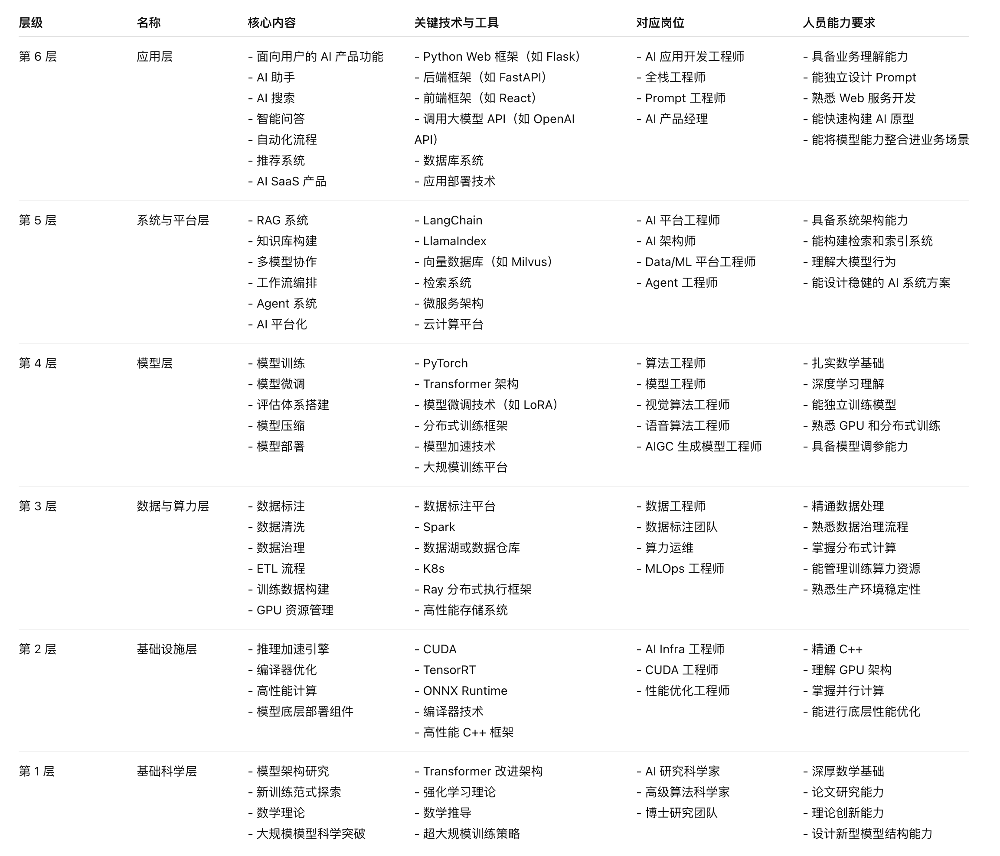
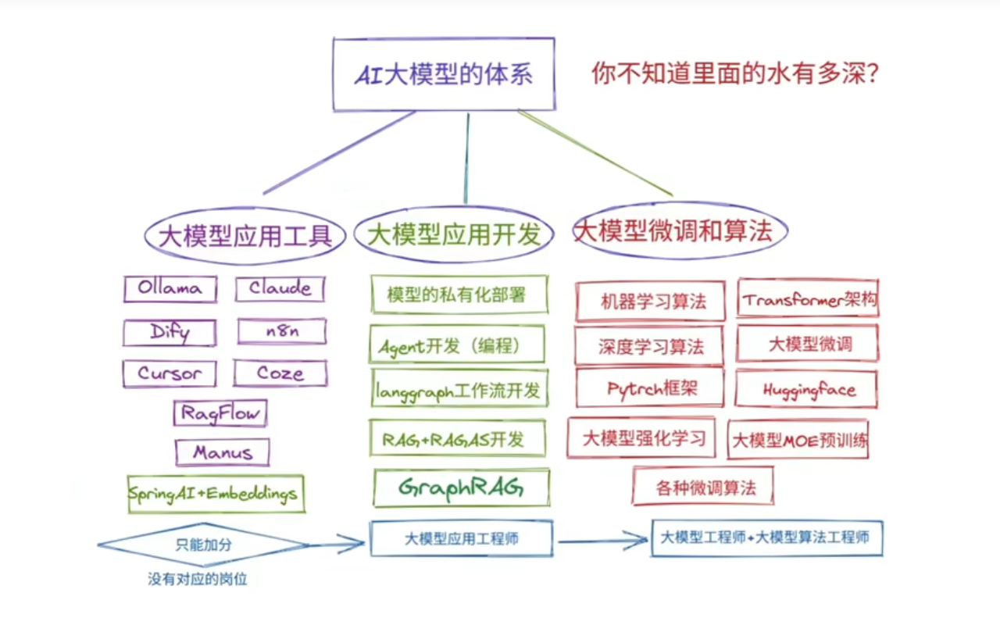
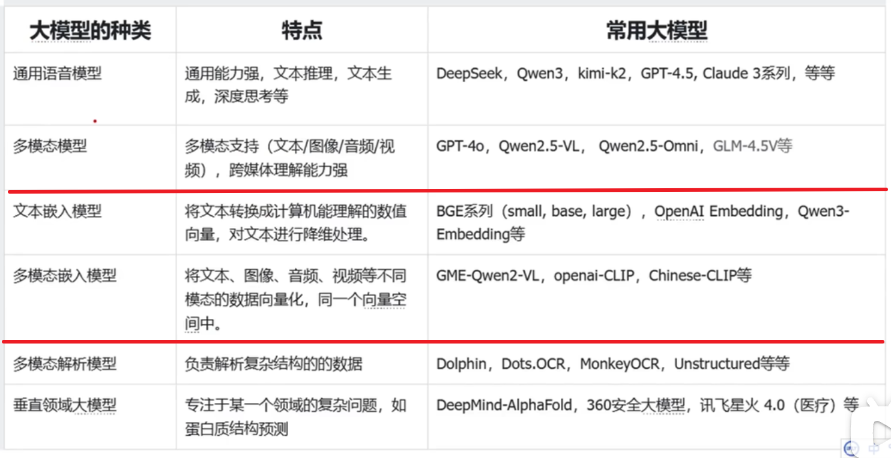
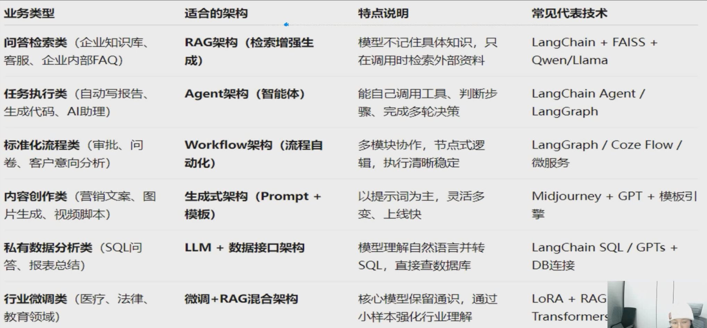

# AI-2-开发认知

- AI 开发分层体系

  

  

- AI 职位分类 及 需要掌握的知识

  1. 大模型应用工程师(agent 工程师)：不做优化，直接用
  2. 大模型研发（开发）工程师：推理优化、模型微调
  3. 大模型算法工程师：大模型预训练、算法优化---》研究算法（研究开发下一代大模型的）

  

- 大模型的分类

  

- 大模型推理框架（能运行大模型的工具 == 把模型跑起来的工具或技术）

  ollama: 个人级别的；下面是企业级：

  .png>)

- 应用场景 (业务类型与架构)

  

## Prompt--》Agent--》Function Call--》RAG--》Fine tune--》垂直行业 LLM

- Agent 运行流程

  

  

  

  

  

- 三个技术层面（从易到难）：

  1. 应用层技术：Prompt、Agent、Function Calling、RAG
  2. 优化层技术：Fine-tuning、模型蒸馏
  3. 底层技术：垂直行业 LLM 开发、预训练

- 实际工作中的技术栈组合：

  1. 新手/应用工程师：精通 Prompt + RAG + Agent 框架
  2. 进阶/研发工程师：掌握 Fine-tuning + 模型优化 + 部署
  3. 专家/算法工程师：深入预训练 + 模型架构 + 算法创新

## 预训练模型、微调、推理

1. 预训练模型：刚毕业的医学生
2. 微调：实习期，专攻一个方向
3. 推理：坐诊，看病

- 微调（Fine-tuning）和推理（Inference）

  1. 先微调 → 后推理。
  2. vllm: 只做推理，不能做微调

- 微调：

  1. 全参数微调（Full Fine-tuning），【全参数微调（Full Fine-tuning）】，精度最高，但显存/算力要求高（需多卡 A100/H100）
  2. 高效微调（Parameter-Efficient FT），【PEFT（LoRA, QLoRA, IA³） + Transformers】，只训练少量参数，节省 70%+ 显存，适合 7B–70B 模型
  3. QLoRA 微调（4-bit 量化 + LoRA），【BitsAndBytes + PEFT + Transformers】，在单张 24G GPU（如 RTX 4090）上微调 65B 模型
  4. 大模型分布式训练，【DeepSpeed（ZeRO-3）、Megatron-LM、FSDP（PyTorch）】，百亿/千亿模型，千卡集群
  5. 云平台托管微调，【AWS SageMaker、Azure ML、Google Vertex AI、Databricks】，无需管理基础设施，按需付费
     **当前企业主流选择**：QLoRA + PEFT + Transformers —— 性价比高、社区支持好、可复现性强。

## AI 原生应用架构的关键点补充

- 企业实践建议：

  1. 通用任务 → 使用 API（GPT/Claude/DeepSeek）
  2. 专业领域 → RAG + 通用模型（解决 90%问题）
  3. 高频固定任务 → Fine-tuning 专用小模型
  4. 核心业务 → 自研垂直模型（护城河）

- RAG 系统的优化路径

  1. 基础 RAG:简单检索 --> 向量搜索
  2. 进阶 RAG: 混合检索 --> Query 改写 --> 重排序 --> 图增强
  3. 生产级 RAG:智能路由 --> 缓存策略 --> 多模态 RAG --> 评估体系

  **注**

  1. 在 RAG 中 embeding 模型的维度必须与向量数据库的维度相同；
  2. FAISS：只存向量，不存 nodes 和 index；
  3. 参考 LlamaIndex；
  4. RAGas: RAG 评估系统；

- Agent 设计的演进

  1. 单 Agent: 工具调用 --> 记忆机制 --> 推理能力
  2. 多 Agent 协作:角色分工 --> 通信协议 --> 竞争协作
  3. 企业级 Agent 系统:工作流编排 --> 监控管理 --> 安全控制

  **注：** LangGraph，多智能体架构，MCP，Tool，上下文工程

## 工具栈推荐

- 向量数据库选择

  1. 入门/原型: Chroma, FAISS
  2. 中小项目: Pinecone, Weaviate
  3. 大型生产: Milvus, Qdrant, Elasticsearch

- 开发环境 -- 企业生产:

  1. vLLM/TGI (推理优化)
  2. FastAPI (服务封装)
  3. Docker/K8s (部署运维)
  4. Prometheus/Grafana (监控)

  **注“** langGrGraph + llamaIndex + fastApi + docker/K8S + 观测(OpenTelemetry / Phoenix / 自建)

## 常见误区提醒

1. 不要过度追求大模型：7B-13B 模型配合 RAG，能解决 80%的企业需求
2. RAG 不是万能的：对于逻辑复杂、需要深度推理的任务，可能需要微调
3. Agent 不是必须的：简单任务直接用链式调用，复杂任务再上 Agent
4. 评估要前置：在开发初期就要建立评估体系，而不是最后补

## 技术栈全景图

### 分层架构

```bash
┌──────────────────────────────────────────────────┐
│                应用层：AI原生应用                   │
├──────────────────────────────────────────────────┤
│          框架层：LangChain、LlamaIndex、AutoGen    │
├──────────────────────────────────────────────────┤
│        模型层：GPT、Claude、Qwen、DeepSeek          │
├──────────────────────────────────────────────────┤
│       基础设施：PyTorch、SiliconFlow、vLLM          │
└──────────────────────────────────────────────────┘
```

### 工具选型矩阵

| 需求场景      | 推荐工具栈                     | 特点             |
| ------------- | ------------------------------ | ---------------- |
| 个人学习/原型 | Ollama + LangChain + Streamlit | 简单快速、低门槛 |
| 中小企业      | vLLM + FastAPI + Docker        | 生产就绪、易部署 |
| 大型企业      | K8s + 多模型网关 + 监控体系    | 高可用、可扩展   |
| 特定领域      | 垂直模型 + RAG + Fine-tuning   | 专业深度、高精度 |

- 企业私有化 = 推理引擎 + 运维体系 + 安全合规

  1. 大型企业/高并发： vLLM on K8s + NVIDIA GPU + API 网关 + 监控
  2. 中型企业/稳定优先： TGI（Hugging Face） + K8s
  3. 小团队/MVP 验证： TGI 单机 Docker（比 Ollama 更生产就绪）
  4. 开发者本地/学习： Ollama 或 vLLM-MPS（Mac）

## 项目架构示例

### 企业知识库系统架构

```bash
┌──────────────────────────────────────────────────────────────┐
│                        用户界面层                              │
├──────────────────────────────────────────────────────────────┤
│                       API 网关与路由                           │
├──────────────────────────────────────────────────────────────┤
│  查询理解      │  检索增强       │  生成优化      │  评估反馈      │
├───────────────┬───────────────┬───────────────┬──────────────┤
│  • Query 改写  │  • 混合检索    │  • 提示工程     │  • RAGAS    │
│  • 意图识别    │  • 向量搜索     │  • 思维链      │  • 人工审核   │
│  • 多轮对话    │  • 全文检索     │  • 多模型融合   │  • A/B测试   │
├───────────────┴───────────────┴───────────────┴──────────────┤
│                     数据与基础设施层                            │
│                向量DB   文档解析   模型服务                     │
└──────────────────────────────────────────────────────────────┘
```

### 多 Agent 协作系统

```bash
┌─────────────────────────────────────────────────────────────────┐
│                         协调 Agent（Orchestrator）               │
├───────────────┬───────────────┬───────────────┬─────────────────┤
│   规划 Agent   │   执行 Agent  │   验证 Agent   │     学习 Agent   │
├───────────────┼───────────────┼─────────────-─┼─────────────────┤
│  • 任务分解     │  • 工具调用    │  • 结果验证    │  • 经验积累       │
│  • 优先级排序   │  • 状态管理    │  • 质量评估    │  • 策略优化       │
│  • 资源分配     │  • 错误处理    │  • 安全审查    │  • 性能调优       │
└───────────────┴───────────────┴───────────────┴─────────────────┘
```

## 实战学习路径

- 阶段一：基础掌握（1-2 个月）

  1. 第一周：大模型原理与 Prompt 工程
  2. 第二周：RAG 基础与向量数据库
  3. 第三周：Function Calling 与工具集成
  4. 第四周：单 Agent 开发实战

- 阶段二：进阶实践（2-3 个月）

  1. 第五周：高级 RAG 技术优化
  2. 第六周：多 Agent 协作系统
  3. 第七周：模型微调实战（LoRA）
  4. 第八周：评估体系与监控

- 阶段三：项目实战（2-3 个月）
  1. 项目 1：企业知识库系统（RAG 冠军方案）
  2. 项目 2：智能客服助手（多 Agent）
  3. 项目 3：数据分析平台（Text-to-SQL）
  4. 项目 4：工作流自动化（企业集成）

## ollama 介绍

1. ollama: 是一款旨在简化大型语言模型本地部署和运行过程的开源软件，
2. ollama: 提供了一个轻量级、易于扩展的框架，让开发者能够在本地机器上轻松构建和管理 LLMS(大型语言模型)
3. 网址: https://ollama.com

- 常用操作：
  - ollama list 【查看已安装的模型】
  - ollama pull llama2:13b 【拉取模型但不运行】
  - ollama rm llama2 【删除模型】
  - ollama run qwen:7b 【启动模型并运行】
  - ollama ps 【查看正在运行的模型】
  - ollama stop <模型名> 【停止当前运行的模型】
  - 运行 Qwen3--》退出后（Ctrl+D），再运行 DeepSeek

## 模型广场

1. 硅基流动：【企业、开发者】 面向开发者和企业的高性能大模型推理与部署平台。

2. 小爱 ai：【个人开发者、小团队】 基于 OneAPI 的聚合型 AI 服务平台（由 Calcium-Ion 开发）。

   - 网址：https://xiaoai.plus/

3. 阿里百炼：【企业、AI 工程师】一站式大模型开发及应用构建平台。

4. ModelScope(魔搭)：【研究者、学生、开发者】模型开放平台

## Coze、Dify、FastGPT、RAGFlow、langchain、MCP、A2A、n8n

1. Coze: 零代码 AI 智能体（Agent）开发平台

   - 极低 (零代码)；
   - 闭源；仅限云服务；
   - 无需任何编程，通过聊天和拖拽，最快速度创建并发布功能丰富的 AI 聊天机器人到各平台

2. Dify: 低代码/可视化 AI 应用开发平台

   - 低 (低代码/可视化)
   - 开源；支持云服务和私有化部署
   - 通过可视化工作流编排，一站式快速构建和运维多种 AI 应用（如聊天机器人、知识库、Agent）
   - CPU >= 2 Core；
   - RAM >= 4 GiB；
   - Docker 19.03 or later Docker Compose 1.25.1 or later

3. FastGPT: RAGFlow 的竞争对手；

   - 服务器配置低
   - 开源；支持私有化部署
   - 没有 RAGFlow 功能强

4. RAGFlow: 是一个开源、本地化部署的检索增强生成（RAG）系统

   - 中高 (需一定技术背景)
   - 开源；支持私有化部署
   - 对复杂格式文档（如 PDF、表格、扫描件）进行深度解析，实现高精度、可溯源的文档问答
   - CPU ≥ 4 核 (x86)；
   - 内存 ≥ 16 GB；
   - 磁盘 ≥ 50 GB；
   - Docker ≥ 24.0.0 & Docker Compose ≥ v2.26.1。

5. langchain: 深度定制的王者；给算法和后端工程师用的，

6. MCP: 是为单个智能体配备“工具箱”的规范

7. A2A: 多智能体系统（让多个智能体“团队协作”的协议;）

   - A2A（Agent-to-Agent）是一个“通信与协作协议”，而多 Agent、Router、Supervisor 是实现多智能体系统的“架构模式与具体角色”。
   - 它们之间的关系是：A2A 定义了智能体之间如何沟通的“规则”，而多 Agent 系统则是这个规则得以应用的“舞台”，Router 和 Supervisor 是这个舞台上的“关键协调者”。

8. n8n: 通用型工作流自动化平台（则是搭建整个“自动化工厂”的平台）

   - 中 (可视化但逻辑复杂)
   - 开源（公平代码）；极易自托管，资源消耗低
   - 通用型工作流自动化平台 连接数百个应用与 API，实现跨系统的业务流程自动化，并可集成 AI 模型节点来增强流程智能

- Claude: 是 Anthropic 公司对标老雇主 OpenAI 的拳头产品；
- Cursor: 内置 AI 的编辑器；
- Manus: 通用 AI 智能体 (AI Agent)

## 对比

Valkey(Redis 的开源版),

- MinerU 与嵌入模型（例：BGE-M3）

  1. MinerU: PDF/文档智能解析工具（Document Parser）;从 PDF、扫描件、复杂排版文档中提取 干净、结构化的文本/表格/公式;
  2. BGE-M3: 多语言文本嵌入模型（Embedding Model）；将文本转换为向量，用于语义检索
  3. MinerU 的输出（干净文本） → 可作为 BGE-M3 的输入（生成嵌入）

- 数据集（Dataset）与 模型库（Model Library / Model Zoo）

  1. 数据集：用于训练、验证或测试模型的“原始数据集合”，通常包含输入（如文本、图像）和/或标签（如分类、答案）。
  2. 模型库：一系列“已训练好的模型”或“模型架构代码”的集合，供开发者直接使用、微调或参考

- 量化模型 与 正常模型（浮点模型）

  1. 正常模型：高精度、训练/推理标准格式（✅ 支持训练与微调）；
  2. 量化模型：低精度、压缩后用于高效推理（❌ 通常仅用于推理）；
  3. 量化（Quantization）：将高精度浮点权重/激活值“近似映射”为低比特整数的过程。
  4. 量化模型有哪些： Hugging Face Hub：搜索 awq、gptq、gguf 后缀（例：TheBloke/Llama-3-8B-GGUF）

- 传统数据库 与 向量数据库

  1. 传统数据库：存储结构化数据（如表格、行、列）。（依赖精确匹配（如=、<、>）。）
  2. 向量数据库：存储高维向量数据，适合非结构化数据。（基于相似度或距离度量）

## 提问

- Mac mini（M2 + 24GB 内存） + macOS Sequoia 15.5 + Xcode 16.4 学习 AI 开发(部署大模型)， 不影响办公（例：vscode PyCharm）；
- PyCharm python（3.11+）,用 uv 怎么安装 vllm（已经 0.12.0 了），PyTorch（已经 2.9 了），下载 4B 量化大模型，并运行；
- 未来会在 linux 上部署；用 langchain1.x；
- 解读，详解，生产建议怎么用（要考虑国内合规性，完全本地部署）？最后附加一个小 demo

*
* 现在 2026 年了，RAGflow 深入学习教程推荐（中文 和 英文），分 入门 、进阶 、 高级 ,最好带上连接（工作中要用）
