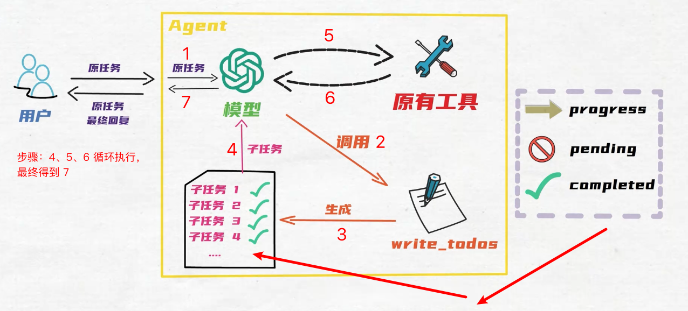

# LangChain V1.0 、 LangGraph 、 deepAgents

1. LangChain V1.0 vs LangGraph V1.0: 分工与定位

   - LangChain: 构建 AI 智能体的最快方式。提供标准的工具调用架构、供应商无关设计和可插拔的中间件系统，让开发者高效构建通用 Agent.
   - LangGraph: 一个底层运行时框架，专为需要长期运行、可控且高定制化的生产级智能体设计。
   - LangChain V1.0 的 Agent 是构建在 LangGraph 之上，以提供持久的执行、流、人机交互、持久性等。

2. DeepAgents V1.0:【做研究类的】 构建能够规划（planning）、使用子代理（subagent）并利用文件系统（file system）完成复杂任务的代理

3. 测试框架：

   - LangSmith: 大型语言模型的可观测性、评估与部署（分析用的）【真实项目不用】
   - LangGraph studio: 语言模型开发工具，基于 LangGraph 构建，提供模型开发、测试、部署等功能。

4. LangGraph CLI: 后端打包部署的工具
5. Agent Chat UI: 前端页面

## LangChain ================================

## 1、model

- 最好用模型对应的 api 接口（例：ChatDeepSeek、ChatOpenAI）：可以显示思考过程、细节等；

- 参数

  1. temperature: 采样温度，值越高越有创造性（按照官方文档来）
  2. max_retries: 最大重试次数。
  3. max_tokens: 要生成的最大 token 数。

- 速率限制：有些大模型不允许，单位时间内调用的次数太多；

  1. init_chat_model()：函数调用【独有速率限制参数】
  2. ChatDeepSeek（）、ChatOpenAI（）：类调用【没有速率限制参数】

- 调用：invoke、stream、batch
- 工具调用：bind_tools
- 结构化输出：structured_outputs
- 高级：
  1. 多模态
  2. 推理（）
  3. 提示词缓存（模型自带）
  4. 速率限制
  5. 日志概率
  6. token 用量
  7. 调用时配置

## 2、工具(tools)

from agent.my_llm import llm

```python
@tool(name:str, description:str,response_format:["content", "content_and_artifact"])
def tool_name(arg1: str, arg2: int) -> str:
     """ 提示词

     Args:
         参数描述

     Returns:
         返回值描述
     """
     print("参数：", arg1, arg2)
     return "返回值"


model = init_chat_model("openai:gpt-3.5-turbo")
model_with_tool = model.bind_tools([tool_name])
response = model_with_tool.invoke("请计算 1+1")
```

- response_format:["content", "content_and_artifact"]:可选，输入二元数组
- get_input_schema():获取工具的输入策略
- get_output_schema():获取工具的输出策略

* 工具参数

  1. 名称：str;
  2. 描述：str;
  3. args_schema: pydantic.BaseModel;
  4. return_dirct: 忽略

* 定义工具三类方式：

  1. @tool 装饰器定义
  2. 继承 BaseTool 类定义，必须重写`_run`函数
  3. 从 MCP 服务器获得

**注意：** 同步工具，智能体同步调用，异步工具，智能体异步调用

## 3、结构化输出（Structured Output）

- ToolStrategy[StructuredResponseT]：使用工具调用进行结构化输出
- ProviderStrategy[StructuredResponseT]：使用提供商原生结构化输出
- type[StructuredResponseT]：架构类型 - 根据模型能力自动选择最佳策略
- None：无结构化输出
- 联合类型：多个架构选项

* 定义结构化输出格式的架构
  1. Pydantic (V2) 的 BaseModel
  2. Dataclass (数据类)
  3. TypedDict：类型化字典类
  4. JSON Schema：带有 JSON 模式规范的字典
  5. 联合类型：多个架构选项

## 4、Agent（智能体/代理）

- Agent 核心组件：模型（Model）、工具（Tool）、记忆（Memory）

  1. 模型（Model）： Agent 的“大脑”，负责推理和决策过程。
  2. 工具(Tool)： Agent 与外部交互的“能力扩展“，每个工具提供一个功能，如搜索、翻译、计算等。
  3. 记忆（Memory）： 为 Agent 提供上下文感知能力，使其能够记住之前的交互历史并基于上下文做出决策（分 短期记忆、长期记忆）。

     - 短期记忆： 维护当前对话的上下文，如当前任务、当前对话、当前工具调用结果等。
     - 长期记忆： 跨对话会话的知识持久化存储，如数据库、文件系统、知识库等。

- agent: model、tools、system_prompt、checkpoint、middleware

- 多 agent:2 种方式

  1. 集中式: user -> supervisor agent ->worker agent
  2. 轮换式: user -> agent1 --> user -->agent2

- 调用：invoke、stream 调用、异步调用

- 工作流程

  
  

### 1、核心入口:create_agent()统-Agent 构建流程

1. 底层封装 LangGraph 执行机制: create_agent()默认基于 LangGraph 引擊实现，将“模型调用一工具决策一工具执行一结果整合“的闭环流程封装为高阶接口，开发者无需关注底层的图执行逻辑，只需传入核心组件即可快速构建 Agent。这种设计不仅简化了代码，还提升了流程的稳定性和可扩展性，支持复杂的分支逻辑和循环执行。

2. 告别繁琐的提示词模板: 旧版本要要从 LanaChain Hub 导入大段的提示词模板，包含工具调用格式、对话历史注入等复杂配置，且模型容易出现格式输出错误。1.0 版本中，开发者只需传入简洁的 system_prompt(系统提示词)，LangChain 会自动结合工具信息、对话上下文生成完整的提示词，大幅降低了提示词设计的难度。

3. 兼容 Function Calling 标准: create_agent()原生支持 OpenAI 定义的 Function calling 格式，能够自动将工具信息转化为结构化的函数描述，传递给支持该格式的 LLM，在国内模型中，通义千问对这一特性的适配性最佳，这也是很多开发者选择其作为 LangChain 默认模型的重要原因。

### 多代理（多 Agent）

- supervisor agent 步骤:

  1. 创建 2 个 worker agent，有各自的 tools;
  2. 把这 2 个 agent 封装成 2 个新的 tool;
  3. 创建 supervisor agent，配置 tools，使用的就是 这 2 个 work agent 封装的 tool;

### 动态模型 Agent

```python
base_model = ChatOpenAI(model="gpt-3.5-turbo-16k")
advanced_model = ChatOpenAI(model="gpt-4")

@wrap_model_call
def dynamic_model_call(request: ModelCallRequest,handler)->ModelResponse:
  message_count = len(request.state['messages'])
  if message_count > 10:
    model = advanced_model
  else:
    model = base_model
  request.model = model
  return handler(request)

agent = create_agent(
  model=base_model,
  tools=tools,
  middleware=[dynamic_model_call]
)
```

## 5、系统提示词(system_prompt)

- 动态系统提示

## 6、消息（Message）

- 组成部分: SystemMessage、HumanMessage、ToolMessage、AIMessage

  1. role: system(系统消息)、user（用户输入）、assistant（模型输出）、tool(工具输出)
  2. content: 消息内容
  3. Metadata:（可选）额外信息，如：消息 ID、响应时间、token 消耗、消息标签等

- 全部响应： model.invoke(message: Message) -> Message
- 流式响应： model.stream(message: Message) -> Generator[Message, None, None]
- 批量响应： model.batch(messages: List[Message]) -> List[Message]

## 8、记忆：短期记忆、长期记忆（持久化）

### checkpointer 检查点管理器

- checkpoint: 检查点，状态图的“总体状态”快照
- thread_id: 管理
- 作用: 管理记忆、时间旅行、人工干预（human-in-the-loop）、容错

### 状态(state)

- SystemMessage、HumanMessage: Content
- AIMessage 的 additional_kwargs

  1. 属性

     - tool_calls(list): 与该消息关联的工具调用；
     - invalid_tool_calls(list): 与该消息关联的解析错误的工具调用；
     - usage_metadata(typedict): 包会该消息的使用元数据，例如 token 使用情况；
     - content_blocks(list): 消息中标准的、结构化的 ContentBlock 字典;

  2. 方法 pretty_repr ->str: 返回该消息更易读的的可视化呈现形式;

- ToolMessage 的 additional_kwargs
  1. 属性
     - results(list): 工具的执行结果，列表内容由所定义工具而定;
     - tool_call_id(str): 该消息消息所响应的工具调用唯一标识;
     - status(Literal['success','error']): 工具调用的结果状态;
     - artifact(Any): 工具执行过程中产生的非传输内容，与工具定义时 content_and_artifact 参数关联；
  2. 方法 coerce_args -> dict: 强制将模型参数转换为正确类型

## 7、中间件 -- 通过钩子

agent 运行过程：拥有更细致、全面的控制与逻辑搭建；

- 中间件的主要作用

  1. 行为记录：通过日志记录、分析和调试跟踪 Agent 行为；
  2. 格式约束：转换提示、工县选择和输出格式；
  3. 逻辑控制：增加了重试、后备和提前终止逻辑；
  4. 资源限制：应用速率限制、保护栏和个人身份识别检测；

**注意：** middleware 参数传入一个列表，可以传入多个中间件；当同一位置有多个中间件时，会按照列表中的先后顺序触发；

- 分类：预构建中间件 和 自定义中间件

  1. 预构建中间件（Built-in Middleware）：

     - Summarization: 触发时自动总结对话列表记录;
     - Human-in-the-loop: 暂停执行以供人工批准或修改工具调用;
     - To-do list: 为代理提供复杂多步骤任务的任务规划和跟踪能力;
     - Model call limit: 限制模型调用次数，以防止过高成本;

  2. 自定义中间件（Custom Middleware）：

     - 节点型钩子:

       1. before_agent: Agent 开始前(每次查询一次);
       2. before_model: 每次模型调用前
       3. after_model: 每次模型响应后
       4. after_agent: 代理 完成后(每次调用一次)

     - 环绕型钩子:
       1. wrap_model_call: 国绕每次模型调用
       2. wrap_tool_call: 用绕每次工具调阳

### 人工干预（人在环上 -- Human-in-the-loop）

- 创建、配置、运行

  1. 配置时：一定要配置 checkpointer，在 agent 执行中断后，维持中断前的图状态；
  2. 调用时：传入 config 记录线程信息；
  3. 运行时机：模型响应之后，任何工具调用之前，触发。

- 运行流程

  1. Agent 调用模型后；
  2. 中间件验证“模型回复”是否符合中断策略；
  3. 当符合时: 中间件触发中断，并汇总信息交给 agent；
  4. agent 将“中断信息”返回给用户，等待决策；
  5. 最终根据用户响应；

- interrupt_on 中不配置，不中断，不做审核；
- 当 interrupt_on 中配置的工具中断时，返回的 message 中包含`__interrupt__`字段, 显示信息；
- 用户响应中断（恢复/拒绝执行时），需要用 Command

```python
middleware=[
  HumanInTheLoopMiddleware(
    interrupt_on={
      "tool_name1": False, # 不做审核
      "tool_name2": True, # 做审核
      "tool_name3": {"allowed_decisions": ["approve", "reject"]}, # 做审核
    },
    description_prefix="提示语言", # 多个工具可能同时中断，根据提示做判断
  )
]

config = {"configurable":{"thread_id": "123"}}
agent.invoke( # 决绝继续
  Command(
    resume={
      "decisions":[{
        'type':'reject',
        'message':'拒绝理由'
        }]
      }),
  config=config)

agent.invoke( # 中断继续
  Command(
    resume={
      "decisions":[{
        'type':'approve'
        }]
      }),
  config=config)

agent.invoke( # 编辑后继续
  Command(
    resume={
      "decisions":[{
        'type':'edit',
        'edited_action':{
          "name":"工具名称",
          "args":{"key1":"value1",ket2:"value2"}
         }
        }]
      }),
  config=config)
```

### 摘要中间件 (Summarization)

较复杂或冗余情况下，agent 状态积累，快要突破 “模型的上下文”token 限制时，它会自动总结旧对话，这样防止 token 溢出，保证对话不中断

- 调用时机：会在 agent 内部每次调用模型前，检查消息列表情况；

- 使用场景：

  1. 长文本(Long-context): 超出上下文窗口的长期对话任务；
  2. 多轮次(multi-turn): 具有丰富历史记录的多轮对话，
  3. 高冗余(High-redundancy): 需要完整保留对话上下文的应用场景;

- 参数：
  1. model: string | BaseChatModel
  2. trigger: tuple[str, int] | list[tuple[str, int]]; 【ContextSize | list[ContextSize]】
  3. keep: tuple[str, int]; 【ContextSize】
  4. summary_prompt: string(可选，替换原来的系统提示词，新的提示词中必须包含{messages}占位符)

```python
agent=create_agent(
  model=model,
  tools=[tools],
  middleware=[
    SummarizationMiddleware( #
      model=model, # 总结模型
      # 1、根据 消息条数：
      trigger=("message", 5), # 消息条数，总结摘要触发的条件
      keep=("message", 5) # 摘要总结时，保留原消息列表中内容数量

      # 2、根据 token数量
      # trigger=("token", 1000),
      # keep=("token", 1000),

      # 3、根据 模型上下文长度的比值
      # trigger=("fraction", 0.8),
      # keep=("fraction", 0.3 ),

      # 4、混合使用,任一条件满足时，触发总结；
      # trigger": [("message", 5),("message", 10),("token", 1000)")]
      # keep": ("message", 5)

    )]
)
```

### PI 脱敏中间件

内容发给模型前，自动识别并打码邮箱电话等敏感信息，保护用户隐私，满足合规的硬性要求

### tool_selector 和 to_do_list

- tool_selector: 工具太多时

  在调用主模型前，利用大型语言模型智能选相关工具，通过结构化输出（定义了可用工具的名称及描述），提供工具子集给 agent 的主模型；

  1. 使用场景：

     - 多工具：拥有大量工具(10+)的代理，其中多数工具对每次查询而言并不相关；
     - 高成本：通过过滤无关工具来减少 token 使用量；
     - 高精度：通过减少冗余工具，提升模型聚焦度与谁确性。

  2. 触发时机：每次模型调用前，基于当前消息列表，触发工具筛选。
     Í

  ```python
    agent = create_agent(
      model=model,
      tools=[tools], # agent 工具列表（所有可用工具--工具对象）
      middleware=[
        LLMToolSelectorMiddleware(
          model=model, # 负责工具筛选的模型
          max_tools=5, # 最多返回的 tool 个数
          allow_include=['tool_1'], # 始终包含的 tool，工具名称（字符串）
        )
      ]
    )
  ```

- to_do_list: 能够为 agent 配备复杂多步骤任务的规划与追踪能力

  （主要适用于跨工具使用的多步骤复杂任务 或 需实时进度可见性的长期运行操作）

  1. 使用场景: 模型认为任务复杂，且需多步骤处理时才会生效
  2. 运行逻辑: 为 Agent(新增)写入 write-todos 工具,使 Agent 能够创建并管理复杂多步骤操作的结构化任务清单，其设计旨在协助代理跟踪进度，整理复杂任务，并为用产提供任务完成状态的可视化信息；

  ```python
     agent = create_agent(
       model=model,
       tools=[tools],
       middleware=[ToDoListMiddleware()]
     )
     res = agent.invoke({"message": "问题"})
     print(res['todo'])
  ```

  复杂任务时: agent 的回答会额外多出 todo 字段

  - to_do_list:

    1. content: 子任务的具体描述
    2. status: 子任务的当前执行状态

  
  步骤：4、5、6 循环执行

## 时间旅行

## 运行时

## 模型上下文协议 (MCP)

## RAG（检索增强生成）

- 语义搜索：

- 问题：1、大模型幻觉；2、上下文“长度”限制；3、模型“专业知识与时效性知识”不足
- 解决：

  1. 数据源
  2. 文档解析
  3. 文本分割
  4. 文本向量化
  5. 存向量库
  6. 检索
     - 相似度计算
     - 重排序
  7. RAG 系统评估
     - 文档检索评估
     - 文档生成评估
     - 评估工具：RAGAS、langSmith、LLM-AS-A-Judge
  8. RAG 系统优化
     - 文档检索过程优化
     - 上下文拼接策略优化
     - 生成策略优化

  - Graph RAG：基于知识图谱的新型检索方式
  - Agentic RAG：将 检索增强生成 与 agent 结合

### 语义搜索

- 从 PDF 到向量库(知识库)

  1. 文档解析：读取 PDF，按页面管理，Document,List[Document]
  2. 分割文本，文本段（chunk），Document,List[Document]
  3. 向量化：文本段<=>向量，需要嵌入模型来辅助；
  4. 向量库：把多个“文本段的向量”保存到向量库；

- 四种语义搜索方法
  1. （用文本）相似度查询
  2. （用文本）带分数的相似度查询
  3. （用向量）进行相似的查询；【查询先转向量，后查询】

## SQL

## 上下文工程

## 模型上下文协议（MCP）

## 防护措施

## langGraph（强调生产可靠性） =================================================

### 图

### 持久化状态：智能体状态自动保存，中断后也能从断点继续

## deepAgent: ========================================

planning(规划)、file system（文件系统）、subagent（子代理）

- 何时使用 Deep Agents：当您需要能够完成以下任务的代理时，请使用 Deep Agents：

  1. 处理需要规划和分解的复杂多步骤任务
  2. 通过文件系统工具管理大量上下文
  3. 将工作委托给专门的子代理以实现上下文隔离
  4. 在对话和线程中持久化内存

- 过程
  1. deepagent 内置工具：write_todos,to_do_list
  2. internet_search ... update to_do_list
  3. write_file ,写报告

## 部署
