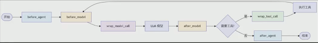

# langChain-V1.x-1-简介

LangChain 1.0（不单单指 langchain） = 协议（core）+ 编排（graph）+ Provider（插件）+ Service（serve）

```bash
Message 是事实
ToolCall 是事件
Runnable 是行为
Graph 是控制流
Agent 是约定
```

## LangChain1.0 构成: 轻核心与模块化

1. 1️⃣ langchain-core（最重要）：这是 LangChain 1.0 的“内核”

   只做三件事：

   | 能力     | 说明                                            |
   | -------- | ----------------------------------------------- |
   | 抽象接口 | LLM / ChatModel / Embeddings / Retriever / Tool |
   | Runnable | 协议 Runnable, RunnableSequence, RunnableMap    |
   | Schema   | BaseMessage, Document, ToolCall, AIMessage      |

   写的 80% 业务代码，只依赖 langchain-core

2. 2️⃣ langchain（名字很大，地位已下降）：“默认拼装层”，对 langchain-core 的 封装 + 兼容；⚠️ 能不用就不用;

   agent 黑盒必须与 LangSmith 配合使用

   - 主要作用：

     - 把常用组件“顺手装一起”
     - 提供少量向后兼容接口
     - 简化新手体验

     ❗LangChain 1.0 官方推荐：能不用 langchain，就不用

3. 3️⃣ langchain-community = 官方兜底的“实验仓库”

   ❗ 社区集成：1.0 之后官方态度： community ≈ “临时停靠区”，成熟了就拆到独立 provider 包

4. 4️⃣ LLM / Embedding Provider（强解耦）

   - 好处：

     - 不污染核心
     - 你可以完全不装 OpenAI
     - Ollama / vLLM / 本地模型一等公民

5. 5️⃣ VectorStore / DB Provider

   全部只依赖 langchain-core

6. 6️⃣ langGraph = 新一代 Agent 引擎

   Agent 系统基础(Agent = Graph + State);

   | 能力         | 说明                  |
   | ------------ | --------------------- |
   | State        | 显式状态机            |
   | Graph        | DAG / 循环 / 条件分支 |
   | Tool Calling | 可控、可回放          |
   | 多 Agent     | Supervisor / Router   |

   ❗ LangChain 官方明确：未来所有 Agent，都应该基于 langgraph

7. 7️⃣ langServe（部署）

   - 功能：
     - 把 Runnable / Graph 直接暴露为 API
     - FastAPI 自动生成
     - 支持 streaming / schema

8. 8️⃣ langSmith（观测，不是必须）
   这是 SaaS，不是你项目必须的一部分。
   你 可以完全不用
   与 LangChain 配合，大型语言模型的可观测性、评估与部署（分析用的）【真实项目不用】;

- langchain-text-splitters（完全独立）;
- langchain-mcp-adapters: 把 MCP Tool 映射成 langchain-core Tool;
- langchain-classic: 向后兼容包（后期删除）;

- DeepAgents:【做研究类的 -- 暂时不可用】 构建能够规划（planning）、使用子代理（subagent）并利用文件系统（file system）完成复杂任务的代理;
- LangGraph studio: 语言模型开发工具，基于 LangGraph 构建，提供模型开发、测试、部署等功能。
- LangGraph CLI: 后端打包部署的工具
- Agent Chat UI: 前端页面

* 命名空间

  | 模块                  | 可用内容                        | 备注                          |
  | --------------------- | ------------------------------- | ----------------------------- |
  | langchain.agents      | create_agent, AgentState        | 核心代理创建功能              |
  | langchain.messages    | 消息类型，内容块，trim_messages | 从 @[langchain-core] 重新导出 |
  | langchain.tools       | @tool, BaseTool，注入助手       | 从 @[langchain-core] 重新导出 |
  | langchain.chat_models | init_chat_model, BaseChatModel  | 统一模型初始化                |
  | langchain.embeddings  | Embeddings, init_embeddings     | 嵌入模型                      |

  ❗ langchain.messages / langchain.tools: 只是为了兼容旧项目，不想一夜之间炸掉全世界代码 💣

## langchain 部分

1. Create_agent API
2. AgentMiddleware:
3. ContentBlocks: 输出的“内容块”
4. Structured Output:
5. State Management: 状态管理

- 中间件的四大功能

  1. 监控(Monitoring): 日志记录、分析、调试;
  2. 修改(Modification): 转换提示词、工具选择、输出格式;
  3. 控制(Control): 重试、降级、提前终止;
  4. 强制(Enforcement): 速率限制、防护栏、PI 检测;



## langchain 分层

- ✅ Layer 1：协议 & 抽象（唯一核心）

  ```bash
  langchain-core
  ├── messages
  ├── runnables
  ├── tools
  ├── output_parsers
  ├── prompts
  └── callbacks / tracing
  ```

- ✅ Layer 2：能力实现层（实现 Runnable）

  ```bash
  chat_models
    ├── langchain-openai
    ├── langchain-anthropic
    └── langchain-vllm

  langchain-mcp-adapters
    └── MCP → BaseTool → Runnable
  ```

- ✅ Layer 3：控制流 & Agent 引擎

  ```bash
  LangGraph
    ├── State
    ├── Node (Runnable)
    ├── Edge
    └── Replay / Checkpoint
  ```

  这一层直接吃 core，不吃 langchain

- ✅ Layer 4：Facade / 快速应用框架（可选）

  ```bash
  langchain
  ├── agents
  ├── chains
  ├── memory
  └── tool routing
  ```

- ✅ Layer 5：组织 & 多 Agent

  ```base
  DeepAgents
    └── built on LangGraph
  ```

- ✅ Layer X：平台 & 监控（旁路）

  ```bash
  LangSmith
    ↔ callbacks / tracing
  ```

## 1、核心入口:create_agent()统-Agent 构建流程

动态模型 Agent

```python
base_model = ChatOpenAI(model="gpt-3.5-turbo-16k")
advanced_model = ChatOpenAI(model="gpt-4")

@wrap_model_call
def dynamic_model_call(request: ModelCallRequest,handler)->ModelResponse:
  message_count = len(request.state['messages'])
  if message_count > 10:
    model = advanced_model
  else:
    model = base_model
  request.model = model
  return handler(request)

agent = create_agent(
  model=base_model,
  tools=tools,
  middleware=[dynamic_model_call]
)
```

## 中间件 -- 通过钩子

### 人工干预（人在环上 -- Human-in-the-loop）

- 创建、配置、运行

  1. 配置时：一定要配置 checkpointer，在 agent 执行中断后，维持中断前的图状态；
  2. 调用时：传入 config 记录线程信息；
  3. 运行时机：模型响应之后，任何工具调用之前，触发。

- 运行流程

  1. Agent 调用模型后；
  2. 中间件验证“模型回复”是否符合中断策略；
  3. 当符合时: 中间件触发中断，并汇总信息交给 agent；
  4. agent 将“中断信息”返回给用户，等待决策；
  5. 最终根据用户响应；

- interrupt_on 中不配置，不中断，不做审核；
- 当 interrupt_on 中配置的工具中断时，返回的 message 中包含`__interrupt__`字段, 显示信息；
- 用户响应中断（恢复/拒绝执行时），需要用 Command

```python
middleware=[
  HumanInTheLoopMiddleware(
    interrupt_on={
      "tool_name1": False, # 不做审核
      "tool_name2": True, # 做审核
      "tool_name3": {"allowed_decisions": ["approve", "reject"]}, # 做审核
    },
    description_prefix="提示语言", # 多个工具可能同时中断，根据提示做判断
  )
]

config = {"configurable":{"thread_id": "123"}}
agent.invoke( # 决绝继续
  Command(
    resume={
      "decisions":[{
        'type':'reject',
        'message':'拒绝理由'
        }]
      }),
  config=config)

agent.invoke( # 中断继续
  Command(
    resume={
      "decisions":[{
        'type':'approve'
        }]
      }),
  config=config)

agent.invoke( # 编辑后继续
  Command(
    resume={
      "decisions":[{
        'type':'edit',
        'edited_action':{
          "name":"工具名称",
          "args":{"key1":"value1",ket2:"value2"}
         }
        }]
      }),
  config=config)
```

### 摘要中间件 (Summarization)

较复杂或冗余情况下，agent 状态积累，快要突破 “模型的上下文”token 限制时，它会自动总结旧对话，这样防止 token 溢出，保证对话不中断

- 调用时机：会在 agent 内部每次调用模型前，检查消息列表情况；

- 使用场景：

  1. 长文本(Long-context): 超出上下文窗口的长期对话任务；
  2. 多轮次(multi-turn): 具有丰富历史记录的多轮对话，
  3. 高冗余(High-redundancy): 需要完整保留对话上下文的应用场景;

- 参数：
  1. model: string | BaseChatModel
  2. trigger: tuple[str, int] | list[tuple[str, int]]; 【ContextSize | list[ContextSize]】
  3. keep: tuple[str, int]; 【ContextSize】
  4. summary_prompt: string(可选，替换原来的系统提示词，新的提示词中必须包含{messages}占位符)

```python
agent=create_agent(
  model=model,
  tools=[tools],
  middleware=[
    SummarizationMiddleware( #
      model=model, # 总结模型
      # 1、根据 消息条数：
      trigger=("message", 5), # 消息条数，总结摘要触发的条件
      keep=("message", 5) # 摘要总结时，保留原消息列表中内容数量

      # 2、根据 token数量
      # trigger=("token", 1000),
      # keep=("token", 1000),

      # 3、根据 模型上下文长度的比值
      # trigger=("fraction", 0.8),
      # keep=("fraction", 0.3 ),

      # 4、混合使用,任一条件满足时，触发总结；
      # trigger": [("message", 5),("message", 10),("token", 1000)")]
      # keep": ("message", 5)

    )]
)
```

### PI 脱敏中间件

内容发给模型前，自动识别并打码邮箱电话等敏感信息，保护用户隐私，满足合规的硬性要求

### tool_selector 和 to_do_list

- tool_selector: 工具太多时

  在调用主模型前，利用大型语言模型智能选相关工具，通过结构化输出（定义了可用工具的名称及描述），提供工具子集给 agent 的主模型；

  1. 使用场景：

     - 多工具：拥有大量工具(10+)的代理，其中多数工具对每次查询而言并不相关；
     - 高成本：通过过滤无关工具来减少 token 使用量；
     - 高精度：通过减少冗余工具，提升模型聚焦度与谁确性。

  2. 触发时机：每次模型调用前，基于当前消息列表，触发工具筛选。
     Í

  ```python
    agent = create_agent(
      model=model,
      tools=[tools], # agent 工具列表（所有可用工具--工具对象）
      middleware=[
        LLMToolSelectorMiddleware(
          model=model, # 负责工具筛选的模型
          max_tools=5, # 最多返回的 tool 个数
          allow_include=['tool_1'], # 始终包含的 tool，工具名称（字符串）
        )
      ]
    )
  ```

- to_do_list: 能够为 agent 配备复杂多步骤任务的规划与追踪能力

  （主要适用于跨工具使用的多步骤复杂任务 或 需实时进度可见性的长期运行操作）

  1. 使用场景: 模型认为任务复杂，且需多步骤处理时才会生效
  2. 运行逻辑: 为 Agent(新增)写入 write-todos 工具,使 Agent 能够创建并管理复杂多步骤操作的结构化任务清单，其设计旨在协助代理跟踪进度，整理复杂任务，并为用产提供任务完成状态的可视化信息；

  ```python
     agent = create_agent(
       model=model,
       tools=[tools],
       middleware=[ToDoListMiddleware()]
     )
     res = agent.invoke({"message": "问题"})
     print(res['todo'])
  ```

  复杂任务时: agent 的回答会额外多出 todo 字段

  - to_do_list:

    1. content: 子任务的具体描述
    2. status: 子任务的当前执行状态

  
  步骤：4、5、6 循环执行

## 时间旅行、图、

## 上下文工程

## 运行时

## 防护措施

## 模型上下文协议 (MCP)

## RAG（检索增强生成）

- 语义搜索：

- 问题：1、大模型幻觉；2、上下文“长度”限制；3、模型“专业知识与时效性知识”不足
- 解决：

  1. 数据源
  2. 文档解析
  3. 文本分割
  4. 文本向量化
  5. 存向量库
  6. 检索
     - 相似度计算
     - 重排序
  7. RAG 系统评估
     - 文档检索评估
     - 文档生成评估
     - 评估工具：RAGAS、langSmith、LLM-AS-A-Judge
  8. RAG 系统优化
     - 文档检索过程优化
     - 上下文拼接策略优化
     - 生成策略优化

  - Graph RAG：基于知识图谱的新型检索方式
  - Agentic RAG：将 检索增强生成 与 agent 结合

### 语义搜索

- 从 PDF 到向量库(知识库)

  1. 文档解析：读取 PDF，按页面管理，Document,List[Document]
  2. 分割文本，文本段（chunk），Document,List[Document]
  3. 向量化：文本段<=>向量，需要嵌入模型来辅助；
  4. 向量库：把多个“文本段的向量”保存到向量库；

- 四种语义搜索方法
  1. （用文本）相似度查询
  2. （用文本）带分数的相似度查询
  3. （用向量）进行相似的查询；【查询先转向量，后查询】

## deepAgent: =====

planning(规划)、file system（文件系统）、subagent（子代理）

- 何时使用 Deep Agents：当您需要能够完成以下任务的代理时，请使用 Deep Agents：

  1. 处理需要规划和分解的复杂多步骤任务
  2. 通过文件系统工具管理大量上下文
  3. 将工作委托给专门的子代理以实现上下文隔离
  4. 在对话和线程中持久化内存

- 过程
  1. deepagent 内置工具：write_todos,to_do_list
  2. internet_search ... update to_do_list
  3. write_file ,写报告

## 部署

LCEL:langChain Extension Language（废弃）

langchain 1.0 自己的工程结构 ，有哪些包？各个包的关系(langchain-core，message, HumanMessage,chat_models,tools,langchain-text-splitters,langchain-mcp-adapters,Output Parsers,langGraph,DeepAgents,等）
出一个结构图
