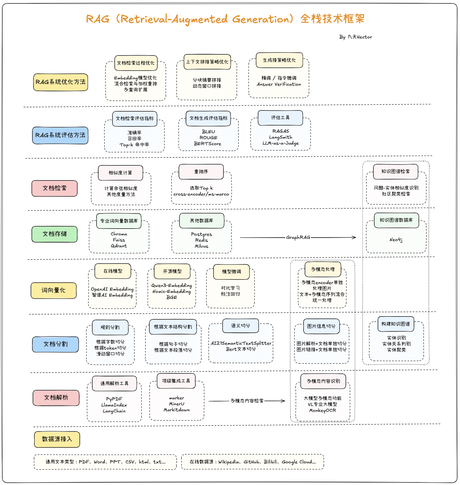

# RAG

## RAG 的 5 个阶段

1. 加载：这指的是将数据从其存储位置（无论是文本文件、PDF、其他网站、数据库还是 API）导入到您的工作流程中。
2. 索引：这意味着创建一种数据结构，以便查询数据。对于 LLM（语言学习模型）而言，这几乎总是意味着创建 vector embeddings 数据含义的数值表示，以及其他多种元数据策略，以便轻松准确地找到与上下文相关的数据。
3. 存储：一旦数据被索引，您几乎总是希望存储索引以及其他元数据，以避免重新索引。
4. 检索：对于任何给定的索引策略，您可以使用 LLM 和 LlamaIndex 数据结构进行查询，包括子查询、多步骤查询和混合策略。
5. 评估：任何流程的关键步骤之一就是检查其相对于其他策略的有效性，或者在进行更改时进行评估。评估提供客观的衡量标准，用于衡量您对查询的响应的准确性、可靠性和速度。

**注：** 构建索引：切分+ 向量化（Embedding） + 存储



## 一个高级的 LlamaIndex 开发流应该是这样的

1. 阶段 0: 治理与策略
   - 权限/Policy
   - Prompt 管理
   - 审计/合规

2. 阶段 1: 数据摄入与索引 (Ingestion & Indexing)

   ```bash
      数据源【DB/文件/Web/API】
      --> 校验 & 清洗 ❗
      --> 加载【Documents】
      --> 摄入管道 (IngestionPipeline)
         |--> Node 建模 【可被检索 + 可被组合 + 可被追溯 + 可被推理的最小知识单元】❗
         |--> 切分 Chunking【是 Node 建模的工具】❗
         |--> 元数据增强【Filter/Context/Trace-可观测&debug】
         └──> 嵌入 (Embedding Model) --【可微调】
      --> 去重 & 版本控制 (Dedup/Versioning)
      --> 索引构建 (Index) 【Vector/Keyword/Graph】
      --> 持久化存储 (Storage) 【VectorDB + DocStore】
   ```

3. 阶段 2: 高级查询流程 (Advanced Querying)

   ```bash
      用户输入
      --> 会话上下文 (Conversation Context)
      --> 查询变换 (Rewriting/Expansion/HyDE) ❗
      --> 路由/Agent (Router/Agent) 【决策：查库 vs 调工具 -- Control Plane】
      --> 检索 (Retrieval) ❗
         |-->混合检索（语义+关键词）：【稠密向量DenseVector + 稀疏关键词】
         └──>Fallback Path(失败处理)
      --> 节点后处理 (Node Post-processor) ❗
         |--> 重排序 (Re-ranking) 【Cohere/BGE】--【可微调】
         |--> 过滤 (Filtering) 【元数据过滤】
         └──> 上下文压缩/选择（Context Compression/Selection）
      --> 响应合成 (Response Synthesis) 【Tree Summarize / Compact】 --【可微调】
      --> 结构化输出 (Structured Output) 【Pydantic】
   ```

4. 阶段 3: 运维与迭代 (Ops & Iteration)

   ```bash
      --> 可观测性 (Observability) 【Trace追踪 + Metrics指标 + Cost成本】
      --> 评估反馈 (Evaluation -- 对检索和生成的质量打分)【评估结果 → 调整 chunk / embedding / index】
      --> 部署 (Deployment) --【API / Service Layer (RAG / Agent / Tool)】
   ```

### 重要详情

#### 1、 数据处理

1. 分块：文档层次结构：markdown
2. 互联网搜到的文章，先虚拟检索，再喂给 llm

#### 2、 node建模

```bash
   TextNode(
     id_,
     text, # 实际的文本块（用于生成 Embedding）。
     embedding,
     metadata, # 元数据
     relationships # 关系: 指向其他节点的链接（Parent, Child, Previous, Next）
   )
```

Node 建模与关系增强:

1. 层次化建模 (Parent-Child / Small-to-Big)
2. 窗口上下文建模 (Sentence Window)：Embedding 仅针对“当前句子”，但 Node 实际上携带了“前后 N 句”作为 Metadata。
3. 语义与元数据增强
   - 自动生成文档标题
   - 自动提取关键词
   - 自动生成摘要（成本较高）

#### 3、切分

1. 固定大小分块（Fixed Size Chunking）：适用：日志、代码、快速原型。
2. 递归分块（Recursive Chunking）：
   - 原理：按语义分隔符优先级递归切分（如 \n\n > \n > 。 > ， > 空格）。
   - 优点：尽量保持段落/句子完整，平衡效率与语义。
   - 通用文档（PDF、网页、文章）——推荐作为默认方案。

3. 文档特定分块（Document Specific Chunking -1. 结构感知分块）：
   - 适合：markdown,
   - 适用：企业知识库、技术文档、法律/医疗文本。

4. 语义分块（Semantic Chunking）: 适用：高质量知识库（如百科、论文）、对精度要求极高的场景。
5. 智能代理分块（Agentic/LLM-Based Chunking）: 让大模型分
6. 父子分块（Parent-Child Chunking）
7. 滑动窗口（Slide Window Chunking）：100行的文章，浏览器窗口一次能显示10行，滚动鼠标每次移动5行；

#### 4、 预检索（正式检索之前，对原始 query 进行智能优化或增强）

1. 查询改写（Query Rewriting）：把模糊/口语化问题改写为清晰、完整的问题；
2. 查询扩展（Query Expansion）：在原 query 上添加同义词、术语、关键词；
3. 假设文档生成（HyDE）：用 query 生成一个“假设答案”，再用它代替 query 去检索；【慎重】
4. 多路查询（Multi-Query Generation）：从原 query 衍生出多个子 query 并行检索；
5. 意图路由（Intent Routing）：不改 query，但根据 query 决定“去哪个库查”；
6. 对话压缩（Query Compression）：把多轮对话压缩成一个独立 query；
<!--

- 纠错与规范化：修正拼写错误、语法问题或术语不规范
- 微调嵌入模型（专业领域）； -->

#### 5、 检索

1. 混合检索（Hybrid Search）：结合稀疏检索（BM25） + 密集检索（向量）
2. 高级分块策略（Chunking Optimization）：较小的子块引用较大的父块
3. 元数据过滤（Metadata Filtering）

- 知识图谱（Graph RAG）：neo4j
- LightRAG
- 向量索引优化--【慎重】
- Embedding 模型选型与微调--【最后专业领域】

#### 6、 节点后处理

<!-- 1. 节点句子窗口：小索引，大窗口（分小块--》匹配到--》扩大范围）
2. Cross-Encoder 重排序（Re-ranking）
1. LLM 重排（LLM-based Re-ranking）：让大模型排
1. 去重与融合（Deduplication & Fusion）-->

1. 结构对齐（Structure Alignment）：chunk -->逻辑块回溯（子->父）❗
   - 这是 Parent-Child Chunking 真正的价值所在

2. 语义去噪（Noise Reduction）：Top-K 检索 ≠ 全部有用
   - 轻量 LLM Binary Filter（强烈推荐）
   - Embedding 相似度二次过滤

3. 冗余折叠（Redundancy Collapse）：多个 chunk 说的是同一件事，只是表达不同❗
   - 相似 Chunk 聚类：1️⃣cosine > 0.92 或 2️⃣ Cross-Encoder 相似
   - 聚类后处理方式：1️⃣选代表 chunk 或2️⃣ 让 LLM 合并为一段「融合表述」
     👉 Token 节省 + 语义密度提升

4. 重要性评估（Salience Scoring）🔥

   不是所有“相关”信息都“重要”。
   多因子重要性评分（推荐）

   | 因子 | 示例 |
   | -----------1. | -----------------1. |
   | Query 匹配度 | 与问题关键词 |
   | 结构权重 | 标题 > 正文 > 脚注 |
   | 新鲜度 | 版本 / 时间 |
   | 权威度 | 官方文档 > 博客 |
   | 任务匹配 | 教程 / 定义 / API |

5. 关系补全（Relation Completion）🔥【Graph 思维】：检索结果是“点”，而不是“关系”
   - 显式关系
   - 隐式关系（LLM 推断）
     👉 这是 Graph RAG 在生成阶段的核心价值

6. 上下文压缩（Context Compression）进阶版

7. Token Budgeting 裁剪❗（真实生产必备）

   `total_budget = model_limit - prompt - safety_margin` == 剩余可用预算 = 模型上下文上限 - 当前提示词消耗 - 安全缓冲/预留(一个较小的整数,如 50 或 100)

8. Context → Prompt 的最终适配: 顺序影响巨大:定义 → 原理 → 示例

   ```bash
      ### Definition
      ### Steps
      ### Notes
   ```

#### 把这些能力映射回 LlamaIndex 组件

| 能力       | LlamaIndex 对应                |
| ---------- | ------------------------------ |
| 去噪       | NodePostProcessor              |
| 冗余折叠   | Custom Fusion Processor        |
| 重要性评分 | Metadata + Reranker            |
| 关系补全   | KnowledgeGraphIndex            |
| 压缩       | ContextualCompressionRetriever |
| Token 控制 | ResponseSynthesizer            |

### embedding演进

1. 全量重建：数据量 < 100 万
2. 双库并行 + 逐步迁移：数据量大 + 允许部分延迟
3. 版本化向量库 + 自动化 re-embed pipeline：长期产品演进

## RAG 性能指标全流程优化

| 目标              | 具体含义                                   | 优化手段                                         |
| ----------------- | ------------------------------------------ | ------------------------------------------------ |
| 召回率(Recall)    | 把知识库里所有相关内容尽可能“捞出来”       | 提升 Embedding 质量、Hybrid 检索、Chunk 切分策略 |
| 精确率(Precision) | 把无关文档剔除，只返回有用文档             | Metadata 过滤、Re-ranking 重排                   |
| 响应时延(Latency) | 用户从提问到返回答案的时间                 | 索引优化、缓存机制、检索并发、减少无效重排       |
| 上下文窗口利用率  | LLM 能用的 tokens 里，放尽可能多的有用信息 | 文档摘要、裁剪无用内容                           |

```bash
   1. 召回全面性 → Embedding、chunk、Hybrid 检索、Query 改写
   2. 精准性 → Metadata 过滤、Re-ranking 重排
   3. 响应时延 → 索引优化、缓存、并发检索
   4. 有效上下文利用率 → 文档摘要、裁剪、扩窗口模型
```
