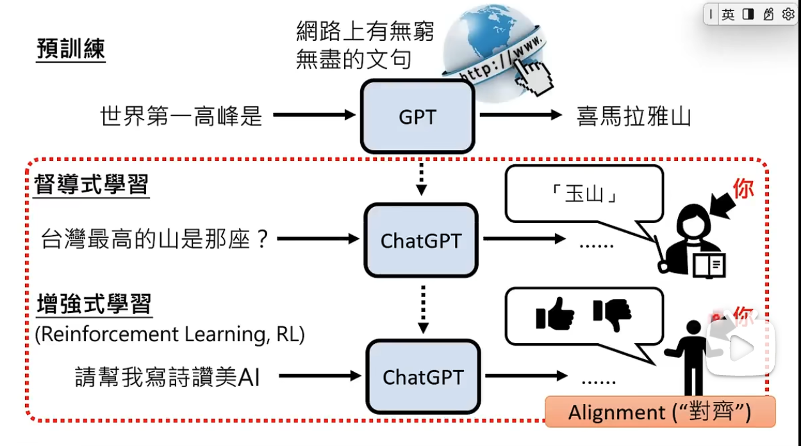

# 第 4 层\_模型层

## AI 模型就是个（大量参数的）函数：输入参数，返回结果

生成文字/像素：就像掷骰子一样，随机取一个字/像素；字/像素出现的概率，通过大量（文本）学习排序的

## 生成式 AI 目前只能用深度学习实现；未来有可能其他方式实现（目前看不到）

1. 人工智能（AI）：让计算机系统模拟人类智能，从而解决问题和完成任务；

   - 计算机科学下的一个学科；

2. 机器学习（Machine Learning）：核心：不需要人类做显式编程，而是让计算机通过算法，自行学习和改进，去识别模式、做出预测和决策；

   - 是 AI 的一个子集；
   - 示例：给电脑大量玫瑰和向日葵的图片，让电脑自行识别模式、总结规律，从而能能对没见过的图片进行预测和判断；
   - 类型：
     1. 无监督学习：从“无标注数据”中发现模式（如聚类）。
     2. 监督学习：用“标注数据”训练模型（如图像分类）。
     3. 强化学习（RL）：通过“奖励机制”训练智能体（如 AlphaGo）。

3. 深度学习：核心在于使用人工神经网络，模仿人脑处理信息的方式，通过层次化的方法，提取和表述数据特征；

   - 是机器学习的一个方法；
   - 核心：多层神经网络；
   - 典型应用：
     1. GAN（生成对抗网络）
     2. Transformer 架构
     3. LLM（大语言模型）Í

   * 神经网络：有许多基本的计算和存储单元组成；
   * 这些单元被称为神经源；这些神经元通过层层连接起来处理数据，并且深度学习模型通常有很多层（称为深度），每一层都会对数据进行处理和转换，从而提取出更高层次的特征；

- GAI（生成式 AI）：是深度学习的一个应用，能够生成新内容，如文本、图像、视频等；
- LLM（大语言模型）：是深度学习的一个应用，专门用于自然语言处理任务；（特征“大”，GPT、LLaMA）

### 机器学习（Machine Learning）

- 监督学习（Supervised Learning）: 机器学习算法会接收有标签的训练数据，

  例：苹果和香蕉的特征输入给 AI 模型，再拿一个水果输入特征自动识别；

  1. 标签就是期望的输出值；
  2. 每个训练数据点都包含输入特征和期望的输出值；
  3. 算法的目标是：学习输入和输出之间的映射关系，从而在给“新的输入特征”后能准确预测书相应的输出；

  - 数据集--》监督员打标签（模型训练）--》机器学习算法--》模型
  - 输入测试数据集--》模型--》预测输出

  应用：回归（预测房价）、分类

- 无监督学习：学习的数据是没有标签的；

  1. 算法的任务：自主发现数据里的模式或者规律；

  - AI 算法自动提取特征，自动分类；
  - 原始数据（无标签）--》机器学习算法（寻找规则）--》模型--》归类
  - 可以调整 机器学习算法 按不同规则输出

  应用：聚类（根据颜色/形状分类）、关联规则（推荐算法）

- 强化学习：让模型在环境中采取行动，获得结果反馈，从反馈里学习，从而能在给定情况下采取最佳行动，来最大化奖励或最小化损失；

  1. 机器学习算法自动学习，没有标签，只有奖励和惩罚（采纳和丢弃）；
  2. 逐渐向奖励方向倾斜；
  3. 专注于让智能体（Agent）通过与环境交互学习最优策略，以最大化累积奖励。其核心思想是“试错学习”，类似于人类或动物通过经验改进行为的过程。

  机器学习效果苹果：欠拟合（未达到效果）、最佳拟合、过拟合（没有泛化能力，只能基于训练数据）

### 深度学习（模仿人类思维）

一种机器学习架构，使用多层人工神经网络，模仿人脑的工作方式来解决复杂的模式识别问题。能够从图像、语音、自然语言中自动提取高层次的特征。

分为：

- Transformer：一种基于`自‘注意力’机制`的深度学习模型，用于处理序列数据。它能够并行处理数据，并且能够捕捉长距离的依赖关系，因此在自然语言处理、计算机视觉等领域取得了显著的成果。
  1、从 “片段记忆” 到 “全局记忆”；
  2、从 “串行处理” 到 “高效并行”；
- CNNs （卷积神经网络）：一种用于处理图像数据的深度学习模型，能够自动提取图像中的特征，并生成新的图像。
- RNNs （循环神经网络）：一种用于处理序列数据的深度学习模型，能够处理时间序列数据，并生成新的序列。

## LLM -- 大型语言模型（的训练）

预训练 --》监督微调（SFT）--》RLHF（基于人类反馈的强化学习）
类似：小学到大学的全面学习（不管 用不用得上）--》为找工作进行的专业学习--》面试或工作中的成长

1. 第一阶段：（预训练）：无监督学习

   - 数据：海量无标注文本，数据清洗和去重（借助海量数据，模型能更好的了解单词与上下文之间的关系，从而更好地理解文本的含义，并生成更准确地预测）；
   - 核心目标：学习语言基础知识，预测下一个词；
   - 产出：基础模型（掌握了语法、句法、大量事实知识，并具备了一定的逻辑推理和泛化能力。但它还不知道如何与人类进行有效、安全的对话）；

2. 第二阶段：(微调)：监督学习 参数数量也是巨大；参数是模型内部的变量，可以理解为是模型在训练过程中学到的知识；

   - 数据：相对较小（几万到十几万条），高质量“指令-回复”对；
   - 核心目标：学会遵循指令和对话（从“预测下一个词”变成了 “在给定指令下，生成最符合期望的回复”）；
   - 产出：SFT 模型（模型学会了遵循指令、进行多轮对话、拒绝不当请求等技能）

3. 第三阶段：RLHF（人类反馈强化学习）：强化学习

   - 数据：人类对回答的排序
   - 核心目标：对齐人类价值观和偏好
   - 产出：最终、对齐的模型（经过 RLHF 训练的模型，其回答在安全性、有用性和无害性上通常远优于仅经过 SFT 的模型）

   - RLHF 是一个复杂的过程，主要包括三个步骤：

     1. 收集人类偏好数据：

        - 针对同一个指令，让 SFT 模型生成多个（通常是 4 个）不同的回答。
        - 人类标注员 对这些回答从好到坏进行排序。例如，回答 A > 回答 C > 回答 D > 回答 B。这构成了一个偏好数据集。

     2. 训练奖励模型：

        - 这是一个独立的、较小的模型，其任务是学习预测人类更喜欢哪个回答。
        - 输入是：指令和模型的一个回答，输出：是一个“奖励分数”。奖励模型的目标是：对于人类排序更高的回答，它应该给出更高的分数。

     3. 使用强化学习优化 SFT 模型：

        - 将 SFT 模型作为智能体，将其生成文本的行为视为动作。
        - 将训练好的奖励模型作为环境，它提供奖励。
        - 使用强化学习算法（最常用的是 PPO），让 SFT 模型学习如何生成能获得最高奖励分数的文本。
        - 关键点： 为了防止模型“作弊”（例如，为了高分而生成无意义的、过度恭维的语句），需要在奖励中加入一个“偏离惩罚”，确保模型的输出不会过于偏离 SFT 模型的基础能力。

## 如何训练出一个 AI 聊天助手

1. 通过大量文本进行无监督学习预训练，得到一个能进行文本生成的“基座模型”；
2. 通过一些人类撰写的高质量的对话数据，对基座模型进行监督微调，得到一个“微调后的模型”。此时的模型 除了能续写文本之外，也会具备更好的对话能力；
3. 用“问题和多个对应回答”的数据，让人类标注员对“回答”进行质量排序，然后基于这些数据，训练出一个 `能对回答 进行评分预测的“奖励模型”`；
4. 让第 2 步得到的模型对问题生成回答，用奖励模型对回答进行评分，利用评分作为反馈，进行强化学习训练，就这样 chart GPT 就诞生了；

- 详细

1. 需要海量文本语料库 用来训练；
2. 分词化（token）：大语言模型的基本文本单位；短的英文单词 1 个词 1 个 token，长的英文单词可能被分为多个 token；中文 1 个字可能需要 1 个或者更多 token 来表示；
3. 预训练最烧钱，需要大量数据，大量算力；
4. 基座模型 --微调--》微调后的模型（sft 模型）--（奖励模型）强化--》
5. 奖励模型：提示词--》sft 模型--》生成多个答案，人类对答案进行质量排序，训练出一个奖励模型；
