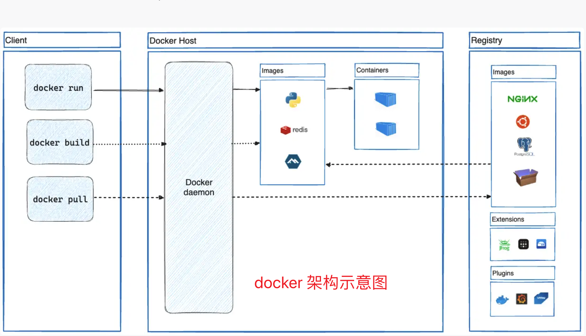
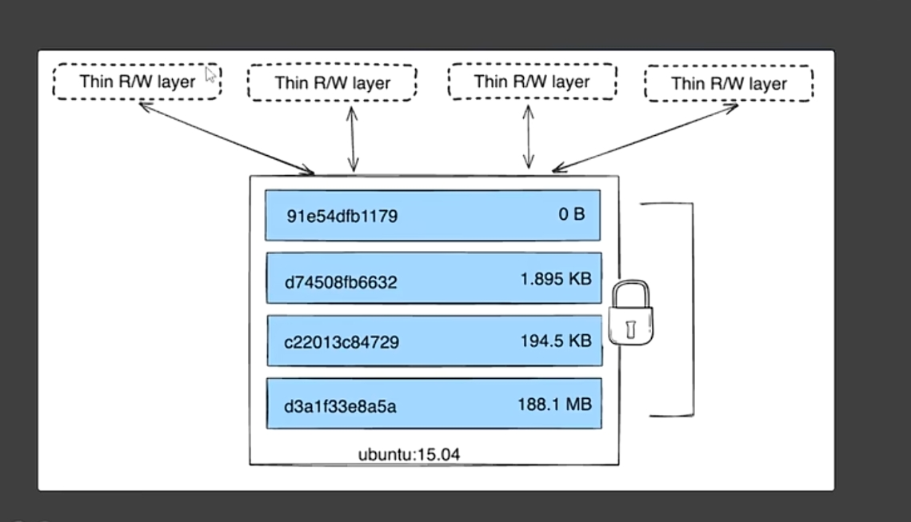

# docker



Docker 使用客户端-服务器架构；Docker 客户端和守护进程使用 REST API 通过 UNIX 套接字或网络接口进行通信。

## 概念

1. Dockerfile：一个文本文件，包含一系列指令，用于自动构建镜像。
2. 镜像（image）：一个只读模板，包含运行应用程序所需的所有内容：代码、运行时、库、环境变量和配置文件。

   - 例：雕版印刷的雕版

3. 容器（container）：镜像的运行实例。

   - 容器是轻量、可移植、隔离的运行环境。
   - 同一镜像可以启动多个容器，彼此隔离。
   - 例：用雕版印出的书页；

4. Volume(卷)：用于持久化容器数据；卷独立于容器生命周期，即使容器删除，数据仍保留。

   - 券：分为命名卷、绑定挂载（bind mount）、tmpfs 挂载（内存中）。

     1. 命名卷（Named Volume）：把数据保存到宿主机的磁盘上

        - 由 Docker 创建和管理；
        - 存储路径通常在 /var/lib/docker/volumes/ 下（Linux）；
        - 跨容器共享方便；
        - 支持 volume driver 扩展。
        - demo: `-v my-vol:/app/data`

     2. 绑定挂载（Bind Mount）：直接映射 宿主机的指定路径 到容器内；

        - 可挂载文件或目录；
        - 修改宿主机文件 = 修改容器内文件（双向同步）；
        - 路径必须绝对路径。
        - demo: `-v /host/path:/container/path`

5. 网络（Network）: 解决容器与外界、与容器之间通信；

   - Docker 提供多种网络驱动（bridge、host、overlay 等）。
   - 默认使用 bridge 网络，容器间可通过名称通信（需自定义网络）。

6. Docker Compose：用于定义和运行多容器 应用程序的工具。

   - 使用 docker-compose.yml 文件配置服务(容器)、网络、卷等；
   - 通过 docker-compose up 一条命令，就可以启动整个应用栈；（前端、后端、数据库、缓存 redis、负载均衡等多个服务器）

7. Docker Daemon(守护进程) 与 Client(客户端):

   - Docker Client(Docker 客户端)：用户使用的命令行工具，客户端通过 REST API 与守护进程通信，并指示它该做什么。
   - Docker Daemon（Docker 守护进程）：一个长期运行在后台的进程（dockerd）；
     1. 侦听 Docker API 请求并管理 Docker 对象（例：镜像、容器、网络和卷）。
     2. 还可以与其他守护进程通信来管理 Docker 服务。

8. Docker Desktop: 面向开发者的一体化桌面应用程序，用于在 Windows 和 macOS 上轻松使用 Docker。

   包含组件：

   - Docker Client（docker CLI）
   - Docker Daemon（运行在后台 VM 中，如 WSL2 或 Hyper-V）
   - Docker Compose
   - Kubernetes（可选）
   - GUI 界面（查看容器、镜像、资源使用等）

9. Docker Hub / Registry（镜像仓库）：用于存储和分发镜像的服务。

   - Docker Hub 是官方公共仓库（https://hub.docker.com）
   - 也可以搭建私有 Registry。

10. Namespace 与 Cgroups（底层技术）
    - Namespaces：实现进程、网络、用户、挂载点等的隔离。
    - Cgroups（Control Groups）：限制、记录和隔离资源使用（CPU、内存等）。

## 开发流程

1. 构建镜像：使用 Dockerfile 创建镜像。
2. 推送镜像到注册表：将镜像上传到 Docker Hub 或私有注册表中。
3. 拉取镜像：通过 docker pull 从注册表中拉取镜像。
4. 运行容器：使用镜像创建并启动容器。
5. 管理容器：使用 Docker 客户端命令管理正在运行的容器（例如查看日志、停止容器、查看资源使用情况等）。
6. 网络与存储：容器之间通过 Docker 网络连接，数据通过 Docker 卷或绑定挂载进行持久化。

## Dockerfile：制作镜像 / 镜像分层机制

1. 常见指令：

   - FROM: 基础环境；例: node:14-alpine`【必须】`
   - LABEL: 为镜像添加键值对形式的标签（如作者、版本、描述）。
   - RUN: 在镜像构建过程中执行 shell 命令（每条 RUN 创建一个新层，例：yarn install --production）。
   - COPY: 将宿主机的文件或目录复制到镜像中。
   - ADD: 高级复制（慎用）
   - WORKDIR: 设置工作目录,如果不存在会自动创建。(后续 RUN、CMD、COPY 等指令的默认目录，例：/usr/local/app)
   - ENV: 设置环境变量。
   - EXPOSE: 声明容器运行时监听的端口。
   - CMD / ENTRYPOINT: 指定容器启动时运行的默认命令`【必需其一】`（例如：CMD ["python", "app.py"]）。
   - .dockerignore（配套文件）
   - VOLUME: 数据持久化提示(仅提示)
   - USER: 指定用户（安全推荐， 非 root 运行）
   - HEALTHCHECK:健康探测（生产推荐）

   alpine:基于 linux 的 alpine 发行版构建的，小几十 M

   ```Dockerfile demo
     FROM python:3.9
     COPY . /app
     WORKDIR /app
     RUN pip install -r requirements.txt
     CMD ["python", "app.py"]
   ```

2. 构建镜像: -t === -tag(标签)

   - 在构建期间给镜像打标签： `docker build -t my-username/my-image .` 最后的点（.）指当前文件夹;
   - 如果已经构建了镜像，则可以使用以下 `docker image tag`命令向图像添加另一个标签：
     `docker image tag my-username/my-image another-username/another-image:v1`

3. 发布镜像：`docker push my-username/my-image`





## 启动容器 -- 命令行 （了解，不做重点）

docker run [OPTIONS] IMAGE [COMMAND] [ARG...]

docker run -dp 127.0.0.1:3000:3000 getting-started

docker run -dp 0.0.0.0:3000:3000 YOUR-USER-NAME/getting-started

绑定 127.0.0.1 仅将容器的端口公开给环回接口。但是，绑定到 0.0.0.0 会在主机的所有接口上公开容器的端口，使其可供外界使用。

-d: 后台运行
-p: 端口映射
-it: 交互式运行
-v: 挂载卷
-e: 设置环境变量
--name: 容器名称
--restart: 容器启动失败时重启
--network: 容器网络
--rm: 容器退出时自动删除容器
--detach: 后台运行
--publish: 端口映射
--mount: 挂载卷
--volume: 挂载卷
--env: 设置环境变量
--entrypoint: 容器启动时执行的命令
--detach-keys: 容器退出时自动删除容器
--interactive: 交互式运行
--tty: 交互式运行
--env-file: 读取环境变量

## docker Compose：docker 批量管理容器的工具

compose.yaml ：代替命令行

- 上线：docker compose up -d （创建容器并启动）
- 下线：docker compose down （移除容器及相关的资源）
- 启动：docker compose start x1 x2 x3 （x1 x2：yaml 中配置的应用名字）
- 停止：docker compose stop x1 x2
- 扩容：docker compose scale x2=3（应用的实例启动 3 份）

* 顶级元素：

  1. version：版本
  2. services：服务
  3. networks：网络
  4. volumes：卷
  5. configs：配置
  6. secrets：密钥

  [docker-compose.yaml](./img/docker-compose.yaml)

## 本地安装

1. windows 需要先开启 Hyper-V 功能；docker 才能正常工作（wsl 安装 ubuntu 也可以）；
2. Hyper-V 与其他虚拟机冲突，例如 Android Studio 中的虚拟机；
3. docker 使用 client-server 架构模式；docker version 看到 2 个才算启动成功；
