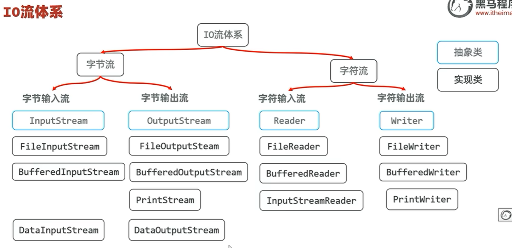

# java

1. mvc 模式: 对象回调

2. 并发：就是“同时”
3. print()在后面拼接； println()另起一行

## 项目--模块--包--类

## 1、====基础类型转换==================

## 整数相除，只得整数部分；只要其中一个为小数，就可得“完整的运算结果”

## 小数相加，结果不精确（在计算机中“整数和小数”存储方式不同导致的）

## char 类型可以与数字相加减；底层逻辑执行的是 字母、符号（a）对应的 ASCII 码的数字加减【网站登录验证码】

## 类型转换：String s = (String) rs

## 类型默认值

- 基本类型：

  1. byte、short、char、int、long : 0
  2. float、double : 0
  3. boolean : false

- 引用类型：类、接口、数组、String : null

## 数组 -- 连续存储; 寻址较快，增删较慢（把后面数据位置进行移动 -- 扩容、缩减）

`String[] arr = new String[3];`

1. 数组查询：通过“虚拟基址”和索引定位，查询任意数据耗时相同；
2. 零基索引(索引从 0 开始)：`元素地址 = 虚拟基址 + 偏移量(单位制 * 索引)`();
3. 一基索引(索引从 1 开始)：`元素地址 = 虚拟基址 + (偏移量 - 1)`，多一次减法操作
4. `偏移量 = 单位制 * 索引`

**注：**

- 栈内存存储的是对象地址，堆内存存储的是对象

  1. 当数组被创建时，JVM 就知道它的起始地址（虚拟基址）
  2. 这个基址保存在栈上的数组引用变量中
  3. 我们不需要"找"基址，它已经在那里了

- 虚拟地址 vs 物理地址

  ```java
  // 物理内存可能是碎片化的：
  物理内存: [空闲][进程A][空闲][进程B][空闲]

  // 但JVM看到的是连续的：
  虚拟内存: [0x0000-0xFFFF] 连续空间
  ```

- 实际内存访问流程

  1. Java 层：array 引用包含虚拟地址；
  2. JVM 层：计算 虚拟基址 + 偏移量；
  3. 系统调用：JVM 通过系统 API 访问该虚拟地址；
  4. MMU 转换：硬件将 虚拟地址 转换为 物理地址 ；
  5. 内存控制器：访问实际的 RAM 位置；
  6. 数据返回：值沿原路返回到 Java 程序；

## 链表：查询慢、增删相对快

## 对象（数据结构）：本质上是一种特殊的数据结构（可以理解成一张表）

1. java 在 “JVM 虚拟机”上运行，“JVM 虚拟机”在“内存”中运行（java 程序在`内存中的 JVM 虚拟机`上运行）
2. “JVM 虚拟机” 为了更好的运行程序，把内存分为`栈内存、堆内存、方法区`来配合执行 java 程序；

   - 栈内存：存执行方法；

     1. 方法中的每个变量存"堆内存"中对应对象的地址;

   - 堆内存：存 new 出来的对象 和 静态变量；

     1. 对象中有 1 个“类地址”，它指向“方法区”中该对象的创建类地址；

   - 方法区：存类；
   - 调用对象中的方法：栈内存变量--》堆内存对象--》方法区类--》添加到栈内存：执行
     `s=new Student(); s.name="liSi";s.read()`

## 2、====面向对象编程的三大特征：封装、继承、多态===========

## 类

1. 构造器：1、没有返回值，2、方法名必须和类型相同

   - 构造器可以重载(重载：多个同名函数，但参数不同)
   - 创建对象时，“类 new 的对象”会自动调用构造器
   - 类默认自带一个无参数构造器；如果写了有参构造器，默认的无参构造器就失效，还想用无参构造器，需要再手写一个；

2. this 关键字：this 就是一个变量，可以在方法中，来拿到当前对象

   - this 主要用来解决：变量名冲突的问题

3. 封装：

   - 面向对象的三大特征：封装、继承、多态
   - 类就是一种封装，方法也是一种封装
   - private(私有)：只能在本类中使用；

     ```java
     public class Student{
        private int age;
        public void setAge (int age){
          this.age = age; //this 区分用的
        }
        public int getAge(){
          return age; //私有变量可以“在本类”中直接用
        }
     }
     ```

4. javabean（实体类）：是一种特殊类；

   - 需要满足以下 2 点：

     1. 类中的成员变量全部私有，并提供 public 修饰的 getter/setter 方法
     2. 类中需提供一个无参数的构造器，有参数的构造器可选

        **注：** 不涉及业务

   - 实际作用：创建对象，存取数据（封装数据）

## static（静态）： 关键字，可以修饰成员变量、成员方法

1. 成员变量：按照有无 static 修饰，分为 2 中：

   - 静态变量（类变量）：有 static 修饰，属于类的；在计算机里只有 1 份，`会被类的全部对象共享`；

     **注：** 可以改变值，不是常量，只是标记为类变量，

   - 实例变量（对象变量）：无 static 修饰，`属于每个对象的`；

     ```java
     public class Student{
       static String name;
       int age;
     }
     // 类名.静态变量（推荐）
     // 对象.静态变量（不推荐）
     //
     // 对象.实例变量
     // 自己类中 访问类变量可以省略类名
     ```

2. 成员方法：按照有无 static 修饰，分为 2 中：

   - 静态方法：有 static 修饰，属于类。
   - 实例方法：无 static 修饰，

     ```java
        public class Student{
          public static void printHW(){
            System.out println("Hello Word")
          }
        }
        // 类名。静态方法（推荐）
        // 对象名。静态方法（不推荐）
        //
        // 对象。实例方法
        //只是为了做一个功能，且不需要访问对象的数据，就定义静态方法
        //对象的行为，且要访问对象的数据，定义为实力方法；
        //在自己类中，访问类方法可以省略类名；
     ```

### 静态方法：常见应用场景--做工具类

工具类没有创建对象的需求，建议将工具类的构造器方法进行私有化（好处，私有化后，强制用户不能实例化，减少实例化的内存占用）

### 静态方法/实例方法：注意事项

- 静态方法中：可直接访问静态成员，不可直接访问实例成员
- 实例方法中：可直接访问静态成员，也可直接访问实例成员
- 静态方法中不可出现 this 关键字，实例方法中可出现 this 关键字；

```java
    public class test{
       public static int count =100;
       public static void printAA(){
         System.out.println("AA")
       }

       private String name;
       public void run(){}

       public static void main(String[] args){}
       // 静态方法中：可直接访问静态成员，不可直接访问实例成员
       public static void printHW(){
         System.out.println(count)
         printAA()
         System.out.println(name) //---报错
         System.out.println(this);//--报错
       }
       // 实例方法中：可直接访问静态成员，也可直接访问实例成员
       public void go(){
         System.out.println(count)
         printAA();
         System.out.println(name)
         run();
         System.out.println(this);
       }
    }

```

## 继承（extends）: 父类（基类、超类），子类（派生类）

子类能继承父类的非私有成员（成员变量、成员方法）

1. 权限修饰符：

   - private：只能本类
   - 缺省：本类、同一个包中的类
   - protected：本类、同一个包中的类、子孙类中
   - public：任意位置

     **注：** private < 缺省 < protected < public

2. 跨包需要导入类
3. 继承特点：

   - 单继承
   - 多层继承（子-父-祖父）
   - 祖宗类：Object
   - （访问）就近原则

     **注：** 可通过`super关键字`，访问父类成员：`super.父类成员变量/父类成员方法`

4. 方法重写：

   - 使用 `@Override` 注解（提示）
   - 方法名和参数一致
   - 访问权限：必须大于等于父类方法的权限
   - 返回值类型：必须小于等于父类的返回值类型
   - 私有方法、静态方法 不能被重写

   ```java
   @Override
   public void cry(){
     System.out.println("啊啊啊啊")
   }
   ```

5. 子类构造器：子类的构造函数会默认调用父类的构造器（supper()必须写在第一行）

   ```java
   class Child extends Parent{
     public Child(){ //子类构造函数
       // supper() //即使子类不写，程序也会默认调用一边
       // supper(6666)
       System.out.println("----")
     }
   }
   ```

6. 构造器中的 this：调用本类中的兄弟构造器

   **注：** “supper(...)”与“this(...)”必须写在构造器的第一行，并且两者不能同时出现

   ```java
     public class Student{
      private String nam;
      private char sex;
      private int age;
      private String schoolName;
      public Student(){} //构造器函数
      public Student(){
        this(name,sex,age,"初中")
      }
      public Student(String name, char sex,int age,String schoolName){
         this.name=name
         this.sex=sex
         this.age =age
         this.schoolName = schoolName
      }
     }
   ```

## 多态：（就是提取共同的，用共同的）

1. 多态的前提条件：1、有继承/实现关系；2、存在父类引用子类对象；3、存在方法重写；

   - 对象多态，行为多态
   - 方法：编译看左边，运行看右边；
   - 成员变量：编译看左边，运行看左边；

     **注：** 多态是对象、行为的多态，java 中的属性（成员变量）不谈多态；

   ```java
   public class Animal{
     String name="动物"
     public void run(){
       System.out.println("动物会跑。。。")
     }
   }
   public class Wolf extends Animal{
     String name="狼"
     @Override
     public void run(){
       System.out.println("狼跑的快~~~")
     }
   }
   public class Tortoise extends Animal{
     String name="乌龟"
     @Override
     public void run(){
       System.out.println("乌龟跑的慢---")
     }
   }
   public class Test{
     public static void main(String[] args){
       Animal a1 = new Wolf();
       a1.run(); //狼跑的快~~~
       System.out.println(a1.name); //动物

       Animal a2 = new Tortoise();
       a2.run(); //乌龟跑的快~~~
       System.out.println(a2.name); //动物

     }
   }

   ```

2. 多态的好处：多态形式下：右边对象是解耦合的，便于扩展和维护

3. 多态问题：不能调用子类独有的功能
4. 多态下的类型转换：

   - 自动类型转换：父类 变量名 = new 子类（）； `例：People p = new Teacher();`
   - 强制类型转换：子类 变量名=（子类）父类变量；`例：Teacher t = (Teacher)p;`

   强制类型转换的注意事项：（类似 TS 的 as）

   - 存在继承/实现关系就可以在“编辑阶段”进行强制类型转换，编译阶段不会报错
   - 运行时，如果发现对象的真实类型与“强转后的类型不同”，就会报类型转换异常（ClassCastException）的错误出来

     **注：** 使用 instanceof 判断当前对象的真实类型：`对象instanceof类型`。

## 3、====面向对象高级： final、单例类、枚举类、抽象类、接口 ==============

## final（最终）：可以修饰：类、方法、成员变量

1. 修饰类：该类是最终类，不能被继承
2. 修饰方法：该方法是最终方法，不能被重写
3. 修饰变量：该变量有且仅能被赋值一次【类似 js 中的常量关键字 const】

   - 修饰基本类型：变量存储的 ”数据“ 不能被改变；
   - 修饰引用类型：变量存储的 ”地址“ 不能被改变，但地址所指向对象的内容可以被改变；

4. 常量：使用 static final 修饰的成员变量；作用：常用于记录系统的配置信息。

   程序编译后，常量会被”宏替换“（即全部替换为字面量-真实值）

   ```java
   public class Constants {
     public static final String DB_URL = "db:mysql://localhost:3306/test";
   }
   ```

## 单例类（设计模式）：确保类对外只能创建一个实例

## 枚举类（enum）

```java
  public enum Color {RED, GREEN, BLUE}
```

## 抽象类（abstract）：--- 为了更好的支持“多态”

abstract 关键字：用来修饰”类” --》“抽象类”
abstract 关键字：用来修饰”方法“ --》“抽象方法“

- 抽象类中不一定有抽象方法，有抽象方法的类必须是抽象类；
- 类有的成员：成员变量、方法、构造器，抽象类都可以有；
- 抽象类特点：抽象类不能创建对象，仅作为一种特殊的类，让子类继承并实现；
- 一个类继承抽象类：必须重写抽象类的全部抽象方法，否则这个类也必须定义成抽象类；

```java
   修饰符 abstract class 类名 {
     修饰符 abstract 返回值类型 方法名(形参列表);
   }
```

## 模板方法（设计模式）：抽出公用的，填充不同的

## 接口（interface）

1. 接口概述

   ```java
     // (jdk8)之前接口中只能定义 “常量和抽象方法”
     public interface 接口名 {
       // 成员变量（常量）
       // 成员方法（抽象方法）
       void run()
       String go()
     }
   ```

   - 接口是用来被类"实现（implements）"的,实现接口的类称为实现类，`一个类可以同时实现多个接口`。
   - 实现类必须重写“所有接口的所有抽象方法”

   ```java
     修饰符 class 实现类类名 implements 接口1,接口2,接口3,接口4,....{  }
   ```

2. 接口好处

   ```java
      public class test{
        public static void main(String[] args){
          Person p = new Student();
          A SA =new Student();
          B SB =new Student();

          A TA = new Teacher();
          B TB = new Teacher();
        }
      }
      interface A{}
      interface B{}
      class Person{}
      class Student extends Person implements A,B{}
      class Teacher extends Person implements A,B{}
   ```

3. jdk8 开始，接口新增的 3 中方法（基本用不到）

   1. 默认方法（实例方法）：使用 default 修饰,默认会被加上 public 修饰；

      **注：** 只能使用接口的实现类对象调用

   2. 私有方法：必须用 private 修饰（jdk9 开始有）；

      **注：** 给接口内部调用

   3. 类方法（静态方法）：使用 static 修饰，默认会被加上 public 修饰；

      **注：** 只能用接口名来调用

4. 接口注意事项：

   - 接口可以多继承：1 个接口可以继承多个接口；

     1. 类与类：单继承；
     2. 类与接口：多实现；
     3. 接口与接口：多继承；

   - 1 个接口继承多个接口：如果多个接口中”方法签名“（返回值类型）冲突，则不支持多继承，也不支持多实现；

   - 1 个类继承父类，又同时实现接口：如果父类中的方法名与接口中的默认方法名冲突，实现类会优先用父类的；

     ```java
       class Dog extends Animal implements A{
         public void run(){
          show(); // 父类方法
          super.show(); //父类方法
          A.supper.show() //接口方法
         }
       }
     ```

   - 1 个类实现多个接口：如果多个接口中的”默认方法“冲突，则类中必须重写该方法；

     ```java
       class Dog implements A,B{
          @Override
          public void show(){
              A.super.show(); //调用A的show方法
              B.super.show(); //调用B的show方法
          }
       }
     ```

5. 抽象类与接口:

   - 相同点：

     1. 都是抽象形式，都可以有抽象方法，都不能创建对象。
     2. 都是派生子类形式：抽象类是被子类继承使用，接口是被实现类实现。
     3. 一个类继承抽象类或者实现接口：都必须重写完他们的抽象方法，否则自己要成为抽象类或者报错！
     4. 都能支持的多态，都能够实现解耦合。

   - 不同点：

     1. 抽象类中可以定义类的全部普通成员，接口只能定义常量，抽象方法(JDK8 新增的三种方式)
     2. 抽象类只能被类单继承，接口可以被类多实现。
     3. 一个类继承抽象类就不能再继承其他类，一个类实现了接口(还可以继承其他类或者实现其他接口)。
     4. 抽象类体现模板思想：更利于做父类，实现代码的复用性。-- 最佳实践
     5. 接口更适合做功能的解耦合：解耦合性更强更灵活。-- 最佳实践

## 4、====面向对象高级： 代码块、内部类、函数式编程、常用 api、GUI 编程 ==============

类的 5 大成分：1.成员变量、2.构造器（构造方法）、3.方法、4.代码块、5.内部类

## 代码块（不常用）

1. 静态代码块：

   - 特点：类加载时自动执行，由于类只会加载 1 次，所以静态代码块也只会执行 1 次；
   - 作用：完成类的初始化，例：对静态变量的初始化赋值

   ```java
   public class Test {
    public static String schoolName;
    public static String[] cardArr = new String[10];
    static{ // 不是必须的，main中也可以，构造器中也可以
      System.out.println("静态代码块");
      schoolName = "上海大学";
      cardArr[0] = "1234567890";
      cardArr[1] = "1234567891";
      //......
    }
    public static void main(String[] args) {}
   }
   ```

2. 实例代码块：

   - 特点：每次创建对象（实例）时，执行实例代码块，并在构建前执行；
   - 作用：和构造器一样，都是用来完成对象的初始化，例：对实例变量的初始化赋值

   ```java
   public class Test {
     private String name;
     private String[] direction = new String[10];
     {
      System.out.println("实例代码块");
      name="张三";
      direction[0] = "上海";
      direction[1] = "北京";
      //.....
     }
     public static void main(String[] args) {}
   }
   ```

## 内部类：（不常用）一个类定义在另一个类的内部

按特点分为：成员内部类、局部内部类、静态内部类、匿名内部类

- 成员内部类：无 static 修饰的内部类

  ```java
   // 外部类名称.内部类名称 对象名 = new 外部类名称.new 内部类名称();
   Outer.Inner oi = new Outer().new Inner();
   oi.setName("sss"); // 内部类中的方法
  ```

  1. 成员内部类：可以直接访问外部类的静态成员，也可以直接访问外部类的实例成员（通过 new Outer()对象）；
  2. 成员内部类的实例方法中，可以直接拿到当前寄生的外部类对象（外部类名.this；通过 new Outer()对象）；

- 静态内部类：有 static 修饰的内部类

  ```java
    // 外部类名称.内部类名称 对象名 = new 外部类名称.内部类名称();
    Outer.Inner oi = new Outer.new Inner();
    oi.show(); // 静态内部类中的方法
  ```

  1. 静态内部类：只能访问外部类的静态成员，不能访问外部类的实例成员；

- 局部内部类：没毛用！！！
- 匿名内部类：所谓匿名：指的是程序员不需要为这个类声明名字，默认有一个隐藏的名字（`编译后能看到自动生成的类名`）。

  1. 特点：匿名内部类本质上就是一个子类，并会立即创建出一个子类对象
  2. 作用：更方便创建一个子类对象
  3. 抽象类和接口 都可以创建匿名内部类

  ```java
    new 类或接口 (参数值...){
      类体(一般是方法重写);
    }
    //----------
    new A(){
      @Override
      public void show(){}
    }
  ```

  ```java demo1
    // 创建一个抽象类
     public abstract class Animal {
      public abstract void cry();
     }

     // 创建一个子类
     // public class Cat extends Animal {
     //    @Override
     //    public void cry() {
     //      System.out.println("喵喵喵");
     //    }
     //}

     // 创建一个匿名内部类
     public class Test {
         public static void main(String[] args) {
              Animal a = new Animal() {
                   @Override
                   public void cry() {
                        System.out.println("喵喵喵");
                   }
              }
              a.cry();
         }
     }

  ```

  ```java demo2
  @FunctionalInterface  // 函数式接口注解(可不加，加了就会检测)
  public interface A {
    public void show();
  }
  public class Test {
    public static void main(String[] args) {
      A a = new A() {
        @Override
        public void show() {}
      }
      start(a);
      //-----------------------------
      start(new A() {
        @Override
        public void show() {}
      });
    }
    public static void start(A a) {
      a.show();
    }
  }
  ```

## 函数式编程：Lambda 表达式（jdk8 新增的）

`java 中的函数（Lambda 表达式）：（x)->2x+1`

`python 中的函数（Lambda 函数）：lambda x:2x+1`

**注：**

1. Lambda 表达式 `只能替代“函数式接口”的“匿名内部类”`；
2. 函数式接口：有且只有一个抽象方法;
3. 上下文推断：Lambda 函数式接口的参数类型和返回值类型，编译器会自动推断

简化规则：

1. 参数类型 和 返回值类型 可以省略，因为编译器会自动推断；
2. 参数列表只有一个参数时，括号可以省略；
3. Lambda 函数体只有一条语句时，大括号、return 和分号(;) 可以省略；

## 函数式编程：方法引用 （Lambda 表达式 的简化 - JDK11 新增）

```java
  @Data
  @AllArgsConstructor
  @NoArgsConstructor
  public class Student {
    private String name;
    private int age;
    private double height;
    private String sex;
    public static int compareByAge(Student s1, Student s2) {
      return s1.getAge() - s2.getAge();
    }
    public int compareByHeight(Student s1, Student s2) {
     // return s1.getHeight() - s2.getHeight();
     return Double.compare(s1.getHeight(), s2.getHeight());
    }
  }
```

- 静态方法的引用：`类名::静态方法名`

  ```java
  public class Test {
    public static void main(String[] args) {
        test1()
        test2()
    }
    public static void test1() {
        Student[] students = new Student[10];
        students[0] = new Student("张三", 18, 1.7, "男");
        // ......
        Arrays.sort(students, new Comparator<Student>() { //Comparator: sort自带的
          @Override
          public int compare(Student o1, Student o2) {
            return o1.getAge()-o2.getAge();
          }
        })
        Arrays.sort(students, (o1,o2)->o1.getAge()-o2.getAge())
        Arrays.sort(students, (o1,o2)->Student.compareByAge(o1,o2));
        Arrays.sort(students, Student::compareByAge);
    }
  }

  ```

- 实例方法的引用：`对象名::实例方法名`

  ```java
    {
      public static void test2() {
          Student[] students = new Student[10];
          students[0] = new Student("张三", 18, 1.7, "男");
          // ......
          Student t = new Student();
          Arrays.sort(students, (o1,o2)->t.compareByHeight(o1,o2));
          Arrays.sort(students, t::compareByHeight);
      }
    }
  ```

- 特定类型方法的引用：`特定类的名称::方法`

  ```java
  public class Test {
    public static void main(String[] args) {
      String[] names={"Tom","Jerry","Harry","Potter","Jack","andy"};
      Arrays.sort(names,new Comparator<String>() {
        @Override
        public int compare(String o1, String o2) {
          return o1.compareToIgnoreCase(o2);
        }
      })
      Arrays.sort(names,(s1,s2)->s1.compareToIgnoreCase(s2));
      Arrays.sort(names,String::compareToIgnoreCase);
    }
  }
  ```

- 构造器的引用：`类名::new`

  ```java
   @Data
   @AllArgsConstructor
   @NoArgsConstructor
   class Car {
     private String name;
   }
   //--------------
   interface CarFactory {
     Car getCar(String name);
   }
   //------------
   public class Test {
    public static void main(String[] args) {

      // CarFactory factory = new CarFactory() {    // 1-------
      //   @Override
      //   public Car getCar(String name) {
      //     return new Car(name);
      //   }
      // }

      // CarFactory factory = (name)->new Car(name);    //2--------

      CarFactory factory = Car::new;    //3--------

      Car c1 = factory.getCar("BMW");
      System.out.println(c1);
    }
   }
  ```

## 常用 api

- String 字符串：

  1. 只有以双引号（“...”）方式写的字符串对象，会存储到“字符串常量池”中，且相同内容的字符串只存储 1 分；（节约内存）

     **注：** 常量池在堆中

  2. 通过 new 方式创建的字符串对象，每 new 一次 都会产生一个新的对象放在堆中；
  3. String(字符串)：两个字符串内容比较： "==" 默认比较的是字符串地址

- 集合：用来装数据，类似数组；大小可变，功能丰富；

  java 中的集合：HashSet、Set、TreeSet、Map 等等。。。。

  ```java
  //---没有添加类型限制-------------
    ArrayList list = new ArrayList();
    list.add("java");
    list.add(222);
  //---添加了类型限制--只能添加String类型-----------
   ArrayList<String> Arr = new ArrayList<String>();
   Arr.add("java");
   Arr.add("python");
   // Arr.add(333); // 报错

  ```

## GUI 编程：现在没啥用

AWT(Abstract Window Toolkit)：依赖操作系统 -- `淘汰了`
Swing：不依赖操作系统（推荐）

## ====加强课============================

## 异常 Java.lang.Throwable

- 异常分类

  1. Error(错误) ：一般不会发生（系统级别的，给 sun 公司用的；一般我们解决不了）；
  2. Exception(异常)：我们程序可能出现的问题；
     - RuntimeException(运行时异常)：编译器不检查，运行时检查(例：数组索引越界)；
     - 其他异常：（例 编译时异常）编译阶段就会出现的错误提醒（例：缺少文件 ）-- 在逐渐摈弃，转向运行时异常

  

- 异常的基本处理：抛出异常（throws）、捕获异常（try catch 【catch catch。。。】）
- 自定义异常：继承 Exception 或 RuntimeException
- 异常的处理方案：1.层层向外抛，由最外层处理；2.最外层捕获异常，尝试修复

## 泛型(`<E>`) -- 泛型类、接口、方法

`ArrayList<String> list = new ArrayList<String>();`

- 常用字母；

  1. E:元素类型
  2. T：返回值类型
  3. K：键类型
  4. V：值类型

- 泛型类型：

  1. 泛型类： `修饰符 class 类名 <类型变量，类型变量，...> {}`
  2. 泛型接口： `修饰符 interface 接口名 <类型变量，类型变量，...> {}`
  3. 泛型方法、通配符、上下限

  - 型方法： `修饰符 <类型变量，类型变量，...> 返回值类型 方法名(参数列表) {}`
  - 通配符：`<?>` 可以在”使用泛型“时代表一切类型；E、T、K、V 是”定义泛型“时用
  - 上下限：`<? extends T>`

    1. 泛型上限：`<? extends T>`：? 只能是 T 或者 T 的子类
    2. 泛型下限：`<? super T>`：?只能是 T 或者 T 的父类

       `public static void print(ArrayList<? extends Cart> list) {}`

- 泛型支持的类型：

  1. 泛型不支持基本数据类型，只支持对象类型（引用数据类型）；

     - 泛型底层会转化为 object 类型；

  2. 泛型擦除：泛型工作在编译阶段，编译后泛型会被替换对应类型；
  3. 包装类：把”基本类型的数据“包装成”对象类型“；

     - 自动装箱：基本类型的数据可以直接变成包装对象的数据，不需要额外操作；

     | 基本数据类型 | 对应的包装类（引用数据类型）对象类型 |
     | ------------ | ------------------------------------ |
     | byte         | Byte                                 |
     | short        | Short                                |
     | int          | Integer【=】                         |
     | long         | Long                                 |
     | char         | Character【=】                       |
     | float        | Float                                |
     | double       | Double                               |
     | boolean      | Boolean                              |

     ```java
      Integer i = new Integer(100); // `淘汰了`-- 占内存
      Integer t1 = Integer.valueOf(100); // `推荐` -- 封装好了（-128 到 127）的固定值
      Integer t1 = Integer.valueOf(100);
      System.out.println(t1 == t2); // true
      Integer T1 = Integer.valueOf(130); // 超过（-128到127）的数字，会重新创建对象
      Integer T2 = Integer.valueOf(130);
      System.out.println(T1 == T2); //false
      //-----以上写法不考虑；用以下的--自动装箱-------------
      Integer s1 = 100; //自动装箱
      Integer s2 = 100;
      System.out.println(s1 == s2); //true
      Integer S1 = 130;
      Integer S2 = 130;
      System.out.println(S1 == S2); //false
      //----自动拆箱---------------
      int i = s1;
      System.out.println(i);//100
     //---------------------------
     ArrayList<Integer> list = new ArrayList<Integer>();
     list.add(100); //自动装箱；这里的100是Integer对象，不是int类型；
     int i = list.get(0); //自动拆箱;取得是对象，然后自动拆箱；
     ```

     - 包装类功能:

     ```java
     //====== 1、把”基本类型的数据“转换成”字符串“；=================
     int j = 23;
     String s = Integer.toString(j); // "23"
     System.out.println(s + 1); // 231
     //------------------------
     Integer i = j;
     String s2 = i.toString(); // "23"
     System.out.println(s2 + 1); // 231
     //------------------------
     String s3 = j+""; // "23"
     System.out.println(s3 + 1); //231

     // ====== 2、把”字符串数值“转换成”基本类型数据“; ==============
     String str = "98"
     // int i = Integer.parseInt(str);
     int i = Integer.valueOf(str); // 98
     System.out.println(i + 2); // 100
     //------------------------
     String str2 = "98.9"
     // double d = Double.parseDouble(str2); // 98.9
     double d = Double.valueOf(str2); // 98.9
     System.out.println(d + 2); // 100.9
     //------------------------
     String str3 = "88bb"
     int i = Integer.parseInt(str3); // 报错
     ```

## 集合

- Collection - `单列集合【祖宗接口】`：每个元素只包含一个值（数据）；

  1. `List<E>`:【接口】添加的数据是： 有序（指添加先后顺序）、可重复、有索引；

     - `ArrayList<E>`:【实现类】有序、可重复、有索引；底层基于“数组”存储数据；
     - `LinkedList<E>`:【实现类】有序、可重复、有索引；底层基于“双链表”存储数据；

  2. `Set<E>`:【接口】添加的数据是： 无序（打印顺序和添加顺序不一致）、不可重复、无索引；

     - `HashSet<E>`:【实现类】无序、不可重复、无索引；底层基于“哈希表”实现的；
     - `LinkedHashSet<E>`:【实现类】“有序”、不可重复、无索引；底层基于“哈希表”+额外的“双链表”实现的；
     - `TreeSet<E>`:【实现类】“按照‘值大小’默认升序排序”、不可重复、无索引；底层基于“红黑树”实现的；

- Map - `双列集合`：【接口】每个元素都包含两个值（数据），一个作为键，一个作为值；

  - `HashMap<K,V>`:【实现类】无序、不重复、无索引；
  - `LinkedHashMap<K,V>`:【实现类】有序、不重复、无索引；
  - `TreeMap<K,V>`:【实现类】按照“键值大小”默认升序排序、不重复、无索引；


### Collection 集合 -- 遍历方式

1. 迭代器遍历：迭代器是用来遍历集合的专用方式（数组没有迭代器），在 java 中迭代器代表是：Iterator

   ```java
      Collection<String> list = new ArrayList<>();
      list.add("张三");
      list.add("李四");
      list.add("王五");
      Iterator<String> it = list.iterator();
      // String str = it.next();
      // it.next();// 取值并移到下一个位置；
      System.out.println(it.next());
      while (it.hasNext()) {} //it.hasNext()：判断当前是否有值（根据下标是否==长度）；
   ```

2. 增强 for 遍历：迭代器的简化写法
   语法：`for(数据类型 变量名 : 数组或集合名)`

   ```java
      String[] list = {"张三", "李四", "王五"};
      for(String str : list) {
        System.out.println(str);
      }
   ```

3. forEach + Lambda 表达式：

#### List 集合 -- 遍历方式（共 4 种）：Collection 遍历方式 + for 循环（有索引）

#### 认识并发修改异常问题：遍历集合的同时又存在增删集合元素的行为，可能出现业务异常

原因：for 循环，每删除一个，后面的数据填位，下标又+1（跳过了填位的数据）；

解决方法：

1. 如果集合支持索引，用 for 循环“正序遍历”时，每删除一个数据后做 i--；
2. 如果集合支持索引，用 for 循环“倒序遍历”时，直接删除；
3. 使用迭代器遍历，并用迭代器提供的删除方法删除数据；

   ```java
   while (it.hasNext()) {
     String str = it.next();
     if (str.contains("aa")) {
       it.remove(); //可以删除
       list.remove(str); //不可以删除
     }
   }
   ```

#### set 集合

1. HashSet

   - 哈希值（哈希码）

     1. 就是一个 int 类型的`随机数`，java 中每个对象都有一个哈希值（哈希码）；
     2. java 中的所有对象，都可以调用 Object 类提供的`hashCode`方法，返回该对象自己的哈希值（哈希码）；

     - 特点：
       1. 同一个对象多次调用 "hashCode" 方法，返回的 哈希值（哈希码）是相同的；
       2. 不同对象的哈希值，大概率不相等，但也可能相等；

   - 哈希表

     1. jdk8 之前，哈希表 = 数组 + 链表
     2. jdk8 之后，哈希表 = 数组 + 链表 + 红黑树（当链表长度超过 8 且数组长度 >=64 时，自动将链表转成红黑树）

   - 二叉树

     普通二叉树 --》二叉查找树（二叉排序树）--》二叉平衡树 --》红黑树（可以自平衡的二叉树）

   - 哈希表存储数据的详细流程

     1. 创建一个默认长度 16，默认加载因为 0.75 的数组，数组名 table
     2. 根据元素的哈希值跟数组的长度计算出应存入的位置
     3. 判断当前位置是否为 null，如果是 null 直接存入，如果位置不为 null，表示有元素，
        则调用 equals 方法比较属性值，如果一样，则不存，如果不一样，则存入数组。
     4. 当数组存满到 `16*0.75=12` 时，就自动扩容，每次扩容成原先的两倍

   - 自定义对象：new 两个相同的对象，他们的 hashCode()值不一样；

     - 因为每个新生成的对象的哈希值不同， hashCode()方法默认返回的是对象的哈希值；
     - 如果希望 Set 集合认为“2 个内容一样的对象”是重复的，必须重写对象的 hashCode()和 equals()方法；

2. TreeSet：“自定义对象”默认无法排序；解决方法：
   1. 需要实现 Comparable 接口，重写 compareTo()方法；
   2. 集合自定义 Comparator 比较器对象，重写比较规则；

### Map 集合 -- 键值对

键不能重复，值可以重复；

- 遍历的三种方法：

  1. 键找值：先获取 Map 集合全部的键，再通过遍历键来找值；
  2. 键值对：把“键值对”看成一个整体进行遍历（每项“整体”转为 set）

     `map.entrySet()`：将 map 对象 转为 set；

     

  3. Lambda 表达式：JDK1.8 开始出现的新特性，可以简化集合遍历；
     map 的 forEach()方法：

- HashMap 底层与 HashSet 一样，都是基于哈希表实现的（数组+链表+红黑树）
  1. 实际上 Set 集合底层也是基于 HashMap 实现的，只不过 Set 集合中的元素只要键数据，不要值数据
- LinkedHashMap 底层与 LinkedHashSet 一样, LinkedHashSet 底层原理就是 LinkedHashMap；
  1. 底层数据结构依然是基于哈希表实现的，只是每个键值对元素又额外的多了一个双链表机制记录元素顺序（保证有序）
- TreeMap 底层与 TreeSet 一样，都是基于红黑树实现的

## Stream 流 -- 操作集合与数组

`public interface Stream<T>...{ }`

- Stream 流：`java8`新增的流式 API 接口，用于操作集合或数组的数据；

- 使用步骤：

  1. 获取（创建） Stream 流；
  2. 使用中间方法: 中间方法可以有多个，可以连续使用；
  3. 获取处理结果；
     - 终结方法：调用完后，不返回新的 Stream 流，没法继续使用流；
     - 收集 Stream 流：把流中的操作结果返回到集合或数组中；

- 获取（创建） Stream 流：

  1. Collection 接口：获取集合流的流;
     - `default Stream<E> stream()`
     - 用法：`collection.stream()`
  2. 数组：获取数组的流：
     - `public static <T> Stream<T> stream(T[] array)`
     - 用法：`Arrays.stream(arr)`
  3. Stream 接口：Stream 类提供的静态方法；
     - `public static <T> Stream<T> of(T... values)`
     - 用法：`Stream.of(arr)`

- 获取处理结果

  1. Stream 流:终结方法：

     - forEach()
     - count()
     - max()
     - min()

  2. Stream 流:收集方法：

     - toArray() //把处理结果收集到数组中
     - collect(collector) //把处理结果收集到集合中；Stream 流只能收集一次
       1. toList()
       2. toSet()
       3. toMap(Function keyMapper, Function valueMapper)

### 方法中的可变参数:只能放后面

`public static void main(int age,String... args){}`

### Collections 工具类：用来操作集合的工具类

## File、IO

- File：是 java.io 包下的类，用于操作文件或目录（只能对文件本身进行操作）不能读取文件里面存储的数据
- IO：用于读写数据（文件中的数据或网络中的数据等）

### File

- delete():只能删除文件和空文件夹，删除后不进回收站（直接删除）

- list()
- 使用 listFiles 方法时的注意事项:
  1. 当主调是文件，或者路径不存在时，返回 null
  2. 当主调是空文件夹时，返回一个长度为 0 的数组
  3. 当主调是一个有内容的文件夹时，将里面所有一级文件和文件夹的路径放在 File 数组中返回
  4. 当主调是一个文件夹，且里面有隐藏文件时，将里面所有文件和文件夹的路径放在 File 数组中返回，包含隐藏文件
  5. 当主调是一个文件夹，但是没有权限访问该文件夹时，返回 null

### 方法递归

1、直接递归（方法自己调自己）；
2、间接递归（方法调用其他方法，其他方法又回调方法自己）

- 递归三要素：
  1. 递归公式：`f(n) = f(n-1)*n`;
  2. 递归的终结点：f(1)
  3. 递归的方向必须走向终结点：

### 字符集

- `标准 ASCII 使用 1 个字节存储一个字符`，首位是 0，因此，总共可表示 128 个字符，对美国来说完全够用；
- GBK（汉字内码扩展规范，国标）：1 个中文字符编码成 2 个字节（16 位）的形式存储；

  1. GBK 兼容 ASCII 字符集；
  2. GBK 规定：汉字的第一个字节的第一位必须是 1；
     `1xxxxxxx xxxxxxxx 0xxxxxxx 1xxxxxx xxxxxxxx`

- Unicode 字符集（统一码，也叫万国码）

  1. UTF-32：每 32 位（4 个字节）表示一个字符；“占存储空间，通信效率低”

- UTF-8 字符集：是 Unicode 字符集的一种编码方案，`采用"可变长"编码方案`，共分为 4 个长度区：1 个字节，2 个字节，3 个字节，4 个字节

  1. 英文字符、数字等只占 1 个字节(兼容标准 ASCII 编码)，汉字字符占用 3 个字节

     
     110、10、10 占位符不动，“我”的二进制编码从后往前插入；

- 总结：
  1. ASCII 字符集：只有英文、数字、符号等，占 1 个字节
  2. GBK 字符集：汉字占 2 个字节，英文、数字占 1 个字节
  3. UTF-8 字符集：汉字占 3 个字节，英文、数字占 1 个字节

### IO 流

1. I 指 input：输入流，负责把（磁盘、网络等）数据读到内存中去，
2. O 指 output：输出流，负责把内存中的数据写出去（磁盘、网络等）

3. 资源释放：`try-catch-finally`,`try-with-resources`

   - 流用完要关闭：底层 内存和磁盘之间传输数据占用管道，把管道占用的资源，释放掉，不影响后续传输;

   - `try-with-resources`

     ```java
       try(定义资源1；定义资源2；...){
          可能出现异常的代码；
       }catch(异常类名 变量名){
          异常的处理代码
       }
       1、()中只能放资源，否则报错；
       2、资源：一般指的是最终实现了AutoCloseable接口
     ```



#### 字节流 -- 适合做数据的转移，比如：文件复制

- FileInputStream(文件字节输入流)

  1. read(): 默认每次读取一个字节的问题：性能较差，读取汉字输入一定会乱码；
     原因：1 个汉字（UTF-8）是 3 个字节，强行读取 1 个字节，后 2 个字节怎么显示；
  2. 解决办法：定义一个与文件一样大的字节数组，一次性读取完文件的全部字节。
     问题：如果文件过大，创建的字节数组也会过大，可能引起内存溢出；

- FileOutputStream(文件字节输出流)
  1. write(): 默认每次写入一个字节的问题：性能较差，写入汉字输入时会乱码；
     原因：1 个汉字（UTF-8）是 3 个字节，强行写入 1 个字节，后 2 个字节没写入；

#### 字符流 -- 适合读取文本

- FileReader(文件字符输入流)
- FileWriter(文件字符输出流)

  **注：** 字符输出流写出数据后，必须刷新流或关闭流，写出去的数据才能生效；
  原因：每写一次就存磁盘（IO 操作），性能太差，先存到内存缓存区，写满或结束一次性移到磁盘，减少 IO 操作；

#### 缓冲流 -- 提高字节输入流读取数据的性能

- 缓冲字节流：BufferedInputStream 、 BufferedOutputStream

  原理：缓冲字节输入流自带 8KB 缓冲池；缓冲字节输入流也自带 8KB 缓冲池

  - 读取：

    1. 在磁盘（D 盘）中，数据装到缓冲池；
    2. 缓冲池运到内存
    3. 在内存中，字节数组从缓存池拿数据（快）

  - 写入：

    1. 在内存中，字节数组写入缓存池；
    2. 缓存池运到磁盘
    3. 在磁盘中，从缓冲池拿数据，写入磁盘；

- 缓冲字符流：BufferedReader、BufferedWriter

  **注：** 同 缓冲字节流一样

  多了按行读取，换行写入

#### 性能分析

- 加大低级管道的大小，速度提升；过分大，反而提升有限；
- 建议使用字节缓冲输入流、字节缓冲输出流，结合字节数组的方式；

#### 其他流

- 字符输入转换流：InputStreamReader、OutputStreamWriter

  解决不同编码时，字符流读取文本内容乱码的问题

  思路：先获取文件的“原始字节流”，再将其按“真实的字符集编码”转成“字符输入流”，这样字符输入流中的字符就不乱码了，

  ```java
    InputStream is = new FileInputStream("d:/a.txt");
    InputStreamReader isr = new InputStreamReader(InputStream, "GBK");
    BufferedReader br = new BufferedReader(isr);
  ```

- 打印流：PrintStream 、PrintWriter

  作用:打印流可以实现更方便、更高效的打印数据出去，能实现打印啥出去就是啥出去。

- 数据输出流：DataInputStream 、DataOutputStream

  作用：允许把数据和其他类型一并写出去

#### IO 框架

官网下载压缩包; win 平台：commons-io-2.16.1-bin.zip

1. 在项目（模块）中创建一个文件夹:lib；
2. 将 commons-io-2.6.jar 文件复制到 lib 文件夹；
3. 在 jar 文件上点右键，选择 Add as Library ->点击 OK；
4. 在类中导包使用；

## 多线程

- 创建线程的方式：

  1. 继承 Thread 类
  2. 实现 Runnable 接口（任务对象，线程对象）
  3. 利用 Callable 接口、FutureTask 类来实现

- 创建线程的注意事项：

  1. 启动线程必须是调用 start 方法，不是调用 run 方法。

     - 直接调用 run 方法会当成普通方法执行，此时相当于还是单线程执行;
     - 只有调用 start 方法才是启动一个新的线程执行；

       1. 启动线程
       2. 让线程执行 run 方法

  2. 不要把主线程任务放在启动子线程之前。

1. 方式一优缺点:

   - 优点:编码简单
   - 缺点:线程类已经继承 Thread，无法继承其他类，不利于功能的扩展。
   - 不能拿到线程返回结果

2. 方式二的优缺点：

   - 优点:任务类只是实现接口，可以继续继承其他类、实现其他接口，扩展性强。
   - 缺点:需要多一个 Runnable 对象；如果线程有执行结果，不能直接返回；
   - 不能拿到线程返回结果

3. 方式三的优缺点:
   - 优点:线程任务类只是实现接口，可以继续继承类和实现接口，扩展性强;可以在线程执行完毕后去获取线程执行的结果
   - 缺点:编码复杂一点。

### 线程安全

多个线程，同时访问同一个共享资源，且存在修改该资源。

### 线程同步 -- 解决线程安全问题

线程同步：让多个线程先后依次访问共享资源，这样就可以避免出现线程安全问题；

同步的常见方案：加锁: 每次只允许一个线程加锁，加锁后才能进入访问，访问完毕后自动解锁，然后其他线程才能再加锁进来。

1. 同步代码块：把访问共享资源的“核心代码”给上锁，以此保证线程安全
   原理: 每次只允许一个线程加锁后进入，执行完毕后自动解锁，其他线程才可以进来执行

   - 同步代码块是如何实现线程安全的?

     1. 对出现问题的核心代码使用 synchronized 进行加锁
     2. 每次只能一个线程占锁进入访问

   - 同步代码块的同步锁对象有什么要求?
     1. 对于“实例方法”建议使用 “this” 作为锁对象。
     2. 对于“静态方法”建议使用 “字节码(类名.class)” 对象作为锁对象。

   ```java
     synchronized (this) {}
     synchronized (Account.class) {}
   ```

2. 同步方法：把访问共享资源的 “核心方法” 给上锁，以此保证线程安全。
   原理: 每次只能一个线程进入，执行完毕以后自动解锁，其他线程才可以进来执行。

   - 同步方法是如何保证线程安全的?

     1. 对出现问题的核心方法使用 synchronized 修饰
     2. 每次只能一个线程占锁进入访问

   - 同步方法底层原理
     1. 同步方法其实底层也是有“隐式锁对象的”，只是锁的范围是整个方法代码。
     2. 对于“实例方法”默认使用 this 作为锁对象。
     3. 对于“静态方法”默认使用 “类名.class” 对象作为锁对象。

   ```java
    修饰符 synchronized 返回值类型 方法名称 (形参列表) {}
   ```

3. lock 锁：（JDK5 提供的）Lock 是接口，不能直接实例化，可以采用它的实现类 ReentrantLock 来构建 Lock 锁对象。

   ```java
    private Lock lock = new ReentrantLock();

      lock.lock();

      try {}
      finally {
         lock.unlock();
      }
   ```

### 线程池 -- 一般不关闭线程池

不使用线程池的问题：用户每发起一个请求，后台就需要创建一个新线程来处理，下次新任务来了肯定又要创建新线程处理的，创建新线程的开销是很大的，并且请求过多时，肯定会产生大量的线程出来，这样会严重影响系统的性能。

线程池：就是一个可以复用线程的技术。
线程池工作原理：包含任务队列 和 多条线程；多条线程从任务队列中拿任务执行，执行完后再拿，依次循环；

#### 创建线程池 2 种方法

1. 方式一：使用 ExecutorService 的实现类 ThreadPoolExecutor 自创建一个线程池对象。
2. 方式二：使用 Executors(线程池的工具类)调用方法返回不同特点的线程池对象

#### ExecutorService 接口（jdk5.0 提供的） -- 建议用

- ThreadPoolExecutor 的 7 个参数：有公式；

- 线程池处理 2 种任务：Runnable 和 Callable

- 什么时候开始创建临时线程?
  新任务提交时发现核心线程都在忙，任务队列也满了，并且还可以创建临时线程，此时才会创建临时线程。

- 什么时候会拒绝新任务?
  核心线程和临时线程都在忙，任务队列也满新的任务过来的时候才会开始拒绝任务

- 拒绝策略

#### 通过 Executors 创建线程池 -- 不建议用

底层通过 ThreadPoolExecutor 实现的；

### 并发、并行

- 进程：

  1. 正在运行的程序(软件)就是一个独立的进程。
  2. 线程是属于进程的，一个进程中可以同时运行很多个线程
  3. 进程中的多个线程其实是并发和并行执行的。

- 并发的含义

  进程中的线程是由 CPU 负责调度执行的，但 CPU 能同时处理线程的数量有限，为了保证全部线程都能往前执行 CPU 会轮询为系统的每个线程服务，由于 CPU 切换的速度很快，给我们的感觉这些线程在同时执行，这就是并发

- 并行的理解

  在同一个时刻上，同时有多个线程在被 CPU 调度执行

## 网络编程 -- `java.net.*包`

CS 架构：Client 客户端 / Server 服务端
BS 架构：Browser 浏览器 / Server 服务端

### 通信三要素：IP、端口、协议

- IP 地址：设备在网络中的地址，是设备在网络中的唯一标识；
- 端口：应用程序在设备中的唯一标识；
- 协议：连接和数据在网络中传输的规则；

#### IP

- IPv4：使用 32 位地址，通常以(点分 十进制)表示；
  32 位（4 个字节） --点分十进制表示法--》192.168.1.6

- IPv6: 使用 128 位地址，通常以(冒分 十六进制)表示；
  128 位（16 个字节） --十六进制表示法--》2001:0db8:85a3:0000:0000:8a2e:0370:7334

- 域名：域名系统，将域名映射为 IP 地址
- DNS 域名解析器：类似电话本

  首次联网时 拉取 运营商的 DNS 服务器

- 公网 IP：
- 内网 IP：也叫局域网 IP，常见地址范围：192.168.0.0 -- 192.168.255.255（192.168.x.x）；
- 本机 IP：127.0.0.1、localhost，只会寻找当前程序所在的主机；
- 常用 IP 命令：

  1. ipconfig: 查看本机 IP 地址；
  2. ping IP 地址：检查网络是否联通；

- mac 地址（物理地址、硬件地址）：出厂自带和本机绑死的（一般不会变）；公网 IP、内网 IP：很容易变动

#### 端口

用来标记 正在计算机设备上运行的应用程序，被规定为一个 16 位的二进制，范围是 0~65535；

- 端口分类

  1. 周知端口:0~1023，被预先定义的知名应用占用(如:HTTP 占用 80，FTP 占用 21)
  2. 注册端口:1024~49151，分配给用户进程或某些应用程序。
  3. 动态端口:49152 到 65535，之所以称为动态端口，是因为它一般不固定分配某种进程，而是动态分配。
  4. 注意:我们自己开发的程序一般选择使用注册端口，且一个设备中不能出现两个程序的端口号一样，否则报错,

#### 协议

网络上通信的设备，事先规定的连接规则，以及传输数据的规则被称为网络通信协议。

- 开放式网络互联标准 -- 0SI 网络参考模型（理论）

  1. OSI 网络参考模型:全球网络互联标准（理论）。
  2. TCP/IP 网络模型:事实上的国际标准（实际）。

  

- 传输层的 2 个通信协议

  1. UDP(User Datagram Protocol):用户数据报协议。
  2. TCP(Transmission Control Protocol):传输控制协议。

- UDP 协议 -- 通信效率高（适合：视频直播、语音通话）

  1. 特点:无连接、不可靠通信。
  2. 不事先建立连接，数据按照包发，一包数据包含:自己的 IP、端口、目的地 IP、端口和数据(限制在 64KB 内)等。
  3. 发送方不管对方是否在线，数据在中间丢失也不管，如果接收方收到数据也不返回确认，故是不可靠的。

- TCP 协议 -- 通信效率相对不高，可靠性更高（适合：网页、文件下载、支付）

1. 特点:面向连接、可靠通信。
2. TCP 的最终目的:要保证在“不可靠的信道”上实现可靠的数据传输。
3. TCP 主要有三个步骤实现可靠传输:三次握手建立连接，传输数据进行确认，四次挥手断开连接

- 三次握手建立可靠连接：确保通信的双方收发消息都是没问题的(全双工：即能发能收)

  1. 客户端：发送连接请求；
  2. 服务端：返回一个响应；
  3. 客户端：再次发送确认信息，连接建立

  

- 四次挥手断开连接：确保通信的双方收发消息都已经完成

  1. 客户端：发送断开连接请求；
  2. 服务端：返回一个响应:稍等；
  3. 服务端：返回一个响应：消息处理完毕，确认断开；
  4. 客户端：再次发出确认断开信息，连接断开；

  

### UDP 通信

### TCP 通信
