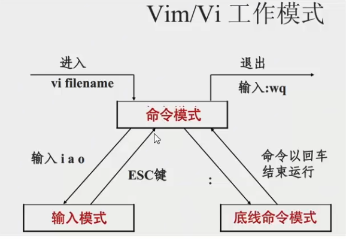
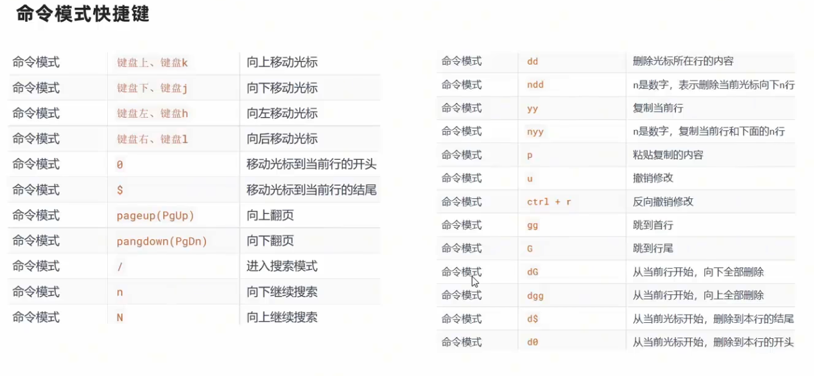
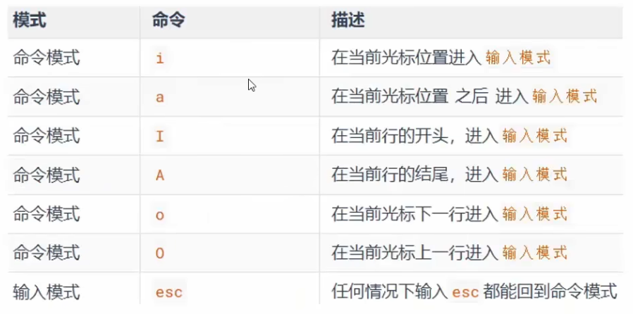
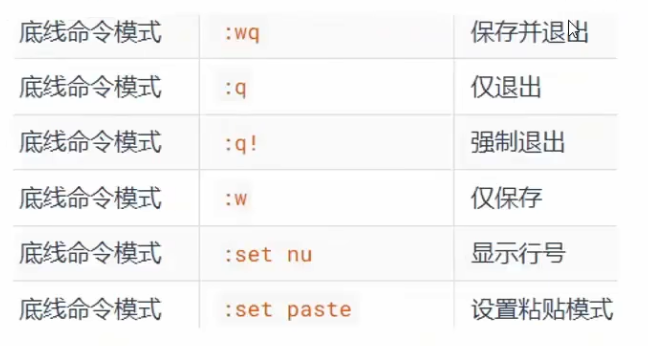

# linux 操作系统

1. 主要目录说明：
   - /: 根目录，所有文件都存放在这里；
   - /bin: 存放系统启动和运行所需的“基本命令”（如 ls, cp, mv, bash）（所有用户可用）；
   - /sbin：存放“系统管理员专用”的管理命令（如 fdisk, ifconfig, reboot）（通常只有 root 能用）；
   - /etc: 系统配置文件目录（如 passwd, fstab, nginx/, systemd/）（不放二进制程序）；
   - /home: 普通用户的家目录。例：用户 alice 的主目录是 /home/alice；
   - /root: root 用户的家目录（不是 /home/root！）。
   - /tmp: 临时文件目录（所有用户可读写，系统重启后通常清空）。
   - /usr: 存放只读的用户程序和数据（类似 Windows 的 Program Files）。
     1. /usr/bin：非基本命令（如 git, python3, vim）
     2. /usr/sbin：非基本系统管理命令
     3. /usr/lib：程序库文件
     4. /usr/share：架构无关的数据（文档、图标、字体等）
     5. /usr/local：本地编译安装的软件（避免与系统包冲突）

   - /proc: 虚拟文件系统，提供内核和进程信息;
   - /sys: 虚拟文件系统，用于内核与硬件交互（设备、驱动、电源管理等），比 /proc 更结构化;

2. 内核：操作和控制硬件的核心程序，如：CPU、内存、硬盘、显卡、网卡、声卡、光驱、摄像头、鼠标、键盘等；

3. linux 发行版（操作系统）有两部分组成： 1、Linux 系统内核 + 2、系统级应用程序（常用软件）
   - 内核：提供系统最核心的功能，如: 调度 CPU、调度内存、调度文件系统、调度网络通讯、调度 I0 等；
   - 系统级应用程序：可以理解为出厂自带程序，可供用户快速上手操作系统，如: 文件管理器、任务管理器、图片查看、音乐播放等。

## 数据流转（发送、接受 消息流程）

用户--》软件（微信）--》操作系统--》网卡驱动--》物理网卡--》【服务器】--》物理网卡--》网卡驱动--》操作系统--》软件（微信）--》用户

- 物理网卡：千千万种
- 网卡驱动：N 多种
- 操作系统：主要作用是协助用户调度硬件工作，充当用户和计算机硬件之间的桥梁

## 虚拟机

## 容器化

## 命令行 -- 常用

- 切换到 root 用户：sudo su - ;然后输入密码；

- 强制停止：ctrl + c(cancel)；
- 终端清屏：clear；

- 安装与卸载 :

  语法：apt install|remove 程序名 [ -y ]

  sudo(Super User Do): 超级用户的身份执行
  1. apt install xxx ; sudo apt install xxx
  2. apt remove xxx

### vim 是 vi 的加强版

快速体验

1. 使用: `vim hello.txt`，编辑一个新文件，执行后进入的是命令模式；
2. 在命令模式内，按键盘 `i`(inset)，进入输入模式；
3. 在输入模式内输入: hello world；
4. 输入完成后，按 `esc` 回退会命令模式
5. 在命令模式内，按键盘`:`，进入底线命令模式
6. 在底线命令内输入:`wq`，保存文件并退出 vi 编辑器

### Linux 命令基础格式

无论是什么命令，用于什么用途，在 Linux 中，命令有其通用的格式：

command [-options] [parameter]

1. command：命令本身
2. -options：[可选，非必填]命令的一些选项，可以通过选项控制命令的行为细节
3. parameter：[可选，非必填]命令的参数，多数用于命令的指向目标等

**注：**
1、语法中的[]，表示可选的意思；
2、默认在“/home/username”目录下操作，其他目录不可以（除非 root 权限）

1. ls : list(列出目录内容)

   语法: ls [-a -l -h] [Linux 路径]
   - -a：显示全部（包括隐藏文件）
   - -l：显示文件详细信息（列表形式显示）
   - -h：显示文件大小（人性化显示）
   - 组合写法，如：ls -alh

2. cd : change directory(改变目录)

   语法: cd [Linux 路径]
   - 特殊路径符:cd
     - cd 或者 cd /home/“username” ：表示当前用户目录
     - cd / ：表示根目录
     - cd . ：表示当前目录
     - cd ..：表示上一级目录
     - cd ~ ：表示 HOME 目录
     - cd -: 返回上一级目录

3. pwd : print work directory(打印当前目录，现示当前工作目录的绝对路径)
4. mkdir: make directory(创建目录)

   语法: mkdir [ -p ] Linux 路径
   - -p 选项可选，表示自动创建不存在的父目录，适用于创建连续多层级的目录

5. touch : 创建空白文件

   语法: touch Linux 路径（文件全名）；例 touch 1.txt

6. cat : concatenate(连锁 -- 查看文件内容)

   语法: cat Linux 路径（文件全名）；例： cat 1.txt
   - cat 直接将内容全部显示出来

7. more : 查看文件内容

   语法: more Linux 路径
   - more 支持翻页；内容过多，可以一页页的展示；
   - 使用空格翻页，使用 q 退出

8. cp : copy file(复制文件)

   语法: cp [-r] 参数 1 参数 2
   - -r 选项，可选，用于”复制文件夹”使用，表示递归；
   - 参数 1，Linux 路径，表示被复制的文件或文件夹
   - 参数 2，Linux 路径，表示要复制去的地方

9. mv : move file (移动目录或文件)

   语法: mv 参数 1 参数 2；例：mv 1.txt 2.txt（移动＋改名）
   - 参数 1，Linux 路径，表示被移动的文件或文件夹
   - 参数 2，Linux 路径，表示要移动去的地方，如果目标不存在，则进行改名，确保目标存在

10. rm : remove(删除目录或文件)

    语法: rm [-r -f] 参数 1 参数 2 参数 N
    - -r 选项，可选，"文件夹"删除(同 cp 命令一样);
    - -f (force)，可选，强制删除 (不会弹出提示确认信息);

      普通用户删除内容不会弹出提示，只有 root 管理员用户删除内容会有提示，所以一般普通用户用不到-f 选项

    - 参数 1、参数 2、参数 N 表示要删除的文件或文件夹路径，按照空格隔开；参数也支持通配符`*`，用以做模糊匹配
      - `rm *.txt (删除所有 txt 文件)`
      - `rm * (删除所有文件)`

11. which : 查看命令的绝对路径

    语法: which 要查找的命令; 例：which ls

12. find : 查找文件（没权限的搜不到）
    1. 语法: find 起始路径 -name "被查找文件名"
       - `find / -name "*.txt"` (查找所有 txt 文件)
       - `find / -name "*test"` (查找所有 以 test 结尾的文件)

    2. 语法:find 起始路径 -size +|-n[kMG]
       - +、-表示大于和小于
       - n 表示大小数字
       - kMG 表示大小单位，k(小写字母)表示 kb，M 表示 MB，G 表示 GB
       - 查找小于 10KB 的文件:find / -size -10k
       - 查找大于 100MB 的文件:find / -size +100M

13. grep : search file(搜索“带有关键字”的行)

    语法：grep [-n] 关键字 文件路径
    - 选项-n，可选，表示在结果中显示“匹配到的行”的行号，
    - 参数，关键字，必填，表示过滤的关键字，带有空格或其它特殊符号，建议使用””将关键字包围起来
    - 参数，文件路径，必填，表示要过滤内容的文件路径，“可作为内容输入端口”

14. wc: word Count(统计)

    语法: wc [-c-m-1 -w] 文件路径
    - 选项，-c，统计 bytes 数量
    - 选项，-m，统计字符数量
    - 选项，-l，统计行数
    - 选项，-W，统计单词数量
    - 参数，文件路径，被统计的文件，“可作为内容输入端口”

15. |： 管道符

    管道符的含义是:将管道符左边命令的结果，作为右边命令的输入；
    - 例: cat a.txt | grep "hello" (将 a.txt 文件的内容，作为 grep "hello" 的输入)
    - 例: cat a.txt | grep "hello" | wc -l (将 a.txt 文件的内容，作为 grep "hello" 的输入，得到结果，再作为 wc -l 的输入)

16. echo: 打印

    语法：echo 输入内容
    - echo "hello world"
    - echo `pwd` (打印当前目录); ``: 把 命令执行后的结果 打印

17. |>：重定向符
    - `>` ，将左侧命令的结果，"覆盖"写入到符号右侧指定的文件中
    - `>>` ，将左侧命令的结果，"追加"写入到符号右侧指定的文件中
    - 文件不存在，则新建
    * 例：echo "hello world" > hello.txt
    * 例：echo "hello world" >> hello.txt
    * pwd > a.txt

18. tail：查看文件尾部内容，跟踪文件的最新更改，

    语法：tail [-f -num] Linux 路径
    - 参数，Linux 路径，表示被跟踪的文件路径
    - 选项，-f（follow），表示持续跟踪；(看日志)
    - 选项,-num，表示，查看尾部多少行，不填默认 10 行

## 命令行 more

1. 【目录|文件】
   - ls : list(列出目录内容)
   - pwd : print work directory(打印当前目录，现示当前工作目录的绝对路径)
   - cd : change directory(改变目录)
   - rmdir: remove directory(删除目录)
   - mkdir: make directory(创建目录)
   - rm : remove(删除目录或文件)
   - mv : move file (移动文件)
   - cp : copy file(复制文件)
   - cat : concatenate(连锁)
   - cat file 1 file 2 >> file 3(把文件 1 和文件 2 的内容联合起来放进 文件 3 中)

2. 【系统|权限】
   - su : switch user(切换用户)
   - uname: unix name(用于打印当前系统相关信息)
   - chown: change owner(改变某和文件或目录所有者和所属的组，，)
   - chgrp: change group(用于改变文件或所属的用户组)
   - chmod: change mode(用于变更文件或目录的权限)

3. 【进程|磁盘】
   - ps : process status(进程状态，类似于 wins 任务管理器)

     常用参数: -auxf ps -auxf (进程现示状态)

   - df : disk free(显示磁盘可用空间数目信息及空间节点信息。换句话说，就是查看在任何安装的设备或目录中还剩多少自由空间)
   - du : disk usage(查看已使用空间)

4. 【打包管理】
   - rpm : redhat package manger(红帽子打包管理器)
   - dpkg: debian package manager
   - apt: advanced package tool

5. 【文件后缀】
   - 文件结尾的 rc: resource configratin(如 .xinitrc, .bashrc 等)
   - knnxxx/snnxxx(位于 rcx.d 目录下):k(kill),s(service);nn(执行顺序号);xxx(服务标识)
   - .a(扩展名 a): archive ,static library
   - .s(扩展名 so): shared object,dynamically linked library
   - .o(扩展名 o): olbject file, compiled result of c/c++ source file

6. 【部分 linux 目录|参数 缩写】
   - bin = binarines
   - /dev = devices
   - /dev = etcetera
   - /lib = library
   - /proc = processes
   - /sbin= superuser binaries
   - /tmp= temporary
   - /usr= unix shared resources
   - /var= variable
   - ? fifo= first in ,fitst out
   - grub= grand unified bootloader
   - ifs= internal field seperators
   - lilo= linux loader
   - mysql= my 是最初作者的女儿的名字，sql=structured query language
   - php= personal home page tools=php hypertext preprocessor
   - ps = prompt string
   - perl= pratical extraction and report language=pathologically eclectic rubbish lister python 得名于电视剧 monty python's flying circus
   - tcl= tool command language
   - tk = toolkit
   - vt = video terminal
   - yast= yet another

7. 【other】
   - insmod: install module(载入模块)
   - lsmod: list modules(用于显示已加载到内核模块的状态信息)
   - rmmod:remove module
   - in -s : link -soft(创建一个软链接，相当于创建一个快捷方式)
   - touch man:manual
   - mkfs: make file system (创建 linux 系统文件)
   - fsck: file system check(用于检查并试图修复文件系统中错误)
   - ln : link file(用于文件创建连接分为硬盘连接和符号连接)
   - fg : foreground(用于后台作业放到前台终端运行)
   - bg : background(用于将作业放到后台运行)
   - umount: unmount(用于卸载已经加载的系统文件)
   - tar : tape archive
   - ldd : list dynamic dependencies
