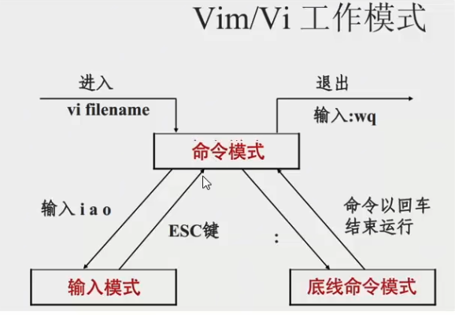
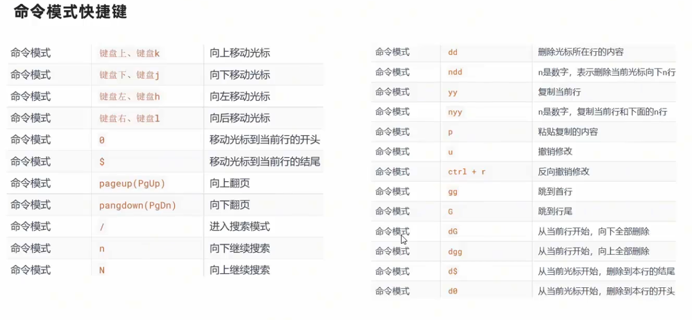
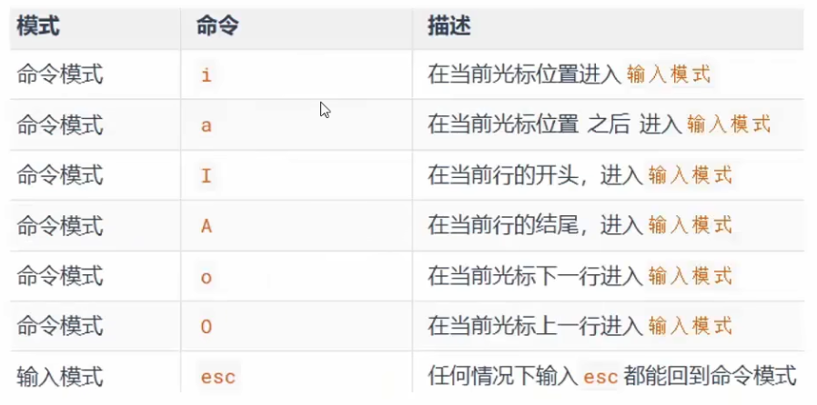
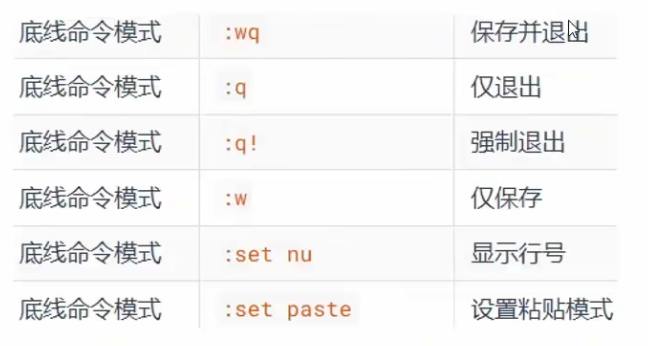

# linux 操作系统

- Linux 不是：一堆命令，而是：一个“资源调度系统”
  负责：
  - 调度 CPU
  - 调度内存
  - 调度文件
  - 调度网络
  - 调度硬件
  - 管理进程
- Linux 本质上是：一个“资源抽象 + 资源调度”系统;

  Linux：一切皆文件（❗重要）; 设备、进程、磁盘、socket，很多都能抽象成文件。

- 而”应用程序“ 只是”向 Linux 申请资源“，这才是操作系统真正本质。
- 整个 Linux 世界真正主线
  1. Linux 是资源调度核心
  2. 内核负责硬件管理
  3. 用户程序通过 系统调用(syscall) 申请资源
  4. 文件系统组织资源
  5. 包管理器管理软件
  6. 服务程序运行在用户空间

- 系统调用(syscall) 是整个用户态/内核态切换核心；syscall 是应用程序进入内核世界的唯一正规入口

## 一、Linux 到底是什么（先建立总框架）

- Linux 最核心是：操作系统 = 内核 + 系统软件 + 用户空间工具;
  - 可以理解成：Linux发行版 = Linux内核 + GNU工具链 + 包管理器 + 桌面/服务程序 + 默认软件;
  - Linux 内核 ≠ 完整操作系统；

    Linus 写的：只是内核; 真正能使用：还需要shell、coreutils、包管理器、init系统、libc等等。
    这也是：GNU/Linux这个名字来源。

- Linux 内核（Kernel）：操作系统最核心部分；
  - 负责：
    1. 进程调度：谁使用 CPU。
    2. 内存管理：谁占用内存。
    3. 文件系统：硬盘怎么读写。
    4. 网络协议栈：TCP/IP。
    5. 设备驱动管理。
       例如：
       - 网卡
       - 显卡
       - 声卡
       - 光驱
       - 摄像头
       - USB
       - 键盘 等

    6. IO调度：磁盘、网络 IO。

## 一个真正重要的 Linux 分层认知（核心）

1. 用户空间（User Space）
   例如：
   - 微信
   - nginx
   - python
   - mysql
   - bash

   普通程序。 不能直接碰硬件。

2. 内核空间（Kernel Space）:Linux Kernel。

   真正控制：
   - CPU
   - 内存
   - 磁盘
   - 网卡

3. 系统调用（syscall）: 连接"用户空间 ↔ 内核空间"的桥梁。
   这部分以后：
   - socket
   - IO模型
   - epoll
   - asyncio

   都会大量涉及。

4. 用户态（User Mode）：权限受限。

   不能：
   - 操作硬件
   - 修改页表
   - 直接访问网卡

5. 内核态（Kernel Mode）：最高权限。

   可以：
   - 控制 CPU
   - 操作内存
   - 驱动设备

6. 为什么这样设计？
   - 为了：安全与稳定；
   - 否则：微信崩了 = 整个系统崩

## 数据流转（发送、接受 消息流程）

用户 --> 应用程序（微信）--> socket API --> 系统调用（syscall）--> Linux内核 --> TCP/IP协议栈 --> 网卡驱动 --> 物理网卡 --> 交换机/路由器 --> 网络

- 物理网卡：千千万种
- 网卡驱动：N 多种
- 操作系统：主要作用是协助用户调度硬件工作，充当用户和计算机硬件之间的桥梁

  应用程序：不能直接操作硬件, 必须：通过内核; 这就是：操作系统存在的意义之一;
  例如：微信不能直接控制网卡, 必须：调用 Linux 内核接口

```bash
  用户
   ↓
  应用程序（Python/微信/nginx/MySQL）
   ↓
  系统调用（syscall）
   ↓
  Linux Kernel
   ├── 进程调度
   ├── 内存管理
   ├── 文件系统
   ├── TCP/IP协议栈
   ├── 驱动程序
   └── IO调度
   ↓
  硬件
   ├── CPU
   ├── 内存
   ├── 磁盘
   ├── 网卡
   └── USB设备
```

## 二、Linux 目录结构

1. /: 根目录，所有目录的起点。
   - 类似 Windows：“C:\”; 但 Linux：没有盘符概念, 所有磁盘都会“挂载”到 ”/“ 下。

2. /bin: 基础用户命令，存放系统启动和运行所需的“基本命令”（例：ls, cp, mv, cat, bash）；【所有用户可用】
   - ⚠️ 现代很多发行版：“/bin -> /usr/bin” 已经合并。

3. /sbin: 管理员命令，存放“系统管理员专用”的管理命令(例：reboot,fdisk,mount);【通常只有 root 能用】
   - ⚠️现代系统也常并入：/usr/sbin。

4. /etc: 系统配置目录(❗非常重要, 例：“/etc/passwd，”/etc/hosts“，”/etc/nginx/“，”/etc/mysql/“)。
   - 特点：基本不放程序，而是：放配置文件【不放二进制程序】

5. /home：普通用户家目录。（例：用户 alice 的主目录是 /home/alice，类似：”C:\Users\alice“）；
6. /root：root 用户家目录。
   - ⚠️ 注意：/root，不是 /home/root；

7. /tmp：临时文件目录。 特点：所有人可写，常用于缓存，部分系统重启清空；
8. /usr（Unix System Resources）：它不是：user，可以理解成：系统级应用程序目录；类似：Program Files（❗超级重要）
   - /usr/bin：普通应用程序（例：git、python3、vim、node）；
   - /usr/sbin：系统管理程序；
   - /usr/lib：动态库（类似 Windows：dll）；
   - /usr/share：架构无关资源（例：字体、文档、icon、locale）；
   - /usr/local：本地手动安装的软件（例：./configure、make、make install）；
     默认会进：/usr/local，作用：避免污染系统包，❗非常重要。
9. /var（variable）：存放：经常变化的数据（例： 日志：/var/log、 MySQL 数据：/var/lib/mysql、 nginx 网站：部分发行版：/var/www）
10. /proc：虚拟文件系统，提供内核和进程信息;。
    - ⚠️ 不是真实磁盘文件。它是：内核实时映射（例：cat /proc/cpuinfo：查看 CPU）。

11. /sys：也是虚拟文件系统。相比 /proc：更偏硬件与设备模型（例：电源、驱动、PCI设备、USB）；
12. /boot: 启动相关文件。
13. /lib: 系统动态库。
    - 很多系统：⚠️ /lib -> /usr/lib

14. /opt: 第三方大型软件。例如：Oracle,JetBrains

## sudo 是什么

你会经常看到：`sudo apt install`

因为：安装软件需要：root 权限;

sudo 意思：以管理员身份执行, 类似 Windows：“以管理员身份运行”

## apt 是 Linux 的“软件安装管理器”，⚠️不是所有 Linux 都有 apt（重要），Linux 有很多发行版。

- 可以理解成：Linux 的应用商店 + 安装器；
  apt（Advanced Package Tool）：是 Debian / Ubuntu 系 Linux 的包管理工具, 因为：apt 属于 Debian 系生态

  用于：
  - 安装软件
  - 卸载软件
  - 更新软件
  - 管理依赖

    | 生态          | 包管理工具     | 安装内容 |
    | ------------- | -------------- | -------- |
    | Ubuntu/Debian | apt            | 系统软件 |
    | CentOS        | yum/dnf        | 系统软件 |
    | macOS         | App Store/brew | 系统软件 |
    | Node.js       | npm/pnpm/yarn  | JS包     |
    | Python        | pip            | Python包 |
    | Rust          | cargo          | Rust包   |
    | Go            | go mod         | Go模块   |

- Linux 软件通常来自：软件仓库（repository）
  类似：官方软件服务器，Ubuntu 官方维护大量软件。

  apt 会：
  - 连接软件仓库
  - 下载软件
  - 自动安装

- Linux 用：`sudo apt install mysql-server`安装软件；
  自动：
  1. 下载
  2. 安装
  3. 配置依赖
  4. 注册服务

  一步完成。

- apt install 到底干了什么？ 例：`sudo apt install mysql-server`
  1. 去软件源查找 mysql-server，类似：软件数据库；
  2. 下载软件包，比如：.deb文件。类似 Windows 的：.exe
  3. 自动安装依赖，比如：MySQL 依赖：
     - libc
     - openssl
     - networking

     apt 自动帮你装。这就是：“依赖管理”

  4. 注册系统服务，例如：systemctl start mysql就能启动。

  “依赖树”: 是：包管理器最大价值, 否则：手工装依赖会地狱。

- 软件源（repository）: 例如："/etc/apt/sources.list"; 里面配置：软件仓库地址,apt update 本质：同步软件索引;
- systemd: 现代 Linux 的：服务管理器（init system）

  负责：
  1. 启动服务
  2. 停止服务
  3. 开机自启
  4. 管理后台进程

- systemctl:systemd 的命令工具。

  例如：
  1. systemctl start nginx
  2. systemctl stop mysql
  3. systemctl restart redis

## apt 常用命令（以后天天用）

1. 更新软件列表:`sudo apt update`意思：刷新软件仓库索引；类似：同步应用商店列表
2. 升级软件:`sudo apt upgrade`
3. 安装软件:`sudo apt install nginx`
4. 卸载软件:`sudo apt remove nginx`
5. 搜索软件:`apt search mysql`
6. 搜索软件:`apt search mysql`

## Linux 软件安装真正底层（进阶理解）

apt 其实只是：高层工具;

真正安装 ".deb 包"的是：dpkg

关系：apt -> dpkg

类似：pip -> python setup/install

- .deb: Ubuntu/Debian 软件包格式。类似：Windows exe/msi; 但更接近：安装包 + 元数据;
- dpkg: 底层包安装工具。只能：安装本地包, 不会自动解决依赖。
- apt: 更高级。
  会：
  - 自动下载
  - 自动解决依赖
  - 自动更新仓库
  - 自动安装依赖

##

## 虚拟机

## 容器化

## 命令行 -- 常用

- 切换到 root 用户：sudo su - ;然后输入密码；

- 强制停止：ctrl + c(cancel)；
- 终端清屏：clear；

- 安装与卸载 :

  语法：apt install|remove 程序名 [ -y ]

  sudo(Super User Do): 超级用户的身份执行
  1. apt install xxx ; sudo apt install xxx
  2. apt remove xxx

### vim 是 vi 的加强版

快速体验

1. 使用: `vim hello.txt`，编辑一个新文件，执行后进入的是命令模式；
2. 在命令模式内，按键盘 `i`(inset)，进入输入模式；
3. 在输入模式内输入: hello world；
4. 输入完成后，按 `esc` 回退会命令模式
5. 在命令模式内，按键盘`:`，进入底线命令模式
6. 在底线命令内输入:`wq`，保存文件并退出 vi 编辑器









### Linux 命令基础格式

无论是什么命令，用于什么用途，在 Linux 中，命令有其通用的格式：

command [-options] [parameter]

1. command：命令本身
2. -options：[可选，非必填]命令的一些选项，可以通过选项控制命令的行为细节
3. parameter：[可选，非必填]命令的参数，多数用于命令的指向目标等

**注：**
1、语法中的[]，表示可选的意思；
2、默认在“/home/username”目录下操作，其他目录不可以（除非 root 权限）

1. ls : list(列出目录内容)

   语法: ls [-a -l -h] [Linux 路径]
   - -a：显示全部（包括隐藏文件）
   - -l：显示文件详细信息（列表形式显示）
   - -h：显示文件大小（人性化显示）
   - 组合写法，如：ls -alh

2. cd : change directory(改变目录)

   语法: cd [Linux 路径]
   - 特殊路径符:cd
     - cd 或者 cd /home/“username” ：表示当前用户目录
     - cd / ：表示根目录
     - cd . ：表示当前目录
     - cd ..：表示上一级目录
     - cd ~ ：表示 HOME 目录
     - cd -: 返回上一级目录

3. pwd : print work directory(打印当前目录，现示当前工作目录的绝对路径)
4. mkdir: make directory(创建目录)

   语法: mkdir [ -p ] Linux 路径
   - -p 选项可选，表示自动创建不存在的父目录，适用于创建连续多层级的目录

5. touch : 创建空白文件

   语法: touch Linux 路径（文件全名）；例 touch 1.txt

6. cat : concatenate(连锁 -- 查看文件内容)

   语法: cat Linux 路径（文件全名）；例： cat 1.txt
   - cat 直接将内容全部显示出来

7. more : 查看文件内容

   语法: more Linux 路径
   - more 支持翻页；内容过多，可以一页页的展示；
   - 使用空格翻页，使用 q 退出

8. cp : copy file(复制文件)

   语法: cp [-r] 参数 1 参数 2
   - -r 选项，可选，用于”复制文件夹”使用，表示递归；
   - 参数 1，Linux 路径，表示被复制的文件或文件夹
   - 参数 2，Linux 路径，表示要复制去的地方

9. mv : move file (移动目录或文件)

   语法: mv 参数 1 参数 2；例：mv 1.txt 2.txt（移动＋改名）
   - 参数 1，Linux 路径，表示被移动的文件或文件夹
   - 参数 2，Linux 路径，表示要移动去的地方，如果目标不存在，则进行改名，确保目标存在

10. rm : remove(删除目录或文件)

    语法: rm [-r -f] 参数 1 参数 2 参数 N
    - -r 选项，可选，"文件夹"删除(同 cp 命令一样);
    - -f (force)，可选，强制删除 (不会弹出提示确认信息);

      普通用户删除内容不会弹出提示，只有 root 管理员用户删除内容会有提示，所以一般普通用户用不到-f 选项

    - 参数 1、参数 2、参数 N 表示要删除的文件或文件夹路径，按照空格隔开；参数也支持通配符`*`，用以做模糊匹配
      - `rm *.txt (删除所有 txt 文件)`
      - `rm * (删除所有文件)`

11. which : 查看命令的绝对路径

    语法: which 要查找的命令; 例：which ls

12. find : 查找文件（没权限的搜不到）
    1. 语法: find 起始路径 -name "被查找文件名"
       - `find / -name "*.txt"` (查找所有 txt 文件)
       - `find / -name "*test"` (查找所有 以 test 结尾的文件)

    2. 语法:find 起始路径 -size +|-n[kMG]
       - +、-表示大于和小于
       - n 表示大小数字
       - kMG 表示大小单位，k(小写字母)表示 kb，M 表示 MB，G 表示 GB
       - 查找小于 10KB 的文件:find / -size -10k
       - 查找大于 100MB 的文件:find / -size +100M

13. grep : search file(搜索“带有关键字”的行)

    语法：grep [-n] 关键字 文件路径
    - 选项-n，可选，表示在结果中显示“匹配到的行”的行号，
    - 参数，关键字，必填，表示过滤的关键字，带有空格或其它特殊符号，建议使用””将关键字包围起来
    - 参数，文件路径，必填，表示要过滤内容的文件路径，“可作为内容输入端口”

14. wc: word Count(统计)

    语法: wc [-c-m-1 -w] 文件路径
    - 选项，-c，统计 bytes 数量
    - 选项，-m，统计字符数量
    - 选项，-l，统计行数
    - 选项，-W，统计单词数量
    - 参数，文件路径，被统计的文件，“可作为内容输入端口”

15. |： 管道符

    管道符的含义是:将管道符左边命令的结果，作为右边命令的输入；
    - 例: cat a.txt | grep "hello" (将 a.txt 文件的内容，作为 grep "hello" 的输入)
    - 例: cat a.txt | grep "hello" | wc -l (将 a.txt 文件的内容，作为 grep "hello" 的输入，得到结果，再作为 wc -l 的输入)

16. echo: 打印

    语法：echo 输入内容
    - echo "hello world"
    - echo `pwd` (打印当前目录); ``: 把 命令执行后的结果 打印

17. |>：重定向符
    - `>` ，将左侧命令的结果，"覆盖"写入到符号右侧指定的文件中
    - `>>` ，将左侧命令的结果，"追加"写入到符号右侧指定的文件中
    - 文件不存在，则新建
    * 例：echo "hello world" > hello.txt
    * 例：echo "hello world" >> hello.txt
    * pwd > a.txt

18. tail：查看文件尾部内容，跟踪文件的最新更改，

    语法：tail [-f -num] Linux 路径
    - 参数，Linux 路径，表示被跟踪的文件路径
    - 选项，-f（follow），表示持续跟踪；(看日志)
    - 选项,-num，表示，查看尾部多少行，不填默认 10 行

## 命令行 more

1. 【目录|文件】
   - ls : list(列出目录内容)
   - pwd : print work directory(打印当前目录，现示当前工作目录的绝对路径)
   - cd : change directory(改变目录)
   - rmdir: remove directory(删除目录)
   - mkdir: make directory(创建目录)
   - rm : remove(删除目录或文件)
   - mv : move file (移动文件)
   - cp : copy file(复制文件)
   - cat : concatenate(连锁)
   - cat file 1 file 2 >> file 3(把文件 1 和文件 2 的内容联合起来放进 文件 3 中)

2. 【系统|权限】
   - su : switch user(切换用户)
   - uname: unix name(用于打印当前系统相关信息)
   - chown: change owner(改变某和文件或目录所有者和所属的组，，)
   - chgrp: change group(用于改变文件或所属的用户组)
   - chmod: change mode(用于变更文件或目录的权限)

3. 【进程|磁盘】
   - ps : process status(进程状态，类似于 wins 任务管理器)

     常用参数: -auxf ps -auxf (进程现示状态)

   - df : disk free(显示磁盘可用空间数目信息及空间节点信息。换句话说，就是查看在任何安装的设备或目录中还剩多少自由空间)
   - du : disk usage(查看已使用空间)

4. 【打包管理】
   - rpm : redhat package manger(红帽子打包管理器)
   - dpkg: debian package manager
   - apt: advanced package tool

5. 【文件后缀】
   - 文件结尾的 rc: resource configratin(如 .xinitrc, .bashrc 等)
   - knnxxx/snnxxx(位于 rcx.d 目录下):k(kill),s(service);nn(执行顺序号);xxx(服务标识)
   - .a(扩展名 a): archive ,static library
   - .s(扩展名 so): shared object,dynamically linked library
   - .o(扩展名 o): olbject file, compiled result of c/c++ source file

6. 【部分 linux 目录|参数 缩写】
   - bin = binarines
   - /dev = devices
   - /dev = etcetera
   - /lib = library
   - /proc = processes
   - /sbin= superuser binaries
   - /tmp= temporary
   - /usr= unix shared resources
   - /var= variable
   - ? fifo= first in ,fitst out
   - grub= grand unified bootloader
   - ifs= internal field seperators
   - lilo= linux loader
   - mysql= my 是最初作者的女儿的名字，sql=structured query language
   - php= personal home page tools=php hypertext preprocessor
   - ps = prompt string
   - perl= pratical extraction and report language=pathologically eclectic rubbish lister python 得名于电视剧 monty python's flying circus
   - tcl= tool command language
   - tk = toolkit
   - vt = video terminal
   - yast= yet another

7. 【other】
   - insmod: install module(载入模块)
   - lsmod: list modules(用于显示已加载到内核模块的状态信息)
   - rmmod:remove module
   - in -s : link -soft(创建一个软链接，相当于创建一个快捷方式)
   - touch man:manual
   - mkfs: make file system (创建 linux 系统文件)
   - fsck: file system check(用于检查并试图修复文件系统中错误)
   - ln : link file(用于文件创建连接分为硬盘连接和符号连接)
   - fg : foreground(用于后台作业放到前台终端运行)
   - bg : background(用于将作业放到后台运行)
   - umount: unmount(用于卸载已经加载的系统文件)
   - tar : tape archive
   - ldd : list dynamic dependencies
