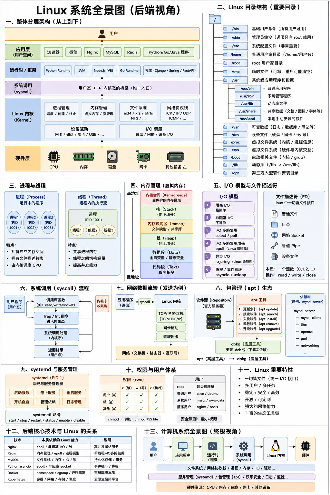

# 计算机系统主干

## 后面你还应该继续理解（很重要）

下一步建议你学：

Linux：
文件系统
root
用户权限
systemctl
进程
端口
ssh
MySQL：
SQL
表关系
索引
事务
网络：
localhost
127.0.0.1
TCP/IP
端口

因为后端开发本质上：Linux + 网络 + 数据库 三件套。



## 一、真正完整的“后端底层主线”

```bash
    硬件
     ↓
    操作系统（Linux）
     ↓
    内核（Kernel）
     ↓
    系统调用(syscall)
     ↓
    进程/线程/内存/IO
     ↓
    文件系统 / 网络协议栈 / 进程模型
     ↓
    运行时(Runtime)
     ↓
    编程语言（Python/Go/Java）
     ↓
    应用框架（Django/Spring/FastAPI）
     ↓
    中间件（MySQL/Redis/Nginx）
     ↓
    业务系统
```

## 二、你现有模块 + 应该继续补充的模块

| 模块     | 本质           | 为什么重要   |
| -------- | -------------- | ------------ |
| Linux    | 资源调度       | 一切基础     |
| Kernel   | 硬件抽象       | 真正控制硬件 |
| syscall  | 用户态进入内核 | 所有IO入口   |
| socket   | 网络通信接口   | 网络编程核心 |
| TCP/IP   | 网络协议       | 数据传输规则 |
| 文件系统 | 资源组织       | 数据如何存   |
| systemd  | 服务管理       | 后台服务运行 |
| apt      | 软件生态       | 软件安装体系 |
| MySQL    | 数据存储服务   | 持久化数据   |

下面是建议你继续补的。

## 三、进程（Process）（超级核心）

Linux 本质上是在调度进程;
进程是: 运行中的程序。
Linux 真正在调度的是：进程, 不是程序文件。

- 重要概念

  | 概念      | 本质         |
  | --------- | ------------ |
  | PID       | 进程ID       |
  | 父子进程  | fork产生     |
  | 前台/后台 | shell控制    |
  | 守护进程  | 后台长期运行 |

## 四、线程（Thread）

线程：进程里的执行流。

一个进程可以同时做多件事(多个线程)

## 五、内存（Memory）（非常重要）

Linux 内存不只是：RAM,还包括：

| 概念       | 作用             |
| ---------- | ---------------- |
| 虚拟内存   | 每个进程独立空间 |
| 页（Page） | 内存管理单位     |
| mmap       | 文件映射         |
| cache      | 文件缓存         |
| swap       | 内存不够时换盘   |

- 为什么重要？

  以后：
  - Redis
  - JVM
  - Python GC
  - mmap
  - 零拷贝

  全涉及。

## 六、IO

IO 本质：数据搬运;

磁盘 -> 内存

网卡 -> 内存

- 经典 IO 模型

  | 模型        | 特点         |
  | ----------- | ------------ |
  | 阻塞IO      | 最简单       |
  | 非阻塞IO    | 不等待       |
  | select/poll | 多路复用     |
  | epoll       | Linux高性能  |
  | asyncio     | 协程事件循环 |

  这是：nginx / redis / asyncio 核心

## 七、文件描述符（FD）（非常关键）

它是：Linux IO统一抽象核心；

- Linux里：很多东西最终都是 fd

  例如：
  - 文件
  - socket
  - pipe

socket 本质：fd
epoll 监听的是：fd

## 八、Shell

shell 是：用户和Linux之间的命令解释器，例如：bash、zsh
shell 本质：一个普通程序，不是 Linux 内核。

- shell 负责：
  - 解析命令
  - 启动进程
  - 管道
  - 重定向

## 九、环境变量

PATH、HOME、PWD

## 十、动态库（共享库）

为什么重要？否则：每个程序都带一份 libc。会巨大浪费。

## 十一、权限系统

Linux 极核心。

- 三类权限：r、w、x；
- 三类用户：owner、group、others

为什么重要？因为 Linux 本质是：多用户系统

## 十二、用户体系

为什么 MySQL 不用 root 跑？因为：安全

## 十三、服务

nginx/mysql/redis：本质：后台长期运行进程

Linux 世界大量东西本质：daemon

## 十四、容器（Docker）

Docker 本质不是虚拟机，而是：Linux namespace + cgroup

本质：进程隔离

## 十五、编程语言 Runtime

| 语言   | Runtime    |
| ------ | ---------- |
| Python | CPython    |
| Java   | JVM        |
| Node   | V8         |
| Go     | Go Runtime |

- Runtime 干什么？
  - 内存管理
  - GC
  - 调度协程
  - syscall封装

## 十六、数据库真正底层（后面会碰）

| 模块        | 本质       |
| ----------- | ---------- |
| B+树        | 索引       |
| WAL         | 崩溃恢复   |
| Buffer Pool | 内存缓存   |
| MVCC        | 并发控制   |
| 事务        | 数据一致性 |
| 锁          | 并发安全   |

## 十七、网络继续深入（后面主线）

| 模块     | 本质       |
| -------- | ---------- |
| DNS      | 域名解析   |
| HTTP     | 应用层协议 |
| HTTPS    | 加密HTTP   |
| TLS      | 安全传输   |
| CDN      | 边缘缓存   |
| 负载均衡 | 请求分发   |

## 最正确的学习方向是：建立系统关联

- nginx 为什么高性能？
  1. epoll
  2. fd
  3. 非阻塞IO
  4. syscall
  5. Linux 内核

- Redis 为什么快？
  1. 内存
  2. 单线程事件循环
  3. epoll
  4. syscall

- Python asyncio 为什么成立？
  1. 协程
  2. event loop
  3. epoll
  4. 非阻塞socket
