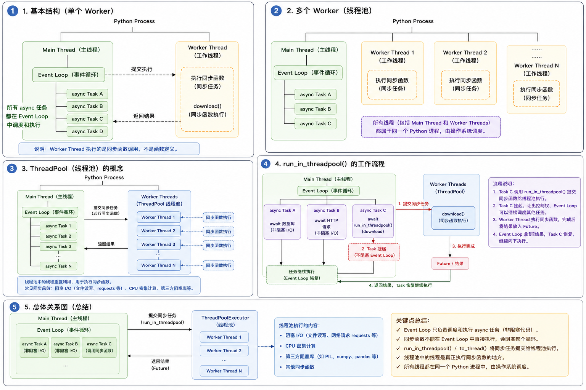

# ========= 疑惑 =====================================================================

## 内置函数

```bash
① 认识对象: dir / type / id / help

② 计算: len / max / min / sum / abs / round

③ 逻辑: all / any

④ 数据处理: enumerate / zip / map / filter / sorted / reversed / range

⑤ 类型转换: int / str / list / dict ...

⑥ 迭代器: iter / next

⑦ 反射: getattr / setattr / hasattr / delattr

⑧ 执行: eval / exec

⑨ 作用域: locals / globals / vars

⑩ 环境: __name__ / __file__ / __doc__ / __annotations__
```

1. 对象 & 类型（基础认知）

   ```python
    dir(obj)        # 查看对象属性（含方法）
    help(obj)       # 查看帮助文档
    type(obj)       # 获取对象类型
    id(obj)         # 获取对象唯一标识（内存地址）
    isinstance(obj, cls)  # 是否是某类型
    issubclass(A, B)      # 是否是子类
   ```

2. 数值 & 计算

   ```python
    len(obj)        # 长度（依赖 __len__）
    abs(x)          # 绝对值（__abs__）
    max(iterable)   # 最大值
    min(iterable)   # 最小值
    sum(iterable)   # 求和
    round(x, n)     # 四舍五入
    pow(x, y)       # 幂运算（x**y）
    divmod(a, b)    # (商, 余数)
   ```

3. 逻辑判断

   ```python
    all(iterable)   # 全为 True 才 True
    any(iterable)   # 有一个 True 就 True
   ```

4. 迭代 / 函数式编程（核心🔥）

   ```python
    enumerate(iterable)          # (索引, 元素)
    zip(a, b, ...)              # 打包
    map(func, iterable)         # 映射
    filter(func, iterable)      # 过滤
    sorted(iterable, key=...)   # 排序（返回新对象）
    reversed(iterable)          # 反转迭代器
    range(start, stop, step)    # 生成序列
    list(iterable)      # 转列表
    tuple(iterable)
    set(iterable)
    dict(iterable)
   ```

5. 迭代器底层（进阶🔥）

   ```python
    iter(obj)    # 获取迭代器（__iter__）
    next(it)     # 获取下一个值（__next__）
   ```

6. 反射（动态编程核心🔥）

   ```python
    hasattr(obj, 'x')         # 是否有属性
    getattr(obj, 'x', None)   # 获取属性
    setattr(obj, 'x', v)      # 设置属性
    delattr(obj, 'x')         # 删除属性
   ```

7. 作用域 / 环境

   ```python
    locals()     # 当前作用域变量
    globals()    # 全局变量
    vars(obj)    # 对象属性字典（__dict__）
   ```

8. 执行代码（危险⚠️）

   ```python
    eval("1+2")      # 表达式（有返回值）
    exec("a=1")      # 代码块（无返回值）
   ```

9. 输入输出

   ```python
    print(...)       # 输出
    input(...)       # 输入
   ```

10. 类型转换（非常重要🔥）

    ```python
      int(x)
      float(x)
      str(x)
      bool(x)

      list(x)
      tuple(x)
      set(x)
      dict(x)
    ```

11. 模块 & 运行环境变量

    ```python
      __name__        # 当前模块名
      __file__        # 文件路径
      __doc__         # 文档
      __package__     # 包名
      __annotations__ # 类型注解
    ```

    🔹导入: `__import__('math')` # 动态导入（很少用）

12. 对象/函数判断（补充🔥）

    ```python
      callable(obj)   # 是否可调用
    ```

13. 格式化 & 表达（补充）

    ```python
      format(x, ".2f")   # 格式化
      repr(obj)          # 官方字符串（给程序员看）
      str(obj)           # 用户字符串
    ```

### 内置函数 ↔ 魔法方法 对照表

1. 最核心对照表（必须掌握🔥）

   | 内置函数 / 操作 | 触发的魔法方法                  |
   | --------------- | ------------------------------- |
   | `len(obj)`      | `obj.__len__()`                 |
   | `str(obj)`      | `obj.__str__()`                 |
   | `repr(obj)`     | `obj.__repr__()`                |
   | `abs(obj)`      | `obj.__abs__()`                 |
   | `bool(obj)`     | `obj.__bool__()` 或 `__len__()` |
   | `iter(obj)`     | `obj.__iter__()`                |
   | `next(it)`      | `it.__next__()`                 |
   | `obj[key]`      | `obj.__getitem__(key)`          |
   | `obj[key]=v`    | `obj.__setitem__(key, v)`       |
   | `del obj[key]`  | `obj.__delitem__(key)`          |

2. 运算符 ↔ 魔法方法（非常重要🔥）

   🔹算术运算

   | 表达式   | 魔法方法            |
   | -------- | ------------------- |
   | `a + b`  | `a.__add__(b)`      |
   | `a - b`  | `a.__sub__(b)`      |
   | `a * b`  | `a.__mul__(b)`      |
   | `a / b`  | `a.__truediv__(b)`  |
   | `a // b` | `a.__floordiv__(b)` |
   | `a % b`  | `a.__mod__(b)`      |
   | `a ** b` | `a.__pow__(b)`      |

   🔹比较运算

   | 表达式   | 魔法方法      |
   | -------- | ------------- |
   | `a == b` | `a.__eq__(b)` |
   | `a != b` | `a.__ne__(b)` |
   | `a < b`  | `a.__lt__(b)` |
   | `a <= b` | `a.__le__(b)` |
   | `a > b`  | `a.__gt__(b)` |
   | `a >= b` | `a.__ge__(b)` |

3. 容器 / 迭代相关（高频🔥）

   | 行为            | 魔法方法               |
   | --------------- | ---------------------- |
   | `x in obj`      | `obj.__contains__(x)`  |
   | `for x in obj`  | `obj.__iter__()`       |
   | `len(obj)`      | `obj.__len__()`        |
   | `reversed(obj)` | `obj.__reversed__()`   |
   | `sorted(obj)`   | `__lt__()`（比较规则） |

4. 调用 & 可调用对象

   | 行为    | 魔法方法         |
   | ------- | ---------------- |
   | `obj()` | `obj.__call__()` |

   👉 这就是为什么“函数本质是对象”

5. 属性访问（超级重要🔥）

   | 行为              | 魔法方法                    |
   | ----------------- | --------------------------- |
   | `obj.x`           | `obj.__getattribute__('x')` |
   | `obj.x（不存在）` | `obj.__getattr__('x')`      |
   | `obj.x = v`       | `obj.__setattr__('x', v)`   |
   | `del obj.x`       | `obj.__delattr__('x')`      |

6. 类型相关

   | 行为                 | 魔法方法                |
   | -------------------- | ----------------------- |
   | `isinstance(obj, A)` | `A.__instancecheck__()` |
   | `issubclass(A, B)`   | `B.__subclasscheck__()` |

7. 对象创建（底层机制🔥）

   `obj = MyClass()`👉 实际发生:
   1. `MyClass.__new__()`
   2. `MyClass.__init__()`

   | 行为     | 魔法方法   |
   | -------- | ---------- |
   | 创建对象 | `__new__`  |
   | 初始化   | `__init__` |
   | 销毁     | `__del__`  |

8. 上下文管理（with）

   `with obj:`👉 对应:

   | 方法        |
   | ----------- |
   | `__enter__` |
   | `__exit__`  |

9. 布尔 & 真值判断

   `if obj:`👉 调用顺序:
   1️⃣ `__bool__()`
   2️⃣ `没有 → __len__()`

10. 👉 Python 的核心设计: 一切语法糖 = 魔法方法调用

你写的是: 语法;
Python做的是: 调用魔法方法;

## python 诡异现象

核心关键词: 缓存、复用、单例、编译期优化

- Python 中，凡是你“没 new 的对象”，都可能被复用。
  所以:
  - ❌ 不要用 is 判断值
  - ✅ is 只用于单例（None / True / False）
  - ✅ 写代码时假设: 对象可能被复用

- Python 为了性能，在你看不见的地方疯狂“省对象”。

### 一、数值类

- 1️⃣小整数池；【范围: -5 ~ 256】python解释器启动时，就在内存申请了空间；
- 2️⃣ bool 是 int 的子类【历史设计】

```python
 # 1️⃣ 小整数池
   a = 100
   b = 100
   a is b   # True
 # 2️⃣ bool 是 int 的子类
   isinstance(True, int)  # True
   True + 1    # 2
```

### 二、字符串类: 比你想象得多

- 3️⃣ 字符串字面量合并【✔ 编译期， ✔ Unicode/中文/emoji都适用】
- 4️⃣ 字符串驻留（intern）【典型场景: dict key; 状态机; 词法分析】
- 5️⃣ 标识符字符串自动 intern 【 如果它是: 合法标识符;且来源明确; 👉 很可能被自动 intern】

```python
 # 3️⃣ 字符串字面量合并
   x = "abc"
   y = "abc"
   x is y   # True
 # 4️⃣ 字符串驻留（intern）
   import sys
   a = sys.intern("hello")
   b = sys.intern("hello")
   a is b  # True
 # 5️⃣ 标识符字符串自动 intern
   x = "variable_name"
```

### 三、空值与特殊对象: 严格单例

- 6️⃣ None 永远只有一个 【✔ 语言规范保证】
- 7️⃣ True / False 也是单例
- 8️⃣ Ellipsis（...）【用于: 切片;类型提示】

```python
 # 6️⃣ None 永远只有一个
   x = None
   y = None
   x is y   # True
 # 7️⃣ True / False 也是单例
   a = True
   b = True
   a is b   # True
 # 8️⃣ Ellipsis（...）
   x = ...
   y = ...
   x is y   # True
```

### 四、容器 & 语法层面的“坑”

- 9️⃣ 空元组是单例 【✔ 不可变，✔ 常量复用】
- 🔟 空 frozenset 可能被复用【⚠️ 实现细节，别依赖】
- 1️⃣1️⃣ 默认参数陷阱（复用的是同一个对象）【原因: 默认参数在”函数定义时“创建；不是调用时】

```python
 # 9️⃣ 空元组是单例
   a = ()
   b = ()
   a is b   # True
 # 🔟 空 frozenset 可能被复用
   a = frozenset()
   b = frozenset()
   a is b   # True（常见）
 # 1️⃣1️⃣ 默认参数陷阱（复用的是同一个对象）
   def f(x=[]):
       x.append(1)
       return x
   f()  # [1]
   f()  # [1, 1]
```

### 五、编译期优化导致的“幻觉”

- 1️⃣2️⃣ 常量折叠（Constant Folding）
- 1️⃣3️⃣ 编译期字符串拼接
- 1️⃣4️⃣ 同一行对象复用【⚠️ 不可预测】

```python
 # 1️⃣2️⃣ 常量折叠
   x = 1 + 2 编译期直接变成: x = 6
 # 1️⃣3️⃣ 编译期字符串拼接
   x = "hello" + "world" 等价于:  x = "helloworld"
 # 1️⃣4️⃣ 同一行对象复用
   a = 1000; b = 1000
   a is b  # 有时 True
```

### 六、类 / 函数层面的共享

- 1️⃣5️⃣ 类属性共享
- 1️⃣6️⃣ 闭包捕获的是“变量”，不是“值”

```python
 # 1️⃣5️⃣ 类属性共享
   class A:
      x = []

    a1 = A()
    a2 = A()
    a1.x.append(1)
    a2.x   # [1]
 # 1️⃣6️⃣ 闭包捕获的是“变量”，不是“值”
   funcs = []
   for i in range(3):
       funcs.append(lambda: i)

   [f() for f in funcs]  # [2, 2, 2]
```

### 七、总结一张「归因速查表」

| 现象           | 原因                     |
| -------------- | ------------------------ |
| `id` 一样      | 缓存 / 单例 / 编译期合并 |
| `is` 偶尔 True | CPython 优化             |
| 默认参数共享   | 定义期绑定               |
| 中文字符串相同 | 常量合并                 |
| 空对象复用     | 不可变 + 优化            |

### 八、对照总表（Python vs Java）

| 维度       | Python      | Java          |
| ---------- | ----------- | ------------- |
| 小整数缓存 | -5 ~ 256    | -128 ~ 127    |
| 是否规范   | ❌ 实现细节 | ✅ JLS        |
| 字符串池   | 有（隐式）  | 有（强规范）  |
| intern     | sys.intern  | String.intern |
| None/null  | None 是对象 | null 不是对象 |
| is / ==    | is 判断引用 | == 判断引用   |
| equals     | == 判断值   | equals 判断值 |

## 数据类型 与 数据类 --- 参考【3. 数据规范->数据模型->数据结构->数据.md】

## async、await、yield、线程池

1. yield（生成器）
   - 包含 yield 的函数称为“生成器函数（Generator Function）”。
   - 调用生成器函数时，“不会立即执行函数体”，而是返回一个“生成器对象（Generator）”。
   - 生成器对象是一种“迭代器（Iterator）”，可以通过 next()（或 for 循环）逐步获取数据。

   ```python
   def gen():
       yield 1
       yield 2

   # 执行过程：gen() --> Generator对象 --> next(Generator对象) --> yield 1 --> next(Generator对象) --> yield 2
   ```

   - 特点：
     1. yield 会暂停函数执行，并保存当前执行状态。
     2. 下次 next() 时，会从上一次 yield 的位置继续执行。

2. await（协程）
   - await 只能出现在 async def 定义的协程中。
   - 作用是：暂停当前协程，并把执行权交还给事件循环（Event Loop），让事件循环可以调度其他协程。

   ```python
   async def foo():
       print(1)
       await asyncio.sleep(1)
       print(2)

   async def foo():
       print(1)
       await asyncio.sleep(1)

   # 执行过程：foo() --> print(1) --> await --> Event Loop 调度其它协程 --> 恢复 foo() --> print(2)
   ```

   - 特点：
     1. await 是协程的调度点（suspension point）。
     2. 协程的取消（CancelledError）通常也只能在 await 处发生。

3. yield 与 await 的区别

   | yield                           | await                     |
   | ------------------------------- | ------------------------- |
   | 暂停生成器                      | 暂停协程                  |
   | 返回一个值给调用方              | 等待一个异步操作完成      |
   | 不会主动把控制权交给 Event Loop | 会把控制权交给 Event Loop |
   | 由 `next()` 恢复执行            | 由 Event Loop 恢复执行    |

   注意：不要把 yield 和 await 混为一谈，它们暂停的是不同的执行模型。

4. GIL 与 yield / await 没有直接关系
   - GIL（Global Interpreter Lock）： 是 CPython 的线程锁，它保证同一时刻只有一个线程执行 Python 字节码。
     1. 可以有很多线程（Thread）;
     2. 但不能同时执行 Python 代码（CPU 密集场景）;
     3. 遇到 IO 时，线程会释放 GIL，其他线程就可以运行;
     4. CPU 密集任务，多线程几乎不会加速，有时还会因为线程切换更慢。
        - 解决：multiprocessing、多进程、使用释放 GIL 的 C 扩展

   - yield 、await：都是 Python 语言层面的控制流机制。它们的行为不是因为 GIL 才产生。
     1. 因此：yield 不会因为 GIL 而不能切换；await 也不是因为 GIL 才能切换。二者和 GIL 基本属于不同层面的概念。

5. FastAPI 中普通生成器与线程池

   ```python
   @app.get("/")
   def download():
       return StreamingResponse(generator())

   def generator():
       while True:
           yield chunk

   # 执行过程：Event Loop --> 需要下一块数据 --> ThreadPool --> next(generator) -->返回 chunk（yield）--> 线程归还线程池 --> Event Loop 发送数据 --> 需要下一块数据 --> 再次从线程池执行 next(generator)
   ```

   - 线程不是一直被某个生成器独占。
   - 每次只是短暂执行一次 next(generator)。
   - yield 后生成器暂停，线程即可归还线程池。
   - 下次继续执行生成器时，可能还是原来的线程，也可能是线程池中的另一个线程，生成器本身并不依赖固定线程。

6. python/fastApi中的 事件循环 与 线程关系
   - 线程是 操作系统调度 CPU 的基本单位。
   - Event Loop 是一个"程序（调度器）"。它不是线程, 它只是运行在线程里的一个对象。

   ```python
   import asyncio
   loop = asyncio.get_running_loop()
   # 这里得到的是：asyncio EventLoop 对象;
   # 不是：Thread 对象
   ```

   - 一个 Event Loop 必须运行在线程里。

     ```bash

     Python Process
     │
     ├── Main Thread
     │      │
     │      └── Event Loop
     │              │
     │              ├── async Task A
     │              │      └── await 数据库（非阻塞 I/O）
     │              │
     │              ├── async Task B
     │              │      └── await HTTP 请求（非阻塞 I/O）
     │              │
     │              ├── async Task C
     │              │      └── await HTTP 请求（非阻塞 I/O）
     │              │
     │              ├── async Task D
     │              │      └── await HTTP 请求（非阻塞 I/O）
     │              │
     │              └── async Task E
     │                     │
     │                     └── await run_in_threadpool(download)
     │                               │
     │                               ▼
     ├── Worker Threads (后台线程池 ThreadPool)
     │      ├── Thread 1:  download()（同步函数）
     │      ├── Thread 2: CPU 密集计算
     │      ├── Thread 3: 文件读写（阻塞接口）
     │      ├── Thread 4: 第三方阻塞库（如 requests）
     │      └── Thread N: ...
     │
     └── 操作系统负责线程调度

        # 执行过程：Main Thread --> Event Loop --> A -> await --> B -> await --> C -> await --> D -> await --> E -> await --> A恢复
        # 一个线程,很多协程
     ```

     - 如果在执行C时，A的await有结果了, 是执行D还是执行A的结果？：

       Event Loop 会继续执行 Task C，直到 Task C 主动交出控制权（遇到 await 或执行结束），然后大概率会先执行 Task D，最后再处理 Task A 的结果。
       1. 核心机制：协作式多任务 (Cooperative Multitasking)

          Python 的 asyncio 属于**“协作式”**多任务，而不是像操作系统线程那样的“抢占式”多任务。
          - 抢占式（线程）： 操作系统可以随时强制暂停当前线程，把 CPU 分配给其他线程。
          - 协作式（协程）： Event Loop 绝对不可能强行中断正在运行的协程（Task C）。Task C 必须自愿交出控制权（通过执行到 await 关键字，或者函数 return 结束），Event Loop 才能重新接管 CPU 去调度其他任务。

       2. 场景重演：当 C 正在执行，A 的结果回来了

          我们一步步来看你的场景：
          1. 初始状态： Task A 遇到 await 发起了网络请求，把控制权交还给 Event Loop。Event Loop 调度了 Task B，B await 后，又调度了 Task C。
          2. 当前状态： CPU 正在全力执行 Task C 中的同步代码。
          3. 事件发生： 就在此时，Task A 等待的网络请求在操作系统底层（网卡/内核）完成了，数据已经准备好。
          4. 此时的 Event Loop 在干嘛？ 答案是：它什么都干不了。 因为此时 CPU 的控制权在 Task C 手里。Event Loop 本身也只是一段 Python 代码，它必须等待 Task C 把 CPU 还给它。

       3. 接下来会发生什么？(执行顺序)

          假设 Task C 继续执行，终于遇到了一个 await（或者执行完毕退出了）：
          1. 交出控制权： Task C 遇到 await，暂停自己，把控制权还给主线程的 Event Loop。
          2. Event Loop 检查状态 (Polling)： Event Loop 拿到控制权后，第一件事就是去检查底层操作系统（通过 epoll / kqueue 等机制），看看之前挂起的 I/O 操作有没有完成的。
          3. 发现 A 已完成： Event Loop 发现 Task A 的数据回来了。它会把 Task A 标记为“准备就绪 (Ready)”，并将其放入内部的**“就绪队列 (Ready Queue)”**的末尾。
          4. 调度下一个任务： Event Loop 检查“就绪队列”，看看谁排在最前面。
             - 在 C 执行期间，如果 Task D 已经被安排进队列等待执行，那么排在前面的会是 Task D。
             - Event Loop 会把控制权交给 Task D。

       4. 最终轮到 A： 等到 Task D 也遇到 await 交出控制权后，Event Loop 再次检查队列，此时终于轮到了之前被放入队列的 Task A，Task A 拿到结果，从上次 await 的地方继续往下执行。

       🍔 一个通俗的餐厅比喻
       - 把 Event Loop 想象成餐厅里唯一的一个超级厨师。
       - 把 Tasks 想象成不同的菜品订单。
       - 把 await 想象成把菜放进微波炉或者烤箱，需要等待。
         1. 厨师接了订单 A，把 A 放进微波炉（await），厨师闲下来了。
         2. 厨师赶紧去切订单 C 的洋葱（正在执行 Task C 的同步代码）。
         3. 就在厨师正在疯狂切洋葱的时候，“叮！”的一声，订单 A 的微波炉加热好了（A 的结果回来了）。
         4. 厨师会扔下手里切了一半的洋葱去拿 A 吗？绝对不会。
         5. 厨师必须把眼前的洋葱切完，放进锅里炖上（Task C 遇到了 await），他才能腾出手来。
         6. 腾出手后，他看了看挂着的订单，发现订单 D 要求拌个沙拉，于是他先去拌沙拉（执行 Task D）。
         7. 等沙拉拌完，他再去微波炉里把订单 A 拿出来继续装盘（处理 A 的结果）。

   
   - Python 异步编程的三条铁律：
     1. I/O 密集型且支持异步：毫不犹豫使用 async def 和 await，在主线程 Event Loop 中完成（最高效）。
     2. I/O 密集型但只有同步库 / CPU密集型计算：必须将其封装为普通的 def 函数，并通过线程池/进程池（如 run_in_threadpool）丢到后台执行，绝不能让主线程自己执行。
     3. 永远不要阻塞 Event Loop：在 async def 函数中，绝对不要出现 time.sleep()、同步的数据库查询或复杂的 while 死循环计算。一旦阻塞，整个应用的服务能力直接降为 0。
   * 线程（Thread）负责真正执行代码，是操作系统调度的执行单元。
   * 事件循环（Event Loop）是运行在线程中的调度器，负责管理和切换协程（Task）。
   * FastAPI 默认模型是：一个 Worker 进程 → 一个主线程 → 一个 Event Loop → 很多协程；同步代码按需借助线程池执行，以避免阻塞事件循环。
   * ThreadPool 本身不是操作系统资源，它只是 Main Thread 持有的一个线程池对象。
   * Main Thread：运行 Event Loop。
   * Worker Thread：由 ThreadPoolExecutor 创建，用来执行同步任务（分主线程和其他线程，其他线程组成 线程池）。
   * Event Loop 始终只运行在 Main Thread。
   * 同步函数才会临时跑到 Worker Thread。
   * Worker Thread 从来不会运行 Event Loop。
