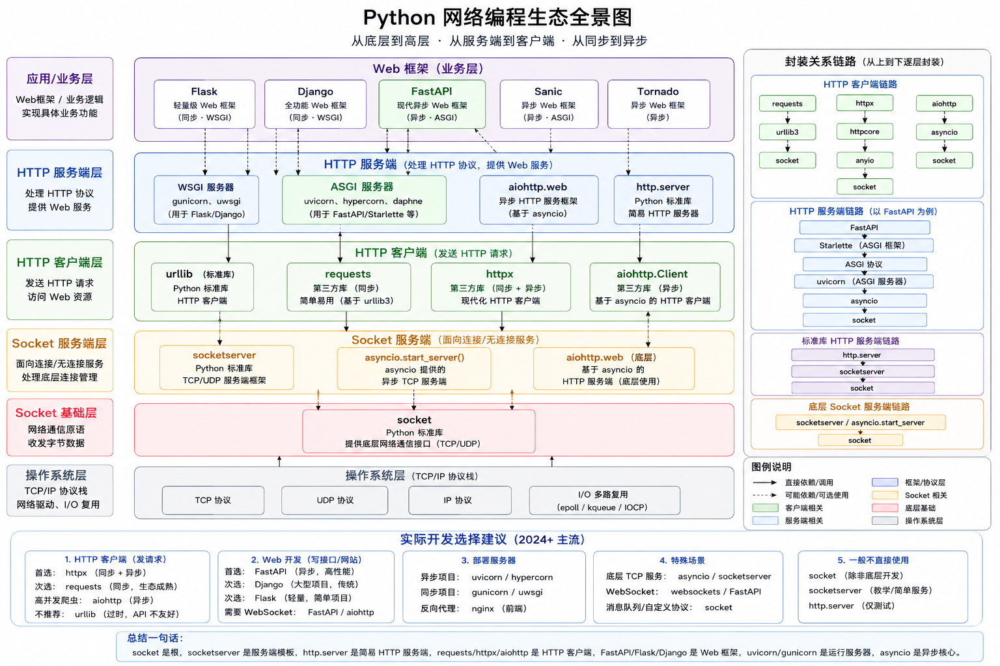

# Python 网络编程生态

socket、socketserver、http.server、urllib、requests、aiohttp、httpx、websockets、fastapi、uvicorn、asyncio

- socket、socketserver、urllib、http.server: 这些更多是：教学、底层框架开发、特殊协议

## 一、先建立整个世界观（最重要）

网络编程，本质分四层

1. 业务框架层
2. HTTP协议层
3. Socket通信层
4. 操作系统 TCP/IP层

## 二、最终一张“江湖地图”

```bash
       【业务层】

   FastAPI / Flask / Django
           ↑
           │
   aiohttp.web / http.server
           ↑
           │
   requests / httpx / aiohttp
           ↑
           │
   asyncio / socketserver
           ↑
           │
   socket
           ↑
           │
   TCP/UDP
           ↑
           │
   Linux epoll
```

## Python\_网络编程生态全景图


