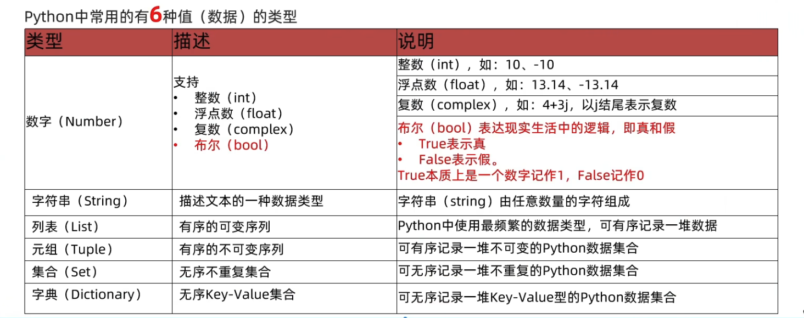

# python 基础

第三方库和工具，如 NumPy、Pandas、TensorFlow 和 PyTorch 等

## 编译与执行

- C/C++：源代码 → 编译器 → 机器码（直接由 CPU 执行）
- Java：源代码 → 编译器 → 字节码 → JVM →（JIT 编译为机器码或解释执行）
- Python (CPython)：源代码 → 编译器（Python 解释器） → 字节码 → Python 虚拟机 → 机器指令（纯解释执行，无 JIT）

  **注：** PyPy 是 Python 的另一种实现，带有 JIT（即时编译），会在运行时将热点字节码编译为机器码，提升性能。

## 字符串

1. () 可以换行

   ```python
    name=("hello"+"world"
     +"!")
   ```

2. m.n 拼接符串：

   - m: 总宽度 -- 小数点占一位，小于总宽度不生效；
   - n: 小数位数（四舍五入）；

   ```python
     print("身高%7.2dcm" % 175.2252) # --> 身高 175.23cm
   ```

3. f_format 字符串格式化

   ```python
     name = "张三"
     height = 175.22
     money = 1000.123456
     print(f"{name},身高{height}cm,工资{money:10.2f}") #--> 张三,身高175.22cm,工资   1000.12
   ```

4. t_format 字符串格式化

## 输入 与 输出

```python
   print("hello world")
   name = input("请输入你的名字：") # input 阻塞程序运行，等待用户输入；返回字符串
   print(f"hello {name}；type {type(name)}")
```

## 数据类型



1. None 是类型'NoneType’的字面量，用于表示: 空的、无意义的;

   - 函数中无返回值，返回 none。

### 循环

range(start, stop, step)
step：步长

### list 列表

列表的下标
[1，2，3，4，5]
正向下标：0 1 2 3 4；
反向下标：-5 -4 -3 -2 -1

1. 在 Python 中，如果将函数定义为 class(类)的成员，那么函数会称之为:方法

### tuple 元组

- 定义 1 个元素的元组
  t2 =('Hello',) 注意，必须带有逗号，否则不是元组类型;

  注意: 元组只有一个数据，这个数据后面要添加逗号；用来区分元组 与 运算等

  t = ((1,2),(3,4)) 元组嵌套元组
  t=(1,2,['a','b']) 元组嵌套列表,列表可以改变值；

### string 字符串

str = "hello world"
str2 = str.replace("l","L")
print(str) --> hello world # 字符串本身没改，
print(str2) --> heLLo worLd # 在原来的字符串的基础上，复制一份修改，返回新的；

str[0]="H" ❎：字符串不能改变值，会报错；

### 切片

序列：（有下标）列表、元组、字符串；

1. 列表切片：list[start:stop:step]
2. 元组切片：tuple[start:stop:step]
3. 字符串切片：str[start:stop:step]

### set 集合 -- 存储 "键"

不重复的元素，无序，无索引，无下标，无重复元素；

{1,2,3,"哈哈"，true}

- 空集合：my_set = set() 只能这么写，不能用 {}；

  原因：与字典共用"{}"符号，被字典占了；

### dict 字典 -- 存 “键值对”

- 键（key）：唯一、无序、无索引、无重复；

  1. 不可是数据容器（字符串除外）；一般为字符串、整数；

- 值 (value)：任意类型；

- 空字典：
  1. my_dict={}
  2. my_dict=dict()

### 通用

- len(容器)、max(容器)、min(容器)
- sorted(容器，reverse=True)：排序
- 相互转换：list(容器)、tuple(容器)、str(容器)、set(容器)

### 比较

- 字符串：转 ASCII 码比较；
- 汉字：转 UTF-8 或 GBK 码比较；
