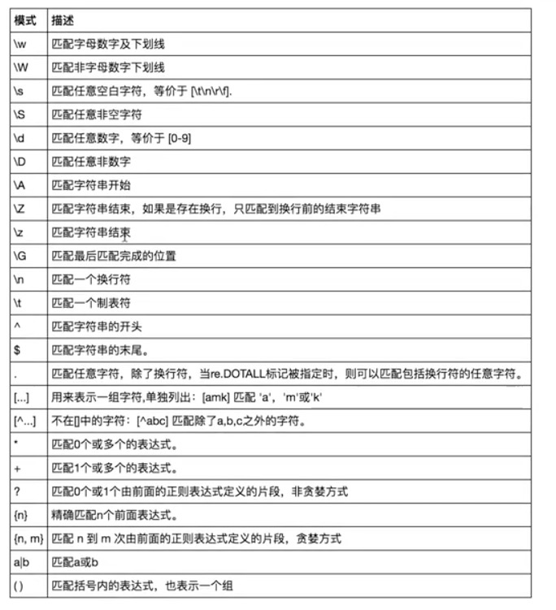
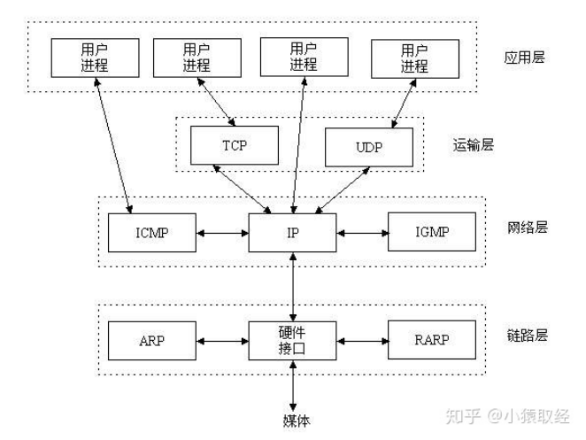
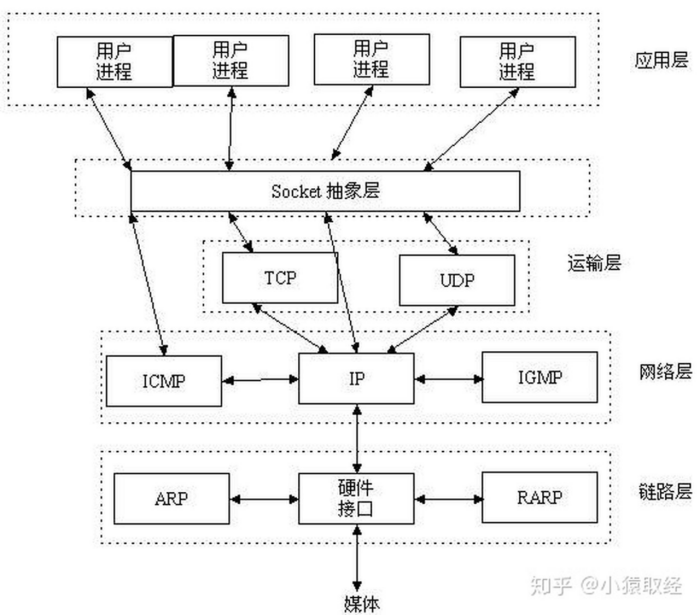
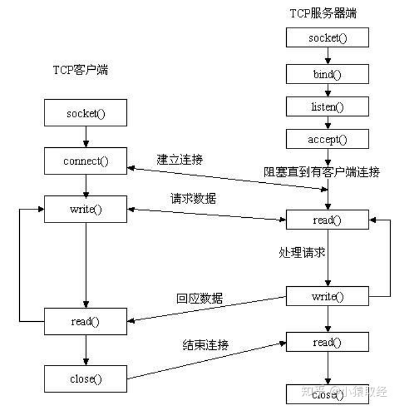
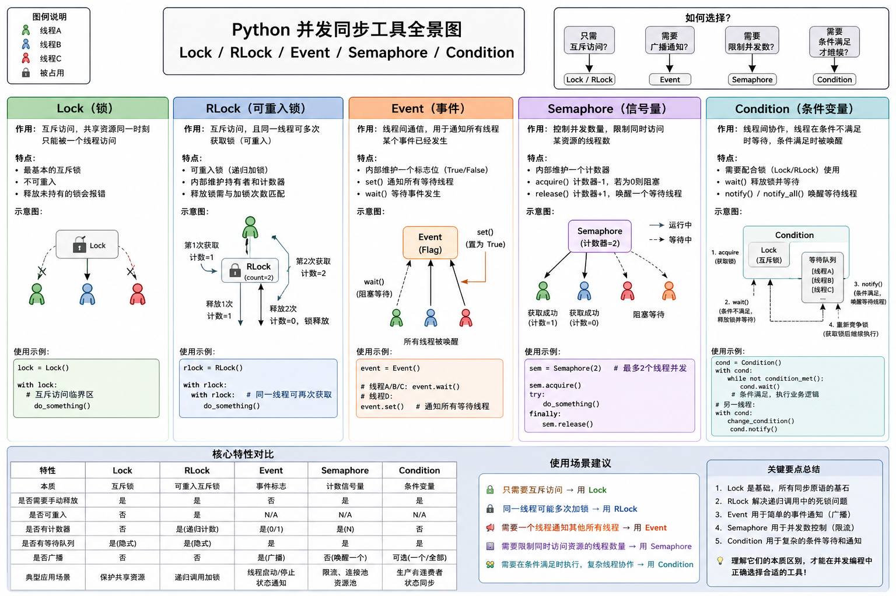

# python 高级 [原文地址](https://www.bilibili.com/video/BV1Sp4y1U7Jr)

🔥 先看 膜拜大神所得/计算机科学速成课/通用讲解.md

## 运行python3步骤

- 1、python解释器启动--解释器从硬盘读到内存（相当于启动文本编辑器）；
- 2、python解释器把a.py的内容当做普通的文本内容由硬盘读入内存(本质是解释器向操作系统发起系统调用，让操作系统控制硬件完成读取)
- 3、解释器解释执行刚刚读入内存的python代码，开始识别python语法

## 编译型or解释型、强类型or弱类型、静态型or动态型

- 强类型or弱类型
  1. 强类型：数据类型不可以被忽略的语言，即变量的数据类型一旦被定义，那就不会再改变，除非进行强转。
  2. 弱类型：数据类型可以被忽略的语言，数据类型可以被忽略，数据类型由数据内容决定。（例：linux中的shell语言）

- 静态型or动态型
  1. 静态型：在定义阶段指定数据类型，在运行时传其他类型报错；需要事先给变量进行数据类型定义
  2. 动态型：在定义阶段只定义变量，不定义类型；在运行时（即在变量赋值时），才确定变量的数据类型；

## 垃圾回收机制：回收“没有任何变量名的“值

## 变量

```python
    x=10
    y=x
    z=x
  # 给10绑定3个变量名
    del x # 解除变量名x与值10的绑定关系
    del y # 解除变量名y与值10的绑定关系
  # 此时 z=10
    z=123
  # 此时 z=123, 值10没有绑定关系了, 会被回收
```

- “变量值” 的三大特性：
  1. id：反应的是变量在内存中的唯一编号，内存地址不同id肯定不同（不是内存地址，是根据内存地址计算的编号）
  2. type：变量值的类型
  3. value：变量值

  ```python
     x='Info Tony:18'
     print(id(x), type(x), x) # ==> 4376607152,<class 'str'>,'Info Tony:18'
  ```

- is 与 ==
  `x="3.1415926"`
  `y="3.1415926"`
  1. is: 比较左右两个值“身份id”是否相等;
  2. ==: 比较左右两个值“他们的值”是否相等;
     **注：** 值相等，id可能不同，即两块不同的内存空间里可以存相同的值

- Python 中比较相等
  1. is: 判断身份
  2. ==: 判断值

- java 中比较
  1. equals: 判断值
  2. ==: 判断引用

## 常量（约定）

在Python中没有一个专门的语法定义常量，约定俗成是用全部大写的变量名表示常量。

## 运算符

1. 逻辑运算符：not、and、or；优先级：not > and > or
2. 成员运算符：in、not in;
3. 身份运算符：is, is not；

- 0、None、空（空字符串、空列表、空字典）==》代表的布尔值为False，其余为True;
- 短路运算：偷懒原则，偷懒到哪个位置，就把当前位置的值返回；【用在条件判断】
  `if 10>3 and 10 and None and 10 or 10>3 and 1===1`

## 解压赋值

- `x,y,z,*_ = arr=[11,22,33,44,55,66]`

  `_`: 占位符（变量名），永远不会被用

- `x,y,z =dic={'a':1,'b':2,'c':3}`
  print(x,y,z) ==> a,b,z 解压出来的是key

## 可变类型 与 不可变类型

- 可变类型：值变了，id不变，证明改的是原值，证明原值是可以被改变的；
  list、dict
- 不可变类型：值变了，id也变了，证明是产生新的值，原值没有改变，证明原值是不可被修改的；
  bool、int、float、str

## 浅copy与深copy

列表变量名（存列表内存地址）-->列表（存各个元素的内存地址）-->各个元素（值）或子列表的内存地址（继续递归）

✅ 浅拷贝：复制最外层容器，新容器中的元素仍指向原对象;  
✅ 深拷贝：递归创建所有子对象，完全独立；

- 默认都是浅copy (包括：切片)

## 可迭代对象

列表、字典、字符串、元组、集合、range

for 循环：在循环取值（遍历取值）比while 循环更简洁；

类型转换：凡是能被for循环遍历的类型都可以当作参数传给list()转成列表；

## 数据类型

- age=10 --> age=int(10) ：涉及申请内存空间
- str字符串：通过下标“仅可读（不可写）”;
- list数组：通过下标“可读可写”；用超出长度的下标操作-->报错；
  1. l=[1,2.2,'a'] --> l=list([1,2.2,'a']);
  2. js 的数组：可读可写；

- 元组：最外层的内存地址不能动，里面的子对象可以修改（类似js的const指针不能改）；
- 集合：集合内元素必须是不可变类型；
  1. s={1,2} --> s=set({1,2});
  2. 空集合: s=set()
  3. print(set('hello world')) ==>{'h','e','l','o','w','r',d'}
  4. 2个集合关系运算：交集&、并集|、差集-、对称差集^、子集<、超集>

## 字符编码

- 一、 字符编码基础
  1. 数学基础：`2**7=128；2**8=256；2**9=512`
  2. ASCII 码表：
     - 涵盖范围 0-127，是世界上首个字符编码表。
     - 实际只需要 7 位（Bit）二进制即可表示完整，但计算机中通常分配 1 个字节（8位）来存储，多出的 1 位（最高位）主要用于后续扩展或奇偶校验。
     - “向下兼容性”：后续所有主流的字符编码表（如 GBK、UTF-8 等）都完全兼容 ASCII 码（即全面支持英文和基础符号）。

- 二、输入字符到显示的完整流程（标准版）
  1. 键盘输入阶段：你按键盘 其实是：“s h a n g” 这些字符属于 ASCII，所以键盘发送的是：ASCII 码（字母）；
  2. 输入法阶段（字符生成）：输入法（如 Microsoft Pinyin）负责：“ASCII 拼音 → 中文字符”（例：shang → 上）；
     - 这里发生的是：字符层面的转换；
     - ❗此时还没有存储，只是生成了一个字符。

  3. 字符在计算机中的统一表示（Unicode）：计算机内部必须统一表示所有字符，于是使用：👉 Unicode 字符集；
     - Unicode 的作用：“字符 → 编号（码点）”（例：上 → U+4E0A）；
     - Unicode 只是一个 “抽象编号体系”，并不决定如何存储。

  4. 编码阶段（真正进入内存）：为了把 Unicode 存入内存，必须使用编码方式，例：UTF-8、UTF-16、UTF-32
     - 上（U+4E0A）→ UTF-8 → E4 B8 8A（二进制）
     - 字符 → Unicode → UTF-8 → 写入内存
     - ❗内存本身没有编码；编码是程序解释这些 0 和 1 的方式。
     - ❗编码属于程序，不属于内存

  5. 程序处理阶段：软件（如文本编辑器）在内存中处理数据：复制、粘贴、搜索、计算；这些操作通常基于 Unicode 逻辑。
  6. 显示到屏幕：内存 UTF-8 → 解码 → Unicode → 字形 → 显示；
     - 解码：软件根据编码（如 UTF-8）把二进制转换为 Unicode。
     - 字体查找：字体（如 Microsoft YaHei）负责：“Unicode → 字形（Glyph）”
     - 渲染：操作系统将字形绘制到屏幕

  7. 保存到文件（硬盘）：当你按“Ctrl + S”，软件会“Unicode → 指定编码 → 写入文件”（例：UTF-8、UTF-8、UTF-16）
     - ❗如果保存编码不同，可能产生乱码（存储时，必须使用指定的编码，否则，数据会乱码）。

  8. 文件读取：当再次打开文件“文件 → 按指定编码读取 → Unicode → 内存”
     - ❗如果编码选择错误：乱码

  ❗乱码的本质：乱码只有一个原因：👉 编码和解码不一致
  ❗字符集不支持：例：保存日文、韩文选择GBK格式，会出现 直接报错、占位符替换 等数据丢失情况；

- 👉 输入到显示的核心链路： 键盘 → ASCII → 输入法（字符） → Unicode → 编码（UTF-8） → 内存 → 解码 → Unicode → 字体 → 屏幕
- 文件流程：
  1. 保存：内存中的 Unicode 字符 → 编码（UTF-8 / GBK 等） → 生成二进制字节 → 写入硬盘文件
  2. 读取：从硬盘读取字节流 → 加载到内存 → 解码（UTF-8 / GBK 等） → 得到 Unicode 字符

- Python 解释器读取文件：
  1. 启动 Python 解释器【类似：文本编辑器】；
     - 加载 Python 程序 → 内存 → 开始执行；
  2. Python 打开 .py 文件（字节模式）【类似：加载文件】；
     - Python 首先做的事情是：以“二进制模式”读取文件，👉 此时 Python 不知道文件是什么编码。它只拿到：一串字节（bytes）例：E4 B8 8A；
  3. 检测编码声明（关键）：
     - Python 会检查文件前两行，寻找：` # coding: xxx # -*- coding: xxx -*-`
     - 👉 这一步是在“字节层”完成的。
     - 👉 Python 还没有真正解析代码。
     - 原因：Python 必须先知道编码，才能正确解码。
     - 为什么只扫描前两行？因为历史原因（兼容 Python2）：编码声明通常在第一或第二行。

  4. 确定编码:
  5. 解码源码为 Unicode: 字节 → 解码 → Unicode
  6. 词法分析（Lexical Analysis）: 例：print('上')会被分解为print、(、'上'、)
  7. 语法分析（Parsing）:生成 AST（抽象语法树）
  8. 编译为字节码: 例：字节码为`LOAD_CONST CALL_FUNCTION`
  9. 执行：Python 虚拟机执行字节码

  👉 Python 解释器先以字节读取源码，检测编码声明后再解码为 Unicode，然后进行词法和语法分析，最终编译为字节码执行。

```python
# coding=utf-8  #既是注释，又是指令；是告诉解释器，这个文件使用utf-8编码 (不用默认编码)
print('上')
```

## 文件

文件：是“操作系统”提供给“用户程序”访问硬盘的抽象接口（虚拟概念）
文件对象：又称文件句柄；

应用程序 → 操作系统 → 文件系统 → 硬盘

###

- 控制内容模式：
  1. t:文本模式（默认）:
     - 读写都是以“字符串（unicode）”为单位；
     - 只针对文本文件
     - 必须指定字符编码（即必须指定encoding参数）

  2. b:二进制模式
     - 读写都是以“字节（bytes）”为单位；
     - 可以针对所有文件
     - 一定不能指定字符编码（即不能指定encoding参数）

- 读写模式：
  1. r:只读
  2. w:只写（清空）
  3. a:只追加
  4. +:可读写；r+、w+、a+ （受r、w、a约束）
     - r+: 指针在开头，覆盖替换；
     - w+: 清空，再写；指针在末尾；
     - a+: 追加，指针在末尾
  5. x:只写模式,不可读；不存在则创建，存在则报错（了解）

### x=10 与open()

- x=10 占应用程序资源：
  1. x 是变量名，属于程序运行环境（如栈帧 / 作用域）
  2. 10 是对象，存在堆中
- open() 同时占用：
  1. Python 内存资源
  2. 操作系统文件资源（fd）

```python

  # r模式
  f=open('test.txt', mode='rt', encoding='utf-8') # 指针在开头；f 叫文件对象，又称文件句柄；
  res =f.read(4) # 4是字符，不是字节
  res = f.read() # 一次读完所有，有可能撑爆内存❗；指针在末尾 ；
  # read（只是单纯的将硬盘的二进制读到内存中，不做字符转换，转换是python做的）
  res = f.read() # 没关闭，从指针位置开始读，指针在末尾，读不到内容；
  res = f.readline() # 一次读一行，指针在末尾
  res = f.readlines() # 一次读所有行，指针在末尾❗
  for line in f: # 每次读一行，防止内存撑爆，防止电脑卡顿
    print(line)

  f.close() # 释放操作系统资源（不写，操作系统会检测：1、在进程结束时回收，2、可能长时间不用后回收；导致：1、文件描述符耗尽，2、数据未写入磁盘，3、文件锁不释放）
  f.read() # 已经close()了，再读会报错；
  del f # 释放程序资源(可以不写)

  # w 模式
  with open('file.txt', 'wt', encoding='utf-8') as f: # 先清空文件内容，指针停留在开头
     f.write('hello world') # 写入, 指针停在末尾
     f.write('hello world') # 追加, 从指针位置开始写; 没有立马写到硬盘中，攒一波再写或者关闭了再写
     f.writelines(['hello world', 'hello world'])
     f.flush() # 刷新缓冲区（立马存到硬盘中）
     f.close() # 释放操作系统资源（存硬盘中）

  # a 模式
  with open('file.txt', 'at', encoding='utf-8') as f: # 追加, 指针停留在末尾
     # f.read() # 报错
     f.write('hello world')
     f.write('hello world')

  # b 内容模式
  with open('file.txt', 'ab') as f:
    res = f.read() # utf-8的二进制
    print(type(res),res) # <class 'bytes'> ，b'\xe5\x93...' 【python解释器--默认给转化为十六进制了】

    print(res.decode('utf-8'))

  with open('file.txt', 'wb') as f:
    f.write('你好'.encode('utf-8'))
    f.writelines(['你好'.encode('utf-8'), '你好'.encode('utf-8')]) # 其他语言转码，
    # '你好'.encode('utf-8') === bytes('你好', encoding='utf-8')
    f.writelines([b'hallo world',b'hello world']) # 英文直接加b就可以

  with open('test.jpg', 'rb') as f:
    while True:
      res = f.read(1024) # 1024是字节，不是字符
      if len(res) == 0: # 读完
        break

      print(res)

  with open('aa.txt', 'rb','utf-8') as f: # 不常用
    # f.seek(n,模式)：
    f.seek(9,0) # 0 参照物是 文件开头位置；9 表示移动的字节数
    f.seek(9,1) # 1 参照物是 当前指针的位置；9 表示移动的字节数
    f.seek(-9,2) # 2 参照物是 文件末尾位置；-9 表示向前移动的字节数
    print(f.tel()) # 返回当前指针位置
```

- mode: 读写模式,内容模式；
- encoding: 文件解码格式

- close() 的核心作用：
  1. 释放 OS 资源
  2. 刷新缓冲区
  3. 防止资源泄露

### with

申请资源 → 使用 → 必须释放；

- with: 自动管理资源（自动调用清理代码）； with 的本质就是：确保操作系统资源一定被回收
- 核心作用：
  1. 自动释放资源
  2. 自动处理异常
  3. 防止资源泄露
  4. 让代码更安全

## 命名空间（名称空间 namespaces ）与 作用域（scope）

- 🔥 命名空间：是“变量存在哪里”
  1. 本质是 dict
  2. 存储变量

- 🔥 作用域：是“变量在哪里可以访问”
  1. 访问规则
  2. LEGB 查找链

`import ujson as json`: 命名空间没变（还是ujson），只是起了个别名，查找时还是找ujson;
后续其他文件 用json还需要`import json`【涉及名称空间、模块缓存】

### 命名空间: 是名字到对象的映射。 本质就是：👉 一个 dict（字典）

Python 本质：
🔥 一切变量都存储在命名空间（dict）中；
🔥 命名空间之间形成查找链（LEGB）；
而不是：❌ 栈变量模型。

- 完整对比表（核心）

  | 命名空间 | 何时创建   | 存什么             |
  | -------- | ---------- | ------------------ |
  | 全局     | 模块加载   | 模块变量、函数、类 |
  | 局部     | 函数调用   | 参数、局部变量     |
  | 类       | 类定义     | 类属性、方法       |
  | 内建     | 解释器启动 | print、int 等      |

- 在 Python 中：
  1. 全局命名空间 → globals()
  2. 局部命名空间 → locals()
  3. 类命名空间
  4. 内建命名空间 → `__builtins__` 或`import builtins`模块； 本质上：👉 一个 dict（或者模块包装的 dict）。

  ```python
  x = 100

  class A:
      y = 200

      def f(self):
          z = 300
          print(locals())
  ```

  结构：

  ```code
   builtins
     ↓
   global: x, A
     ↓
   class: y, f
     ↓
   local: z
  ```

- 1️⃣ 局部命名空间（Local）-- 特点：
  1. 每次调用时创建新的
  2. 调用结束销毁
  3. 存储函数参数和局部变量

- 2️⃣ 全局命名空间（Global）：👉 Python 模块加载时创建。
- 3️⃣ 类命名空间（Class）：👉 类定义时创建。
- 4️⃣ 内建命名空间是如何创建的？

  Python 启动时：
  1. 初始化解释器
  2. 加载核心 C 实现
  3. 创建 built-in 模块
  4. 填充基础对象
  5. 注入到每个模块

  👉 所以每个 Python 文件：`globals()["__builtins__"]`都会自动存在。
  - 内建命名空间包含 5 大类
    1. 内建函数
    2. 内建类型
    3. 内建异常
    4. 内建常量
    5. 语言底层工具

    本质：一个 Python 解释器初始化时创建的 dict；是变量查找的最后一层。

- 栈里放的是：C 语言层的“函数调用栈帧”（frame）

- 每次执行函数：创建一个 frame object，frame 里面有：
  1. f_locals → 指向局部命名空间 dict
  2. f_globals → 指向全局命名空间 dict
  3. f_builtins → 指向内建命名空间 dict

  ⚠️ 注意：frame 对象本身也在堆上。

- 真正的“栈”只是：
  1. C 语言调用栈
  2. 存放指针、返回地址等

- 在 Python 中：
  1. 变量名存在命名空间 dict 中
  2. 命名空间 dict 在堆
  3. 对象在堆
  4. frame 在堆
  5. 栈只是解释器运行机制

- `x=10`发生：

  ```code
  堆：
      10 (int对象)
      globals dict  { "x": 地址 }

  栈：
      当前frame指针
      frame里持有对 globals dict 的引用
  ```

  关系：

  ```code
    frame
      ↓
    f_globals  →  dict对象 (堆)
                       ↓
                    "x" → int对象(堆)
  ```

- 函数局部变量

  ```python
    def f():
      a = 100
  ```

  执行时：

  ```code
  堆：
    100 (int对象)
    locals dict { "a": 地址 }
    frame对象

  栈：
      C函数调用栈帧
  ```

### 作用域: 👉 代码中访问变量的区域。也就是说：哪些命名空间对当前代码可见

- 当 Python 解析代码时，查找变量顺序是(LEGB-链 规则) 或者说 Python 的作用域规则（LEGB）：
  1. Local（局部）
  2. Enclosing（闭包）
  3. Global（全局）
  4. Built-in（内建）

  👉 内建命名空间是最后的兜底查找层。

- 🔥
  1. Python 是静态作用域（Lexical scope）：在函数定义时就确定。
  2. 作用域不是运行时动态变化
  3. 局部变量优先
  4. Python 没有块级作用域

### global 与 nonlocal

- global: 让变量来自全局

  ```python
    x = 10
    y = 30
    l = [11,22]
    def f():
        global x # 主要用在：不可变类型
        x = 20  # 全局的x
        y = 35  # 新造了y, 和全局的没关系
        l.append(33) # 改变全局的l
  ```

- nonlocal: 用于闭包

  ```python
  def outer():
      x = 10
      l = []
      def inner():
          nonlocal x # 主要用在：不可变类型
          x = 20  # x -> 为outer内的x

          l.append(33) # l --> 为outer内的l
  ```

## 函数

- 定义函数时：

1. 申请内存空间保存函数体代码
2. 将上述内存地址绑定到函数名
3. 定义函数不会执行函数体代码，但会检测函数体语法

- 调用阶段:

1. 通过函数名找到函数内存地址
2. 然后加括号就是在 触发函数体代码的执行，❗产生名称空间（命名空间）

- 形参与实参：

1. 在调用阶段，实参会绑定给形参
2. 这种绑定关系只能在函数体内使用
3. 实参与形参的绑定关系在函数调用时生效，函数调用结束后解除绑定关系；
4. 默认参数的值是在定义阶段被赋值的，❗赋予的是内存地址；

`*`可以用在实参中，实参中带`*`,`*`后面的值会被打散成位置参数；

```python
def func(x,y,x):
print(x,y,z)

func(*[1,2,3]) # 1,2,3
func(*{'x':1,'y':2,'z':3}) # func('x','y','z')
func(**{'x':1,'y':2,'z':3}) # func(x=1,y=2,z=3)

# ==================================================
def index(x,y,z):
print(x,y,z)

def wrapper(*args, **kwargs): #形参 #arg=(1,) kwargs={'y':2,'z':3}
index(*args, **kwargs) # 实参
# index(*(1,),**{'y':2,'z':3})
# index(1,z=3,y=2)

wrapper(1,z=3,y=2)
```

- 命名关键字参数（了解）

  ```python
  def func(x,y,*,a,b): #其中，a和b是命名关键字参数，y和z是位置参数
    print(x,y,a,b)

  func(1,2,b=4,a=3)
  ```

### 👉 Python 在编译函数时就确定变量作用域，而不是运行时

```python
def func():
    print(x) # 无法访问未赋值的局部变量'x'
    x=2

x=111
func()

# ===== 上面报错、下面不报错 ====================
def func(): # 第一步：定义函数：Python 只是创建函数对象，不执行函数体。
    print(x)

x=111 # 第二步：执行： 👉 全局命名空间已经有：x → 111
func() # 第三步：调用函数
```

- 编译阶段：Python 在函数定义时（编译阶段）扫描函数体：发现`x = 2`，于是 Python 认为：👉 x 是局部变量。
- 执行阶段：但执行时：执行到：`print(x)`局部变量 x 还没有赋值。所以报错：UnboundLocalError

⚠️ 注意：不是找不到变量; 是找到局部变量，但还没赋值。
👉 全局变量在函数执行前已经赋值了，而局部变量是在函数执行过程中才赋值。

### 和 JavaScript 的 var/let 作用域机制对比

#### JavaScript 的 var 机制

```js
function f() {
  console.log(x); // 输出 undefined
  var x = 2;
}
f();
```

🔥 JS 的 var 有“变量提升”

- JS 在函数执行前，会：
  1. 创建执行上下文
  2. 扫描 var 声明
  3. 把变量加入作用域
  4. 初始值设为 undefined

等价于：

```js
function f() {
  var x; // 提升
  console.log(x);
  x = 2;
}
```

所以：👉 访问时已经存在; 只是值是 undefined

#### JavaScript 的 let 机制

```js
function f() {
  console.log(x); // 报错：ReferenceError
  let x = 2;
}
f();
```

因为：👉 let 存在 TDZ（暂时性死区）

- 执行流程：
  1. 变量已被创建
  2. 但在声明前不可访问
  3. 访问就报错

## 装饰器

装饰器：定义一个函数，该函数是用来为其他函数添加额外的功能

在“不修改原函数及调用方式”的情况下，给它添加新功能；

- 开放封闭原则：
  1. 开放：指对扩展功能是开放的
  2. 封闭：指对修改源代码是封闭的

```python
import time
from functools import wraps # 将原函数的属性赋值给wrapper函数

def index(x,y,z):
  time.sleep(3)
  print(x,y,z)

def home(x):
  time.sleep(3)
  print(x)

def outter(func):
  # func:被装饰对象的内存地址
  @wraps(func) # 将原函数的属性赋值给wrapper函数
  def wrapper(*args, **kwargs):
    start = time.time()
    res = func(*args, **kwargs)
    stop = time.time()
    print(f'耗时：{stop-start}')
    return res

  # wrapper.__name__ = func.__name__
  # wrapper.__doc__ = func.__doc__
  # ...
  return wrapper

home = outter(home) # 偷梁换柱: 变量home: 指向wrapper函数的内存地址
res = home("hello")
print("返回值",res) # hello

# == 语法糖 ================================================
# 由于语法糖限制：outter函数只能有一个参数（只用来接受被装饰对象的内存地址）；
@outter  # index = outter(index)
def index(x,y,z):
  time.sleep(3)
  print(x,y,z)
  return "返回值-index"

res = index(1,2,3)
print("返回值",res)
# == 语法糖解析、装饰器函数属性 ===============================================
@print('hello')  # ==> None=print('hello')(index) ==> index=None(index)
def index(x,y,z):
  """ 函数文档 """
  pass

# index.__name__ = 原函数.__name__
# index.__doc__ = 原函数.__doc__
# ...

print(index.__name__)
print(index.__doc__)
print(help(index))
# ==有参数装饰器================================
def auth(type):
  def deco(func):
    @wraps(func)
    def wrapper(*args, **kwargs):
      if type == 'admin':
        print("管理员权限")
        return func(*args, **kwargs)
      else type == 'user':
        print("普通用户权限")
        return func(*args, **kwargs)
    return wrapper
  return deco

  @auth('admin') # deco=@auth('admin') ==> index=deco(index) ==》index=wrapper
  def index(x,y,z):
    print(x,y,z)
    return "返回值-index"

```

- 多个装饰器
  1. 查找阶段：由近及远
  2. 执行阶段：从远端开始，U型（或者洋葱模型）

```python
  # deco1
  def deco1(func1): # func1 =wrapper2的内存地址
    def wrapper1(*args, **kwargs):
      print("正在运行==》deco1.wrapper1 ")
      res1 = func1(*args, **kwargs)
      return res1
    return wrapper1

  # deco2
  def deco2(func2): #func2 =wrapper3的内存地址
    def wrapper2(*args, **kwargs):
      print("正在运行==》deco2.wrapper2 ")
      res2 = func2(*args, **kwargs)
      return res2
    return wrapper2

  # deco3
  def deco3(x):
    def outter3(func3): ##func3 =被装饰对象index函数的内存地址
      def wrapper3(*args, **kwargs):
        print("正在运行==》deco3.wrapper3 ")
        res3 = func3(*args, **kwargs)
        return res3
      return wrapper3
    return outter3

  # 加载顺序: 由近到远
  @deco1 #index=deco1(wrapper2的内存地址)  ==>index=wrapper1的内存地址
  @deco2 #index=deco2(wrapper3的内存地址)  ==>index=wrapper2的内存地址
  @deco3(111) # ==》@outter3 ==> index=outter3(index) ==>index=wrapper3的内存地址
  def index(x):
    print("正在运行==》test ")

  # 执行顺序: 从远端开始，U型（或者洋葱模型）
```

## 迭代器 与 生成器

### 迭代器

迭代器：是迭代取值的工具，迭代是一个重复的过程，每次重复都是基于上一次的结果而继续的（单纯的重复不是迭代）；

```python
  d={"a":1,"b":2}
  d_iter = d.__iter__()

  print(d_iter.__next__()) #==> 'a'
  print(d_iter.__next__()) #==> 'b'
  print(d_iter.__next__()) # 抛出异常
```

- 迭代器对象：不依赖索引取值
- 可迭代对象（可以转换成迭代器的对象）：内置有`__iter__`方法的的对象;
  1. `可迭代对象.__iter__()`: 得到迭代器对象

- 迭代器对象： 内置有`__next__`方法和`__iter__`方法的对象；
  1. `迭代器对象.__next__()`: 返回迭代器的下一个值
  2. `迭代器对象.__iter__()`: 返回迭代器对象本身（调了跟没调一样）

  ```python
    dic={"a":1,"b":2}
    dic_iterator = dic.__iter__()
    print(dic_iterator is dic_iterator.__iter__().__iter__().__iter__()) # ==> True
  ```

  python为什么给迭代器对象内置`__iter__`方法: 为了让for循环的工作原理统一起来；

- ❗for 循环工作原理：

  ```python
  for k in 可迭代对象: # ==> 可迭代对象.__iter__() ==> 迭代器对象 ==> next(迭代器对象)
    print(k)
  ```

  1. `d.__iter__()`得到一个迭代器对象；
  2. `迭代器对象.__next__()`拿到一个返回值，然后将该值赋值给K；
  3. 循环往复步骤2，直到抛出StopIteration异常,for循环会捕捉异常然后结束循环；

### 生成器: 自定义的迭代器

在函数内一旦存在yield关键字，调用函数并不会执行函数体代码，会返回一个生成器对象，生成器即自定义的迭代器

`x = yield 返回值`

```python
  def func():
    print("hello")
    yield 1
    print("world")
    yield 2
    print("python")
    yield 3
    print("end")

  g=func()
  # print(func) # <function func at 0x7f7c7c0c0c50>
  # 生成迭代器
  # print(g) # <generator object func at 0x7f7c7c0c0c50>
  # print(g.__iter__()) # <generator object func at 0x7f7c7c0c0c50>

  # len('aaa')  # 'aaa'.__len__()
  # next(g) # g.__next__()
  res1= g.__next__() # hello
  print(res1) # 1
  res2= g.__next__() # world
  print(res2) # 2
  res3= g.__next__() # python
  print(res3) # 3
  res4= g.__next__() # end
  print(res4) # 报错：StopIteration
```

```python
def dog(name):
  print(f'{name}  is coming')
  while True:
    x= yield # x 拿到的是 yield 接收到的值
    print(f'{name}  is eating {x}')

g= dog('wangcai')
g.send(None) # 等同于next(g)

g.send('bone')
g.send('fish')
g.send('meat')
g.close()
g.send('egg') # 报错：StopIteration
```

## 三元表达式 与 生成式(列表、字典、集合、生成器)

- 语法格式：条件成立时的值 if 条件 else 条件不成立时的值
- 列表生成式：arr=[表达式 for item in 可迭代对象 if 条件]
  `arr = [name for name in names if name[0] == 'w']`

- 字典生成式
  `items = [('name', 'wc'), ('age', 18), ('sex', 'male')];
`dicts = {key: value for key, value in items if key != 'sex'}`

- 集合生成式
  `keys = {name for name in names if name[0] == 'w'}`

- 生成器表达式：
  `gen = (i for i in range(10) if i % 2 == 0)`

## 递归 (python 没有尾递归)

```python
  import sys;
  sys.getrecursionlimit() # ==> 1000 获取递归深度
  sys.setrecursionlimit(2000) # 设置递归深度
```

- 递归的2个阶段：递推、回归

回溯：指的是一种通过“试错”来寻找解的方法；

## 面向过程思想

过程是“流水线”，用“分步骤”来解决问题；

- 面相过程思想：
  - 优点：复杂问题流程化，进而简单化
  - 缺点：扩展性非常差

爬虫（Scrapy框架）：1、目标站点发请求，拿数据；3、数据清洗；4、存数据库
数据分析：

- 匿名函数：fn=lambda 参数：函数体
  `res = max(obj,key=lambda k:obj[k])`
  `res = map(lambda x:x**2,range(10));res.__iter__();`
  `res = filter(lambda x:x%2==0,range(10));res.__iter__();`
  `res = reduce(lambda x,y:x+y,range(10),0);res.__iter__();`

## 模块： 一些列功能的集合体

- 三者区别
  1. 内置模块：python解释提供好的，C、C++语言便编写的；
  2. 第三方模块：
  3. 自定义模块：python、C、C++写的

  | 类型       | 来源       | 是否需要安装 | 示例               |
  | ---------- | ---------- | ------------ | ------------------ |
  | 标准库模块 | Python自带 | ❌ 不需要    | `os`, `sys`        |
  | 第三方模块 | pip安装    | ✅ 需要      | `requests`,`numpy` |
  | 自定义模块 | 自己写     | ❌ 不需要    | `my_module`        |

- 首次导入 与 之后的导入
  - “首次导入”模块会发生什么？
    1. 执行foo.py 文件;
    2. 产生foo.py的命名空间，将foo.py运行过程产生的名称丢到foo.py的命名空间中；
    3. 当前文件中产生一个foo名字，该名字指向2中产生的命名空间；

  - 之后的导入，都是直接引用“首次导入”产生的命名空间（不会重复执行）；

- 起别名: `import foo as f` 把foo的内存地址给了f;

- `__name__`
  1. 当文件被运行时:`__name__`的值为`__main__`，
  2. 当文件被作为模块导入时：`__name__`的值为模块名；

```python
# ==foo.py===============================================
x=1
def get():
  print(x)

def change():
  globals x
  x=0

__all__ = ['x','get','change'] # 控制*代表的名字有哪些
# from foo import *
# ==run.py===============================================
from foo import x # 指向foo中1的内存地址
from foo import get #指向foo中get函数内存地址
from foo import change
# from foo import change as c
  # ------------------
  # print(x)
  # x=33
  # print(x)
# --------------------
get() # 获得foo的x
change() #改变foo的x
get() # 获得foo的x
print(x) # 指向当前x(1的内存地址)
# --------------------
from foo import x # 重新导入foo的x值为0
print(x) # 0
```

- python模块加载机制
  1. 内存（内置模块、缓存）
  2. 硬盘（自定义的文件）

  ```python
  import sys
  print(sys.path) # 查看模块查找路径
  # 👉 环境变量是以执行文件为准的，“所有被导入的模块中” 或 “后续的其他文件中” 引用的sys.path都是参照执行文件的sys.path
  sys.path.append('/Usrs/xxx/foo') # 添加 文件查找路径
  import foo # 导入后能查到
  ```

- `sys.modules`:查看已经加载到内存中的模块
  `del 模块名`：解除模块绑定（理论上模块应该被垃圾回收，实际还在内存中；原因：优化机制，减少下次导入时申请内存）

### python模块加载机制 与 node 加载机制

- Python: 模块是一个对象，被 import 系统动态加载。
- Node CommonJS: 模块是一个函数执行环境，通过 require 运行。
- Node ESM: 模块是一个静态依赖图，在执行前完成链接。

#### python模块加载机制

Python 的模块加载由 import system 控制，核心模块是：

- importlib、
- sys.modules、
- sys.meta_path、
- sys.path

1. 第一步：检查缓存：`sys.modules`这是一个 全局模块缓存字典
2. 第二步：查找模块：搜索顺序：sys.meta_path -> PathFinder -> sys.path
   - sys.path: [ 当前脚本目录、PYTHONPATH、标准库目录、site-packages ]
   - 按顺序寻找：

   ```python
     foo.py
     foo/__init__.py
     foo.so
     foo.pyd
   ```

3. 第三步：创建 Module 对象，放入缓存中（⚠️先缓存、在执行 - 这是为了解决：循环引用）
   `module = ModuleType("foo"); sys.modules["foo"] = module`
4. 第四步：执行模块代码：模块变量全部进入：`module.__dict__`
5. 第五步：绑定到当前命名空间：`foo -> module object`

⚠️ 1、模块只执行一次：  
⚠️ 2、循环引用问题：因为：module 先进入 sys.modules所以不会死循环，`但变量可能未初始化`。  
⚠️ 3、Python 模块是对象：模块本质是：ModuleType object

#### Node.js 模块加载机制--1--CommonJS（传统）

1. 第一步：检查缓存：`require.cache`
2. 第二步：路径解析：
   Node 按顺序查找：

   ```js
   ./foo
   ./foo.js
   ./foo.json
   ./foo.node
   // ========================
   当前目录/node_modules
   父目录/node_modules
   根目录/node_modules
   ```

3. 第三步：创建 Module 对象,并加入缓存`require.cache`;

   ```js
   Module {
     id
     filename
     exports
     loaded
   }
   ```

4. 第四步：代码包装；Node 不会直接执行 JS 文件，会先包一层函数：

   ```js foo.js
   (function (exports, require, module, __filename, __dirname) {
     // foo.js 内容
   });
   ```

5. 第五步：执行模块:
   执行 wrapper function，最终返回：`module.exports`

#### Node.js 模块加载机制--2--ES Module（现代）

- Node 的 ESM 实现遵循：ECMAScript Module Spec
- 加载流程：解析 → 链接 → 执行
- ESM 关键特点: 静态分析: 在 编译阶段就解析:所以：import 不能写在 if 里
- live binding: `export let count = 0` 其他模块引用：实时更新(不是拷贝)。

#### Python vs Node 模块机制核心区别

| 对比     | Python               | Node CommonJS    | Node ESM     |
| -------- | -------------------- | ---------------- | ------------ |
| 加载方式 | import               | require()        | import       |
| 解析阶段 | 运行时               | 运行时           | 编译阶段     |
| 缓存     | sys.modules          | require.cache    | Module Map   |
| 模块本质 | Module object        | module.exports   | live binding |
| 执行次数 | 一次                 | 一次             | 一次         |
| 循环依赖 | 可运行但可能未初始化 | 容易 undefined   | 更安全       |
| 作用域   | module.**dict**      | wrapper function | module scope |
| 是否静态 | 否                   | 否               | 是           |

## 包（模块的一种）

包：一个包含`__init__.py`文件的文件夹；
包本质：是模块的模块的一种形式，用来当做模块导入；

```shell
day
|->main.py
└─>package
  |->moduleAA.py
  |->__init__.py
  └─>packageChild
       |->moduleBB.py
       └─>__init__.py
```

1.关于包相关的导入语句也分为import和from...import#两种，但是无论哪种，无论在什么位置，在导入时都必须遵循一个原则:# #凡是在导入时带点的，点的左边都必须是一个包，否则非法。
可以带有一连串的点，如import 顶级包.子包.子模块，但都必须遵循这个原则。

例如:#
#from a.b.c.d.e.f import xxx；。。。。。
#import a.b.c.d.e.f 其中a、b、c、d、e都必须是包
#2、包A和包B下有同名模块也不会冲突，如A.a与B.a来自俩个命名空间#
#3、import导入文件时，产生名称空间中的名字来源于文件，
#import 包，产生的名称空间的名字同样来源于文件，即包下的

- 绝对导入：以包的文件夹作为起始来进行导入；
  package文件夹下的`__init__.py`中添加`from package.module import func`

  确保执行文件与包在同一文件夹下 或者 sys.path.append('/Usrs/xxx/foo')；

  原因：👉 环境变量是以执行文件为准的，“所有被导入的模块中” 或 “后续的其他文件中” 引用的sys.path都是参照执行文件的sys.path
  `from a.b.c.d.e.f import func` : .左侧的必须是包，不能是其他；

- 相对导入：仅限于包内使用，不能跨出包(包内模块之间的导入，推荐使用相对导入)
  1. .:代表当前文件夹
  2. ..:代表上一层文件夹
     `from .module import func`

```python
print(__file__) # 当前文件的绝对路径
import os
print(os.path.dirname(os.path.dirname(__file__))) # 当前文件的父目录的父目录
BASE_DIR = os.path.dirname(os.path.dirname(__file__))
sys.path.append(BASE_DIR) #基准目录，添加到环境变量
from pathlib import Path
res = Path(__file__).parent.parent
res.resolve() # 获取绝对路径

```

## 常用模块

👉 标准库 = 官方自带的一大堆模块集合（我们常说的模块）
👉 模块 = Python 代码的基本组织单位（我们写的代码文件 -- .py）
👉 包 = 文件夹 + 多个模块

### 一、 时间、日期模块 -- time模块、datetime模块

- time模块
  1. 时间戳：用于计算时间间隔（从1970-01-01 00:00:00 开始到现在的秒数）
  2. 格式化字符串时间：用于展示时间（2026-03-11 21:46:00）
  3. 结构化的时间：用于单独获取时间的某一部分（本地时间）

  ```python
  import time
  # 时间戳:
  print(time.time()) # 1647020160.0
  # 按照格式显示的时间：
  print(time.strftime("%Y-%m-%d %H:%M:%S")) # 2026-03-11 21:46:00
  print(time.strftime("%Y-%m-%d %X")) # 2026-03-11 21:46:00
  # 结构化时间：
  tm = time.localtime() # (2026, 3, 11, 21, 46, 0, 0, 78, 0)
  print(tm.tm_year)
  # 1、format time <-->struct time <-->timestamp
  # 2、世界标准时间与本地时间
  # time.sleep(1) # 阻塞1秒
  ```

- datetime模块（类似js的moment.js、dayjs）

```python
import datetime
print(datetime.datetime.now()) # 2026-03-11 21:46:00.000000
print(datetime.datetime.utcnow()) # 世界标准时间

```

### 二、 随机数、数学运算模块 -- random、math模块

```python
import random

print(random.random()) # （0,1） 0<x<1 的小数
print(random.randint(1, 10)) # [1,10] 1-10的整数
print(random.randrange(1,3)) #[1,3) 1<=x<3 的整数
print(random.choice([1,2,3,4,5]))
print(random.shuffle([1,2,3,4,5]))
print(random.sample([1,2,3,4,5], 2))
print(random.uniform(1, 10)) # (1,10) 1<=x<10 的小数
##==验证码==========
ord('a') # 97
ord('z') # 122
chr(ord('a')) # a
s1= chr(random.randint(ord('a'), ord('z')))
s2 = str(random.randint(0,9))
random.choice([s1,s2])
```

### 三、 操作系统模块--1-- os模块【操作系统交互】

👉 os本质：Python 对 操作系统功能的封装
👉 os = 你可以“操作系统”的工具箱

```python
  import os
  os.name # 当前操作系统
   # ==========1️⃣ 文件 & 目录操作==================================
  os.getcwd()        # 当前工作目录
  os.listdir()       # 列出当前目录下的内容

  os.chdir("path")  # 切换目录
  os.mkdir("test") # 创建目录
  os.remove("a.txt") # 删除文件
  os.rename('a', 'b') # 重命名
  os.rmdir('a') # 删除目录
  os.chdir('a') # 切换目录
  os.chdir('..') # 返回上一级目录
  os.walk('a') # 遍历目录


  os.path.isdir('a') # 判断是否是目录
  os.path.isfile('a') # 判断是否是文件
  os.path.getsize('a') # 文件大小

  # ===========2️⃣ 路径处理（重点🔥）==================================
  os.path.abspath("a.txt")  # 绝对路径  与 print(__file__)
  os.path.join("a", "b")  # 拼路径（跨平台）
  # 👉 推荐：永远用 os.path.join，不要手写 /
  os.path.exists("a.txt")  # 判断文件是否存在
  os.path.isdir("dir")  # 是否目录

  os.path.isabs('a') # 判断是否是绝对路径
  os.path.realpath('a') # 真实路径
  os.path.split('a/b/c') # ('a/b', 'c')
  os.path.dirname('a/b/c') # a/b
  os.path.basename('a/b/c') # c

  # ==========3️⃣ 环境变量==================================
  os.environ["PATH"]      # 获取环境变量
  os.environ["JAVA_HOME"] = "/xxx"  # 设置环境变量
  os.environ # 环境变量-字典；
  os.environ['aaa'] ='111' # 环境变量 -- 用在全局变量中；


  # ==========4️⃣ 进程相关==================================
  os.getpid()   # 当前进程ID
  os.getppid()  # 父进程ID

  # ==========5️⃣ 执行系统命令==================================
  os.system("ls")   # Linux / macOS
  os.system("dir")  # Windows
  # ⚠️ 实际开发更推荐用：
  import subprocess
```

### 四、 系统模块 --2-- sys模块【解释器与运行时】

👉 sys本质：Python 解释器级别控制
👉 sys = 控制 Python 程序运行方式的工具

```python
  import sys
  print(sys.argv)  # 获取python解释器后的参数值
  # ====== 1️⃣ 命令行参数 ===============================
  python3.8 test.py a b c   #  ['test.py', 'a', 'b', 'c']

  # ====== 2️⃣ 退出程序 ====================================
  sys.exit(0) # 程序控制

  # ====== 3️⃣ 模块搜索路径（超重要🔥）====================
  sys.path # --》 👉 决定："import xxx" 去哪里找模块
  # 可以动态添加路径： sys.path.append("/my/module/path")

  # ======== 4️⃣ 标准输入输出 =================
  sys.stdin
  sys.stdout  # 标准输出 sys.stdout.write("hello\n")
  sys.stderr

  # ======== 5️⃣ 解释器信息 ================
  sys.version      # Python版本
  sys.platform     # 操作系统类型
```

```python
# 进度条
import time
res =''
for i in range(50):
  res+=''
  time.sleep(0.1)
  print('\r[%-50s]' %,end='')
  # \r 回到行首
```

### 🔥os 与 sys

👉 os 是“操作系统接口层”
👉 sys 是“Python解释器控制层”

| 维度     | os               | sys              |
| -------- | ---------------- | ---------------- |
| 作用对象 | 操作系统         | Python解释器     |
| 侧重点   | 外部环境         | 程序本身         |
| 常见用途 | 文件、目录、进程 | 参数、路径、退出 |
| 类比     | “工具箱”         | “控制台”         |

1. 场景1：路径问题: 👉 找文件路径：
   - os.path 👉 处理路径字符串
   - sys.path 👉 决定 import 路径

2. 场景2：运行脚本
   - sys.argv : sys 控制输入
   - os.system(): os 执行命令

3. 场景3：跨平台
   - os.name 👉 粗粒度（nt / posix）
   - sys.platform 👉 更细

### 五、 pathlib 模块（官方标准库） 🆚 os.path（传统路径处理方式）

👉 os.path = 字符串拼路径（旧时代）
👉 pathlib = 对象操作路径（现代Python）

pathlib 是一个用于处理文件系统路径的标准库模块，而 pathlib里的 Path 是该模块中最核心的类。

```python
from pathlib import Path
import os
# ==== 1️⃣ 拼接路径 ====================
p = Path("a") / "b" / "c.txt"  # 【pathlib】
os.path.join("a", "b", "c.txt")

# ==== 2️⃣ 判断是否存在 ==================
p.exists() # 【pathlib】
os.path.exists(p)

# ==== 3️⃣ 判断文件/目录 ==================
p.is_file() # 【pathlib】
p.is_dir() # 【pathlib】

os.path.isfile(p)
os.path.isdir(p)

# ==== 4️⃣ 获取绝对路径==================
p.resolve() # 【pathlib】
os.path.abspath(p)

# ==== 5️⃣ 获取文件名 / 后缀（优势巨大🔥） ================
p.name        # 文件名   【pathlib】
p.stem        # 文件名（无后缀）  【pathlib】
p.suffix      # 后缀   【pathlib】

os.path.basename(p)
os.path.splitext(p)

# ==== 6️⃣ 遍历目录 ================
p = Path(".")  #【pathlib】
for file in p.iterdir():
    print(file)

# ==== 7️⃣ 递归查找（超强🔥） ================
list(p.glob("*.py"))# 【pathlib】
list(p.rglob("*.py")) # 👉 rglob = 递归搜索

# ==== 8️⃣ 读写文件（优雅🔥） ================
p.write_text("hello") #【pathlib】
content = p.read_text()
```

### 六、 shutil 模块【文件copy、解压缩】 与 zipfile模块

- zipfile：压缩 / 解压 zip 文件
- shutil：文件操作工具箱（更通用）
  1. shutil 是“高级文件操作”，底层其实用的是 os模块

| 对比点   | zipfile               | shutil               |
| -------- | --------------------- | -------------------- |
| 作用范围 | 只处理 zip            | 文件系统操作（更广） |
| 压缩控制 | ✅ 精细控制（文件级） | ❌ 粗粒度            |
| API 难度 | 稍复杂                | 更简单               |
| 常用场景 | 处理压缩包            | 复制/移动/删除       |

### 七、 序列化反序列化 --1-- json(通用) & pickle（python专用）模块

- 序列化：用于将对象序列化成字符串；用于存储和数据传输；

  python(列表) <--> 特定格式(跨平台交互--通用的，所有语言都能识别) <--> java(数组)

  内存中的数据 --> 序列化 --> 特定格式（json或pickle格式）  
  `{'aa':'aa'} --> 序列化str({'aa':'11'}) --> "{'aa':'11'}"`

- 反序列化：用于将字符串反序列化成对象；

  `{'aa':'aa'} <-- 反序列化eval({'aa':'11'}) <-- "{'aa':'11'}"`

```python
import json
# 序列化
json_res= json.dumps([1,'aa',True,False,None])
print(json_res,type(json_res))  # [1, "aa", true, false, null] <class 'str'>
# json.dump([1,'aa',True,False,None], fp) # ⚠️将对象序列化成字符串并写入文件

# 反序列化: json格式中字符串的引号必须是双引号
l = json.loads('[1, "aa", true, false, null]') # 将字符串反序列化成对象
# json.load(fp) # ⚠️将文件内容读取成对象
print(l,type(l)) # [1, 'aa', True, False, None] <class 'list'>

print(json.dumps({'aa':'aa'}))
print(json.loads('{"aa":"aa"}'))
print(json.dumps({'aa':'aa'}, ensure_ascii=False))
print(json.dumps({'aa':'aa'}, indent=2))
print(json.dumps({'aa':'aa'}, indent=2, ensure_ascii=False))
```

- pickle：用法与json类似（python2与python3不同，要指定协议）

  ```python
  import pickle

  res = pickle.dumps([1,'aa',True,False,None])
  print(pickle.loads(res)) # [1, 'aa', True, False, None]

  s =pickle.loads(res)
  print(s) # [1, 'aa', True, False, None]
  ```

json模块： 不支持 python对象（实例）序列换；
pickle模块：可以将 python对象（实例）序列化成字符串；

### 🔥猴子补丁：替换第三方的部分功能

直接在入口文件中修改，后续其他文件导入使用“自动使用”

```python
# ujson 效率比json高
import json
import ujson
json.dumps = ujson.dumps
json.loads = ujson.loads


```

### 八、 序列化反序列化 --2-- shelve 模块(了解)

对pickle的封装

### 九、 序列化反序列化 --3-- xml 模块(了解)

### 十、 加载配置文件 -- configparser 模块【配置文件】

加载某种特定格式的配置文件

```python
# test.ini
[section1] #分组
k=v1
k2=v2
user=zhang
password=123
is_admin=True

[section2]
k1=v3
# config.py
import configparser
config = configparser.ConfigParser()
config.read('test.ini') # 加载配置文件
print(config['section1']['k'])
print(config.get('section1', 'k2')) # 获取section1的k2的值
print(config.getboolean('section1', 'is_admin')) # 获取section1的is_admin的值
```

### 十一、 哈希模块 -- hashlib 模块【hash加密】

- hash算法：该算法接受传入的内容，经过运算得到一串hash值；

- hash算法特点：  
  1、只要传入的内容一样，得到的hash值必然一样；  
  2、不能由hash值推算出原始内容；  
  3、只要使用的hash算法不变，无论传入的内容多大，得到的hash值长度是固定的；

- 撞库破解md5：不停试账户密码，直到找到；

```python
import hashlib
# print(hashlib.md5('123456'.encode('utf-8')).hexdigest())
m=hashlib.md5()
m.update('hello'.encode('utf-8')) # 只能接受byte值
m.update('world'.encode('utf-8'))
res=m.hexdigest() # 拼成'helloword'后获取hash值
print(res)

# print(hashlib.sha1('123456'.encode('utf-8')).hexdigest())


```

### 十二、 执行系统命令 -- subprocess 模块【子进程--系统级别】

执行系统命令的: subprocess 用的是“管道（Pipe）”，不是队列（Queue）。

```python
os.system('dir') # “应用程序”向“操作系统”提交指令;
import subprocess

subprocess.call('dir')
subprocess.call('dir', shell=True)

res = subprocess.run('dir', shell=True, capture_output=True)
print(res.stdout.decode('utf-8'))
print(res.stderr.decode('utf-8'))
print(res.returncode)
print(res.args) # 运行命令的参数
print(res.stdout) # 运行命令的输出
print(res.stderr) # 运行命令的错误输出
# ==================================================================================================
obj = subprocess.Popen(['ls /root'], shell=True, stdout=subprocess.PIPE, stderr=subprocess.PIPE)
# 这里的 subprocess.PIPE 本质就是：操作系统的匿名管道（pipe）

# stdout: 标准输出给stdout; stderr: 错误输出stderr
stdout_res = obj.stdout.read()
stderr_res = obj.stderr.read()
print(stdout_res.decode('utf-8')) #编码（'utf-8'）是系统的默认编码（win:gbk,linux:utf-8），不是我们指定的
print(stderr_res.decode('utf-8'))
print(obj.returncode)
```

subprocess 做的事情其实是：

1. 1️⃣ 创建管道（pipe）
2. 2️⃣ fork 子进程（Linux）或创建进程（Windows）
3. 3️⃣ 重定向标准流：
   - 子进程的 stdout → 管道
   - 子进程的 stderr → 管道
   - 父进程从管道读取

```结构图
   子进程 stdout ───▶ [ pipe ] ───▶ 父进程读取
   子进程 stderr ───▶ [ pipe ] ───▶ 父进程读取
```

| 对比             | Pipe（subprocess）       | Queue（multiprocessing） |
| ---------------- | ------------------------ | ------------------------ |
| 层级             | 操作系统级               | Python高级封装           |
| 通信对象         | 任意进程（甚至非Python） | Python进程               |
| 是否需要序列化   | ❌ 不需要                | ✅ 需要                  |
| 是否支持多生产者 | ❌                       | ✅                       |

👉 subprocess 使用的是操作系统级的管道（pipe）进行进程间通信，而不是 Python 的队列（Queue）。

- 1️⃣ Queue 是 Python 层的
  - 需要 pickle
  - 需要锁
  - 是高级抽象

- 2️⃣ subprocess 是系统级通信
  - 它是：父进程 ↔ 子进程（外部程序）
  - 例如：
    - ls
    - ffmpeg
    - python script.py

    👉 这些不是 Python 进程对象，不能用 multiprocessing.Queue

### 十三、 logging 模块

日志级别：debug > info > warning > error > critical

```python
import logging

  # 1、基础配置--了解
    logging.basicConfig(level=logging.DEBUG, format='%(asctime)s - %(name)s -%(levelname)s -%(module)s: %(message)s')
    # 参数1、日志输出位置：1文件、2默认终端；filename='access.log' (不配置，默认终端)
    # 参数2、日志格式：%(asctime)s - %(name)s - %(levelname)s - %(message)s
    # 参数3、时间格式 datefmt='%Y-%m-%d %H:%M:%S %p'
    # 参数4、日志级别：level=默认30；大于等于30才输出；小于30不输出；

    logging.debug('调试--debug') # 级别 10 --默认不输出
    logging.info('消息--info') # 级别 20--默认不输出
    logging.warning('警告--warning') # 级别 30
    logging.error('错误--error') # 级别 40
    logging.critical('严重--critical') # 级别 50

  # 2、日志配置 -- 单独文件

      # 1、定义三种日志输出格式，日志中可能用到的格式化串如下
      # %(name)s Logger的名字
      # %(levelno)s 数字形式的日志级别
      # %(levelname)s 文本形式的日志级别
      # %(pathname)s 调用日志输出函数的模块的完整路径名，可能没有
      # %(filename)s 调用日志输出函数的模块的文件名
      # %(module)s 调用日志输出函数的模块名
      # %(funcName)s 调用日志输出函数的函数名
      # %(lineno)d 调用日志输出函数的语句所在的代码行
      # %(created)f 当前时间，用UNIX标准的表示时间的浮 点数表示
      # %(relativeCreated)d 输出日志信息时的，自Logger创建以 来的毫秒数
      # %(asctime)s 字符串形式的当前时间。默认格式是 “2003-07-08 16:49:45,896”。逗号后面的是毫秒
      # %(thread)d 线程ID。可能没有
      # %(threadName)s 线程名。可能没有
      # %(process)d 进程ID。可能没有
      # %(message)s用户输出的消息


      # settings.py
      import os

      # 2、强调：其中的%(name)s为getlogger时指定的名字
      standard_format = '[%(asctime)s][%(threadName)s:%(thread)d][task_id:%(name)s][%(filename)s:%(lineno)d]' \
                        '[%(levelname)s][%(message)s]'

      simple_format = '[%(levelname)s][%(asctime)s][%(filename)s:%(lineno)d]%(message)s'

      test_format = '%(asctime)s] %(message)s'

      # 3、日志配置字典
      LOGGING_DIC = {
          'version': 1,
          'disable_existing_loggers': False,
          'formatters': {
              'standard': {
                  'format': standard_format
              },
              'simple': {
                  'format': simple_format
              },
              'test': {
                  'format': test_format
              },
          },
          'filters': {},
          'handlers': {
              #打印到终端的日志
              'console': {
                  'level': 'DEBUG',
                  'class': 'logging.StreamHandler',  # 打印到屏幕
                  'formatter': 'simple' # 使用formatters里配置的format
              },
              #打印到文件的日志,收集info及以上的日志
              'default': {
                  'level': 'DEBUG',
                  'class': 'logging.handlers.RotatingFileHandler',  # 保存到文件,日志轮转
                  'formatter': 'standard',
                  # 可以定制日志文件路径
                  # BASE_DIR = os.path.dirname(os.path.abspath(__file__))  # log文件的目录
                  # LOG_PATH = os.path.join(BASE_DIR,'a1.log')
                  'filename': 'a1.log',  # 日志文件
                  'maxBytes': 1024*1024*5,  # 日志大小 5M
                  'backupCount': 5,
                  'encoding': 'utf-8',  # 日志文件的编码，再也不用担心中文log乱码了
              },
              'other': {
                  'level': 'DEBUG',
                  'class': 'logging.FileHandler',  # 保存到文件
                  'formatter': 'test',
                  'filename': 'a2.log',
                  'encoding': 'utf-8',
              },
          },
          'loggers': {
              #logging.getLogger(__name__)拿到的logger配置
              '': { # 默认的:没有指定logger,匹配不到logger
                  'handlers': ['default', 'console'],  # 这里把上面定义的两个handler都加上，即log数据既写入文件又打印到屏幕
                  'level': 'DEBUG', # loggers(第一层日志级别关限制)--->handlers(第二层日志级别关卡限制)
                  'propagate': False,  # 默认为True，向上（更高level的logger）传递，通常设置为False即可，否则会一份日志向上层层传递
              },
              '用户交易': {
                  'handlers': ['default', 'console'],  # 这里把上面定义的两个handler都加上，即log数据既写入文件又打印到屏幕
                  'level': 'DEBUG', # loggers(第一层日志级别关限制)--->handlers(第二层日志级别关卡限制)
                  'propagate': False,  # 默认为True，向上（更高level的logger）传递，通常设置为False即可，否则会一份日志向上层层传递
              },
              '专门的采集': {
                  'handlers': ['other',],
                  'level': 'DEBUG',
                  'propagate': False,
              },
          },
      }

      # 4、使用
      import settings
      # 4.1
      from logging import getLogger, config
      if not logging.getLogger().handlers:
        config.dictConfig(settings.LOGGING_DIC)
      logger1 = getLogger('用户交易')
      logger1.info('info')

      # 4.2
      import logging.config # 导入config模块时，logging模块也会被导入所有有getLogger模块可用
      if not logging.getLogger().handlers:
        logging.config.dictConfig(settings.LOGGING_DIC)
      logger2 = logging.getLogger('专门的采集')
      logger2.info('info')

      logger3 = logging.getLogger('用户操作') # 匹配不到,进''中
      logger3.info('info')


```

### 十四、 re 模块 -- 【正则模块】



```python

import re
#1、返回所有满足匹配条件的结果,放在列表里
print(re.findall('e','alex make love') )   #['e', 'e', 'e'],
#2、只到找到第一个匹配然后返回一个包含匹配信息的对象,该对象可以通过调用group()方法得到匹配的字符串,如果字符串没有匹配，则返回None。
print(re.search('e','alex make love').group()) #e,

#3、同search,不过在字符串开始处进行匹配,完全可以用search+^代替
print(re.match('e','alex make love'))    #None,match

#4、先按'a'分割得到''和'bcd',再对''和'bcd'分别按'b'分割
print(re.split('[ab]','abcd'))     #['', '', 'cd']，
#5
print('===>',re.sub('a','A','alex make love')) #===> Alex mAke love，不指定n，默认替换所有
print('===>',re.sub('a','A','alex make love',1)) #===> Alex make love
print('===>',re.sub('a','A','alex make love',2)) #===> Alex mAke love
print('===>',re.sub('^(\w+)(.*?\s)(\w+)(.*?\s)(\w+)(.*?)$',r'\5\2\3\4\1','alex make love')) #===> love make alex

print('===>',re.subn('a','A','alex make love')) #===> ('Alex mAke love', 2),结果带有总共替换的个数

#6
obj=re.compile('\d{2}')

print(obj.search('abc123eeee').group()) #12
print(obj.findall('abc123eeee')) #['12'],重用了obj
```

### 十五、 uuid模块

```python
import uuid
print(uuid.uuid4()) # 9c5d0c0c-d0c9-4c0c-9c0c-c0c9d0c0c0c0

```

### 十六、 struct 模块 --【Python 数据类型 和 二进制数据（bytes）之间进行转换】

struct = “Python ↔ 二进制数据”的打包/解包工具

1. 打包（pack）：把 Python 数据 → bytes（二进制）
2. 解包（unpack）：把 bytes → Python 数据
3. 计算大小（calcsize）

```python
 import struct
 # === 打包（pack）=====================================
 data = struct.pack('i', 10)  # 含义：'i'：int（4字节） 10 → 转成二进制
 print(data)  # b'\n\x00\x00\x00'
 # === 解包（unpack）======================================
 data = b'\n\x00\x00\x00'
 num = struct.unpack('i', data)
 print(num)  # (10,) ⚠️ 注意：返回的是 元组
 # === 计算大小（calcsize）=====================================
 struct.calcsize('i')  # 4
```

### 十七、 collections模块 --【提供增强版数据结构】

👉 在 list / dict / set / tuple 基础上，给你更强的“变种结构”

```bash
collections
├── deque: 双端队列
├── Counter:  计数神器
├── defaultdict: 自动初始化(自动补默认值)
├── namedtuple: 结构体(带名字的元组)
├── ChainMap: 合并 dict
└── OrderedDict: 有序 dict（历史遗留）
```

👉 dataclass / pydantic 决定“一个数据长什么样”
👉 collections 决定“一堆数据怎么高效地玩”

### 十八、 网络与接口模块 -- urllib (实际开发更喜欢第三方requests)

## 面向对象思想

- 函数：用来封装“可复用的功能（行为）”；
- 对象：就是“容器”，用来封装“数据+功能”，将程序“整合”起来; 👉 对象：封装"数据+行为"的实体，是程序运行的基本单位
- 类：对象的抽象模板，是定义"同类对象"共有属性和方法的"模板"; 👉 注意：类不是“装对象的容器”; 类是“生成对象的规则”
- 👍 程序最终用的是对象【程序运行时操作的都是对象，类只存在于设计阶段（或语法层面）】

📌 本质：面向对象 = 用对象组织程序，而不是用函数堆代码；

🔥 一句话讲清三者关系: `类是模具 → 造出对象 → 对象用函数干活`

- 函数: 干活的工具
- 对象: 一个完整的东西（有数据 + 能做事）
- 类: 造对象的模板
- 程序运行时，真正干活的是对象

1️⃣ 封装（Encapsulation）: 把数据和操作数据的方法绑定在一起，并隐藏内部细节;
2️⃣ 继承（Inheritance）: 子类继承父类的属性和方法，并扩展新的属性和方法;
3️⃣ 多态（Polymorphism）: 同一个方法，不同对象表现不同;

### 类

类体中最常见的是变量与函数的定义，但是类体其实是可以包含任意其他代码的；
📌 类体代码：是在类定义阶段就会立即执行，会产生类的名称空间（命名空间）；

```python
# 👉 类定义时，会执行类体代码，生成类对象（只执行一次）
class Student:
# stu_name = "张三"
# stu_age = 18
# stu_gender = "男"
stu_school = "上海大学"
count = 0 # 静态变量 --> 统计实例化次数

def __init__(self,name=None): # 1、构造函数，初始化参数；2、类调用阶段运行(即生成对象实例时)，3、self:对象实例本身；4、可以给默认值；
 self.stu_name = name # 初始化参数
 Student.count += 1
 print("=====") # 也可以放其他代码,类调用时立即执行；
 return None # 默认就是 None，可以不写；如果写了非 None 会报错(建议：直接省略，不写)

def set_name(self, name): # self只是个参数名字，写成X、Y也可以；❗指向调用者，类似js的call/apply/bind
 self.stu_name = name # ❗self上的属性，就当没有；初始化后才有

def choose(self, course):
 self.course = course

print("=====") # 定义时运行（只执行一次）；

# 读到 class
# 1️⃣ 执行 class 里的代码（print 会执行）
# 2️⃣ 把执行过程中产生的变量/函数收集起来（形成一个 dict）
# 3️⃣ 用这个 dict 创建“类对象 Student”


print(Student.__dict__) # 类的名称空间的内容 ==>
# {
#   '__module__': '__main__',
#   'stu_school': '上海大学',
#   '__init__': <function Student.__init__ at 0x1031c98a0>,
#   'set_name': <function Student.set_name at 0x1031c9da0>,
#   '__dict__': <attribute '__dict__' of 'Student' objects>,
#   '__weakref__': <attribute '__weakref__' of 'Student' objects>,
#   '__doc__': None
# }


print('========访问类的属性===============')
print(Student.stu_school) # 本质是Student.__dict__['stu_school'] ==> "上海大学"
# print(Student.stu_name) # ❗报错，因为stu_name是实例属性，对象实例才能访问，类没有这个属性；
print(Student.set_name) # 本质是Student.__dict__['set_name'] ==> <function Student.set_name at 0x0000020EA0E5EA60>

print('=========访问对象属性===============')
# 调用类，其实就是在调用类这个“可调用对象”，触发 __call__，内部完成实例化流程了；简化版【类名() = 创建对象 + 自动调用 __init__】
stu1_obj = Student() # 创建对象, 绑定对象与类的关联关系（❗不是执行类，而是告诉解释器用这个类模板产生对象）
print(stu1_obj.__dict__) # 本质是stu1_obj.__dict__ ==> {'stu_name': None} 已经被 __init__ 初始化了;
stu1_obj.stu_name = "李四"
print(stu1_obj.stu_name) # 本质是stu1_obj.__dict__['stu_name'] ==> 李四
# 🔥 实例化发生3件事：
# step1、产生空对象；
# step2、调用类中的__init__方法，然后将空对象和调用类时括号内的参数一起传给__init__；
# step3、返回初始化完的对象（调用类的返回值，不是init的返回值）；

stu2_obj = Student("张三") # 实例化（即创建对象）时，会自动触发__init__并将生成的对象传给它，❗Student.__init__(空对象,,,)

print("======类中存放的是 对象'共有的'数据+功能 =====================")
print( id(stu1_obj.stu_school) == id(stu2_obj.stu_school) ) # id 相同，共用类的属性
# 1️⃣ 先找 stu1_obj.__dict__ ❌ 没有; 2️⃣ 再找 Student.__dict__ ✅ 找到了; 3️⃣ 返回


print('========访问类方法===============')
# 实例对象调用方法时，会自动把“对象本身”作为第一个参数（self）传进去
print(Student.set_name) #  <function Student.set_name at 0x0000020EA0E5EA60> 本质是Student.__dict__['set_name']
print(stu1_obj.set_name) # <bound method Student.set_name of <__main__.Student object at 0x10263fce0>>
# Student.set_name("李四") # ❌ 报错：TypeError: missing 1 required positional argument: 'self' --->因为：没有自动传 self
Student.set_name(stu1_obj, "李四") # ✅
stu1_obj.set_name("李四") # 实际等价于：Student.set_name(stu1_obj, "李四") # obj.fn() ≈ Class.fn(obj)

stu1_obj.choose("Python 开发")
print(stu1_obj.course) #  Python 开发
print(stu2_obj.course) #  ❌ 报错，因为 course 属性只属于对象实例，对象实例没有 course 属性；
# stu1_obj.set_name
#   ↓
# 先找 stu1_obj.__dict__ ❌ 没有
#   ↓
# 找到 Student.set_name ✅
#   ↓
# 📌自动绑定 stu1_obj
#   ↓
# 得到 bound method
#   ↓
# 调用时自动传入 stu1_obj
```

✅ 1. 类是“共享区”: 放公共数据 + 方法;  
✅ 2. 对象是“私人空间”: `__dict__` 里存自己的数据;  
✅ 3. 查找规则（必须记住）: 对象 → 类 → 父类 → 报错;

✅ Python：方法 = 函数 + 自动绑定对象（self）;  
✅ JS：this = 谁调用函数，就指向谁（可以被 call/apply/bind 改）;

```python
# python3中 类就是类型，类型就是类
l=['a', 'b', 'c'] # l=List('a', 'b', 'c')
l.append('d')
print(l) # ['a', 'b', 'c', 'd']

# list.append('d') # ❌ 报错
list.append(l,'d') # ✅
print(l) # ['a', 'b', 'c', 'd', 'd']
```

### 封装 --》隐藏(伪私有)

如何隐藏: 在“属性名、方法名”前加`__前缀`,就会实现一个对外隐藏属性效果;

1️⃣`__属性`和`__方法` ==》 `_类名__属性`和`_类名__方法`: 隐藏（伪私有，本质是改名，不是隐藏）;  
2️⃣`__属性__`/`__方法__`: 内置属性/方法（python解释器自带的），可以访问、可以重写、不建议乱改（约定俗成）;

🔥 Python 里 `__xxx` 并不是“真正隐藏”，而是：`名称改写（name mangling）机制，用来避免 子类覆盖冲突，而不是做权限控制`

```python
class Foo:
  __x=1 # 隐藏属性x(不是绝对隐藏)--》 _Foo__x,  ❗这种隐藏对外不对内,因为`__`开头的属性会在检查类内代码语法时统一发生变形;

  def __init__(self,name,age):
    self.__name=name  # 隐藏name(不是绝对隐藏) --》_Foo__name,
    self.__age=age   # 隐藏age(不是绝对隐藏) --》_Foo__age

  def get_name(self):
    # 添加逻辑
    return self.__name

  def set_name(self,name):
     # 添加逻辑
    self.__name=name

  def __f1(self): #隐藏方法f1(不是绝对隐藏) --》_Foo__f1
    print('from test')

  def f2(self):
    print(self.__x) # print(self._Foo__x)
    print(self.__f1) # print(self._Foo__f1)

Foo.__y=3 # ❗这种变形操作（名称改写）在“类定义阶段”发生一次，之后定义的`__`开头的属性都不会发生变形;
# 👉 因为：
#   1. 类体代码会被 Python 编译；
#   2. 编译时才做改名；
#   3. 类外只是普通赋值；
print(Foo.__dict__) # 👉查看类属性 ===>
#{
#  '__module__': '__main__',
#  '_Foo__x': 1,
#  '__init__': <function Foo.__init__ at 0x1047898a0>,
#  '_Foo__f1': <function Foo.__f1 at 0x10460d760>,
#  'f2': <function Foo.f2 at 0x104789e40>,
#  '__dict__': <attribute '__dict__' of 'Foo' objects>,
#  '__weakref__': <attribute '__weakref__' of 'Foo' objects>,
#  '__doc__': None
#  '__y': 3
#}

# 访问“隐藏”属性（不推荐）
print(Foo._Foo__x) # 1
print(Foo._Foo__f1) # <function Foo.__f1 at 0x10460d760>

obj=Foo('张三',18)
obj.f2()
# print(obj.name,obj.age)
print(obj.__dict__) # 👉实力的 {'_Foo__name': '张三', '_Foo__age': 18}
```

- 1️⃣ `__xxx`（双下划线开头）： 触发 名称改写（name mangling）; `__x → _类名__x`

  特点：
  - ❌ 不是严格私有
  - ✔ 只是防止子类覆盖
  - ✔ 外部仍可访问（不推荐）

- 2️⃣ `_xxx`（单下划线）: 只是约定俗成的“不要访问”; `_x`

  特点：
  - ✔ 完全公开
  - ✔ 只是“君子协议”

- 3️⃣ `__xxx__`（双下划线前后）: Python 内置魔法方法; 比如：`__init__`;`__str__`;`__dict__`

  特点：
  - ✔ 可以访问
  - ✔ 可以重写
  - ❗ 不要乱定义（可能冲突解释器）

- 👉 **注** 为什么 Python 不做真正 private？

  因为 Python 的哲学是：“我们都是成年人”（consenting adults）

  核心思想：
  - 不强制限制访问
  - 通过约定 + 命名规范
  - 给你自由，同时你自己负责

#### property -- 装饰器

👉 把“方法调用”伪装成“属性访问”

将绑定给对象的“方法”伪装成“属性”: 改变调用方式 `实例.函数名()==》实例.函数名`

```python
class People:
  def __init__(self,name,age):
    self.__name=name
    self.__age=age
  # ======旧写发==============

  def get_name(self):
    return self.__name

  def set_name(self,name):
    if not isinstance(name, str):
        raise TypeError("必须是字符串")
    self.__name=name

  def del_name(self):
    del self.__name
  name=property(get_name,set_name,del_name)  #等价于：👉 给 name 这个“属性”绑定了三个方法：

  # ======新写发==============
  @property # property 是个“中间人” 👉 拦截属性操作
  def age(self):
    return self.__age

  @age.getter
  def age(self):
    return self.__age

  @age.setter
  def age(self,age):
    self.__age=age

  @age.deleter
  del age(self):
    del self.__age

obj=People('张三',18)
obj.name='李四'
print(obj.name) # 李四·
```

### 继承与组合

| 对比   | 继承           | 组合            |
| ------ | -------------- | --------------- |
| 关系   | is-a（是一个） | has-a（有一个） |
| 耦合   | 高             | 低              |
| 灵活性 | 差             | 强              |
| 推荐   | ❌ 少用        | ✅ 多用         |

#### 继承 -- 解决类与类之间代码冗余问题

1. 多继承 `类.mro()`列表顺序: --- 【方法解析顺序 (Method Resolution Order, MRO) 】
   - 菱形类：就近原则，广度优先查找
   - 非菱形类：就近原则：深度优先查找

2. Mixin机制: 减少继承的深度；（类似早起react/vue2的Mixin）

3. 实例属性查找顺序: 实例--》类--》父类--》父类的父类--》... --》object

4. 调用super()会得到一个特殊的对象，该对象会参照“发起属性查找那个类”的mro, 从当前位置向后查找；

##### 单继承

```python
# ======父类==================================
class Person:
  school='上海大学'
  def __init__(self,name,age,sex):
    self.name=name
    self.age=age
    self.sex=sex

  def f1(self):
    print('Person.f1')

  def f2(self):
    print('Person.f2')
    self.f1() # 当 stu_obj.f2() 运行时，会自动把 stu_obj 传给 self，查找顺序：stu_obj.f1 --> Student.f1 --> Person.f1
    Person.f1(self)
    self.__f3() # self.__f3()

  def __f3(self): # _Person__f3
    print('Person.f3')
# ======学生==================================
class Student(Person):
  def __init__(self,name,age,sex,course):
    super().__init__(name,age,sex) # super()遵循 MRO规则
    self.course=course
  def f1(self):
    print('Student.f1')
  def __f3(self): # _Student__f3
    print('Student.__f3')

stu_obj=Student('张三',18,'男','Python 3.x')
print(stu_obj.__dict__) #  {'_Person__name': '张三', '_Person__age': 18, '_Person__sex': '男', 'course': 'Python 3.x'}
print(stu_obj.school) # 上海大学
stu_obj.f2() # Person.f2 --> Student.f1
# ======教师==================================
class Teacher(Person):
  def __init__(self,name,age,sex,level):
    Person.__init__(self,name,age,sex)
    self.level=level
```

##### 多继承

- 菱形继承：一个子类继承多个父类，最终汇聚到非object类上 -- ❗就近原则，广度优先查找

  ```python
  class A:
    pass
  class B(A):
    def test(self):
      print("B")
  class C(A):
    def test(self):
      print("C")
  class D(A):
    def test(self):
      print("D")
  class Z(B,C,D):
    pass

  # ❗mro查找: 类以及该类的对象访问属性都是参照 该类的mro列表顺序；
  # 总结:类相关的属性査找(类名,属性、该类的对象,属性)都是参照该类的mro
  print(Z.mro()) # [<class '__main__.Z'>, <class '__main__.B'>, <class '__main__.C'>, <class '__main__.D'>, <class '__main__.A'>, <class 'object'>]
  print(Z.__mro__) # (<class '__main__.Z'>, <class '__main__.B'>, <class '__main__.C'>, <class '__main__.D'>, <class '__main__.A'>, <class 'object'>)
  obj = Z()
  obj.test() # B
  ```

- 非菱形继承：❗就近原则：深度优先查找

  ```python
  class A:
    pass
  class B(A):
    pass
  class E:
    pass
  class F(E):
    pass
  class G(F):
    pass
  class D(B,G):
    pass

  print(D.mro()) # [<class '__main__.D'>, <class '__main__.B'>, <class '__main__.A'>, <class '__main__.G'>, <class '__main__.F'>, <class '__main__.E'>, <class 'object'>]
  print(D.__mro__) #

  ```

- 在子类派生的新方法中重用父类方法 -- super()

  调用super()会得到一个特殊的对象，该对象会参照“发起属性查找那个类”的mro, 从当前位置向后查找；

  ```python
  class A:
    def test(self):
      super().test()

  class B:
    def test(self):
      print("B")

  class Z(A,B):
    pass

  obj=Z()
  obj.test() # B
  print(Z.mro()) # [<class '__main__.Z'>, <class '__main__.A'>, <class '__main__.B'>, <class 'object'>]

  ```

#### 组合： 一个对象的某个属性值 为另一个对象

🔥 Python 组合本质：对象 = 数据 + 行为 + 其他对象

👉 组合 = 拼装能力；

```python
class Fly:
    def fly(self):
        print("飞")


class Swim:
    def swim(self):
        print("游")


class Duck:
    def __init__(self):
        self.fly_ability = Fly()
        self.swim_ability = Swim()
```

👉 鸭子不是“继承飞 + 游”，而是“组合能力”；

### 多态 ：同一种事物有多重形态 (在继承背景下表现的形式)

```python
class Animal:
    def say(self):
        print("叫")

class Dog(Animal):
    def say(self):
        super().say()
        print("汪汪汪")

class Pig(Animal):
    def say(self):
        super().say()
        print("哼哼哼")

obj1 = Animal()
obj2 = Dog()
obj3 = Pig()

# 定义统一的接口，接收传入的动物对象
def animal_say(animal):
  animal.say()

animal_say(obj1)
animal_say(obj2)
animal_say(obj3)

len('hello')
len([1,2,3])
len({'a':1, 'b':2})

```

### 绑定方法 与 非绑定方法(静态方法)

- 绑定方法: 调用时，会自动传入调用者，当做第一个参数；
  1. 绑定给对象（实例）的方法: 调用者是对象，自动传入的是对象;
  2. 绑定给类的方法: 调用者类，自动传入的是类; `@classmethod`

- 非绑定方法(静态方法): 类和对象都可以调用(就是个普通函数)

```python
  class Animal:

      @staticmethod # 非绑定方法(静态方法)【❗类作用域里的普通函数】
      def create_id(x,y):
          print(f'{x},{y}')
          import uuid
          return uuid.uuid4()

      @classmethod # 类方法【绑定方法 -- 用的较少】
      def f1(cls):
        pass

      def eat(self): # 对象（实例）方法【绑定方法】
        print(self)

  obj=Animal()
  obj.eat()

  print(Animal.create_id) # <function Animal.create_id at 0x102db4c20>
  print(obj.create_id) # <function Animal.create_id at 0x102db4c20>

  print(Animal.create_id(1,2)) #
  print(obj.create_id(1,2)) #
```

## 面向对象高级

- 对象属性查找：对象实例.属性--》类.属性--》父类.属性--》...--》object.属性
- 类属性查找：
  1. 类.属性--》父类.属性--》object.属性
  2. 类.属性--》元类.属性--》type.属性

### 反射 -- 动态语言：不确定对象中有什么，只有运行到的时候才知道

程序在运行过程中可以“动态”获取对象的信息；

```python
  hastattr(obj, 'name')
  getattr(obj, 'name')
  setattr(obj, 'name', '张三')
  delattr(obj, 'name')
```

### 内置方法

定义在类内部，以`__开头`,并以`__结尾`的方法;  
特点：会在某种条件下自动触发；
`__str__`: 打印对象时会触发，然后将返回值（必须是字符串类型）当做本次打印的结果输出；
`__del__`: 清理对象时会触发，会先执行该方法（程序运行完，会清理自己申请的内存空间）；

### 元类（了解）

元类：是用来实例化产生类的类；  
元类 --实例化--> 类（People）--实例化--> 对象（obj）  
class 定义的类、内置的类 都是由元类type实例化产生的；

```python
print(type(obj)) # 类： <class '__main__.People'>
print(type(People)) # 元类： <class 'type'>
print(type(int)) # 元类： <class 'type'>
```

- class关键字创造类People的步骤
- 类有三大特征
  1. 类名: class_name="People"
  2. 类的基类: class_bases=(object,)
  3. 执行类体代码拿到类的名称空间

     ```python
       class_dic={}

       class_body="""
        def _init__(self,name,age):
           self.name=name
           self.age=age
         def say(self):
           print('%s:%s' %(self.name,self.name))
       """
       exec(class_body,{} class_dic)

       print(class_dic)
     ```

  4. 调用元类: `People = type(class_name, class_bases, class_dic)`

- 如何自动元类

  ```python
    class Mymeta(type): #只有继承type类的类才是元类
      def __init__(cls, class_name, class_bases, class_dic):
        if not class_name.startswith('_'):
          raise NameError('类名必须以_开头')
      # 当前所在的类，调用时所传入的参数，返回一个类对象
      def __new__(cls, *args, **kwargs):
        # 造Mymeta对象
        # return super().__new__(cls，*args, **kwargs)
        return type.__new__(cls, class_name, class_bases, class_dic)
      def __call__(cls, *args, **kwargs):
       people_obj = cls.__new__(cls)
        cls.__init__(people_obj, *args, **kwargs)
        return people_obj
    # People = Mymeta(class_name, class_bases, class_dic)
    # 调用Mymeta发生三件事，调用Mymeta就是type.__call__
    # 1. 先造一个空对象==》People,调用类内的__new__方法
    # 2. 调用Mymeta的__init__方法，完成初始化对象
    # 3. 返回初始化好的对象（People）

    # 类的产生
    # People=M要么他（）=》type.__call__
    # 1.type.__call__函数内先调用Mymeta内的__new__方法
    # 2.type.__call__函数内先调用Mymeta内的__init__方法
    # 3.type.__call__函数内返回一个初始化好的对象
    class People(metaclass=Mymeta):
      def __init__(self, name, age):
        self.name = name
        self.age = age
      def __new__(cls, *args, **kwargs):
        return super().__new__(cls)
    # 类的调用
    # obj = People('张三', 18)==>Mymeta.__call__ ==>干了三件事
    # 1. Mymeta.__call__函数内先调用People内的__new__方法
    # 2. Mymeta.__call__函数内先调用People内的__init__方法
    # 3. Mymeta.__call__函数内返回一个初始化好的对象
    obj = People('张三', 18)
  ```

## 异常

为了增强程序的健壮性，即便是程序运行过程中出错了，也不要终止程序# 而是捕捉异常并处理:将出错信息记录到日志内

```python
try:
  有可能抛出异常的代码
except 异常类型1 as e:
  pass
except 异常类型2 as e:
  pass
except (异常类型3,异常类型4) as e:
  pass
except Exception as e:
  # 所有异常都可以匹配到
else:
  # 1.如果没有异常，则会执行; 2.必须搭配 except
 finally:
 # 无论是否发生异常，都会执行
```

## 网络编程

CS架构(Client-Server) 、BS架构(Browser-Server)

ip + MAC + port(端口,应用程序的id)

### 正确理解：半连接池（SYN Queue）

1. 内存是有限的
2. 每个半连接 ≈ 占用一块内核内存
3. 队列大小有限 = 为了防止资源被耗尽 + 保证系统稳定性
   - 服务器的内存给应用程序划一块内存（A），在这块内存（A）中再划出一块做半连接池；

半连接队列大小是有限的，因为每个连接都会占用内核资源，如果不限制，在高并发或攻击场景下会导致内存和CPU被耗尽，从而拖垮整个系统，因此操作系统通过限制队列大小来保证稳定性。

- 队列大小其实是：“吞吐能力” 和 “抗攻击能力” 的平衡点

```code
📌 工作流程（超重要）

1️⃣ 客户端发 SYN
2️⃣ 服务端：
   - 创建一个“半连接对象”
   - 放入 SYN 队列【半连接池】
   - 返回 SYN+ACK

3️⃣ 如果客户端回 ACK：
   👉 从 SYN 队列移除
   👉 进入 Accept 队列【全连接队列】

4️⃣ 应用程序 accept() 取走连接【应用接管】
5️⃣ 。。。
6️⃣ 应用程序 close()【进入 TIME_WAIT】
7️⃣ 释放


📌 两个队列要分清！

队列                     状态                          作用
------------------------------------------------------------------
SYN 队列（半连接池）       SYN_RECV（半连接）             等 ACK
------------------------------------------------------------------
Accept 队列（全连接池）    ESTABLISHED（已连接）          等应用 accept
------------------------------------------------------------------
                        TIME_WAIT（等待连接彻底关闭）
📌 队列满了会怎样？

1. SYN 队列满：
  * 新 SYN 被丢弃
  * 或 启用 SYN Cookie

2. Accept 队列满：
  * TCP 已建立，但应用不 accept
  * 客户端会感觉：
    👉 连接成功但卡住

```

1. 洪水攻击（SYN Flood）:
   - 本质：攻击者：疯狂发 SYN, 但不回 ACK;
   - 结果：半连接队列被占满, 正常用户无法连接(服务“看起来挂了”);
   - 防御手段：
     1. SYN Cookie（核心）：不分配内存，直接用算法生成序列号
     2. 增大队列
     3. 限速 / 防火墙

2. 普通个人发起洪水攻击：
   - 数据包会在互联网中经过多跳路由转发（多个路由器），根据网络拓扑和路由协议（如 BGP）动态选择路径。
   - 由于不同路径的延迟、带宽和拥塞情况不同，数据包通常不会同时到达目标服务器，而是呈现出一定的离散性和波动性。

### socket




1. 🔥 B/S vs C/S
   - B/S = 浏览器帮你用 socket
   - C/S = 你自己写 socket

#### TCP、UDP共用

TCP 和 UDP 的共同点是都基于 socket API，数据都经过内核协议栈和 socket 缓冲区。

1. socket抽象层：封装应用层以外的所有层；
   - 👉 socket = 操作系统提供的 API，用来操作 TCP/IP 协议栈
   - 🔥 socket 的本质：socket = 应用程序访问 TCP/IP 的入口
   - socket 是“应用程序 ↔ 操作系统网络协议栈”的接口

   ```code
      应用层（浏览器 / App）
           ↓
      socket API
           ↓
      TCP（可靠传输）
           ↓
      IP（路由）
           ↓
      网卡（发包）
   ```

2. 浏览器 帮你封装了 socket【浏览器是 socket 的高级封装 + 协议实现器（HTTP/HTTPS）】

   ```code
   访问：https://google.com 时，
   浏览器内部其实做了：
      * socket()
      * connect()
      * TLS握手
      * 发送HTTP请求
      * 接收响应
   ```

   ✔ 本质：HTTP over TCP（或 QUIC over UDP）

   👉 小补充（高级点）：
   - HTTP/1.1 / HTTP/2 → TCP
   - HTTP/3（QUIC）→ UDP

3. 很多客户端连接会撑爆服务端：👉 这是高并发的核心问题；
   - 每个连接都占用：
     - 一个 socket（文件描述符）
     - 内核内存（缓冲区）
     - TCP 状态

4. 服务端怎么解决“撑爆问题”？
   1. ✅ IO 多路复用（核心）：一个线程管理成千上万连接【也适合UDP】
   2. ✅ 连接池 / 限流
   3. ✅ 负载均衡：把流量分散到多台服务器【也适合UDP】
   4. ✅ 长连接优化：减少握手次数
   5. ✅ 内核调优：1、 提高文件描述符上限；2、accept队列；3、半连接队列的最大长度【也适合UDP】

   👉 UDP 也会撑爆（但更轻）

5. ip:
   - 0,0,0,0: 监听所有网卡（是否能访问取决于网络环境）；
   - 127.x.x.x: “本地回环”，永远只在本机内部通信
   - 192.168.x.x: 局域网可访问

6. 发送路径

   ```code
       ① 应用程序
           ↓ send()
       ② 用户态 → 内核态（拷贝）
                   ↓
       ③ Socket 发送缓冲区（Socket在内核中）
           ↓
       ④ TCP/IP 协议栈（分包）
           ↓
       ⑤ DMA 直接写入内存（内核空间）
           ↓
       ⑥ 网卡
           ↓
       ⑦ 网络
   ```

7. 数据接收（从网络到程序）

   ```code
       ① 网卡（NIC）
           ↓
       ② DMA 直接写入内存（内核空间）
           ↓
       ③ 操作系统网络协议栈（TCP/IP）
           ↓
       ④ Socket 接收缓冲区（recv buffer）
           ↓
       ⑤ 应用程序调用 recv()
           ↓
       ⑥ 数据从“内核态”拷贝到“用户态”
   ```

#### TCP 专属

TCP 是面向连接、可靠的流式协议，需要三次握手、四次挥手，有连接状态和队列；

1. 🔥 连接问题:
   - 是否每次握手？ → 看是否复用连接;
   - 会不会撑爆？ → 会（所以才有高并发架构）

2. 一个连接生命周期：建立 → 使用 → 空闲 → 超时关闭

3. TCP 粘包的本质原因：是 TCP 是面向字节流的协议，没有消息边界，多个应用层消息在传输过程中可能被合并或拆分。
   - ✅ 解决方法是: 在应用层设计协议来定义消息边界，常见方式包括固定长度、分隔符、以及最常用的“长度字段 + 数据”模式。
   - UDP 是面向数据报的协议，每个数据报在内核中独立存储，recvfrom() 一次读取一个完整报文。

4. 程序结束后：socket会释放，但不是“立刻完全消失”

   🔹阶段1：程序运行中

   ```code
       你创建 socket
         → 获得 fd（文件描述符）

      如果你不 close：
         → fd 一直占用
         → 数量不断增加
         → 达到系统上限（ulimit -n）
         → 报错：too many open files

      ✅ 运行过程中必须主动 close(不需要时)：
         → fd 释放（应用层）
         → 内存释放（内核层）
         → TCP 连接关闭（协议层）
   ```

   🔹阶段2：程序结束时

   ```code
      进程退出
         → OS（操作系统内核）自动关闭所有 socket（相当于调用 close）【只是“兜底”机制，❌此时会积累很多fd，大量 CLOSE_WAIT（典型 bug），连接堆积】
         → TCP 连接进入四次挥手流程
         → 主动关闭方进入 TIME_WAIT=2 × MSL（通常 1~4 分钟）【客服端、服务端都可能主动close】

      📌关键点:
         ✅ 文件描述符立即释放（退出时兜底）
         ⚠️ TCP 连接：不会立刻消失【 内核仍然维护连接状态（如 TIME_WAIT）】
         ⚠️ 端口：可能暂时无法复用：【 特别是：主动关闭的一方会进入 TIME_WAIT，占用 (ip, port)】

         不是所有 socket 都进入 TIME_WAIT
            主动关闭方 → TIME_WAIT
            被动关闭方 → CLOSE_WAIT → LAST_ACK → CLOSED
   ```

5. 网络\_socket套接字工作流程

   

   ```code
      【服务端】：  socket → bind → listen →（等待）

      【客户端】：              connect()
                                 ↓
                              三次握手
                                 ↓
      【服务端内核】：  SYN队列 → Accept队列
                                 ↓
      【服务端】：               accept()  从 Accept队列取连接
                                 ↓
                              得到 conn_fd（新socket）
                                 ↓
                              read / write
   ```

   1. socket → 创建“通信端点”
      - 创建一个 socket 结构体；
      - 分配一个 文件描述符 fd；
      - 此时：❗ 还没有地址；❗ 还不能通信

   2. bind → 绑定“地址和端口”
      - 把 socket 和 IP + 端口 绑定
      - 告诉操作系统：这个 socket 负责监听哪个地址

   3. listen → 进入“可接收连接状态”（建立队列）
      - 把 socket 变成“监听 socket”
      - 1、创建两个队列【SYN队列（半连接队列），Accept队列（全连接队列）】； 2、状态变化

   4. accept → 从“全连接队列” 取出一个“已完成连接”
      - 本质：返回一个 新的 socket（conn_fd），这个 socket：已经建立 TCP 连接，可以 read/write
      - ❗注意：原来的 fd（listen socket）不变 → 继续负责接收新连接
      - 📌 如果没有连接：accept 会阻塞

```python
#  =======TCP============== 服务端 ========= 简版: 每次发送小于1024字节的数据；单线程（一次只能处理一个链，多个链接需要等待） =================
# 1.一直提供服务
# 2.并发地提供服务
import socket
import subprocess
import struct
# 1. 创建套接字
server = socket.socket(socket.AF_INET, socket.SOCK_STREAM) # 流式协议==》TCP协议  【不写默认TCP协议】
# 2-1. 允许端口复用（避免重启时报错）
server.setsockopt(socket.SOL_SOCKET, socket.SO_REUSEADDR, 1)
# 2. 绑定
server.bind(('127.0.0.1', 8080)) # 0-65535,1024以前的都被系统保留使用
# 3. 监听
server.listen(5) # 最多允许挂起5个客户端【已完成连接队列 + 半连接队列的上限（实现相关）】；
print("服务端启动...")

# 第一件事:循环地从“Accept 队列”中 拿 链接对象
while True:
    # 4. 等待客户端连接
    conn_fd, client_addr = server.accept()
    print('客户端ip与端口:', client_addr)
    try:
      #第二件事:拿到链接对象后，与其进行循环通信
      while True:
        # 5. 接收数据
        data = conn_fd.recv(1024) # 1024字节，最大接收的数据量为1024Bytes,收到的是bytes类型【从本地缓存中读取数据】
        if not data:
          print("客户端断开") # 👉 表示：对方调用了 close()（正常断开）
          break
        print('recv:', data.decode('utf-8'))

        # 6. 发送数据
        obj = subprocess.Popen(data.decode('utf-8'),shell=True,stdout=subprocess.PIPE,stderr=subprocess.PIPE)
        stdout_data = obj.stdout.read()
        stderr_data = obj.stderr.read()
        total_size = len(stdout_data) + len(stderr_data)

        # 6-1、先发头信息(固定长度的bytes):对数据描述信息
        header = struct.pack('i',total_size)
        conn_fd.send(header) # 【先发给本地缓存】

        # 6-2、再发真实的数据
        conn_fd.send(stdout_data)
        conn_fd.send(stderr_data)


    except Exception as e:
          print("连接异常:", e)
    finally:
          # 7. 关闭连接(❗必须关闭)
          conn_fd.close()
          print("连接关闭")
# 关闭套接字（一般不考虑）
# server.close()
# ====================== 客户端 ===============================
import socket
# 1.初始化
client = socket.socket(socket.AF_INET, socket.SOCK_STREAM)
try:
  # 2.建立连接
  client.connect(('127.0.0.1', 8080))
  while True:
    # 3.发送数据
    msg = input("输入指令>>: ")
    if msg == 'exit':
          break
      client.send(msg.encode('utf-8'))

    # 4.接收数据
    # 4-1、先收固定长度的头:解析出数据的描述信息，包括数据的总大小total_size
    header = client.recv(4) # 打包‘i’模式，占4个字节
    total_size = struct.unpack('i', header)[0]
    # 4-2、根据解析出的描述信息，接收真实的数据
    recv_size=0
    while recv_size < total_size:
      data = client.recv(1024)
      recv_size += len(data)
      print('data:', data.decode('utf-8'))
finally:
  # 5.关闭连接（❗必须关闭）
  client.close()
```

#### UDP 专属

UDP 是无连接、面向数据报的协议，不保证可靠性，但开销小、延迟低，不存在粘包和连接状态。

```python
# =======UDP============== 服务端 =========
import socket
# 1.初始化
server = socket.socket(socket.AF_INET, socket.SOCK_DGRAM)
# 2-1. 端口复用
server.setsockopt(socket.SOL_SOCKET, socket.SO_REUSEADDR, 1)
# 2.绑定
server.bind(('127.0.0.1', 8080))
print("UDP 服务端启动...")
try:
    while True:
      # 3.接收数据
      data, client_addr = server.recvfrom(1024)
      print(f"客户端: {client_addr}")
      print('recv:', data.decode('utf-8'))
      # 4.发送数据
      server.sendto(data.upper(), client_addr)
except Exception as e:
  print("异常:", e)
finally:
  # 5.关闭套接字
  server.close()

# =======UDP============== 客户端 =========
import socket
# 1.初始化
client = socket.socket(socket.AF_INET, socket.SOCK_DGRAM)
try:
  while True:
    msg = input("输入消息: ")
    if msg == 'exit':
      break
    # 2.发送数据
    client.sendto(msg.encode('utf-8'), ('127.0.0.1', 8080))
    # 3.接收数据
    data, server_addr = client.recvfrom(1024) # 👉 相当于：从内核 socket buffer 取一个完整数据报（datagram）
    print("recv:", data.decode('utf-8'))
finally:
  # 5.关闭连接（必须关闭）
  client.close()
```

#### TCP VS UDP 区别

1. send / recv vs sendto / recvfrom
   - TCP： send / recv（基于连接）
   - UDP： sendto / recvfrom（必须带地址）

2. 粘包问题
   - TCP：会粘包（流式）
   - UDP：不会粘包（报文边界天然存在）

3. TIME_WAIT
   - TCP：有（主动关闭方）
   - UDP：没有

4. accept()
   - TCP：必须 accept
   - UDP：没有 accept（直接收包）

5. 连接数量 vs 并发
   - TCP：每个连接一个 socket（重）
   - UDP：一个 socket 可服务所有客户端（轻）

   👉 这就是：为什么 DNS / 游戏 / 直播用 UDP

- 🔥 一句话本质区别
  - TCP：维护“连接状态”（stateful）
  - UDP：无状态（stateless）

### socketserver模块 -- 服务器【实现并发】

Python 特有：GIL（重点🔥）

- 在 CPython：
  - 👉 同一时刻：只能有 1 个线程执行 Python 字节码
  - 👉 结果：
    1. 多线程 ≠ 并行（CPU密集）
    2. 多线程适合 IO（网络、文件）

#### socketserver -- TCP

```code -- 生命周期
  client.connect()
     ↓
  server.accept()
     ↓
  创建线程
     ↓
  handle()
     ↓
  while recv/send
     ↓
  客户端关闭 → recv=0
     ↓
  break → close
```

```python
# ================ TCP 服务器 ===========================
import socketserver
class MyTCPHandler(socketserver.BaseRequestHandler):
  def handle(self):
    print("原来的conn_fd:", self.request)
    print("客户端:", self.client_address)
    try:
      while True:
          data = self.request.recv(1024)
          if not data:
            print("客户端断开")
            break
          print("收到:", data)
          self.request.send(data.upper())
    except Exception as e:
        print("异常:", e)
    finally:
      self.request.close() # 对方主动关闭、网络异常、业务逻辑结束、超时 等
      print("连接关闭:", self.client_address)

# 1. 初始化
server = socketserver.ThreadingTCPServer(('127.0.0.1', 8080), MyTCPHandler)
# 2. 启动
print("服务器启动...")
server.serve_forever()
# 等同于
# while True:
#     conn_fd, client_addr = server.accept()
#     创建新线程(handle(conn))
# ============= TCP 客户端 ===========================
import socket
client = socket.socket(socket.AF_INET, socket.SOCK_STREAM)
client.connect(('127.0.0.1', 8080))
try:
  while True:
    msg = input("输入消息: ")
    if msg == 'exit':
      break
    client.send(msg.encode('utf-8'))
    data = client.recv(1024)
    print("recv:", data.decode('utf-8'))
except Exception as e:
  print("异常:", e)
finally:
  client.close()
  print("连接已关闭")
```

#### socketserver -- UDP

👉 UDP 编程 = “一包一处理”，没有连接、没有循环、没有状态

```python
  # ================ UDP 服务器 ===========================
  import socketserver
  class MyUDPHandler(socketserver.BaseRequestHandler):
    def handle(self):
      data, sock = self.request
      client_addr = self.client_address
      print("客户端:", client_addr)
      print("收到:", data)

      try:
          sock.sendto(data.upper(), client_addr)
      except Exception as e:
        print("异常:", e)

# 1. 创建服务器
server = socketserver.ThreadingUDPServer(('127.0.0.1', 8080), MyUDPHandler)
# 2. 启动
print("服务器启动...")
server.serve_forever()
# 等同于
# while True:
#   conn_fd, client_addr = server.recvfrom(1024)
#   print("收到:", data)
#   server.sendto(data.upper(), client_addr)

# ============= UDP 客户端 ===========================
import socket
client = socket.socket(socket.AF_INET, socket.SOCK_DGRAM)
try:
  while True:
    msg = input("输入消息: ")
    if msg == 'exit':
      break

    client.sendto(msg.encode('utf-8'), ('127.0.0.1', 8080))
    data, server_addr = client.recvfrom(1024)
    print("recv:", data.decode('utf-8'))
    print("来自:", server_addr)
except Exception as e:
  print("异常:", e)
finally:
  client.close()
  print("客户端关闭")
```

## ------ 接下来课程安排 ------

- 并发编程(3~4d)
- 小项目(2~3d)
- 数据库(MySQL)5d
- 前端7d
- django框架(10d)
- bbs项目(3~5d)
- 代码发布(5d)
- CMDB(5d)

## 进程 -- 并发编程

- ✅ Linux（fork）：
  1. 使用 fork()【复制内存】
  2. 子进程 = 父进程的“克隆”
  3. 代码不会重新执行

  👉 就像复制内存快照

- ❌ Windows（spawn）【重新执行文件】
  1. 没有 fork，只能 重新启动一个 Python 解释器
  2. 然后：👉 import 主程序文件，再执行一遍

- ❗关键问题来了: 如果没有把“创建进程的代码”放进 main 保护里（`if __name__ == "__main__":`里面）那么子进程在 import 时会：👉 从头到尾再执行一遍代码，于是：
  - 主进程运行 → 创建子进程
  - 子进程启动 → 再执行这段代码 → 又创建子进程
  - 子子进程 → 再执行 → 无限套娃递归

- `__name__ == "__main__"` 到底干了啥？

  Python 规则：
  - 直接运行脚本 → `__name__ == "__main__"`
  - 被 import → `__name__ == "模块名"`
  - 在 Windows 子进程中：子进程执行的是：`import 你的脚本`所以`__name__ != "__main__"`,
  - `if __name__ == "__main__"`: 不成立
    → 不会创建新进程
    → 避免递归

```python
from multiprocessing import Process
import time
# ======== 进程创建：方式1 ========================
def task(name,n):
  print("子进程开始执行:", name)
  time.sleep(n)
  print("子进程结束:", name)

if __name__ == '__main__':
  # 1. 创建一个对象
  p = Process(target=task, args=('zhangsan', 3))
  # 2. 开启进程
  p.start() # 告诉操作系统帮忙创建一个进程（应用程序没办法直接与硬件打交道的，必须通过操作系统）
  print("主进程")

  start = time.time()
  p_list=[]
  for i in range(3):
    p = Process(target=task, args=(f'lisi{i}', i))
    p.start()
    p_list.append(p)
  for p in p_list:
    p.join() # ❗等待子进程结束，才继续进行主进程
  end = time.time()
  print("总耗时:", end-start) # 总耗时: 3.1s,不到4s
# ========= 进程创建： 方式2 =================
class MyProcess(Process):
  def run(self):
    print("子进程开始执行:", self.name)
    time.sleep(3)
    print("子进程结束:", self.name)

if __name__ == '__main__':
  p = MyProcess(name='MyProcess')
  p.start()
  print("主进程")
# ========= ❗进程间数据是隔离的 =================
money = 100
def task(name):
  global money
  money =666
  print("子进程:", money)
if __name__ == '__main__':
  p = Process(target=task, args=('lisi',))
  p.start()
  p.join()
  print("主进程:", money)
```

- 创建进程就是在内存中申请一块内存空间将需要运行的代码丢进去;
- 一个进程对应在内存中就是一块独立的内存空间;
- 多个进程对应在内存中就是多块独立的内存空间;
- 进程与进程之间数据默认情况下是无法直接交互，如果想交互可以借助于第三方工具、模块

### 进程对象及其方法（守护进程、停止当前进程、获取进程是否存活、等待子进程）

一台计算机上面运行着很多进程，那么计算机是如何区分并管理这些进程服务端的呢?

计算机会给每一个运行的进程分配一个PID号

- 📌daemon 不是“守护别人”，而是“被主进程绑定生死的进程”

```python
  from multiprocessing  import Process, current_process
  import os
  import time

  def task():
    print(f'子进程 -- 当前进程PID: {current_process().pid}' )
    print(f'子进程 -- 当前进程PID: {os.getpid()}')
    time.sleep(5)
    print(f'子进程 -- 父进程PID: {os.getppid()}')

  if __name__ == '__main__':
    p = Process(target=task)
    p.daemon = True # 守护进程 (❗daemon 必须在 start() 前设置，因为进程启动后属性不可修改；守护进程会在"主进程"退出时被强制终止；daemon 不是“守护别人”，而是“被主进程绑定生死的进程”)
    p.start()

    print(f'主进程 -- 当前进程PID: {current_process().pid}')
    print(f'主进程 -- 当前进程PID: {os.getpid()}')
    print(f'主进程 -- 父进程PID: {os.getppid()}')

    p.terminate() # 停止当前进程（告诉操作系统帮你去杀死当前进程 但是需要一定的时间）
    time.sleep(0.1)
    print(p.is_alive()) # 获取进程是否存活

   # p.join() # ❗等待子进程结束，才继续进行主进程
   # ==== ⚠️ 这样写：daemon 的意义就没了,因为：又主动等它结束了  ==========================================
    p.daemon = True
    p.start()
    p.join()

```

### 僵尸进程与孤儿进程（了解）

- 僵尸进程：孩子死了，父进程没“收尸”（必须处理）
  1. 解决：父进程必须调用：`os.wait()` 或 `os.waitpid(pid, 0)`

- 孤儿进程：父进程死了，孩子还活着（被“init进程”接管）

### 互斥锁

- 多个进程操作同一份数据的时候，会出现数据错乱的问题,针对上述问题；

  解决方式就是加锁处理: 将并发变成串行，牺牲效率但是保证了数据的安全

- 注意:
  1. 锁不要轻易的使用，容易造成死锁现象(我们写代码一般不会用到，都是内部封装好的)
  2. 锁只在处理数据的部分加来保证数据安全(只在争抢数据的环节加锁处理即可)

```python
from multiprocessing import Process, Lock, Queue
  def task(i, lock):
    lock.acquire() #抢锁
    print(f"{i} is working")
    lock.release() # 释放锁
if __name__ == "__main__":
  lock = Lock()
  for i in range(10):
    p = Process(target=task, args=(i, lock))
    p.start()
```

## 队列 与 管道

- 队列（Queue）: 高级封装，安全、好用（推荐）
  1. 👉 Queue = Pipe + 锁 + 缓冲 + 封装

     ```code
       Queue.put() --> pickle序列化 --> 写入 Pipe --> 另一端读取 --> 反序列化

       Queue
        ├── Pipe（管道）
        ├── Lock（锁）
        ├── Buffer（缓冲区）
        └── pickle（序列化）
     ```

- 管道（Pipe）: 底层通信工具，更轻量但更原始
  1. Pipe 本质就是：👉 两个端点的连接（socket/管道）  
     `parent_conn  ⇄  child_conn`

- Queue 是基于 Pipe 的进程安全通信队列，而 Pipe 是更底层的双向通信通道。
- IPC（进程间通信）

| 对比           | Queue              | Pipe             |
| -------------- | ------------------ | ---------------- |
| 抽象层级       | 高级               | 低级             |
| 是否安全       | ✅ 安全            | ❌ 不安全        |
| 是否支持多进程 | ✅ 多生产者/消费者 | ❌ 只适合2个端点 |
| 是否有锁       | ✅ 有              | ❌ 没有          |
| 性能           | 较慢               | 更快             |
| 使用难度       | 简单               | 稍复杂           |

### 队列 Queue -- 会 阻塞

- 🔥 Python3 中的两种 Queue:
  1. 线程用的队列;
  2. 进程用的队列

  | 对比           | queue.Queue | multiprocessing.Queue |
  | -------------- | ----------- | --------------------- |
  | 用途           | 线程间通信  | 进程间通信            |
  | 是否跨进程     | ❌ 不可以   | ✅ 可以               |
  | 是否需要序列化 | ❌ 不需要   | ✅ 需要（pickle）     |
  | 性能           | 快          | 相对慢                |

```python
# ===== 进程队列=======================================
from multiprocessing import Queue
q = Queue(5) # 括号内可以放数字来限制队列的大小; 不传则，默认32767个
q.put(111) # 放数据：当队列满了，继续放会阻塞，直到有位置让出来， ❗不会报错；
q.get() # 取数据：当队列空了，继续取会阻塞；
q.get(timeout=3) # 取数据：没有数据之后原地等待三秒,之后再报错 queue.Empty

# *********** 以下方法 ❗不精确，不是实时的 ************
q.empty() # 判断队列是否为空（❗不精确，不是实时的）
q.get_nowait() # 取数据：不会阻塞，如果队列中没有数据，直接报错queue.Empty（❗不精确，不是实时的）
# ===== 线程队列=======================================
from queue import Queue, LifoQueue, PriorityQueue

q2 = Queue()
q2.put(1)
q2.get()

q3 = LifoQueue(4)  # 后进先出


q4 = PriorityQueue(4)  # 优先级高的先执行
# put括号内放一个元祖;第一个放数字表示优先级; 需要注意的是: 数字越小优先级越高!!!
q4.put((11, "111"))
q4.put((22, "222"))
q4.put((0, "0"))
q4.put((-5, "-5"))
print(q4.get())  # (-5,'-5')
```

- 📌 特点：
  - ✅ 线程/进程安全
  - ✅ FIFO（先进先出）
  - ✅ 自动加锁
  - ✅ 自动处理并发
  - ❗ 底层用 pickle（有开销）

- 👉推荐场景：
  - 多个生产者 + 多个消费者
  - 任务调度
  - 并发安全要求高

#### 进程间通信IPC机制

```python
  def task(q):
     q.put('呼叫！呼叫！')
     prtint('hahahah')

  if __name__ == '__main__':
    q = Queue()
    p = Process(target=task, args=(q,))
    p.start()
    print(q.get()) # 呼叫！呼叫！
```

#### 生产者-消费者模型（Queue）

```python
from multiprocessing import Process, Queue

def producer(q):
    for i in range(5):
        q.put(i)

def consumer(q):
    while True:
        print(q.get())

if __name__ == "__main__":
    q = Queue()

    Process(target=producer, args=(q,)).start()
    Process(target=consumer, args=(q,)).start()

```

#### JoinableQueue

JoinableQueue: 是'带任务完成确认机制'的队列，通过 task_done() 和 join() 实现任务同步。

```python

from multiprocessing import Process, JoinableQueue
import time

def worker(q):
    while True:
        task = q.get()
        if task is None:
            break

        print(f"处理任务: {task}")
        time.sleep(1)

        q.task_done()  # 🔥 完成任务（消费者调用）

if __name__ == "__main__":
    q = JoinableQueue() # 👉  内部维护一个：“未完成任务计数器”

    # 启动消费者
    for _ in range(2):
        p = Process(target=worker, args=(q,))
        p.daemon = True
        p.start()

    # 生产任务
    for i in range(5):
        q.put(i) # 放任务

    q.join()  # 🔥 等待所有任务完成（生产者调用）
    print("所有任务完成")
```

流程：

```code
  put()        → +1
  task_done()  → -1
  join()       → 等待计数器变为 0
```

### 管道 Pipe -- 多个进程同时send()：数据错乱/崩溃

- 📌 特点：
  - ✅ 双向通信
  - ✅ 速度更快（比 Queue）
  - ❌ 不安全（多进程同时用会出问题）
  - ❌ 没有锁

- 👉 推荐场景：
  - 只有两个进程通信
  - 对性能要求极高
  - 你能控制并发（不会同时写）

```python
  from multiprocessing import Process, Pipe

  def worker(conn):
      conn.send("hello")
      conn.close()

  if __name__ == "__main__":
      parent_conn, child_conn = Pipe()

      p = Process(target=worker, args=(child_conn,))
      p.start()

      print(parent_conn.recv())
      p.join()
```

## 线程相关知识点

👉 守护线程不是“跟主线程死”，而是“随进程一起死”

```python
from threading import Thread, current_thread, active_count
import time, os


class MyThread(Thread):
    def __init__(self, name):
        super().__init__()
        self.name = name

    def run(self):
        print(f"MyThread--hello:{self.name}")
        time.sleep(1)
        print(f"MyThread--world:{self.name}")
        print(f"MyThread--线程名字:{current_thread().name}")
        print(f"MyThread--进程id:{os.getpid()}")
        print("*" * 40)


def task(name):
    print(f"task--hello:{name}")
    time.sleep(2)
    print(f"task--world:{name}")
    print(f"task--线程名字:{current_thread().name}")
    print(f"task--进程id:{os.getpid()}")
    print("*" * 40)


def task2(name):
    print(f"task2--hello:{name}")
    time.sleep(3)
    print(f"task2--world:{name}")


if __name__ == "__main__":
    t = MyThread("zhangsan")
    print("主线程1")
    t.start()
    t.join()  # 阻塞当前线程，等待子线程结束

    t2 = Thread(target=task, args=("lisi",))
    print("主线程2")
    t2.start()
    print("主线程2.1")
    print(f"主线程--名字:{current_thread().name}")
    # 2（MyThread已经结束了）
    print(f"主线程--活跃线程数:{active_count()}")  # 统计当前正在活跃的线程数

    print(f"主线程--进程id:{os.getpid()}")

    t3 = Thread(target=task2, args=("wangwu",))
    t3.daemon = True  # 守护线程（当进程退出时会被强制终止；程序会等待所有非守护线程结束后才退出）
    t3.start()
    print("主线程3")  # ❗守护线程不是“跟主线程死”，而是“随进程一起死”


# ======= 输出结果：============
# 主线程1
# MyThread--hello:zhangsan
# MyThread--world:zhangsan
# MyThread--线程名字:zhangsan
# MyThread--进程id:90733
# ****************************************
# 主线程2
# task--hello:lisi
# 主线程2.1
# 主线程--名字:MainThread
# 主线程--活跃线程数:2
# 主线程--进程id:90733
# task2--hello:wangwu
# 主线程3
# task--world:lisi
# task--线程名字:Thread-2 (task)
# task--进程id:90733
# ****************************************
主线程结束
   ↓
如果还有非守护线程 → 继续运行
   ↓
当只剩守护线程
   ↓
进程退出 → 守护线程被干掉 ✅

```

### 多线程服务端

```python
def talk(conn):
  while True:
    try:
      data = conn.recv(1024)
      if not data:
        break
      print(data.decode('utf-8'))
      conn.send(f"{data.upper()}")
    except ConnectionResetError: as e:
      print(e)
      break

while True:
  conn, addr = s.accept()
  t =Thread(target=talk, args=(conn,))
  t.start()
```

### 线程互斥锁 -- 加锁

### GIL全局解释器锁

👉 GIL（全局解释器锁）= 同一时刻只允许一个线程执行 Python 字节码

1. GIL（全局解释器锁）不是 Python 语言规范的一部分，而是 CPython 解释器的实现机制；
2. GIL 的作用是保证 CPython 内部对象模型（尤其是引用计数）的线程安全；
3. 在 GIL 存在下，同一进程内多个线程无法同时执行 Python 字节码（CPU 密集型任务无法并行）；
4. GIL 不能保证应用层数据安全，多线程访问共享数据仍需加锁（如 Lock）；
5. GIL 并不是解释型语言的通病，而是 CPython 的设计权衡，不同语言和实现有不同策略。

- 🚫 GIL 带来的直接影响
  1. 多线程 ≠ 并行（CPU 密集型）❌
  2. IO 密集型没问题 ✅

- 那为什么 Python 不去掉 GIL？：

  因为去掉 GIL 会让单线程性能下降，同时大幅增加实现复杂度（内存管理、锁粒度等），CPython 选择的是“牺牲多线程 CPU 并行能力，换取简单性和单线程性能”。

- GIL 切换机制

  ```code
  大致机制：

    * 执行一定字节码数量
    * 或遇到 IO
    * 或主动让出

  👉 类似：

    * 线程A：拿到GIL → 执行一会 → 释放
    * 线程B：抢到GIL → 执行 → 释放
  ```

- 怎么绕过 GIL？
  1. 多进程（最常用）
     - 每个进程都有自己的 GIL;
     - 真正并行 ✅

  2. C扩展（底层释放GIL），例：numpy、pytorch；
  3. asyncio（不是并行，是协程）

👉 GIL 本质是：用“全局串行”换“实现简单 + 线程安全”

### GIL 与 互斥锁

```python
from threading import Thread, Lock
import time

lock = Lock()
money = 100


def task():
    global money
    # ----写法1 -------
    lock.acquire()

    tmp = money
    time.sleep(0.1)
    money = tmp - 1

    lock.release()
    # ----写法2 -------
    # with lock:
    #     tmp = money
    #     time.sleep(0.1)
    #     money = tmp - 1


if __name__ == "__main__":
    list = []
    for i in range(100):
        t = Thread(target=task)
        t.start()
        list.append(t)

    for t in list:
        t.join()
    print(money)

# 100个线程起起来之后要先去抢GIL
# 我进入IO,GIL自动释放,但是我手上还有一个自己的互斥锁;
# 其他线程虽然抢到了GIL但是抢不到互斥锁

```

### 死锁(Deadlock)与递归锁（RLock）

1. 死锁：本质 多个线程（或进程）互相持有对方需要的锁，谁也不释放 → 永远卡住；
2. 递归锁：本质 同一个线程，可以多次获取同一把锁，不会被自己卡死；（内部采用记数，每次加/减1）

| 对比点     | 死锁              | 递归锁         |
| ---------- | ----------------- | -------------- |
| 本质       | 多线程互相卡住    | 单线程重复加锁 |
| 是否正常   | ❌ bug            | ✅ 正常机制    |
| 是否能恢复 | ❌ 不能           | ✅ 可以        |
| 发生原因   | 锁顺序混乱        | 重复加锁       |
| 解决方式   | 统一顺序 / 减少锁 | 用 RLock       |

### 信号量（Semaphore）

- 锁 = 一次只允许 1 个人进（一把钥匙）
- 信号量 = 允许 N 个人同时进（N 张门票，限流）
- 信号量也可能导致死锁 👇
  1. 一个线程拿了不 release
  2. 或多个资源顺序混乱

- 信号量解决什么问题
  1. 限流（最常见），比如：
     - 数据库连接最多 10 个
     - 接口并发最多 5 个
     - 爬虫同时请求数限制

  2. 资源池控制，比如：
     - 连接池
     - 线程池内部控制
     - GPU 资源

- Semaphore 和 Lock / RLock 的区别

  | 类型      | 同时允许几个线程 | 是否可重入 | 场景            |
  | --------- | ---------------- | ---------- | --------------- |
  | Lock      | 1                | ❌         | 简单互斥        |
  | RLock     | 1                | ✅         | 递归/嵌套调用   |
  | Semaphore | N                | ❌         | 限流 / 资源控制 |

- 概念串：
  1. Lock → 互斥（1个线程）
  2. RLock(递归锁) → 可重入互斥（1个线程，可重复）
  3. Semaphore → 多个线程同时访问（N个）
  4. Deadlock(死锁) → 锁用错了，大家一起卡死

```python
import threading
import time

sem = threading.Semaphore(3) # 同一时间最多只有3个线程在执行，其他线程在排队（ ❌ release 多了会控制失效 ）
sem = threading.BoundedSemaphore(3) #（✅ 更安全，多 release 会直接报错）

def task(i):
  # 1.
   sem.acquire()
    print("进入")
    # 执行业务
    sem.release()
    # 2.
    # with sem:
    #     print(f"{i} 进入")
    #     time.sleep(2)
    #     print(f"{i} 离开")


for i in range(10):
    threading.Thread(target=task, args=(i,)).start()
# ======= 输出结果：============
# 0 进入
# 1 进入
# 2 进入
# 0 离开
# 1 离开
# 2 离开
# 3 进入
# 4 进入
# 5 进入
# 3 离开
# 6 进入
# 4 离开
# 7 进入
# 5 离开
# 8 进入
# 8 离开
# 9 进入
# 6 离开
# 7 离开
# 9 离开
```

### 事件(Event)

- 内部只有两种状态：
  1. False：没触发 -- 阻塞（默认）
  2. True ：已触发 -- 放行

- 线程 和 进程 都有Event❗

- 核心 API:

  ```python
      # from multiprocessing import Event
      from threading import Thread, Event
      e = Event() # 1.创建
      e.set() # 2.设置事件（变成 True）, 相当于：发通知
      e.clear() # 3.清除事件（变回 False）, 重置状态
      e.wait() # 4.阻塞，直到 set() 被调用
      e.is_set() # 5.判断状态
  ```

| 对比               | Event        | Lock         |
| ------------------ | ------------ | ------------ |
| 本质               | 信号通知     | 互斥控制     |
| 是否互斥           | ❌ 不互斥    | ✅           |
| 多线程能否同时通过 | ✅ 可以      | ❌ 不行      |
| 典型用途           | 控制执行时机 | 保护共享资源 |

👉 Event = 用来做“（线程或进程）之间打信号”的工具

Event 控“什么时候执行”，Lock 控“谁能执行”

### 条件变量（Condition）

👉 “满足某个条件才执行” + 可精确唤醒

Condition = Lock + 等待队列 + 精准唤醒机制

Condition = 线程在“条件不满足时等待”，在“条件满足时被唤醒”的机制

它解决的是：👉 “线程不是随便执行，而是要等某个条件成立再执行”

- 核心点：
  - 必须配合 锁（Lock）
  - wait() 会：
    1. 释放锁📌
    2. 进入等待队列（阻塞 -- 睡觉）
    3. 被 notify 唤醒
    4. 重新抢锁

- 后续

```code
拿锁 → 判断条件 → 不满足 → 放锁睡觉
        ↑
    被唤醒后再回来
```

❗ wait 只是让你醒，不保证条件成立，所以必须用 while 再确认一次；
（if 是“一次性”的判断， while 是“反复”的循环）

👉 核心区别一句话：Event 是“通知发生了”，Condition 是“条件成立了”
👉 一句话：Semaphore 是“限流”，Condition 是“逻辑控制”

```python
import threading
from collections import deque

cond = threading.Condition()
queue = deque() # 用链表，不用数组
# 👉 原因：
# list 是“动态数组”：往头部插入 👉 后面所有元素都要往后挪
# deque 是“双端队列（链表块结构）”：头尾操作都是 O(1)


# ==== 生产者 做了三件事： ====
# 1. 每隔1秒生产一个
# 2. 放进队列
# 3. notify() 👉 通知“有人可以消费了”
#
#  ⚠️ 注意：
#   ❗ 没有任何“条件判断”
#   ❗ 没有 wait()
#   ❗ 👉 完全不会阻塞
def producer():
    for i in range(5):
        # ❗time.sleep() 是阻塞当前线程的；不是“挡住 for”，而是：让当前线程停住（其他线程不卡），for 只能等它醒了再继续
        time.sleep(1)
        with cond:  # with cond: = 先加锁 → 执行 → 最后释放锁
            queue.append(i)
            print("生产:", i)
            cond.notify()  # 唤醒一个
            # cond.notify_all() → 全叫醒（多个消费者）
        # ==== with cond:  等价 下面👇 =====
        # cond.acquire() # 加锁
        # try:
        #    # 临界区代码
        #    # queue.append(i)
        #    # print("生产:", i)
        #    # cond.notify()  # 唤醒一个
        # finally:
        #     cond.release() # 解锁
    # 👇 通知结束
    with cond:
        queue.append(None)
        cond.notify()
        # cond.notify_all() → 全叫醒（多个消费者）


# ====== 消费者：如果队列是空的，就等 ======
# ****** 第一次 ******
# while True
#   with cond
#     while not queue
#       wait()   ← 暂停在这里 😴


# ****** 👉 被唤醒后 *******
# 从 wait() 返回
#  ↓
# 再次执行 while not queue 判断（if 是“一次性”的判断， while 是“反复”的循环）
#  ↓
# 如果 queue 有数据
#  ↓
# 继续往下执行
def consumer():
    while True:
        with cond:  # with cond: = 先加锁 → 执行 → 最后释放锁
            # ❗必须用 while，不能用 if，因为“被唤醒 ≠ 条件一定成立”
            # ❗wait() 只是让你醒，不保证条件成立，所以必须用 while 再确认一次
            #  例：🔥 情况1：虚假唤醒；情况2：多个消费者
            while not queue:
                cond.wait()  # ✅ 被唤醒 → 从 wait() 继续执行,返回到 while not queue
            item = queue.pop(0)

        if item is None:
            break

        print("消费:", item)  # ❗锁更小 → 并发更高（没必要在锁中）


t1 = threading.Thread(target=producer)
t2 = threading.Thread(target=consumer)

t1.start()
t2.start()
t1.join()# 阻塞当前线程，等待子线程结束
t2.join()# 阻塞当前线程，等待子线程结束
# ============== 流程 ===================================
# ******** 第一步：消费者 ********
#   with cond:
#       while not queue:
#           cond.wait()
# -----------------------
#   拿锁 🔒
#   发现 queue 为空
#   → 调用 wait()
#   → 释放锁 🔓
#   → 睡觉 😴
# ******** 第二步：生产者 ********
#   with cond:
#       queue.append(i)
#       cond.notify()
# -----------------------
#   成功拿到锁 🔒
#   → queue.append(1)
#   → cond.notify()
#   → 释放锁 🔓
# ******** 第三步：消费者被唤醒（进入就绪态） ********
#   被唤醒
#   → 等待锁释放
#   → 抢到锁 🔒
#   → 从 wait() 返回
#   → 再执行 while 判断
#   → 条件满足 → 消费
#   → 释放锁 🔓
# ******** 🔁 再循环 ********

```

### Lock 🆚 RLock 🆚 Event 🆚 Condition 🆚 Semaphore

Event 管“开关”，Condition 管“条件 + 队列”，Semaphore 管“名额（配额）”

- Event 👉 大门开/关（开了大家都能进）
- Semaphore 👉 车位数量（最多 N 辆车能进）
- Condition 👉 “有空位才叫你进”（带排队 + 唤醒机制）

| 维度           | Event                | Condition        | Semaphore    |
| -------------- | -------------------- | ---------------- | ------------ |
| 本质           | 标志位（True/False） | 条件 + 等待队列  | 计数器       |
| 控制粒度       | 所有线程一起放行     | 精确唤醒某些线程 | 限制并发数量 |
| 是否需要锁     | ❌                   | ✅ 必须配合锁    | 内部已实现   |
| 是否有数量概念 | ❌                   | ❌               | ✅           |
| 典型用途       | 广播通知             | 复杂线程协作     | 限流         |

- Event 是基于标志位的广播通知机制，适合做线程间的开关控制；
- Semaphore 是基于计数器的同步工具，用于限制并发访问资源的数量；
- Condition 则是在锁的基础上实现的条件变量，支持线程在特定条件下等待和被唤醒，适用于复杂的线程协作场景。



### 线程队列（queue 模块）

参考 “队列 与 管道”

## 进程池与线程池

## 协程

协程(了解)
协程实现TCP服务端的并发效果(了解)

## a ==============================================================================

## 内置函数

```bash
① 认识对象：dir / type / id / help

② 计算：len / max / min / sum / abs / round

③ 逻辑：all / any

④ 数据处理：enumerate / zip / map / filter / sorted / reversed / range

⑤ 类型转换：int / str / list / dict ...

⑥ 迭代器：iter / next

⑦ 反射：getattr / setattr / hasattr / delattr

⑧ 执行：eval / exec

⑨ 作用域：locals / globals / vars

⑩ 环境：__name__ / __file__ / __doc__ / __annotations__
```

1. 对象 & 类型（基础认知）

   ```python
    dir(obj)        # 查看对象属性（含方法）
    help(obj)       # 查看帮助文档
    type(obj)       # 获取对象类型
    id(obj)         # 获取对象唯一标识（内存地址）
    isinstance(obj, cls)  # 是否是某类型
    issubclass(A, B)      # 是否是子类
   ```

2. 数值 & 计算

   ```python
    len(obj)        # 长度（依赖 __len__）
    abs(x)          # 绝对值（__abs__）
    max(iterable)   # 最大值
    min(iterable)   # 最小值
    sum(iterable)   # 求和
    round(x, n)     # 四舍五入
    pow(x, y)       # 幂运算（x**y）
    divmod(a, b)    # (商, 余数)
   ```

3. 逻辑判断

   ```python
    all(iterable)   # 全为 True 才 True
    any(iterable)   # 有一个 True 就 True
   ```

4. 迭代 / 函数式编程（核心🔥）

   ```python
    enumerate(iterable)          # (索引, 元素)
    zip(a, b, ...)              # 打包
    map(func, iterable)         # 映射
    filter(func, iterable)      # 过滤
    sorted(iterable, key=...)   # 排序（返回新对象）
    reversed(iterable)          # 反转迭代器
    range(start, stop, step)    # 生成序列
    list(iterable)      # 转列表
    tuple(iterable)
    set(iterable)
    dict(iterable)
   ```

5. 迭代器底层（进阶🔥）

   ```python
    iter(obj)    # 获取迭代器（__iter__）
    next(it)     # 获取下一个值（__next__）
   ```

6. 反射（动态编程核心🔥）

   ```python
    hasattr(obj, 'x')         # 是否有属性
    getattr(obj, 'x', None)   # 获取属性
    setattr(obj, 'x', v)      # 设置属性
    delattr(obj, 'x')         # 删除属性
   ```

7. 作用域 / 环境

   ```python
    locals()     # 当前作用域变量
    globals()    # 全局变量
    vars(obj)    # 对象属性字典（__dict__）
   ```

8. 执行代码（危险⚠️）

   ```python
    eval("1+2")      # 表达式（有返回值）
    exec("a=1")      # 代码块（无返回值）
   ```

9. 输入输出

   ```python
    print(...)       # 输出
    input(...)       # 输入
   ```

10. 类型转换（非常重要🔥）

    ```python
      int(x)
      float(x)
      str(x)
      bool(x)

      list(x)
      tuple(x)
      set(x)
      dict(x)
    ```

11. 模块 & 运行环境变量

    ```python
      __name__        # 当前模块名
      __file__        # 文件路径
      __doc__         # 文档
      __package__     # 包名
      __annotations__ # 类型注解
    ```

    🔹导入：`__import__('math')` # 动态导入（很少用）

12. 对象/函数判断（补充🔥）

    ```python
      callable(obj)   # 是否可调用
    ```

13. 格式化 & 表达（补充）

    ```python
      format(x, ".2f")   # 格式化
      repr(obj)          # 官方字符串（给程序员看）
      str(obj)           # 用户字符串
    ```

### 内置函数 ↔ 魔法方法 对照表

1. 最核心对照表（必须掌握🔥）

   | 内置函数 / 操作 | 触发的魔法方法                  |
   | --------------- | ------------------------------- |
   | `len(obj)`      | `obj.__len__()`                 |
   | `str(obj)`      | `obj.__str__()`                 |
   | `repr(obj)`     | `obj.__repr__()`                |
   | `abs(obj)`      | `obj.__abs__()`                 |
   | `bool(obj)`     | `obj.__bool__()` 或 `__len__()` |
   | `iter(obj)`     | `obj.__iter__()`                |
   | `next(it)`      | `it.__next__()`                 |
   | `obj[key]`      | `obj.__getitem__(key)`          |
   | `obj[key]=v`    | `obj.__setitem__(key, v)`       |
   | `del obj[key]`  | `obj.__delitem__(key)`          |

2. 运算符 ↔ 魔法方法（非常重要🔥）

   🔹算术运算

   | 表达式   | 魔法方法            |
   | -------- | ------------------- |
   | `a + b`  | `a.__add__(b)`      |
   | `a - b`  | `a.__sub__(b)`      |
   | `a * b`  | `a.__mul__(b)`      |
   | `a / b`  | `a.__truediv__(b)`  |
   | `a // b` | `a.__floordiv__(b)` |
   | `a % b`  | `a.__mod__(b)`      |
   | `a ** b` | `a.__pow__(b)`      |

   🔹比较运算

   | 表达式   | 魔法方法      |
   | -------- | ------------- |
   | `a == b` | `a.__eq__(b)` |
   | `a != b` | `a.__ne__(b)` |
   | `a < b`  | `a.__lt__(b)` |
   | `a <= b` | `a.__le__(b)` |
   | `a > b`  | `a.__gt__(b)` |
   | `a >= b` | `a.__ge__(b)` |

3. 容器 / 迭代相关（高频🔥）

   | 行为            | 魔法方法               |
   | --------------- | ---------------------- |
   | `x in obj`      | `obj.__contains__(x)`  |
   | `for x in obj`  | `obj.__iter__()`       |
   | `len(obj)`      | `obj.__len__()`        |
   | `reversed(obj)` | `obj.__reversed__()`   |
   | `sorted(obj)`   | `__lt__()`（比较规则） |

4. 调用 & 可调用对象

   | 行为    | 魔法方法         |
   | ------- | ---------------- |
   | `obj()` | `obj.__call__()` |

   👉 这就是为什么“函数本质是对象”

5. 属性访问（超级重要🔥）

   | 行为              | 魔法方法                    |
   | ----------------- | --------------------------- |
   | `obj.x`           | `obj.__getattribute__('x')` |
   | `obj.x（不存在）` | `obj.__getattr__('x')`      |
   | `obj.x = v`       | `obj.__setattr__('x', v)`   |
   | `del obj.x`       | `obj.__delattr__('x')`      |

6. 类型相关

   | 行为                 | 魔法方法                |
   | -------------------- | ----------------------- |
   | `isinstance(obj, A)` | `A.__instancecheck__()` |
   | `issubclass(A, B)`   | `B.__subclasscheck__()` |

7. 对象创建（底层机制🔥）

   `obj = MyClass()`👉 实际发生：
   1. `MyClass.__new__()`
   2. `MyClass.__init__()`

   | 行为     | 魔法方法   |
   | -------- | ---------- |
   | 创建对象 | `__new__`  |
   | 初始化   | `__init__` |
   | 销毁     | `__del__`  |

8. 上下文管理（with）

   `with obj:`👉 对应：

   | 方法        |
   | ----------- |
   | `__enter__` |
   | `__exit__`  |

9. 布尔 & 真值判断

   `if obj:`👉 调用顺序：
   1️⃣ `__bool__()`
   2️⃣ `没有 → __len__()`

10. 👉 Python 的核心设计：一切语法糖 = 魔法方法调用

你写的是：语法;
Python做的是：调用魔法方法;

## python 诡异现象

核心关键词：缓存、复用、单例、编译期优化

- Python 中，凡是你“没 new 的对象”，都可能被复用。
  所以：
  - ❌ 不要用 is 判断值
  - ✅ is 只用于单例（None / True / False）
  - ✅ 写代码时假设：对象可能被复用

- Python 为了性能，在你看不见的地方疯狂“省对象”。

### 一、数值类

- 1️⃣小整数池；【范围：-5 ~ 256】python解释器启动时，就在内存申请了空间；
- 2️⃣ bool 是 int 的子类【历史设计】

```python
 # 1️⃣ 小整数池
   a = 100
   b = 100
   a is b   # True
 # 2️⃣ bool 是 int 的子类
   isinstance(True, int)  # True
   True + 1    # 2
```

### 二、字符串类：比你想象得多

- 3️⃣ 字符串字面量合并【✔ 编译期， ✔ Unicode/中文/emoji都适用】
- 4️⃣ 字符串驻留（intern）【典型场景: dict key; 状态机; 词法分析】
- 5️⃣ 标识符字符串自动 intern 【 如果它是: 合法标识符;且来源明确; 👉 很可能被自动 intern】

```python
 # 3️⃣ 字符串字面量合并
   x = "abc"
   y = "abc"
   x is y   # True
 # 4️⃣ 字符串驻留（intern）
   import sys
   a = sys.intern("hello")
   b = sys.intern("hello")
   a is b  # True
 # 5️⃣ 标识符字符串自动 intern
   x = "variable_name"
```

### 三、空值与特殊对象：严格单例

- 6️⃣ None 永远只有一个 【✔ 语言规范保证】
- 7️⃣ True / False 也是单例
- 8️⃣ Ellipsis（...）【用于：切片;类型提示】

```python
 # 6️⃣ None 永远只有一个
   x = None
   y = None
   x is y   # True
 # 7️⃣ True / False 也是单例
   a = True
   b = True
   a is b   # True
 # 8️⃣ Ellipsis（...）
   x = ...
   y = ...
   x is y   # True
```

### 四、容器 & 语法层面的“坑”

- 9️⃣ 空元组是单例 【✔ 不可变，✔ 常量复用】
- 🔟 空 frozenset 可能被复用【⚠️ 实现细节，别依赖】
- 1️⃣1️⃣ 默认参数陷阱（复用的是同一个对象）【原因：默认参数在”函数定义时“创建；不是调用时】

```python
 # 9️⃣ 空元组是单例
   a = ()
   b = ()
   a is b   # True
 # 🔟 空 frozenset 可能被复用
   a = frozenset()
   b = frozenset()
   a is b   # True（常见）
 # 1️⃣1️⃣ 默认参数陷阱（复用的是同一个对象）
   def f(x=[]):
       x.append(1)
       return x
   f()  # [1]
   f()  # [1, 1]
```

### 五、编译期优化导致的“幻觉”

- 1️⃣2️⃣ 常量折叠（Constant Folding）
- 1️⃣3️⃣ 编译期字符串拼接
- 1️⃣4️⃣ 同一行对象复用【⚠️ 不可预测】

```python
 # 1️⃣2️⃣ 常量折叠
   x = 1 + 2 编译期直接变成：x = 6
 # 1️⃣3️⃣ 编译期字符串拼接
   x = "hello" + "world" 等价于： x = "helloworld"
 # 1️⃣4️⃣ 同一行对象复用
   a = 1000; b = 1000
   a is b  # 有时 True
```

### 六、类 / 函数层面的共享

- 1️⃣5️⃣ 类属性共享
- 1️⃣6️⃣ 闭包捕获的是“变量”，不是“值”

```python
 # 1️⃣5️⃣ 类属性共享
   class A:
      x = []

    a1 = A()
    a2 = A()
    a1.x.append(1)
    a2.x   # [1]
 # 1️⃣6️⃣ 闭包捕获的是“变量”，不是“值”
   funcs = []
   for i in range(3):
       funcs.append(lambda: i)

   [f() for f in funcs]  # [2, 2, 2]
```

### 七、总结一张「归因速查表」

| 现象           | 原因                     |
| -------------- | ------------------------ |
| `id` 一样      | 缓存 / 单例 / 编译期合并 |
| `is` 偶尔 True | CPython 优化             |
| 默认参数共享   | 定义期绑定               |
| 中文字符串相同 | 常量合并                 |
| 空对象复用     | 不可变 + 优化            |

### 八、对照总表（Python vs Java）

| 维度       | Python      | Java          |
| ---------- | ----------- | ------------- |
| 小整数缓存 | -5 ~ 256    | -128 ~ 127    |
| 是否规范   | ❌ 实现细节 | ✅ JLS        |
| 字符串池   | 有（隐式）  | 有（强规范）  |
| intern     | sys.intern  | String.intern |
| None/null  | None 是对象 | null 不是对象 |
| is / ==    | is 判断引用 | == 判断引用   |
| equals     | == 判断值   | equals 判断值 |

## 数据类型 与 数据类

- 数据类型

```bash
object
 ├── int, float, bool, complex(复数)
 ├── str(不可变)
 ├── list, tuple(不可变), range
 ├── set, frozenset(不可变集合)
 ├── dict
 ├── bytes(不可变字节), bytearray, memoryview
 ├── None(空值)
 └── function, class, ...

```

- 数据类

| 类型                 | 是否官方 | 是否推荐  | 特点                |
| -------------------- | -------- | --------- | ------------------- |
| `@dataclass`         | ✅       | ✅ 强烈   | 现代 Python 标准 ✅ |
| `namedtuple`         | ✅       | ⚠️        | 老方案，不直观      |
| `typing.NamedTuple`  | ✅       | ⚠️        | 不可变              |
| `attrs`              | ❌       | ✅        | dataclass 超集      |
| `pydantic.BaseModel` | ❌       | ✅（Web） | 校验 + 序列化 ✅    |

```bash
🔹 容器层（装数据）
   tuple / dict / list / collections

🔹 轻量结构体（结构 + 可读性）
   namedtuple / typing.NamedTuple / dataclass

🔹 增强结构体（更多控制）
   attrs

🔹 数据模型层（校验 + 序列化 + 工程）
   pydantic.BaseModel
```

🧭 你的“选择流程”

- 1️⃣ 普通业务数据：用 @dataclass（默认答案）
- 2️⃣ API、JSON、外部输入：用 pydantic
- 3️⃣ 性能 + 不可变：用 namedtuple
- 4️⃣ 觉得 dataclass 不够用： 再考虑 attrs

👉 dataclass / pydantic 决定“一个数据长什么样”；
👉 collections 决定“一堆数据怎么高效地玩”；

```python
# 1. 默认
@dataclass
class Point:
    x: int
    y: int
    z: int = 18 # 默认值
    members: list[str] = field(default_factory=list) # 使用 field() 的数据类
    members: list[str] = []  # 大坑 ❌
p = Point(1, 2)
p.x = 10   # ✅ 可以改

# 2. 不可变数据类
@dataclass(frozen=True)
class Point:
    x: int
    y: int
p = Point(1, 2)
p.x = 10  # ❌ 报错

# 3. 默认值
@dataclass
class Team:
    name: str
    age: int = 18 # 默认值
    members: list[str] = field(default_factory=list) # 使用 field() 的数据类
    members: list[str] = []  # 大坑 ❌
    classVal: str = field(compare=False) # 不参与比较

# 4. 排序数据类
@dataclass(order=True)
class User:
    age: int
    name: str
User(18, "A") < User(20, "B")  # True

```

第三方库和工具，如 NumPy、Pandas、TensorFlow 和 PyTorch 等

- 类型工具：
  1. dataclass:主要用于简化类的创建;
  2. typing: 类型检查;
     - TypedDict
     - NamedTuple
  3. pydantic V2: (推荐用于 Python 3.11+) 处理复杂的数据验证;
