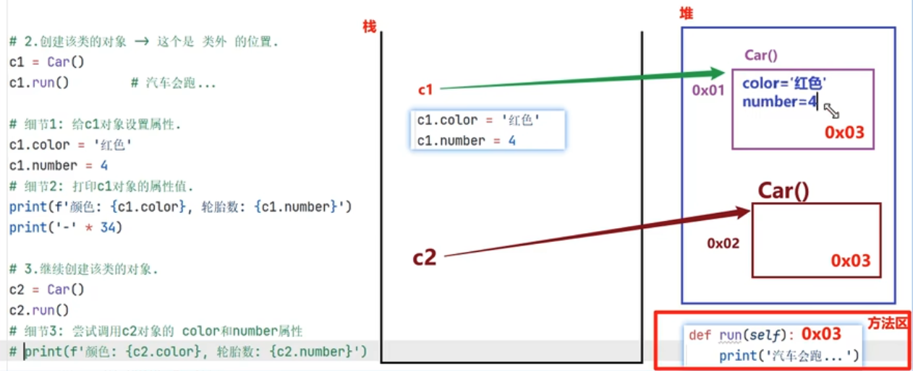
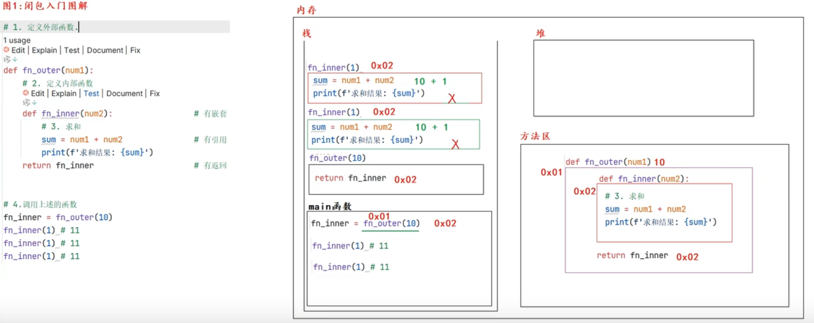
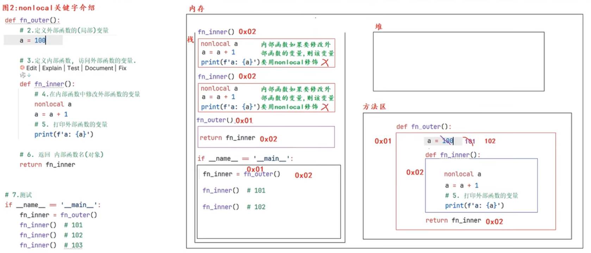
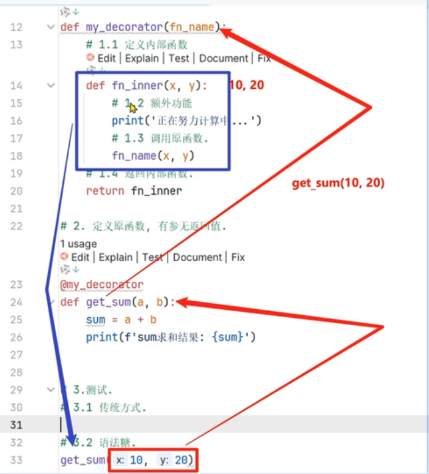
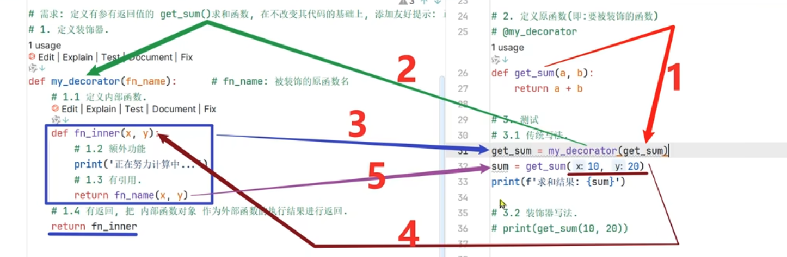

# python 进阶

- 面向过程 与 面向对象

  1. 面向过程：强调过程，第一步、第二步、第三步。。。。
  2. 面向对象：强调以“对象为基础”完成各种操作，对象是具有属性和方法的（例：洗衣服，交给别人/机器，让它做）。
     - 它是基于面向过程的

- 封装、继承、多态

  1. 封装：【好处：简化编程】；隐藏对象的属性和实现细节，仅对外公开接口；
  2. 继承：【好处：代码复用】；子类继承父类的属性和方法；使得子类对象（实例）具有父类的特征和行为；
  3. 多态：【好处：解耦合，可扩展】同一个事物在不同时刻做出的反应不一样；例：（同一个人）在教室是学生，在商场是顾客，在家是。。。
     - 同一个函数接收参数不一样，表现出来的结果也不一样；

- 类与对象

  1. 类：是抽象模板（图纸）
  2. 对象：是类的具体实例（按图纸造出来的东西）；有 属性（名词）、方法（动词）

  

## 类

- self 关键字：用于指向“对象实例本身”；

  1. 谁调用，指向谁
  2. 类似 js 中的 this 关键字

- 魔法方法：

  在 Python 中，有一些可以"给 Python 类增加魔力的特殊方法"，它们"总是被双下划线所包围"，我们称之为魔法方法。"在特殊情况下会被自动调用"，不需要开发者手劲去调用。

  1. `__init__()` ：在创建对象时调用，初始化方法；
  2. `__str__()` ：打印对象时调用，返回对象的字符串表示【不重写，print()对象时，返回对象的内存地址】；
  3. `__del__()` ： 当.py 文件执行结束后 或 手动删除对象后调用；

  ```python
  class Car:
    def __init__(self, name, color):
        self.name = name
        self.color = color

    def show(self):
        print("name:", self.name, "color:", self.color)

    def __str__(self):
        return f'{self.name} {self.color}'

    def __del__(self):
        print("对象被删除")

  c1=Car("BMW", "white")
  c1.show() # name: BMW color: white
  print(c1.name,c1.color)
  ```

### 类的高级

- 三种定义方式：

  1. `class 类名:`
  2. `class 类名():`
  3. `class 类名(父类):`

- 多继承：优先左边顺序

  1. `class 类名(父类1, 父类2):`优先“父类 1 ”的属性名和方法
  2. mro: 查看继承顺序

  3. 重写：

  ```python
      class blueCar:
        def __init__(self):
            self.name = "blue"
        def show(self):
            print("name:", self.name)

      class redCar:
        def __init__(self):
            self.name = "red"
        def show(self):
            print("name:", self.name)
        def run():
            print("run")

      class Car(blueCar, redCar):
        def __init__(self):
            self.name = "new"
        def show(self):
            print("name:", self.name)
        def show_blue(self):
            self.show() #就近，调用本身的
            ## 方法1
            blueCar.__init__(self) # 传进去并改变self的name: blue
            blueCar.show(self) #self的name已经是blue了
        def show_red(self):
            redCar.__init__(self)
            redCar.show(self)
        def show_parent(self):
            ## 方法2
            super().run()
      if __name__ == "__main__":
         c1 = Car()
         print(c1.mro()) # c1--> blueCar --> redCar --> object
         c1.show() # name: new
         print("------------------")
         c1.show_blue() # name: blue
         c1.show() # name: blue
         print("------------------")
         c1.show_red() # name: red
         c1.show() # name: red
         print("------------------")
         c1.show_parent() #查找顺序 blueCar -->redCar --> object

  ```

- 封装

  ```python
    class Person:
        def __init__(self, name):
            self.name = name
            self.__mobile = "123456" # 私有属性
        def get_mobile(self):
            return self.__mobile

    class Student(Person):
        pass
    if __name__ == "__main__":
        s1 = Student("张三")
        print(s1.name) # 张三
        print(s1.__mobile) # 报错
        print(s1.get_mobile()) # 123456
  ```

### 对象属性、类属性、类方法、静态方法

- 对象属性: 对象实例的属性，对象实例有自己单独的属性；
- 类属性: 属于类的；即:能被该类下所有的对象所共享。A 对象修改类属性，B 对象访问的是修改后的.
- 类方法: 属于类的；定义时，必须使用“装饰器@clasSmethod”，且“第 1 个参数”必须表示类对象，通常以 cls 作为第一个参数名。
- 静态方法: 需要使用“装饰器@staticmethod” 来标识其为静态方法，静态方法与普通方法一样，只是不需要 self 参数。

**注：** 类方法 与 静态方法 区别不大；

```python
class Student:
    teacher_name = "张三" # 类属性
    def __init__(self,name):
        self.name = name # 对象属性
    def show_name(self):
        print("学生name:", self.name)
    @classmethod # 类方法
    def show_classMethod(cls):
        print("teacher:", cls.teacher_name)
        print("teacher:", Student.teacher_name)
    @staticmethod # 静态方法
    def show_staticMethod():
        print("teacher:", Student.teacher_name)

if __name__ == "__main__":
    s = Student("学生")
    s.show_name()
    s.show_classMethod()
    s.show_staticMethod()
```

## 闭包

闭包：根据词法作用域的规则，内部函数总是可以访问其外部函数中声明的变量，当通过调用一个外部函数返回一个内部函数后，即使外部函数已经执行结束了，但是内部函数引用外部函数的变量依旧保存在内存中，把这些变量的集合称为闭包；

`fn_outer(100)(200)`: 其中 `fn_outer(100)`是外部函数执行后返回的内部函数`fn_inner`，等价于 `fn_inner(200)`；

- global: 关键字用来在函数或其他局部作用域中使用全局变量。但是如果不修改全局变量也可以不使用 global 关键字。
- nonlocal: 声明的变量不是局部变量,也不是全局变量,而是外部嵌套函数内的变量。




### 装饰器 -- 本质上就是一个闭包函数

装饰器目的：在不改变原有函数的情况下，给函数添加功能；

装饰器: 本质上是一个高阶函数

```python
# 传统装饰器 -- 高阶函数
def check_login(fn_name):
    def fn_inner():
        # 额外功能
        print("检验登录。。。")
        fn_name()
    return fn_inner

def comment():
    print("发表评论。。。")
def payment():
    print("支付。。。")

# 调用---------------
comment = check_login(comment)
comment()
print("-"*23)
payment = check_login(payment)
payment()
```

```python
# 函数装饰器 -- 语法糖
def check_login(fn_name):
    def fn_inner():
        # 额外功能
        print("检验登录。。。")
        fn_name()
    return fn_inner

@check_login
def comment():
    print("发表评论。。。")

@check_login
def payment():
    print("支付。。。")

# 调用---------------
comment()
print("-"*23)
payment()
```

- 被装饰函数的 4 种情况：

  1. 无参无返: 计数用
  2. 有参无返回: 统计用

     

  3. 无参有返回
  4. 有参有返回
     

- 多个装饰器的装饰过程是: 离函数最近的装饰器先装饰，然后外面的装饰器再进行装饰，由内到外的装饰过程;

  ```python
    # ---装饰器写法---（装饰器从上到下执行）---------
    @checkout_login
    @checkout_code
    def comment():
         print("发表评论。。。")

    # ---传统写法-----（栈的形式）----------
    cc = checkout_code(comment)
    cl = checkout_login(cc)
    cl()
  ```

  -传统执行流程.png>)

- 使用带有参数的装饰器，其实是在装饰器外面又包裹了一个函数，使用该函数接收参数，返回装饰器。
  1. 装饰器每层只能传一个参数

## 拷贝

- 赋值：只是创建别名，不创建新对象
- 浅拷贝：创建新容器，但填充的是原内容的引用

  1. 对象没有嵌套结构或嵌套结构不可变
  2. 需要共享嵌套对象引用时
  3. 对性能要求较高时

- 深拷贝：递归创建所有内容的新副本
  1. 对象有嵌套的可变结构
  2. 需要完全独立的副本
  3. 修改副本不应影响原始对象时

* 不可变对象：（数字、字符串、元组）原数据、深拷贝浅拷贝，都指向同一个对象；
* 可变对象：深拷贝 创建新的对象，浅拷贝 创建新的对象，但填充的是原对象的引用；

## 网络

## 进程 与 线程

- 多任务: 是指在“同一时间”内执行“多个任务”(给我们的感觉)；
- 并发: 在一段时间内，“交替”执行任务；
- 并行: 在一段时间内，真正的“同时一起”执行多个任务（需要多核 CPU）；

1. Python (CPython)：进程优先策略

   - 由于 GIL（全局解释器锁）的存在，真正的并行只能通过多进程实现
   - 每个 Python 进程是独立的操作系统进程，有自己独立的内存空间和 Python 解释器
   - 进程间通信需要显式处理（队列、管道、共享内存等）

2. Java：线程优先策略

   - 没有 GIL 的限制，可以直接使用多线程实现真正的并发
   - 线程共享内存空间，通信简单直接
   - 也支持多进程，但线程是首选的并发模型

- 进程：是分配资源的基本单位，一旦创建一个进程就会分配一定的资源;
- 线程：是 cpu 调度的基本单位，每个进程至少都有一个线程，而这个线程就是我们通常说的主线程

### 进程

```python
   # 新建进程
   import multiprocessing
   p1 = multiprocessing.Process(target=函数名, args=元组, kwargs=字典)
   p1.daemon = True # 设置守护进程,思路1
   p1.start()
   p1.terminate() # 结束进程,思路2

   # 获取当前进程ID
   pid = os.getpid() # 方法一
   pid = multiprocessing.current_process().pid # 方法二
   # 获取父线程ID
   ppid = os.getppid()
```

进程的特点:

1. 进程之间数据是相互隔离的.

   - 因为子进程相当于是父进程的"副本"，会将父进程的"main 外资源"拷贝一份，即:各是各的

2. 默认情况下，主进程会等待子进程执行结束再结束
   - 如果要设置主进程结束，予进程同步结束，方式如下:
     1. 思路 1:设置子进程为 守护进程；
     2. 思路 2:强制关闭子进程，可能导致子进程变成僵尸进程，交由 Python 解释器自动回收(底层有 init 初始化进程来管理维护)；

### 线程

```python
   import threading
   my_lock = threading.Lock()
   mu_lock2 = threading.Lock() # 2把锁可能造成锁不住；

   def func1():
      my_lock.acquire()
      print("线程1")
      time.sleep(1)
      my_lock.release()

   def func2():
      my_lock.acquire()
      print("线程2")
      time.sleep(1)
      my_lock.release()


   t1 =threading.Thread(target=func1,args=元组,kwargs=字典)
   t2 =threading.Thread(target=func2,daemon=True) #线程守护,写法1
   t2.daemon = True # 线程守护，写法2
   t1.start()
   t2.start()
```

1. 线程之间执行是无序的
2. 主线程会等待所有的子线程执行结束再结束（线程守护）
3. 线程之间共享全局变量
4. 线程之间共享全局变量数据出现错误问题（互斥锁解决）

- 死锁：一直等待对方释放锁的情景就是死锁；

  - 死锁的原因:使用互斥锁的时候需要注意死锁的问题，未在合适的地方注意释放锁；
  - 死锁的结果:会造成应用程序的停止响应，应用程序无法再继续往下执行了；

- 互斥锁：对共享数据进行锁定，保证同一时刻只有一个线程去操作
- 锁不住：使用 2 把及以上的锁；

## 生成器、迭代器、

### 迭代器

1. 手动管理: 需要显式地实现`__iter__()`和`__next_()`方法；
2. 状态管理: 迭代器需要自己管理迭代的状态，包括当前位置和结束条件；
3. 内存使用: 内存使用取决于迭代器的实现，通常是惰性计算(即按需生成数据)；

```python
    class MyIter:
      def __init__(self, start,end):
        self.current_value = start
        self.end = end
      # 重写iterator方法，返回当前对象（即：迭代器对象）
      def __iter__(self):
        return self
      # 重写next方法，返回当前值，并更新当前值
      def __next__(self):
        if self.current_value >= self.end:
          raise StopIteration  # 抛出异常，迭代结束

        value = self.current_value
        self.current_value += 1
        return value

    # for i in range(1,10):
    for i in MyIter(1,10):
      print(i)

    my_iter = iter(MyIter(1,10))
    print(next(my_iter))
    print(next(my_iter))

```

### 生成器

根据"制定的规则"循环生成数据，当条件不成立时则生成数据结束。数据不是一次性全部生成出来，而是使用一个，再生成一个，可以节约大量的内存；

创建生成器的方式: 1、生成器推导式；2、yield 关键字

```python
   # 生成器推导式
   my_list = [i for i in range(9999)]
   my_gen = (i for i in range(9999)) # 推导式

   next(my_gen)

   sys.getsizeof(my_list)
   sys.getsizeof(my_gen)
```

```python
  # yield 关键字
  def my_gen():
    for i in range(9999):
      yield i   # yield在这里做了三件事儿:1.创建生成器对象。 2.把值存储到生成器中， 3.返回生成器，

  my_g = my_gen()
  next(my_g)
```

## Property 属性

负责把一个方法“当属性”使用，来“简化代码“使用；

- 定义 property 属性有两种方式: ① 装饰器方式 ② 类属性方式；

```python
  # 方式1
  class Person:
    def __init__(self, age):
      self.__age = age

    @property
    def age(self):   # get_age
      return self.__age

    @age.setter
    def age(self, age):  # set_age
      self.__age = age
  if __name__ == '__main__':
    p = Person(18)
    print(p.age)
    p.age = 20
    print(p.age)
```

```python
  # 方式2
  class Person:
    def __init__(self, age):
      self.__age = age

    def get_age(self):
      return self.__age

    def set_age(self, age):
      self.__age = age

    # 参1:获取值的函数名，参2:设置值的函数名
    age = property(get_age, set_age)
  if __name__ == '__main__':
    p = Person(18)
    print(p.age)
    p.age = 20
    print(p.age)
```
