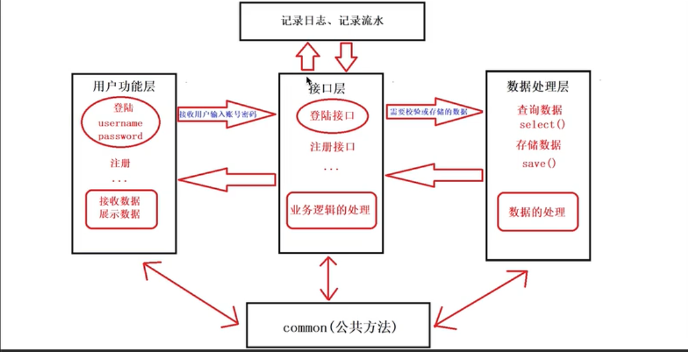

# 项目说明书

## 项目：XXXXX

## 项目需求

## 项目描述

## 项目流程

# 一个项目如何从无到有

## 需求收集

## 一、 需求分析

- 拿到项目：先在客户那一起讨论需求（带上前、后端）；  
  商量功能能否实现，周期与价格，得到一个“需求文档”；

- 在公司内部开一次会，最终得到一个“开发文档”，交给不同岗位进行开发；
  1. 产品宣讲: 产品原型、流程图辅助、产品文档
  2. UI宣讲: UI 设计稿
  3. 前端开发
  4. 后端开发
  5. 测试: 压力测试、界面测试、功能测试、性能测试、安全测试、兼容性测试
  6. 运维

## 二、程序架构设计

- 三层架构：用户视图层、业务层（接口层）、数据层
  1. 用户视图层：用户操作、数据交互、页面展示；
  2. 业务层（接口层）：根据逻辑判断调用'数据处理层'加以处理，并返回一个结果给 用户视图层；
  3. 数据处理层：先数据处理，再数据增、删、改、查；

## 三、分任务开发

## 四、测试

## 五、上线

产品文档

# 🚀 项目开发方式（优化整理版）

## 一、两种主流开发模式

| 维度     | 敏捷开发（Agile）    | 传统项目（瀑布）       |
| -------- | -------------------- | ---------------------- |
| 目标     | 可调整               | 固定                   |
| 开发方式 | 小步迭代             | 一次性交付             |
| 需求     | 动态变化             | 前期确定               |
| 风险     | 分散（持续暴露）     | 集中（后期爆发）       |
| 适用场景 | App / Web / 创新产品 | 外包 / 政府 / 固定需求 |

## 二、核心结论

- ❌ 传统瀑布：一次性规划 + 整体交付（不适合长期演进项目）
- ✅ 敏捷开发：先做可用版本 → 持续优化迭代

## 三、敏捷开发本质

敏捷 ≠ 倒推终点，而是：

1. 小步快跑（迭代开发）
2. 快速反馈（用户 / 测试）
3. 持续调整（动态优化）

👉 本质一句话：边做边修正，而不是一次做对

## 四、推荐实践：功能拆解式开发（实用敏捷）

✔ 开发原则

- 一个功能一个功能做
- 每完成一块都“可运行”
- 持续迭代优化

## 五、最实用方法：伪敏捷开发（强烈推荐）

### Step 1：最小可用（MVP）

功能能跑即可；不关注 UI 、 细节 、 性能

👉 例：图表先“显示出来”

### Step 2：功能增强

补交互（tooltip）、加样式（颜色）、 修结构（坐标轴）

### Step 3：整体优化

性能优化、UI细节、兼容性

## 六、成熟项目的正确开发模式

❌ 避免：
攒需求 → 一次性大改 → 一次性上线

问题：

- 风险高
- 难回滚
- 容易崩

### ✅ 推荐：迭代开发 + 发布流程

1️⃣ 迭代开发（核心）

按版本推进：

- v1.1：性能优化
- v1.2：UI优化
- v1.3：Bug修复
- v1.4：小功能

👉 每一版都必须：

- 可上线
- 可验证
- 可回滚
  2️⃣ 发布流程（小周期闭环）

每次迭代都走完整流程：

- 需求确认
- 开发实现
- 自测
- 测试（QA）
- 发布上线
- 收集反馈

👉 本质：小型瀑布 + 高频循环

## 七、标准迭代节奏（Sprint）

推荐周期：1～2 周

流程：

1. 规划（0.5天）：Bug、优化、小功能、
2. 开发（3～5天）：控制范围，避免扩散
3. 测试（1～2天）：自测 + 他测
4. 发布: 上线版本、观察运行情况
5. 反馈: 用户反馈、日志/崩溃

## 八、关键能力（决定项目能走多远）

1️⃣ 可回滚：
每个版本都能快速回退

2️⃣ 数据监控：

必须具备：

- 崩溃监控
- 性能指标（加载时间）
- 关键日志

3️⃣ 小步快跑（最重要）

❌ 禁止：一次改很多

✅ 正确：每次只动一小块

## 九、最终总结（精华版）

🔥新项目：靠敏捷活下来

🔥成熟项目：靠迭代活得久

开发本质不是“做完”，而是“持续变好”

# 预案：影响范围、有问题--》怎么解决

# 复盘不是为了处分谁，而是为了优化系统。学会把人的问题转化为系统问题，是成熟技术团队最重要的政治正确。能推动流程完善的人，才是团队的资产。
