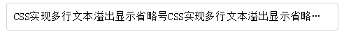
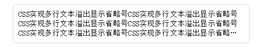
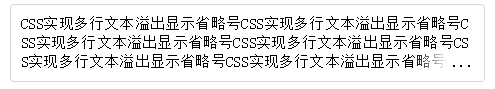

# CSS 实现单行、多行文本溢出显示省略号

## 单行文本的溢出显示省略号

加宽度 width 属来兼容部分浏览

```css 实现方法：
overflow: hidden;
text-overflow: ellipsis;
white-space: nowrap;
```



## 多行文本溢出显示省略号

```css 实现方法：
display: -webkit-box;
-webkit-box-orient: vertical;
-webkit-line-clamp: 3;
overflow: hidden;
```

注：

1. -webkit-line-clamp 用来限制在一个块元素显示的文本的行数。  为了实现该效果，它需要组合其他的 WebKit 属性。常见结合属性：
2. display: -webkit-box;  必须结合的属性  ，将对象作为弹性伸缩盒子模型显示  。
3. -webkit-box-orient  必须结合的属性  ，设置或检索伸缩盒对象的子元素的排列方式  。



## 多行文本溢出显示省略号,半透明

```css 实现方法：
p {
  position: relative;
   line-height: 20px;
   max-height: 40px;
  overflow: hidden;
}
p::after {
  content: "...";
   position: absolute;
   bottom: 0;
   right: 0;
   padding-left: 40px;
  background: -webkit-linear-gradient(left,  transparent,  #fff 55%);
  background: -o-linear-gradient(right,  transparent,  #fff 55%);
  background: -moz-linear-gradient(right,  transparent,  #fff 55%);
  background: linear-gradient(to right,  transparent,  #fff 55%);
}
```

注：

- 将 height 设置为 line-height 的整数倍，防止超出的文字露出。
- 给 p::after 添加渐变背景可避免文字只显示一半。
- 由于 ie6-7 不显示 content 内容，所以要添加标签兼容 ie6-7（如：<span>…<span/>）；兼容 ie8 需要将::after 替换成:after。


