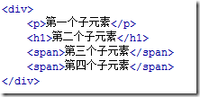

# 综合

## 图片盖住父容器边框

给父容器设置 margin-top

## 锚点跳转位置上下偏移方法

```css
.target {
  padding-top: 50px;
  margin-top: -50px;
}
```

## margin 和 padding 百分比问题

1. margin 和 padding 都可以使用百分比值的，但有一点可能和通常的想法不同，

   就是 margin-top | margin-bottom | padding-top | padding-bottom 的百分比值参照的不是容器的高度，而是宽度。

2. background-size:cover;

## 解决 inline-block 元素的空白间距、img 有间距问题

使用纯 CSS 就是在父元素中设置 font-size:0,用来兼容 chrome，而使用 letter-space:-N px 来兼容 safari:

```css
ul {
  letter-spacing: -4px; //根据不同字体字号或许需要做一定的调整
  word-spacing: -4px;
  font-size: 0;
}
li {
  font-size: 16px;
  letter-spacing: normal;
  word-spacing: normal;
  display: inline-block;
  *display: inline;
  zoom: 1;
}
```

## px、em、rem

1. px 像素（Pixel）：相对长度单位。像素 px 是相对于显示器屏幕分辨率而言的。
2. em 是相对长度单位。相对于当前对象内文本的字体尺寸。如当前对行内文本的字体尺寸未被人为设置，则相对于浏览器的默认字体尺寸。
3. rem 是 CSS3 新增的一个相对单位（root em，根 em）;rem 是 CSS3 新增的一个相对单位（root em，根 em）

## css 选择器 first-child 与 first-of-type 的区别



- :first-child 选择器是 css2 中定义的，从字面意思上来看也很好理解，就是第一个子元素。

1. `p:first-child`  匹配到的是 p 元素,因为 p 元素是 div 的第一个子元素；
2. `h1:first-child`  匹配不到任何元素，因为在这里 h1 是 div 的第二个子元素，而不是第一个；
3. `span:first-child`  匹配不到任何元素，因为在这里两个 span 元素都不是 div 的第一个子元素；
4. `:first-child`  匹配到的是 p 元素,因为在这里 div 的第一个子元素就是 p。

- :first-of-type 选择器是 css3 中定义的

1. `p:first-of-type`  匹配到的是 p 元素,因为 p 是 div 的所有为 p 的子元素中的第一个，事实上这里也只有一个为 p 的子元素；
2. `h1:first-of-type`  匹配到的是 h1 元素，因为 h1 是 div 的所有为 h1 的子元素中的第一个，事实上这里也只有一个为 h1 的子元素；
3. `span:first-of-type`  匹配到的是第三个子元素 span。这里 div 有两个为 span 的子元素，匹配到的是第一个。
4. `:first-of-type`  匹配到的是 p 元素

- 所以，通过以上两个例子可以得出结论：

1. :first-child 匹配的是某父元素的第一个子元素，可以说是结构上的第一个子元素。
2. :first-of-type 匹配的是该类型的第一个，类型是指什么呢，就是冒号前面匹配到的东西，比如 p:first-of-type，就是指所有 p 元素中的第一个。

   这里不再限制是第一个子元素了，只要是该类型元素的第一个就行了，当然这些元素的范围都是属于同一级的，也就是同辈的。

3. 同样类型的选择器 :last-child  和 :last-of-type、:nth-child(n)  和   :nth-of-type(n) 也可以这样去理解。
