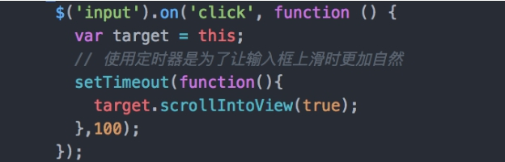

# 手机端 input 获取焦点弹出键盘时挡住 input 解决方案

针对此问题，目前没有十分有效的方法，只能通过 js 调整 input 输入框的位置，使之出现在正常的位置。
解决方法

1. scrollIntoView(alignWithTop):  滚动浏览器窗口或容器元素，以便在当前视窗的可见范围看见当前元素。
   - alignWithTop  若为  true，或者什么都不传，那么窗口滚动之后会让调用元素的顶部与视口顶部尽可能平齐；
   - alignWithTop  若为  false，调用元素会尽可能全部出现在视口中，可能的话，调用元素的底部会与视口顶部平齐，不过顶部不一定平齐。

支持的浏览器：IE、Chrome、Firefox、Safari 和 Opera。

该方法是唯一一个所有浏览器都支持的方法，类似还有如下方法，但是只有在 Chrome 和 Safari 有效：

- scrollIntoViewIfNeeded(alignCenter)
- scrollByLines(LineCount)

代码如下：(使用 setTimeout 注意修改 this 值)

