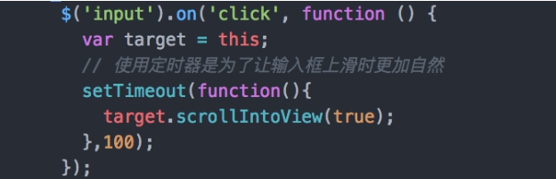

# 综合

## JS DOMNodeInserted，DOMNodeRemoved 和监听内容变化插件

DOMNodeInserted，DOMNodeRemoved
今天想对某个 div 的变化做监听，发现了这两个方法，还是很好使的。
具体从字面就能看出其意义，但是有个地方需要注意，这个方法的调用时机在 jQuery 的对 dom 操作之前执行。

```js code
ulObj.bind("DOMNodeInserted", function (e) {
  var obj = jQuery(e.target);
  if (obj.hasClass("rhHome__item")) {
    fixHomeUlHei();
  }
});
```

```js code
ulObj.bind("DOMNodeRemoved", function (e) {
  var obj = jQuery(e.target);
  if (obj.hasClass("rhHome__item")) {
    fixHomeUlHei();
  }
});
```

## 对象冻结：Object.freeze

## ipad body 点击没反应

body{cursor:pointer}

## 移动端穿透

html，body {height:100%;overflow:hidden;position: fixed;}

css:display:flex 布局将影响孙子元素的旋转；子元素要加 display：flex

## JS+H5 新标签 classList。删除添加 class

经常要兼容不得不用老方法，总要还下新方法来尝试的
直接上代码：

```js code
window.onload = function () {
  var abox = document.querySelectorAll(".sub");
  for (var i = 0; i < abox.length; i++) {
    abox[i].onclick = function () {
      for (var i = 0; i < abox.length; i++) {
        abox[i].classList.remove("active");
      }
      this.classList.add("active");
    };
  }
};
```

- 简单说明：

1. div.classList.add("active");
2. div.classList.remove("active");
3. div.classList.length 有几个 class 名字
4. div.classList.item[0] 获取下标
5. div.classList.contains("class 名") 查看是否存在这个名字 存在是 true 不存在是 false

如果存在就移除：

```js code
var x = document.getElementById("myDIV");
if (x.classList.contains("mystyle")) {
  x.classList.remove("anotherClass");
} else {
  alert("Could not find it.");
}
```

## 手机端 input 获取焦点弹出键盘时挡住 input 解决方案

针对此问题，目前没有十分有效的方法，只能通过 js 调整 input 输入框的位置，使之出现在正常的位置。
解决方法

1. scrollIntoView(alignWithTop):  滚动浏览器窗口或容器元素，以便在当前视窗的可见范围看见当前元素。
   - alignWithTop  若为  true，或者什么都不传，那么窗口滚动之后会让调用元素的顶部与视口顶部尽可能平齐；
   - alignWithTop  若为  false，调用元素会尽可能全部出现在视口中，可能的话，调用元素的底部会与视口顶部平齐，不过顶部不一定平齐。

支持的浏览器：IE、Chrome、Firefox、Safari 和 Opera。

该方法是唯一一个所有浏览器都支持的方法，类似还有如下方法，但是只有在 Chrome 和 Safari 有效：

- scrollIntoViewIfNeeded(alignCenter)
- scrollByLines(LineCount)

代码如下：(使用 setTimeout 注意修改 this 值)


## 禁止鼠标滚轮 ---- 页面滚动时禁止滚动操作

- PC 端：

  1. 禁止鼠标滚轮
     `window.onmousewheel = document.onmousewheel = function () {return false;};`
  2. 解禁鼠标滚轮
     `window.onmousewheel = document.onmousewheel = function () {return true;};`

- 手机端：

```js code
var jz = 0; //全局
$(".nav_click").click(function () {
  t++;
  var jz = t % 2;
  if (document.addEventListener) {
    document.removeEventListener("touchmove", fun, false);
  } else {
    document.addEventListener("touchmove", fun, false);
  }
});

function fun() {
  if (jz != 0) {
    e.preventDefault();
    e.stopPropagation();
  }
}
```

## 对话框拖动--移动端、PC

```js code1 移动端
mobileDragEvent: function(dragTarget, moveTarget) {
    var dragextend = {
        //判断设备是否支持touch事件
        touch: ('ontouchstart' in window) || window.DocumentTouch && document instanceof DocumentTouch,
        slider: document.getElementById(dragTarget),
        //事件
        events: {
            handleEvent: function(event) {
                var self = this; //this指events对象
                if (event.type == 'touchstart') {
                    self.start(event);
                } else if (event.type == 'touchmove') {
                    self.move(event);
                } else if (event.type == 'touchend') {
                    self.end(event);
                }
            },
            //开始
            start: function(event) {
                var touch = event.targetTouches[0]; //touches数组对象获得屏幕上所有的touch，取第一个touch
                startPos = {
                    x: touch.pageX - $("#" + dragTarget).offset().left,
                    y: touch.pageY - $("#" + dragTarget).offset().top
                }; //取第一个touch的坐标值
                document.getElementById(dragTarget).addEventListener('touchmove', this, false);
                document.getElementById(dragTarget).addEventListener('touchend', this, false);
            },
            //移动
            move: function(event) {
                event.preventDefault();
                //当屏幕有多个touch或者页面被缩放过，就不执行move操作
                if (event.targetTouches.length > 1 || event.scale && event.scale !== 1) return;
                var touch = event.targetTouches[0];
                endPos = {
                    x: touch.pageX - startPos.x - $(document).scrollLeft(),
                    y: touch.pageY - startPos.y - $(document).scrollTop()
                };
                var obj = $("#" + moveTarget);
                obj.css({
                    'left': endPos.x,
                    'top': endPos.y
                });
            },
            //释放
            end: function(event) {
                //解绑事件
                document.getElementById(dragTarget).removeEventListener('touchmove', this, false);
                document.getElementById(dragTarget).removeEventListener('touchend', this, false);
            }
        },
        //初始化
        init: function() {
            var self = this; //this指slider对象
            if (!!self.touch) self.slider.addEventListener('touchstart', self.events, false); //addEventListener第二个参数可以传一个对象，会调用该对象的handleEvent属性
        }
    };
    dragextend.init();
}
```

```js code2 移动端
function mobile(dragTarget, moveTarget) {
  var dragTarget = document.getElementById(dragTarget);
  var moveTargets = document.getElementById(moveTarget);

  var startX;
  var startY;
  dragTarget.addEventListener("touchstart", touchStart, false);

  function touchStart(event) {
    event.preventDefault();
    if (!event.touches.length) return;
    var touch = event.touches[0];
    startX = touch.pageX;
    startY = touch.pageY;
    dragTarget.addEventListener("touchmove", touchMove, false);
  }

  function touchMove(event) {
    event.preventDefault();
    if (!event.touches.length) return;
    var touch = event.touches[0];
    var x = touch.pageX - startX;
    var y = touch.pageY - startY;
    console.log(touch.pageY + "****startY:" + startY);
    document.getElementById(moveTarget).style.left = x + "px";
    document.getElementById(moveTarget).style.top = y + "px";
  }
  dragTarget.addEventListener("touchend", touchEnd, false);
  function touchEnd(event) {}
}
```

```js PC1
dragEvent: function(dragTarget, moveTarget) {
    $(dragTarget).mousedown(function(e) {
        var isMove = true;
        var abs_x = e.pageX - $(moveTarget).offset().left;
        var abs_y = e.pageY - $(moveTarget).offset().top;
        $(document).mousemove(function(e) {
            if (isMove) {
                var obj = $(moveTarget);
                obj.css({
                    'left': e.pageX - abs_x,
                    'top': e.pageY - (abs_y + $(document).scrollTop())
                });
            }
            return false;
        }).mouseup(function(e) {
            isMove = false;
            $(document).unbind('mousemove');
            $(document).unbind('mouseup');
        });
       //return false;
    });
}
```

```js PC2
function dragEvent(dragTarget, moveTarget) {
  $(dragTarget).mousedown(function (event) {
    var isMove = true;
    var abs_x = event.pageX - $(dragTarget).offset().left;
    var abs_y =
      $(document).scrollTop() + event.pageY - $(dragTarget).offset().top;
    $(document)
      .mousemove(function (event) {
        if (isMove) {
          var obj = $(moveTarget);
          obj.css({
            left: event.pageX - abs_x,
            top: event.pageY - abs_y
          });
        }
      })
      .mouseup(function () {
        isMove = false;
      });
  });
}
```
