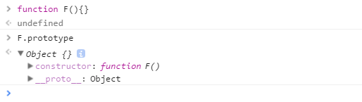

## 判断 JS 数据类型的四种方法

#### 在 ECMAScript 规范中，共定义了 7 种数据类型，分为 "基本类型" 和 "引用类型" 两大类，如下所示：

**基本类型（原始类型、简单类型）：** String、Number、Boolean、Symbol、Undefined、Null （值：存储在"栈"中）  
**引用类型（复杂类型、对象类型）：** Object （值：储存一个指针，指向“堆”中; 实际存储在"堆"中）

#### 1.typeof

```
typeof ''; --> string
typeof 1; --> number
typeof true;  --> boolean
typeof Symbol(); --> symbol
typeof undefined; --> undefined
typeof null; --> object

typeof [] ; --> object
typeof newFunction(); --> function
typeof newDate(); --> object
typeof newRegExp(); --> object

typeof (Object、Function、Array、Date、Number、String、Bootlean) --> funciton
```

- 对于基本类型: 除 null 以外，均可以返回正确的结果;
- 对于引用类型: 除 function 以外，一律返回 object 类型;
- 对于 null ，返回 object 类型;
- 对于 function 返回 function 类型;  
  其中，null 有属于自己的数据类型 Null ， 引用类型中的 数组、日期、正则 也都有属于自己的具体类型;  
  而 typeof 对于这些类型的处理，只返回了处于其 "原型链最顶端" 的 Object 类型; 没有错，但不是我们想要的结果。

#### 2.instanceof （只能用来判断"引用类型"，基本类型不可以）

通过判断对象的原型链中是不是能找到类型的 prototype；例如：  
使用 instanceof 判断一个对象是否为数组，instanceof 会判断这个对象的原型链上是否能找到对应的 Array 的原型，找到返回 true，否则返回 false。

语法：object instanceof constructor;  
参数：object（要检测的对象）constructor（类型）

```
function myInstanceof(left, right) {
  let prototype = right.prototype
  left = left.__proto__
  while (true) {
    if (left === null || left === undefined){
       return false
    }
    if (prototype === left){
       return true
    }
    left = left.__proto__
  }
}
```

**注：** 所有对象类型 instanceof Object 都是 true
针对数组，ES5 提供了 Array.isArray() 方法;Array.isArray([1, 2, 3]) --> true ；

#### constructor （）

当定义函数时，js 引擎会为函数添加一个 prototype 属性，该属性指向一个对象。这个对象就是我们所说的原型；  
并且这个对象中的 constructor 属性指向函数引用， 因此重写 prototype 会丢失原来的 constructor。  

