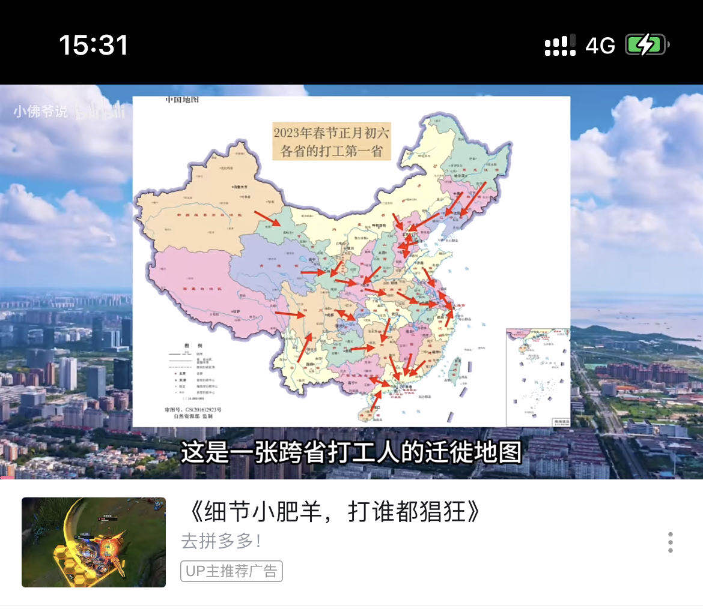
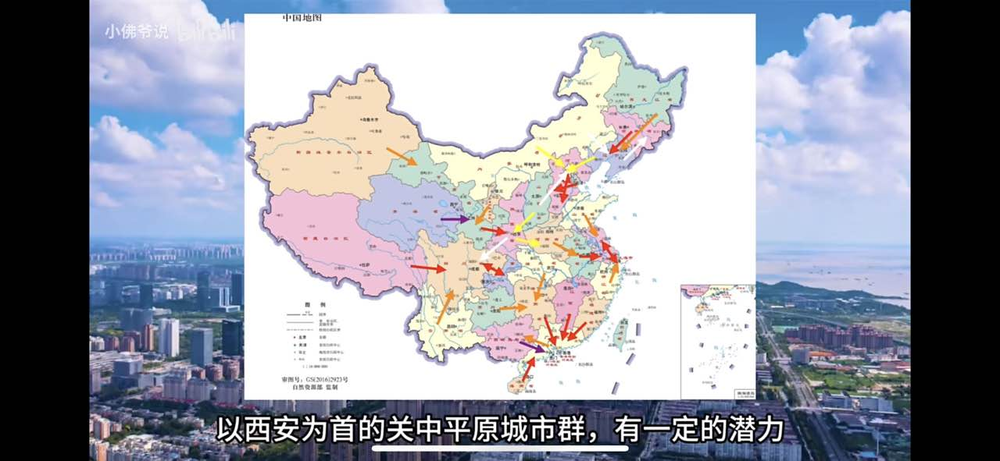

# 城市：政策&天赋决定上限，机遇&努力决定下限

大的变化:迁都、战争、超级超级自然灾害，或者新设直辖市；

中国的城市:这种上限，来源于地理位置、自然条件，或者来源于国家大政策。

## 上限极高的城市

南京比杭州稍高，毕竟三位区号，代表了大区中心，高校云集

1. 成都: 上限极高的城市,第五名左右

   - 方圆一千里，能打的不多。重庆算一个，那是因为国家给了他直辖市，政策天赋暴涨。
   - 8000 万人口的省内，一个能打的都没有。不解释
   - 大平原，能容纳大量产业和人口

   以上三点，就是成都最大的天赋，前两条看似一样，其实不然。

   - 第一条，决定了几乎所有的大企业，只要想开拓西南市场，就要去成都投资。所有的西南头的高校，几乎都在成都
   - 第二条，决定了四川会集中全部的力量堆成都，没有其他选择。
   - 再加上政策支持（国家中心城市，各种大政策支持），成都的天赋，已经基本顶天了

2. 武汉：的情况接近于成都;

   - 比成都天赋好的：长江;
   - 比成都天赋差的：郑州长沙离着不远，虽然也不算特别能打（和武汉比），但是肌肉也是在长的。

## 上限"低"一些的大城市

1. 郑州：上限不如成都、武汉、南京、杭州

   - 政策上，国家之前并未把郑州以及河南当作重点发展对象，否则，不可能连个副省级都不给。
   - 天赋上，河南相对来说穷，至少不如江浙
   - 不是区域中心；说华北吧，有京津冀；说中原吧，现在已经没有这个政治概念了。真正算得上中心的，黄委会算一个？这导致，郑州很难像成都武汉那样吸引大量的科研、金融资源。

   郑州这座城市的上限，我认为是北方第三城，全国第十。

2. 济南：天赋和郑州五五开，现阶段可能依然稍稍不如。

   - 山东比河南经济发达，沿海省份的优势还是有的。这点给济南加分。
   - 山东还有个青岛，直到 2017 年，省里还在堆计划单列市。这点给济南减分，而且减了大分。
   - 济南南部山地多，要聚集大量产业和人口，只能东北发展。

   目前济南的上限，也是北方第三，全国第十五。同郑州、西安一起，重现黄河流域曾经的荣光。

3. 合肥：是个非常努力，但是上限并不高（相比于其他大城市）。如果目前国家地理、国际环境、大政策不出现大的改动，就是一个上限不高（15 名），而下限不低（约 25 名）的城市。

   - 安徽没有一个能打的，芜湖本来能打，后来双手被捆起来了。
   - 挨着中国最富的地方不远。
   - 有中科大。（因为努力而得来，现在成了天赋）

   合肥的上限受制于那哪些因素？

   - 安徽是穷省小省，至少相比于东部沿海来说，能支撑合肥的力量有限。
   - 方圆一千里，到处都是能打的，而且不是一般的能打。
   - 交通方面没有任何特点，不临海，无法成为大动脉米字形交汇（是大动脉米字形，像郑州那样的，不是省内修几条高铁就能成为米字形枢纽的），也没法联通京沪两座超级城市，更没法成为超级航空枢纽。

4. 掰手指头算算，`全国前十一，四大直辖+广深+宁杭+武成+苏州`，合肥在上限上，都达不到。

   再往后算，

   - 宁波（上海卫星城，坐拥全国最大港口之一）、
   - 福州（民富大省决定开始堆的省会）、
   - 西安（三位数区号的西北王，一亿西北人民的指望）、
   - 佛锡（紧挨健康发展的超级城市，永远不愁溢出效应）、
   - 郑济（人口大省省会，一亿老乡的希望），这些城市，合肥没有哪个能说上限比他高。

## 人口流动五极？

1. 北京：河北、
2. 长三角：天津、山东、河南、安徽、江苏、浙江
3. 珠三角：海南、广西、
4. 成渝：
5. 西安？：
6. 郑州、武汉城市群 被吸血；

   
   

## 郑州与合肥

- 郑州看起来是富士康代工厂，实质是海量中小微企业蚂蚁堆积成山，所以郑州没高端就业，县域经济活跃，经济疫情受创非常明显，这两年疫情直接萎了；
- 合肥看起来是创新高科技，实质是电脑电视家电代工厂，因为都是市场领导者的生产基地，所以抗风险能力强大，疫情和经济危机反而会加速垄断。

所以这几年表现很强势，俩个城市都是小姐的心思丫鬟的命，郑州是一直没政策，有民营经济活跃度，可全是蚂蚁没政策变不大，个别变大了企业也往有政策的地方跑，合肥的问题是对接长三角，承接代工厂，可却想搞高科技，高科技创新的竞争对手是北上深杭，合肥那点可怜的财政只能补贴几个小企业撑门面，里子花销大，政策相比对手差太多，科技企业的融资和创投差太远，合肥根本有心无力玩不起。两个城市都难进前 13，甚至前 15 都呆着费劲。

## 大学

- 安徽--23 年

| 名字             | 排名         | 类型   | 地点 | 标签                       | 特色                                                   |
| ---------------- | ------------ | ------ | ---- | -------------------------- | ------------------------------------------------------ |
| 中国科学技术大学 | 7            | 综合类 |      | 双一流、985、211、强基计划 | 化学，数学，电子信息，计算机                           |
| 合肥工业大学     | 83           | 理工   |      | 双一流、211                | 车辆工程和机械工程                                     |
| 安徽大学         | 104          | 综合类 |      | 双一流、211                | 电子信息专业、计算机专业、汉语言文学，财经类专业和法学 |
| 安徽师范大学     | 132          | 师范   |      | ======                     | 地理科学、汉语言文学、化学、电子信息工程。             |
| 安徽医科大学     | 140（医 17） | 医药   |      | ======                     |                                                        |
| 安徽农业大学     | 162          | 农林   |      | ======                     | 农业资源与环境、林学、植物保护、园艺学                 |
| 安徽工业大学     | 175          | 理工类 |      | =====                      |                                                        |
| 安徽理工大学     | 201          | 理工类 |      | =====                      |                                                        |
| 安徽财经大学     | 220（财 17） | 财经   |      | ======                     |
| 安徽建筑大学     | 237          | 理工   |      | ======                     |                                                        |
| 安徽工程大学     | 243          | 理工   |      |                            |                                                        |
| 合肥学院         | 260          | 理工   |      |                            |                                                        |
| 安庆师范大学     | 291          | 师范   |      |                            |                                                        |
| 淮北师范大学     | 301          | 师范   |      |                            |                                                        |
| 安徽中医药大学   | 316（医 46） | 医药   |      | ======                     |                                                        |
| 蚌埠医学院       | 325（医 48） | 医药   |      |                            |                                                        |
| 安徽科技学院     | 349          | 师范   |      | ======                     |                                                        |

- 河南-23 年

| 名字                 | 排名 | 类型   | 地点 | 标签        | 特色 |
| -------------------- | ---- | ------ | ---- | ----------- | ---- |
| 郑州大学             | 46   | 综合类 | 郑州 | 双一流、211 |      |
| 河南大学             | 98   | 综合类 | 郑州 | 双一流大学  |      |
| 河南农业大学         | 140  | 农林   | 郑州 | =====       |      |
| 河南师范大学         | 155  | 师范   | 新乡 | =====       |      |
| 河南科技大学         | 167  | 综合类 | 洛阳 | =====       |      |
| 河南理工大学         | 179  | 理工   | 焦作 | =====       |      |
| 河南工业大学         | 209  | 理工   | 郑州 | =====       |      |
| 华北水利水电大学     | 218  | 理工   | 郑州 | =====       |      |
| 河南中医药大学       | 242  | 医药   | 郑州 | =====       |      |
| 郑州轻工业大学       | 249  | 理工   | 郑州 | =====       |      |
| 新乡医学院           | 256  | 医药   | 新乡 | =====       |      |
| 信阳师范学院         | 269  | 师范   | 信阳 | =====       |      |
| 中原工学院           | 272  | 理工   | 郑州 | =====       |      |
| 河南财经政法大学     | 281  | 财经   | 郑州 | =====       |
| 洛阳师范学院         | 319  | 师范   |      | =====       |      |
| 河南科技学院         | 342  | 师范   |      | =====       |      |
| 南阳理工学院         | 374  | 理工   |      | =====       |      |
| 安阳师范学院         | 379  | 师范   |      | =====       |      |
| 黄淮学院             | 379  | 师范   |      | =====       |      |
| 南阳师范学院         | 381  | 师范   |      | =====       |      |
| 周口师范             | 388  | 师范   |      | =====       |      |
| 信阳农林学院         | 390  | 农林   |      | =====       |      |
| 郑州航空工业管理学院 | 417  | 财金   |      | =====       |      |

- 陕西-23 年

  | 名字             | 排名  | 类型   | 标签                       |
  | ---------------- | ----- | ------ | -------------------------- |
  | 西安交通大学     | 10    | 综合类 | 双一流、985、211、强基计划 |
  | 西北工业大学     | 25    | 理工类 | 双一流、985、211、强基计划 |
  | 西安电子科技大学 | 39    | 理工类 | 双一流、 211               |
  | 西北大学         | 65    | 综合类 | 双一流、 211               |
  | 空军军医大学     |       |        | 双一流、211                |
  | 陕西师范大学     | 67    | 师范类 | 双一流、 211               |
  | 西北农林科技大学 | 74    |        | 985                        |
  | 空军工程大学     |       |        | ============               |
  | 长安大学         | 88    |        | 双一流、211                |
  | 西安理工大学     | 117   |        |                            |
  | 西安建筑科技大学 | 122   |        |                            |
  | 陕西科技大学     | 131   |        |                            |
  | 西安科技大学     | 171   |        |                            |
  | 西安邮电大学     | 192   |        |                            |
  | 西北政法大学     | 政 5  |        |                            |
  | 西安石油大学     | 245   |        |                            |
  | 西安工业大学     | 249   |        |                            |
  | 延安大学         | 275   |        |                            |
  | 西安工程大学     | 282   |        |                            |
  | 西安外国语大学   | 语 9  |        |                            |
  | 陕西中医药大学   | 医 54 |        |                            |
  | 陕西理工大学     | 385   |        |                            |
  | 西安文理学院     | 385   |        |                            |
  | 西安财经大学     | 财 29 |        |                            |
  | 榆林学院         | 448   |        |                            |

- 湖北-23 年

  | 名字         | 排名 | 类型 | 标签 |
  | ------------ | ---- | ---- | ---- |
  | 华中科技大学 | 8    |      |      |
  | 武汉大学     | 9    |      |      |
  | 华中农业大学 | 42   |      |      |
  | 华中师范大学 |      |      |      |
  | 武汉理工大学 |      |      |      |
  |              |      |      |      |
  |              |      |      |      |
  |              |      |      |      |
  |              |      |      |      |
  |              |      |      |      |
  |              |      |      |      |
  |              |      |      |      |
  |              |      |      |      |
