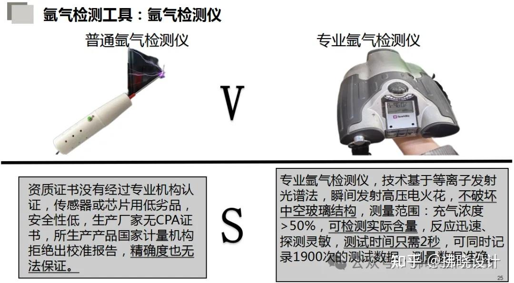
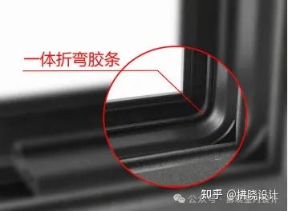
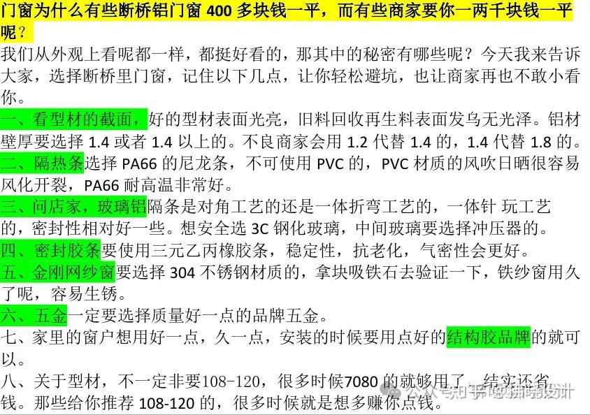

# 装修

## 封窗 [原文](https://zhuanlan.zhihu.com/p/698714864)

### 1. 铝合金型材

1. 6060-T66,简称 T6,强度较高，性能稳定，变形量少，达到航空级铝合金；
2. 6063-T5，为最常见的铝合金及交货状态，建筑型材应用最多 ;
3. 回收铝:旧铝窗、可乐罐，二次挤压成型后的铝材，表面上看是没有什么区别，但防腐蚀性能较差，喷涂容易脱落，承重和抗风压方面都不能达标，使用寿命也更短。
4. 2020 最新版“铝合金门窗”国家标准 GB/T8478-2020，硬度达 15um 才能达到抗风压标准。

### 2. 型材表面处理

表面处理分很多种，有木纹、电泳、瓷泳、喷涂、氟碳等。

粉末也有很多种品牌，普通的 3-5 年就退色，好点的粉末价格相差较大。

奥地利 tiger 老虎第二代邦定金属粉，老虎粉末是世界顶级粉末品牌，20 年的色衰大约在 3%--5%，属于比较好的粉末。

荷兰阿克苏诺贝尔则是全球最大的涂料生产商，优点在于无毒害、无污染、无浪费，与水性涂料等被称为环保涂料。

### 3. 门窗隔热条

隔热条主要是隔热作用，所谓的断桥铝就必须有隔热条连接两端铝型材，阻挡室外的热指数传导到室内。

隔热条品类有很多种，有 C 型、有 I 型、有 U 型、有丁型，还多腔体结构等，越复杂导热指数越低。

隔热条越薄，热传递越慢；隔热条越宽，隔热越好，同时起到了隔音效果。

PVC 材质：这种材质的隔热条使用寿命在 1-3 年，价格较低，但是使用中耐候性差，遇低温硬化、收缩、龟裂，所以不建议选择这种材质的胶条（颜色比较亮，反光系数比较高）。

PA66 材质：这种材质加百分之 25 玻璃纤维材料，在聚酰胺材料中有较高的熔点，是一种半晶体-晶体材料，在较高温度也能保持较强的强度和刚度，成型后仍然具有吸湿性，可使用寿命在 30 年以上。

### 4. 门窗密封胶条

胶条主要是密封作用，水密性和气密性与胶条的设计与材质密切相连。

复杂多腔体可弱化和阻断声音穿透。

特殊工艺采用的是软硬共挤 EPDM 胶条。

三元乙丙：这种材质的密封胶条使用寿命 20 年以上，有良好的耐候性、抗臭氧、抗老化性能。

### 5. 浮法玻璃

浮法玻璃是指用浮法工艺生产的玻璃，透明性，亮度，明亮和平整度比较好。

玻璃品牌：福耀 FUYAO、南玻 SG、信义玻璃、金晶 G-CRYSTAL、洛玻 CLFG、沙玻 SHABO、旗滨 KIBING、中玻 CNG、台玻等。

玻璃品种：白玻、超白玻、磨砂玻璃、蓝玻、LOW-E 玻璃等

玻璃加工品类：中空钢化玻璃、夹胶玻璃（干夹和湿夹）、防弹玻璃、防火玻璃等。

玻璃厚度：3、4、5、6、8、10、12、14、16、18、19 厘。

### 6. 双层中空（两玻一腔）、三玻两腔、单面夹胶中空、双面夹胶中空

两玻一腔就是两片玻璃合在一起，中间有铝条，形成一个腔体就叫两玻一腔，所说的中空玻璃，英文代表 A。

三玻璃两腔就是三片玻璃合在一起，中间有两条铝条，形成两个腔体就叫三玻两腔。

中间铝条越宽，隔音性能越好，中空主要作是隔音效果。
如：12A、18A、20A、27A 等

### 名词解释

1. 什么是夹胶玻璃？

夹胶玻璃就是把两片玻璃合在一起，中间有一层胶粘在一起，作用是碎了也不会掉落，会是一个整块的，更加安全。

夹胶英文代表 PVB，夹胶的厚度分 0.76PVB、1.14PVB、2.26PVB,薄膜越厚效果越好，价格也是贵。

1. 什么是氩气？

氩气英文代表：AR，是一种惰性气体，主要是起保护气体作用，中空内充氩气起到真空作用，同时保护玻璃中空太软粘在一起，充了氩气更加饱满。

3. 什么叫暖边条？

暖边条是中空玻璃的间隔铝条，内外间含有尼龙材质，阻挡玻璃与玻璃之间边缘的导热，

普通的不含有内外尼龙材质，就是铝隔条，通常为银色的，好点的是氟碳的，不具备玻璃与玻璃之间的隔热。

系统窗一般采用是暖边条，它的隔热性更好。

4. 什么叫在线 Low-E 玻璃？

   在线 LOW-E 玻璃就是低辐射玻璃，它是在玻璃表面上镀膜，是玻璃的辐射率由 0.84 降低到 0.15 以下形成的，防紫外线，更节能。优点：可热弯，可做单片

5. 什么叫离线 Low-E 玻璃？

离线 LOW-E 玻璃是采用真空磁控溅射镀膜设备，必须是新鲜玻璃原片的表面镀上金属银化合物膜层，比在线更节能。

LOW-E 玻璃的镀膜层是单质银，膜层越厚防辐射效果越好。

6. 什么叫离线单银（双银）Low-e 玻璃？

   - 离线 Low-e 玻璃在一个镀膜周期进行一次镀层，也就是镀银，针对 LOW-E 玻璃来说的单银。

   - 镀膜完成一次后再进行一次镀膜（镀在前一次的膜层上）这就是双银，现在市场上镀膜层最厚的 low-e 产品是三银，膜层越厚防辐射效果越好。

   - 单银玻璃的膜层数为 5 层；双银玻璃的膜层数为 9 层；三银玻璃的膜层数为 13 层。

   - LOW-E 膜层中镀有银层，银可将 98%以上的远红外热辐射反射出去，从而像镜子反射光线一样直接反射热量。

7. 什么叫遮阳系数 SC？

遮阳系数 Sc：在相同条件下，透过玻璃的太阳辐射能与透过 3mm 玻璃的太阳辐射能之比。透过 3mm 透明玻璃的太阳辐射能为 630w/m2；

遮阳系数 Sc 高好，还是低好？不同遮阳系数的玻璃适用于不同气候的地区。遮阳系数高，透过玻璃窗进入室内的太阳能辐射多，从而降低冬季的取暖费用。这种玻璃适合在冬季漫长的北方地区使用。遮阳系数低，对太阳直接辐射的阻挡效果好，可减少进入室内的太阳直接辐射能。这种玻璃适合在夏季漫长的南方地区使用。

8. 什么叫玻璃自爆？

9. 什么叫垂直等温线？

隔热条、密封胶条和玻璃设计在垂直一条线上就叫垂直等温线，才真正起到隔热、保温效果，有效阻隔热传递。

10. 什么叫一体折弯胶条、防水等压胶条、玻外长尾胶条？

等压一体折弯工艺胶条：属于软性发泡材质、整体折弯结构的，用在内开窗框上。

防水等压胶条：属于三无乙丙材质，用在外开玻扇上，包裹在玻扇的外，犹如汽车门密封胶条。

玻外长尾胶条：尾巴比较长，起到隔热作用。

11. 什么叫保温棉、聚氨酯？

保温棉属于 PEX 材质：比较软，阻燃材质，一般用在隔热条中和玻璃四周，起到保温隔热作用。

聚氨酯属于发泡材质：比较硬，一般用在型材腔体和门芯内。

隔热、保温性能更佳。

12. 什么叫多腔体结构设计？

型材有多个腔体的设计，隔热性保温性更高，室外冷腔越小，性能越好；

13. 什么是地漏式直流排水？

4 种规格的一体式排水解决方案，防倒灌式的直流排水

14. 什么叫门窗防盗等级？

门窗防盗等级一般以 RC1-RC6 来划分。

五金是门窗的心脏，门窗使用中顺畅、安全、耐用完全取决于五金的好坏了，差的五金可能使用 5 年左右就不好用了，好的五金可能使用几代人都可以了。

国内五金品牌：HOPO、瑞纳斯、兰德、霍曼、京都、希美克

进口五金品牌：HOPPE、索宾柯、富适博、G-U、丝吉利娅、诺托、吉斯、富尔、雷哲等。

15. 什么叫系统门窗？

系统门窗起源于欧洲，是一个性能系统的完美有机组合，需要考虑水密性、气密性、抗风压、机械力学强度、隔热、隔音、防盗、遮阳、耐候性、操作手感等一系列重要的功能，还要考虑设备、型材、配件、玻璃、粘胶、密封件各环节性能的综合结果，缺一不可，最终形成高性能的系统门窗。

### 高质量的门窗=高质量的型材+玻璃+配件胶条+加工工艺+安装工艺+…

高性能的门窗=高性能的型材 × 玻璃 × 配件胶条 × 加工工艺 × 安装工艺 ×…

所以：高质量的门窗 ≠ 高性能的门窗

保温性、隔声性、水密性、气密性、抗风压性能，统称五性。

保温性：K 值越小保温性能越好,一般 K 值在 2.0-3.0 之间，国际标准 K 值 1.2（M²K）

隔音性：分贝越大隔音效果越好，一般在 20-35 之间，好的门窗隔音达到 45 分贝。

水密性：P 值越大水密性越好，1 级最低，6 级最高，常用 3 级左右。

气密性：Q 值越小气密性越好，1 级最低，8 级最高，常用 6 级左右。

抗风压：P 值越大抗风压性能越好，1 级最低，9 级最高，常用 5 级左右。

五性均达到高标准的就叫：高性能门窗

保温性：K 值 M²K 整窗 K 值 ≈0.2 框 M²K+0.8 玻 M²K

### 如何选择系统门窗？

1. 选型号：门窗宽度分为 55mm、60、70、75、80、90、108、110、120、135 等等，以北京为例，90%选用的都是七零或者八零系列，108-120 基本都是南方选用的窗纱，一体窗以外开居多。

2. 选壁厚：门窗的壁厚有 1.0mm、1.2、1.4、1.6、1.8、2.0、3.0，非标，国标，国家强制性执行标准 1.4mm，推荐性执行标准 1.8mm 及以上壁厚（且内壁和外壁均厚均为一个厚度，部分商家以次充好，外框壁厚给你用 2.0mm，内壁厚给你用 1.6mm 的）；如果你家不是要做那种超大玻璃的落地窗且楼层较低，选实际厚度能达到 1.4 的就够了，具体的可根据窗洞尺寸和设计方案来定，比如三四个平方都不到的窗户选 1.8mm 的就太浪费了,你多花的这个钱呢，还不如去升级一下玻璃；【一般低楼层（12 楼及以下）、自建房选壁厚 1.4mm 其实已经够用了；大玻璃、高楼层建议 1.8mm 壁厚或者 2.0mm 壁厚】

3. 选铝材：我们建议选择 6063T5 的原生铝型材，可以看型材的截面,原生铝的型材表面光亮，废旧料回收的再生铝呢，表面发物没有光泽。尽量选择品牌铝型材，大部分品牌铝型材选用的都是原生铝。

4. 选隔热条：断桥铝为什么叫断桥铝？这个就是断桥铝当中的桥，主要是用来断开冷和热的传导，以及提高整窗的强度。一定要选择 PA66 尼龙条，PA66 尼龙条耐高温，韧性好，强度高，不可以使用 PVC 的塑料条，容易变形（PVC 反光度较高，比较亮，PA66 易折断且断面整齐，PVC 不易折断，且折断后断口发白、变形，PA66 阻燃性较好，离火自熄，PVC 燃烧时间长且有塑料味道）；

5. 选中空铝条：那些天天跟你们说要选择一体折弯工艺,不要选择擦接工艺，会影响窗户的强度，会漏气啊,多少有营销噱头在里面。漏不漏气和铝隔条的折弯还是插接工艺没有半毛钱关系，主要看两道胶的工艺,其实大家真正需要考虑的不是间隔条的工艺，而是材质，特别是北方地区低导热抗结露的暖边条才是首选。

6. 选密封胶条：要使用三元乙丙橡胶条，三元乙柄胶条抗老化,不发硬,不断裂，回弹利好，你像我们汽车门边上使用的就是这种胶条，劣质的胶条时间久了就会发硬开裂，这也是导致很多窗户漏风的主要原因。

7. 选金刚网纱窗：纱网我们一定要选择 304 不锈钢材质的，你像那些 201 的的都不要，时间长了容易生锈，你可以拿个吸铁石验证一下。

8. 选五金件：五金件关乎到整个窗的使用寿命，不容小视。北方地区 70%以上做的都是内开内倒窗，如果你只做平开不需要内倒，那么普通五金件即可，如果你想做内开内倒窗，那我还是强烈建议你选择一下品牌五金。

9. 选玻璃：选择带 3C 标志的钢化玻璃,安全不伤人才是首要的。玻璃原片要采用品牌玻璃而不是杂牌玻璃。想要保温效果好,就选择三玻两腔中空玻璃,想要隔音效果好,就选择 pvb 夹胶中空玻璃,如果想要经济实惠那就选择中空双玻就可以了（隔绝低频噪音用夹胶玻璃，隔绝高频噪音用三玻两腔， 想要隔热好用 LOWE 玻璃）。

PS：高频噪音主要有—喇叭声、汽车鸣笛声、乐器、广场舞、狗叫声、学校广播、说话声；低频噪音主要有—火车声、飞机声、汽车发动机声(尤其是马路、高架桥附近)、轮船声等；电梯、水泵、配电房、变压器、发电机等，只要处于工作状态都能持续地发出“嗡嗡”声；还有破风声、音响声、大型活动、酒吧、夜店、KTV 歌厅等；

10. 选玻璃胶：很多人最容易忽视的就是玻璃胶了,到目前为止也没几个人讲到过玻璃胶的重要性这也就导致了大部分业主不会自己另外花钱去。购买玻璃胶,认为这些都是商家包含在内的,那么商家包含在内所提供的玻璃胶,您觉得它能使用多少年呢?多少年之后分化开裂、漏风、漏水,其实大部分窗户漏水的真正原因就是玻璃胶开裂导致的。

11. 安装：三分产品,七分安装!安装工艺和辅料也尤为重要,有些安装师傅为了涂方便,就直接在隔热条上打螺丝,还有完全不用螺丝,只用发泡器固定的,最好就是安装的时候业主尽量到场,毕竟各个商家对安装师傅的安装标准也是不一样的。所以在选择门窗这块,大家还是要擦亮眼睛,毕竟这行的水有点深,包括也会有一些一次充好的产品流入市场,售后问题跟不上也是行业的通病,所以不光是选好的产品就万事大吉了,安装环节你还是需要把好关的。最后还有一点需要让大家知道的是呢,北方的冬天寒冷,对保温的要求极高,这也就导致了南方和北方门窗制作的标准以及他研究的方向,它是不一样的,材料的大小也不一样,开装的方式也不一样,还是那句话,不是所有的都要选择最贵的,根据需求选择才是最正确的。

### 问题卖家

1.  窗体-宽度：北方：70mm、75mm、80mm;
2.  窗体-壁厚: 内外壁一致，1.8mm 或者 2.0mm
3.  窗体-铝合金型材：？6060-T66 > 6063-T5（常见） > 垃圾回收铝；原生铝横截面光滑，再生铝暗淡无光；
4.  窗体-铝材表面处理：？奥地利 tiger 老虎第二代邦定金属粉（老虎金粉）> 荷兰阿克苏诺贝尔则；
5.  窗体：地漏式直流排水
6.  //---------
7.  金刚网纱窗：选择 304 不锈钢材质 > 201 （不要）
8.  //---------
9.  玻璃-品牌：
10. 玻璃-品种：LOW-E 玻璃
11. 玻璃-厚度：玻璃：单片 6 厘，铝片：12A
12. 玻璃-加工品类：双面夹胶中空 > 单面夹胶中空 > 三波两腔；
13. 玻璃-中空气体：（单片玻璃中）填充 氩气（常见） > 氪气（需要专业仪器检测）；
14. 玻璃-夹层膜种类：（两片玻璃中间部分-双面夹胶的单面）SGP 膜 > EVA 膜 > PVB 膜（常见：2.26PVB > 1.14PVB > 0.76PVN）；越厚越好；
15. 玻璃-暖便条（中空铝条）：（双面玻璃链接的中间）含尼龙材质 > 铝隔条（银色，不隔热）；选择一体折弯工艺,不要选择擦接工艺；
16. 玻璃-遮阳系数 SC：参考值值 630w/m2，北方越大越好，南方越小越好；（大，辐射多，冬天暖和）
17. //---------
18. 门窗隔热条：PA66 尼龙条 材质（好）>PVC 材质（垃圾-1-3 年）；多腔体结构（第五代）；隔热条越薄，热传递越慢；隔热条越宽，隔热越好，同时起到了隔音效果；
19. 门窗密封胶条：三元乙丙橡胶；
20. //---------
21. 隔热条、密封胶条和玻璃设计子在垂直一条线上；
22. 防水等压胶条，属于三元乙丙材质，用在外开玻扇上，包裹在玻扇的外，犹如汽车门密封胶条。
23. 玻外长尾胶条，尾巴比较长，起到隔热作用。
24. 保温棉、聚氨酯：

    - 保温棉属于 PEX 材质，比较软，阻燃材质，一般用在隔热条中和玻璃四周，起到保温隔热作用。
    - 聚氨酯属于发泡材质，比较硬，一般用在型材腔体和门芯内。

25. 玻璃：带 3C 标志的钢化玻璃,安全不伤人才是首要的。玻璃原片要采用品牌玻璃而不是杂牌玻璃。

    - 想要保温效果好,就选择三玻两腔中空玻璃；
    - 想要隔音效果好,就选择 pvb 夹胶中空玻璃；
    - 如果想要经济实惠那就选择中空双玻就可以了；
    - （隔绝低频噪音用夹胶玻璃，隔绝高频噪音用三玻两腔， 想要隔热好用 LOWE 玻璃）。

    注：高频噪音主要有—喇叭声、汽车鸣笛声、乐器、广场舞、狗叫声、学校广播、说话声；

        低频噪音主要有—火车声、飞机声、汽车发动机声(尤其是马路、高架桥附近)、轮船声等；电梯、水泵、配电房、变压器、发电机等，只要处于工作状态都能持续地发出“嗡嗡”声；还有破风声、音响声、大型活动、酒吧、夜店、KTV歌厅等；

26. 玻璃胶--自己购买
