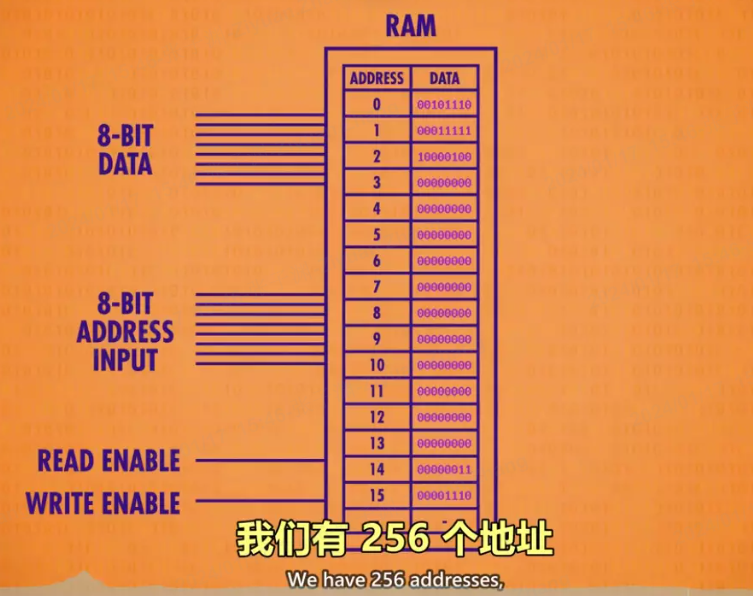
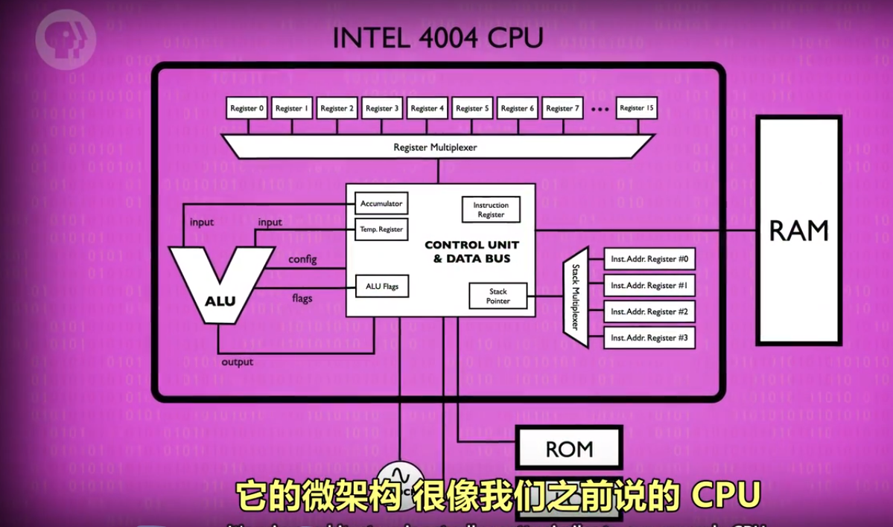

# 计算机科学速成课 https://shimo.im/docs/PJAUY30F1uYksv0h/read

- 计算机鼻祖--算盘：逢十进一
- 星盘：在海上计算维度；
- 计算尺：帮助计算乘法、除法；
- 制作各种工具：算日出、潮汐、天体的位置、或纯粹计算；

##

1.  bug（虫子）:程序出错为什么叫 bug

    早期计算机是巨大的，通过机械传动的，机械中容易出现虫子卡住机械转动，导致程序暂停/停止运行，需要清理虫子才能继续运行；
    出现 bug(虫子)代表机械停止了，程序出问题了；

2.  安全漏洞&补丁由来：

    在 1940 年代，是用打孔纸带进行的，但程序出现了问题（也就是漏洞），为了节约时间，只能贴上胶带也就是打补丁来填补空隙，漏洞和补丁因此得名。

## 位(bit) / 字节(byte) / 字（word）

1. 位(bit)：音译为“比特”，表示二进制位。位是计算机内部数据储存的最小单位，11010100 是一个 8 位二进制数。

   一个二进制位只可以表示 0 和 1 两种状态；两个二进制位可以表示 00、01、10、11 四种状态；三位二进制数可表示八种状态……。

2. 字节(byte)：音译为“拜特”，习惯上用大写的“B”表示。字节是计算机中数据处理的基本单位。

   计算机中以字节为单位存储和解释信息，规定一个字节由八个二进制位构成，即 1 个字节等于 8 个比特(1Byte=8bit)。
   八位二进制数最小为 00000000，最大为 11111111；通常 1 个字节可以存入一个 ASCII 码，2 个字节可以存放一个汉字国标码。

3. 字（word）：计算机进行数据处理时，一次存取、加工和传送的数据长度称为字(word)。

   一个字通常由一个或多个(一般是字节的整数位)字节构成。例如 286 微机的字由 2 个字节组成，它的字长为 16；486 微机的字由 4 个字节组成，它的字长为 32 位机。

- 1byte=8bit;
- 1KB=1000B(byte) = 8000bit;
- 另一种计算方法（二进制里的算法）:
- 1 千字节 = 2 的 10 次方 byte = 1024 字节；
- 1000 也是千字节（KB）的正确单位；所以 1000 和 1024 都对；**?**

  你说的是 1K ＝ 2 的 10 次方吧。因为这里所说的 K 并不是读千，而是读 kei。这是因为在计算机中，数据是以二进制形式存储的。二进制的意思就是只有两个数 0 和 1，但是 0 和 1 只能表示两个信息，而计算机要表示数以亿计的信息，就只能对 0 和 1 进行组合。比如有两个空位，使用二进制数，每个空位只能放一个 0 或者一个 1，因此每个空位有 2 种情况，2 个空位就有 2 的 2 次方种组合情况(这个懂了吗？)，再比如有三个空位，使用二进制数，每个空位只能放一个 0 或者一个 1，那么就有 2 的 3 次方种组合情况，以此类推，有 10 个空位，使用二进制数，就有 2 的 10 次方种组合情况。`在计算机中，把 2 的 10 次方叫做 K(kei)，`它就和十进制中的万有点类似(1 万＝ 10 的 4 次方，因为有四个空位，每个空位可以放 0 ～ 9 的任意一个数，因此每个空位有 10 种情况，4 个空位就有 10 的 4 次方种组合情况)，就是一个很大的数。不要把十进制中的 1 千和二进制中的 1K 搞混了。

  1KB=1024B，1MB=1024KB，1GB=1024MB，1TB=1024GB，1PB=1024TB，1EB=1024PB

* 中国表示数量的数词:一、二 、三、四、五、六、七、八、九、 十、百、千、万、亿、兆、京、垓 、杼、穰、沟、涧、正、载、极。
* 佛教的传入加入的数词：恒河沙、阿僧 □、那由它、不可思议、无量。
* 日本新增：大数（它原本是与小数相对应的，后来才被引申为一个新的数词）
  1. 万：代表的是 10 的四次方.
  2. 亿：代表的是 10 的八次方.
  3. 兆：代表的是 10 的十二次方.
  4. 京：代表的是 10 的十六次方.
  5. 垓：代表的是 10 的二十次方.
  6. 杼：代表的是 10 的二十四次方.
  7. 穰：代表的是 10 的二十八次方.
  8. 沟：代表的是 10 的三十二次方
  9. .......

## 第 5 课: 算术逻辑单元 (ALU)

构成：ALU 有 2 个单元，1 个算术单元和 1 个逻辑单元（Arithmetic Unit 和 Logic Unit）

作用：计算机中负责运算的组件，处理数字和逻辑运算的最基本单元。

- 算术单元：由半加器、全加器组成；半加器、全加器由 AND、OR、NOT、XOR 门组成

  1. 溢出：超出计算机（存储/处理）范围了；8bit 二进制相加结果超出 8 位，超出部分被舍弃；

     8bit 能存储 0~255 的数据；强行放 266 就超过了 255，会把第 0 个向前挤掉变成 1~266，出错；
     8 个位置想坐 9 个人，把第一个人向前挤掉；

  2. 计算机底层只有加减，没有乘除和其他高级运算;

     乘除和其他高级运算：用加减代替；例如 2 乘 5 实际上是 2 加了 5 次；

     2.1、 手机、笔记本等高级处理器，有专门做乘法的算术逻辑单元（更多的逻辑门、没有其他特殊）；普通处理器没有。

- 逻辑单元：执行逻辑操作，如 NOT、AND、OR 等操作，以及做简单的数值测试。

## 第 6 课: 寄存器与内存（RAM）

### 寄存器：

1. 锁存器：存储 1 位数字。
2. 寄存器：一组并排的锁存器；存储多位数字。这个数字有多少位，叫位宽；早期 8 位->16 位->32 位。
3. 门锁矩阵：寄存器的优化版--以矩阵的方式来存"锁存器的组合件"；消耗物理资源少（比如电线），存储的更多。

   - 位址：锁存器在矩阵中的行数与列数。例如 12 行 8 列
   - n*n 门锁矩阵可存放 n^2 个锁存器，但同一时间只能写入/读取 1 个数字。（早期为 16*16 矩阵）

     **注：**但 1 个矩阵只可记录 1 位数字，n 个矩阵组合在一起，才可记录 n 位数。如 1 个 8 位数，会按位数分成 8 个数，分别存储在 8 个矩阵的同一个位址中。

   - 多路复用器：一组电线，输入 2 进制的行址&列址，可启用矩阵中某个锁存器。

4. 多路复用器与矩阵 配合存储数据。

### 内存：---- 指令（程序）存 在内存中

内存的一个重要特性：可以随时访问任何位置，所以叫“随机存取'存储器'”简称 RAM

1.  内存粗略定义：将一堆“独立的存储模块”和“电路”看做一个单元，组成内存方块；n 个内存方块组成内存模块。在一个电路板上所有的内存方块统称为内存(RAM)。
2.  RAM（内存）：地址、数据构成；例如：数据由 8 位构成（00010100），数据的前四位指定“操作码”，后四位代表数据来自哪里--指定“内存地址”或“寄存器”

## 第 7 课: CPU（中央处理器单元）--- 负责执行程序（指令）

程序有一个个操作组成，这些操作叫“指令”（instruction）；因为他们指示计算机要做什么；

CPU 负责执行程序。通常由 寄存器、控制器单元、ALU（计算逻辑单元）、时钟组成。 与 RAM 配合，执行计算机程序。CPU 和 RAM 之间用“地址线”、“数据线”和“允许读/写线”进行通信。

- 概念梳理

  1. 寄存器：不在控制器单元内的(例：ABCD)；
  2. 控制器单元： 像指挥部，有序的控制指令的读取、运行与写入。控制器单元包含：寄存器（临时保存 ALU 的结果）、指令地址寄存器、指令寄存器、解析指令的逻辑门组件

     “例如：” 当启动计算机时，所有寄存器从 0 开始。

     - 寄存器：临时保存 ALU 的结果，关闭 ALU 后，再把值写入正确寄存器；
     - 指令地址寄存器：存当前指令的内存地址，追踪程序运行到哪里了。类似于银行取号，该器件只按顺序通报地址，让 RAM 按顺序将指令交给指令寄存器。
     - 指令寄存器：存当前指令。
     - 解析指令的逻辑门组件：

  3. ALU（计算逻辑单元）--看上面

  4. 时钟：负责管理 CPU 运行的节奏，以精确地间隔，触发电信号，控制单元用这个信号，推动 CPU 的内部操作。

     - 时钟速度：CPU 执行“取指令 → 解码 → 执行”（fetch → decode → execute）中每一步的速度叫做“时钟速度”，单位赫兹 Hz，表示频率。
     - 超频/降频：

       1. 超频，修改时钟速度，加快 CPU 的速度，超频过多会让 CPU 过热或产生乱码。
       2. 降频，降低时钟速度，达到省电的效果，对笔记本/手机很重要。

- CPU 工作过程：

  1. 取指令阶段（fetch）：“指令地址寄存器”发“地址”给 RAM → RAM 发“该地址内的数据”给“指令寄存器” → “指令寄存器”接受“数据”
  2. 解码阶段（decode）：“指令寄存器”发送“数据-指令”给“控制单元” → 由“控制单元”进行解码（逻辑门确认操作码）
  3. 执行阶段（execute）：“控制单元”执行“指令”（ → 涉及计算时 → 调用所需寄存器 → 传输入&操作码给 ALU 执行）→ 调用 RAM 特定地址的数据 → RAM 将结果传入寄存器 → 指令地址寄存器+1

## 第 8 课: 指令和程序

- 概念梳理

  1. 指令：指示计算机要做什么，多条指令共同组成程序。如数学指令，内存指令。
  2. 指令表（给人看的）：记录指令名称、用法、操作码、对应的 “内存地址”或“寄存器”的表格。

  **注:** 指令和数据都是存在同一个内存里的。每个“操作码”对应的一个指令。

- 原则：

  1.  RAM 每一个地址中，都存放 0 或 1 个数据。
  2.  特定的数字组合，就表示为一个指令，否则表示一个值。

- 指令的执行：

  1. LOAD 指令：

     - 计算机会按地址的顺序，读取 RAM 中所记录的指令/数据。
     - 计算机接收到指令后，如 LOAD_A，则通过“数据线”将“数据”传至“寄存器 A”。

  2. ADD 指令：ADD B A 指令告诉 ALU，把寄存器 B 和寄存器 A 中的数字加起来，存到寄存器 A 中。
  3. JUMP 指令：

     - 遇到 JUMP 指令，程序会跳转至对应的 RAM 地址读取数据。
     - JUMP 指令可以有条件跳转（如 JUMP-negative），也可以无条件跳转。

  例如：指令：从后四位指定的内存读取数据然后存到寄存器 A 中（ 处理“后四位数据”把“结果”保存到“指定的存储器”）

  **注：** 可以把 RAM（内存）的数据简化为指令或数据 更容易理解；根据地址找到对应的指令处理数据（指令中指向的寄存器中的）

- 计算机指令长度问题： 由于早期计算机每个字只有 8 位，指令只占 4 位，意味着只能有 16 个指令，这远远不够。

  现代计算机有两种方式解决指令不够用的问题：

  1. 更多位来表示指令，如 32 位或 64 位。
  2. 采用“可变指令长度”，令不同的指令的长度不同，尽量节约位数。

## 第 9 课: 高级 CPU 设计

- 概念梳理

  1. 硬件解码:
  2. 缓存模块（cache）:
  3. 指令流水线：
  4. 多核处理器：

- 内容

  1. 早期通过加快晶体管速度，来提升 CPU 速度。但很快该方法到达了极限。
  2. 给 CPU 设计了“专门除法电路+其他电路”来做复杂操作：如游戏，视频解码 -- 硬件解码？
  3. CPU 添加缓存模块（cache）：  
     为了不让 CPU 空等数据，在 CPU 内部设置了一小块内存，称为缓存；  
     空等原因：从 RAM 到 CPU 的数据传输速度低于处理数据速度（要通过总线，RAM 还要时间找地址、取数据、配置、输出数据）。

     1、加载：计算机数据通常是按顺序排列和处理的，当 CPU 加载一条数据时，从 RAM 中拿当前数据及后面的一整块数据放缓存中；  
     2、使用：命中缓存直接用，没有命中则从 RAM 中拿；  
     3、保存：处理完的数据保存在缓存中（不是保存到 RAM 中），以便后续使用；同时标记缓存存储的每个内存块为“脏位”；  
     脏位：缓存副本中的数据与 RAM 中的数据不一样。  
     4、同步：缓存满时，处理器请求新内存块时，擦除旧块释放空间前，检测脏位写回 RAM；

  4. 指令流水线 ---- 让取址 → 解码 → 执行三个步骤同时进行。并行执行指令，提升 CPU 性能。  
     1、在 CPU 的连续循环中 执行顺序是 fetch-decode-execute（取指令-解码-执行）；需要三个时钟周期来执行一条指令；  
     2、多条指令时，decode（解码）第 N+1 条指令时，fetch(取指令)部分加载第 N+1 条指令；  
     execute（执行）第 N 条指令时，decode（解码）第 N+1 条指令，fetch(取指令)第 N+2 条指令；  
     **注：**数据具有依赖性、跳转程序；解决方法：乱序运行、预测分支（高端 CPU）
  5. 一次性处理多条指令
  6. 同时运行多个指令流（多核 CPU）：  
     多核处理器：一个 CPU 芯片中，有多个独立处理单元。但因为它们整合紧密，可以共享一些资源。
  7. 超级计算机（多个 CPU）：在一台计算机中，用无数个 CPU，做怪兽级的复杂运算，如模拟宇宙形成。

## 第 10 课: 早期编成--程序如何进入计算机

早期，电脑无内存的概念，人们通过打孔纸卡/纸带 等物理手段，输入数据（数字），进入计算机。

- 概念梳理

  1. 控制面板
  2. 储存程序计算机

- 打孔卡片/纸带（机器里有个金属探针）--制表(功能单一)

  1. 打孔卡片被认为是便宜、可靠也易懂。62500 张纸卡=5MB 数据
  2. 当一张卡片被送入“汇总机”时，金属探针通过小孔，连通电路，该特定答案的运行总数加一。
  3. 早期的“汇总机”不是计算机，只能做数据汇总；它的操作固定，不可编成。
  4. 打孔纸卡/纸带 存的是数据，不是程序。

- 控制面板：随后，汇总机（制表机）增加了减、乘、除功能，甚至可以决定何时执行某些指令，为了正确执行不同计算，程序员创造了控制面板；

  1. 面板有很多小插孔，程序员可以插电线，让机器的不同部分 互相传数据和信号。因此也被叫做插线板；
  2. 插线板：通过插拔线路的方式，改变器件之间的连接方式，进行编程。
  3. 面板开关（1980s 前）：通过拨动面板上的开关，进行编程。输入二进制操作码，按存储按钮，推进至下一个内存位，直至操作完内存，按运行键执行程序。（内存式电脑）

  <!-- 4. 不幸的是，运行不同的程序时要重新接线。
  5. 因此到 1920 年代，控制面板变成可插拔的。让编程更方便，可以给机器插入不同程序。例：一个计算工资，一个计算税收
  6. 但给插线板编成很复杂，一堆缠结的电线 -->

- 现代计算机基础结构——冯诺依曼计算机

  1. 储存程序计算机--随着内存普及不再将程序放在物理插线板，放在计算机内存中。内存足够大的话 还可以存程序所需的数据；
  2. 冯诺依曼计算机的标志是，一个处理器(有算术逻辑单元)、数据寄存器、指令寄存器、指令地址寄存器、内存

  

## 第 11 课: 编程语言发展史

- 概念梳理

  1. 伪代码：用自然语言（中文、英语等）对程序的高层次描述;例：获取内存值，数字加一。
  2. 机器码（机器语言）：计算机能处理二进制，二进制是处理器的“母语”，事实上，他们“只能”理解二进制。
  3. 操作码：例 ：上面 RAM（内存）数据的前四位；
  4. 助记符: 每个操作码分配一个简单的名字，叫“助记符”。助记符后面紧跟数据，形成完成指令。例：LOAD_A 14，LOAD_A 就是助记符。
  5. 汇编码：用助记符写的指令。例：LOAD_A 14。
  6. 汇编器：用于将“汇编语言（助记符写的指令）”转换成“机器语言（机器码）”。
  7. 编译器：专门把高级语言转化为低级语言（汇编/机器码）。
  8. 安全漏洞&补丁由来：在 1940 年代，是用打孔纸带进行的，但程序出现了问题（也就是漏洞），为了节约时间，只能贴上胶带也就是打补丁来填补空隙，漏洞和补丁因此得名。
  9. 软件：先前都是硬件层面的编程，硬件编程非常麻烦，所以程序员想要一种更通用的编程方法，就是软件。

- 最早高级编程语言“A-0”

  1.  汇编只是修饰了一下机器码，一般来说，一条汇编语句对应一条机器指令。所以汇编码和底层硬件的连接很紧密，汇编器仍然强迫程序员思考底层逻辑。
  2.  葛丽丝·霍普博士，设计了一个高级编程语言，一行高级编程语言 可以转成几十条二进制指令。
  3.  高级语言没有低级语言运行的快，但是高级语言写代码写的快，取平衡下。
  4.  **过程：** 高级编程语言 → 编译器 → 汇编码/机器码

- 通用编程语言——COBOL

  1. 以前一种语言只能运行在一种类型的电脑上，换成其他类型的电脑不能用，需要重新写代码。
  2. 为此，工业界、学术界、政府的计算机专家组建一个联盟，开发一种通用编成语言，可以在不同计算机上通用。"普通面向商业语言"，简称 COBOL
  3. 每个计算架构需要一个 COBOL 编译器，不管是什么电脑都可以运行相同的代码，得到相同结果。（ 一次编写，到处运行 ）

- 现代编程语言:1960s-2000
  1. 1960s 起，编程语言设计进入黄金时代。
  2. 1960：LGOL, LISP 和 BASIC 等语言
  3. 70 年代有：Pascal，C 和 Smalltalk
  4. 80 年代有：C++，Objective-C 和 Perl
  5. 90 年代有：Python，Ruby 和 Java

## 第 12 课: 编程基础-语句和函数

- 概念梳理

  1. 语法: 规定句子结构的一系列规则。
  2. 程序：由一个个指令组成。
  3. 控制流语句：条件语句（if）、循环语句（while、for）
  4. 函数（方法、子程序）：当一个代码很常用的时候，我们把它包装成一个函数 。
  5. 库：大量函数的集合。

## 第 13 课: 算法入门

- 概念梳理

  1. 算法的复杂度(大 O 表示法)：算法的“输入大小”和“运行步骤”之间的关系 叫做“算法的复杂度”；
  2. 算法的复杂度：来表示运行速度的量级

- 内容

  1. 选择排序:复杂度为 O(n²);--交换
  2. 归并排序的算法复杂度为 `O（n*log n）`，n 是需要比较+合并的次数，和数组大小成正比，log n 是合并步骤所需要的的次数，归并排序比选择排序更有效率；
  3. Dijkstra 算法（图）：一开始复杂度为 O(n²)，优化后复杂度为 `O（nlog n +I）`，n 表示节点数，I 表示有多少条线。

## 第 14 集 数据结构

算法处理的数据 存在内存里的格式是什么？

- 概念梳理

  1. 数组（Array），也叫列表（list）或向量（Vector）：是一种数据结构。

     - 数组在内存中 按顺序储存，在中间插一个值很困难。
     - 为了拿出数组中某个值，我们要指定一个下标（index），大多数编程语言里，数组下标都从 0 开始，用方括号 [ ] 代表访问数组。
     - **偏移**： j[0],会去内存地址 1000，加 0 个偏移，得到地址 1000，拿值：5； j[5]会从 j[0]加 5 个偏移，得到地址 1005，拿值：4

     

  2. 字符串 ：是字母、数字、标点等组成的数组;

     - 字符串在内存里以 0 结尾。（0 不是“字符串 0”，是“二进制 0”，叫字符“null”，标识字符串结尾）

     

  3. 矩阵： 可以把矩阵看成数组的数组

     

  4. 结构体(Struct)：把几个有关系的变量存在一起叫做结构体

     - 存结构体的数组和其他数组一样，创建时就有固定大小，不能动态增加大小。
     - 但结构体可以创建更复杂的数据结构，消除（数组的）这些限制。

     

  5. 指针：指针是一种特殊变量，指向一个内存地址，因此得名。
  6. 节点（结构体的一种）：存一个变量，一个指针（pointer）
  7. 链表：用节点可以做链表，链表是一种灵活数据结构，能存很多个 节点 (node)，灵活性是通过每个节点 “指向” 下一个节点实现的。

     - 链表可以是循环的，也可以是非循环的，非循环的最后一个指针是 0（“null”代表链表的尽头）
     - 数组大小需要提前定好，链表大小可以动态增减。通过改变指针值，把新节点插入链表。
     - 链表 很容易 重新排序、两端缩减、分割、倒序等。

     

  8. 队列（用的链表）："队列" 就像邮局排队，谁先来就排前面，这叫 先进先出（FIFO——first in first out）。

     - 入队、出队

  9. 栈（用的链表）：把"栈"想成一堆松饼,做好一个新松饼，就堆在之前上面,吃的时候，是从最上面开始。

     - 栈是后进先出(LIFO)
     - 入栈（push）、出栈(pop)

  10. 树（ 链表加一个指针，nextLeft【左侧】、nextRight【右侧】、value【值】）

      - 根节点
      - 子节点
      - 母节点
      - 页节点（leaf）：没有任何子节点。
      - 二叉树：有两个子节点。
      - 看子节点数量，也可以三叉树、四叉树。。。
      - **重要**：树的“根到“叶”是单向的

  11. 图（链表的一种）：如果数据随意连接，有循环，我们称之为图，

## 第 15 课 阿兰图灵

- 可判定性问题

  是否存在一种算法，输入正式逻辑语句 输出准确的"是"或"否"答案？【被证明不存在--计算机解决问题的能力是有极限的】

  上帝是否是万能的：上帝能否创造出一块上帝都举不起的石头

  1.  阿隆佐邱奇，Lambda 算子:

      美国数学家 阿隆佐·丘奇，开发了一个叫"Lambda 算子"的数学表达系统，证明其不存在。

  2.  图灵机:

      只要有足够的规则，状态和纸带，图灵机可以解决一切计算问题。和图灵机一样完备，叫做“图灵完备”。

  3.  停机问题: 证明图灵机不能解决所有问题。

- 图灵测试

  向人和机器同时发信息，收到的回答无法判断哪个是人，哪个是计算机，则计算机达到了智能程度。  
  应用：机器验证

- 二战加密与破解：

  加密后的字母等于自身，排除掉自身；查找剩余的字母组成的单词；

## 第 16 课 软件工程

- 概念梳理

1. 对象：

   - 当任务庞大，函数太多，我们需要把函数打包成层级，把相关代码都放一起，打包成“对象”。
   - 对象可以包括其他对象，函数和变量。
   - 把函数打包成对象的思想叫做“面向对象编程”，面向对象的核心是隐藏复杂度，选择性的公布功能。

2. 程序编程接口（AP）：I
3. 集成开发环境（IDE）：程序员用来专门写代码的工具
4. 调试（debug）：IDE 帮你检查错误，并提供信息，帮你解决问题，这个过程叫调试
5. 文档与注释：
6. 版本控制：
7. 质量控制：测试可以统称“质量保证测试”（QA），作用是找 bug
8. alpha 与 beta

   - beta 版软件，即是软件接近完成，但没有完全被测试过，公司有时会向公众发布 beta 版，以帮助发现问题。
   - alpha 是 beta 前的版本，一般很粗糙，只在内部测试

## 第 17 课 集成电路与摩尔定律（硬件的发展）

继电器 → 真空管（电子管）→ 晶体管

“晶体管”标志着“计算 2.0 时代”
“集成电路”标志着“计算 3.0 时代”

- 概念梳理

  1. 分立元件： 一开始，计算机都有独立组件构成，叫“分立元件”，然后不同组件再用线连在一起。
  2. 数字暴政： 如果想提升性能，就要加更多部件，这会导致计算机的构成更复杂，这个问题叫做“数字暴政”。
  3. 集成电路（IC）：与其把多个独立部件用电线连起来，拼装出计算机，不如把多个组件包在一起，变成一个新的独立组件。这种新的独立组件就叫集成电路（IC）。
     - 早期一个 “集成电路（IC）” 只有几个晶体管。
     - 即使只有几个晶体管，也可以把简单的电路（逻辑门）封装成单独组件。
     - IC 就像乐高积木一样，可以组合出无数种设计。
     - 最终还需要连接起来，创造更复杂的电路，例如计算机。
  4. 印刷电路板（PCB）：为了不用焊接 IC 或用一大堆线连接 IC，发明了印刷电路板（PCB）；它通过蚀刻金属线的方式，把零件连接到一起。
  5. 硅：有时可导电，有时不能导电。根据其特性，控制其能不能导电，做成半导体。
  6. 光刻： 即用光把复杂图案印到材料上。我们把一片薄片状的硅叫做晶圆，通过一系列生产步骤，将晶圆表面薄膜的特定部分除去的工艺叫做光刻。
  7. 摩尔定律：每两年左右，得益于材料和制造技术的发展 ，同样大小的空间，能塞进两倍数量的晶体管。【已经不存在了】

- 进一步小型化会碰到的问题【摩尔定律已经到“数字暴政”了】

  1. 由于光的波长限制，精度已到极限。
  2. 量子隧穿效应：当晶体管非常小，电极之间可能只距离几个原子，电子会跳过间隙，会产生漏电问题

- 光刻

  
  
  
  
  
  

## 第 18 课 操作系统

- 概念梳理

1. 操作系统(OS)： 操作系统也是一种程序，不过它有操作硬件的特殊权限，可以运行和管理其他程序。

   - 以前计算机只能运行一个程序，运行完需要手动放下一个程序，后来计算机运行效率提升，放程序的时间大于运行的时间。
   - 需要一种方式让计算机自动运行，于是操作系统(OS)诞生了。
   - 操作系统一般是计算机启动的第一个程序，其他程序有它启动和管理。

2. 批处理：一个程序运行后会自动运行下一个程序。
3. 外部设备：和计算机连着的其他设备，如打印机。
4. 设备驱动程序：为了使所写程序和不同类型的电脑兼容，我们需要操作系统充当软件和硬件之间的媒介，更具体地说，操作系统提供程序编程接口(API)来抽象硬件,叫“设备驱动程序”。程序员可以用标准化机制，和输入输出硬件（I/O）交互，

   - 问题：不同牌子的同一种设备（例：打印机），底层调用不一样，写代码很痛苦。

5. 多任务处理：操作系统能使多个程序在单个 CPU 上同时进行的能力，叫做“多任务处理”

   - 问题：CPU 处理太快，其他部分处理太慢（例：打印）；不能闲置昂贵的 CPU，其他部分工作时给它任务处理。

6. 虚拟内存：多程序处理带来了一个程序所占用内存可能不连续的问题，导致程序员难以追踪一个程序，为了解决这个问题操作系统会把内存地址虚拟化，这叫“虚拟内存”。

   - 使程序以为它用的内存是连续的（地址从 0 开始）；“虚拟内存”映射“物理内存”，操作系统做的。

7. 动态内存分配：虚拟内存的机制使程序的内存大小可以灵活增减，叫做“动态内存分配”，对程序来说，内存看上去是连续的。
8. 内存保护：给每个程序分配单独的内存，那当这个程序出现混乱时，它不会影响到其他程序的内存，同时也能有效地防止恶意程序篡改其他程序，这叫做内存保护。
9. 多用户分时操作系统（Multics）：用来处理多用户同时使用一台计算机的情况，即每个用户只能用一小部分处理器，内存等，
10. Unix：把操作系统分成两个部分，

    - 一个是操作系统的核心部分，如内存管理，多任务和输入/输出处理，这叫做“内核”，
    - 第二部分是一堆有用的工具，比如程序和运行库。
    - **注**：可能造成“内核恐慌”，重启电脑就好，用户可以接收。

## 第 19 课 内存和储存介质（存储技术的发展）

存储器（storage）、内存（memory）

- 概念梳理

1. 纸卡/纸带 问题：读取慢 难修改 难存临时值
2. 延迟线存储器：利用线的延迟在线里存储数据，又叫顺序存储器或者循环存储器。

   - 存在问题：
     1. 不能随意调出数据；
     2. 难以增加内存密度；

3. 磁芯（磁环）：利用电磁感应原理；

   - 问题：成本高

4. 磁带：问题: 访问速度慢（机械寻址）；
5. 磁鼓：与磁带相似（机械寻址）；
6. 硬盘：与磁带相似（机械寻址）（寻址时间）；
7. 内存层次结构：在计算机中，高速昂贵和低速便宜的内存混合使用以取得一个平衡；
8. 软盘：除了磁盘是软的，其他都和硬盘一样，好处是便携（机械寻址）；
9. 光盘：原理：光盘表面有很多小坑，造成光的不同反射，光学传感器会捕获到，并解码为 1 和 0；
10. 固定硬盘（SSD）：里面是集成电路；

## 第 20 课 文件系统

为什么要采用文件格式：可以随便存文件数据，但按格式存会更方便

- 概念梳理

  1. TXT 文本文件：存文字，用 ASCII 解码；
  2. WAV 音频文件（波形文件）：存音频数据，记录的是振幅；

     - 元数据：存在文件开头，在实际数据前面，也叫“文件头”；包含：码率、声道（单声道、立体声）

  3. 位图（BMP）文件：存图片，记录每个像素的红绿蓝 RGB 值；

     - 开头有元数据（文件头）：保存图片宽高、颜色深度
     - 假如：图片宽度 `4*4`，颜色深度 24，8 位红、8 位绿、8 位蓝；8 位（bit）= 1 字节（byte）；
     - 1 字节能标识（0-255），红色 255、绿色 255、蓝色 255。三原色

  4. 目录文件：用来解决多文件问题，存各个文件的信息，比如开头，结尾，创建时间，类型等。

     - 文件是连续存在“存储器”中的（例：硬盘）；
     - 存储器没有文件的概念，只有存储大量位；
     - 要添加、删除、更改文件名等，必须更新“目录文件”；
     - 抽象为我们说的文件夹；

  5. 文件系统：专门负责管理文件。

     - 目录文件，以及对目录文件的管理是一个非常简单的文件系统。
     - 平面文件系统（Flat File System）：文件都在同一个层次，平的；早期空间小，只有十几个文件，平面系统够用。
     - 某个文件新增，导致其后的文件被覆盖。决解办法：

       1. 把（硬盘）空间划分成一块块；
       2. 文件拆分存在多个块里；（目录文件会记录）

     - 删除某个文件：只需在“目录文件”删除它的记录，让那些块空间变得可用；

       1. **注**：没有擦除数据，只是删除记录；
       2. 之后某个时刻，那些块被新的数据覆盖；在覆盖前 数据还在原处。（计算机取证团队可以“恢复数据”）；

     - 不同目录文件间移动：不用移动任何数据块，只需改两个目录文件，一个目录文件里删除一条记录，一个目录文件里添加一条记录。

  6. 碎片整理：文件的增删改查会不可避免的造成文件散落在各个块里，打开文件需要花费时间读取。所以需要碎片整理--计算机把“文件内容”调换位置，放在一起、排成正确顺序、方便读取。
  7. 分层文件系统（Hierarchical File System）：有不同文件夹（多个目录文件），文件夹可以层层嵌套；
     - 根目录：包含文件和子目录

## 第 21 课 压缩

压缩的好处：能存更多文件，传输也更快；
无压缩：wav\flac
无损压缩：gif\png\pdf\zip
有损压缩：mp3

- 概念梳理

  1. 游程编码（Run-Length Encoding）适合经常出现相同值的文件，以吃豆人游戏为例：

     
     然后删掉后面的重复数据
     
     

  2. 无损压缩 （Lossless compression）：没有损失任何数据的压缩。解压后，数据和压缩前完全一样。

     有一个“字典”，存储“代码”和“数据”间的对应关系

  3. 无损压缩--霍夫曼树 （Huffman Tree）和字典编码 （Dictionary coders）

     一种高效的编码模式，以压缩图片为例：把图像看成一个一个块而不是像素，为了简单把 2 个像素看成一个块（占 6 字节）
