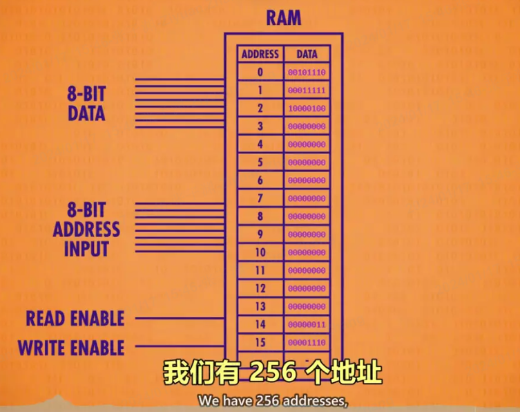
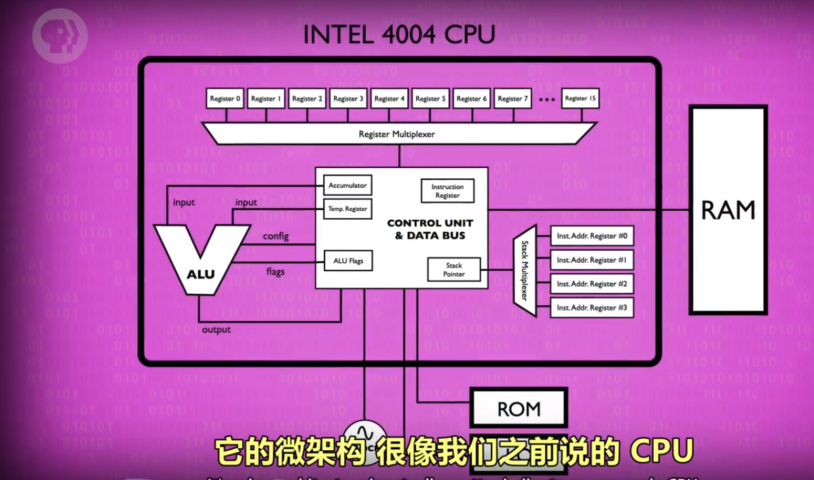

# 名词解释 https://shimo.im/docs/PJAUY30F1uYksv0h/read

计算机鼻祖--算盘：逢十进一
星盘：在海上计算维度；
计算尺：帮助计算乘法、除法；
制作各种工具：算日出、潮汐、天体的位置、或纯粹计算；

##

1.  bug（虫子）:程序出错为什么叫 bug

    早期计算机是巨大的，通过机械传动的，机械中容易出现虫子卡住机械转动，导致程序暂停/停止运行，需要清理虫子才能继续运行；
    出现 bug(虫子)代表机械停止了，程序出问题了；

## 位(bit) / 字节(byte) / 字（word）

1.  位(bit)：音译为“比特”，表示二进制位。位是计算机内部数据储存的最小单位，11010100 是一个 8 位二进制数。

    一个二进制位只可以表示 0 和 1 两种状态；两个二进制位可以表示 00、01、10、11 四种状态；三位二进制数可表示八种状态……。

2.  字节(byte)：音译为“拜特”，习惯上用大写的“B”表示。字节是计算机中数据处理的基本单位。

    计算机中以字节为单位存储和解释信息，规定一个字节由八个二进制位构成，即 1 个字节等于 8 个比特(1Byte=8bit)。
    八位二进制数最小为 00000000，最大为 11111111；通常 1 个字节可以存入一个 ASCII 码，2 个字节可以存放一个汉字国标码。

3.  字（word）：计算机进行数据处理时，一次存取、加工和传送的数据长度称为字(word)。

    一个字通常由一个或多个(一般是字节的整数位)字节构成。例如 286 微机的字由 2 个字节组成，它的字长为 16；486 微机的字由 4 个字节组成，它的字长为 32 位机。

- 1byte=8bit;
- 1KB=1000B(byte) = 8000bit;
- 另一种计算方法（二进制里的算法）:
- 1 千字节 = 2 的 10 次方 byte = 1024 字节；
- 1000 也是千字节（KB）的正确单位；所以 1000 和 1024 都对；**?**

  你说的是 1K ＝ 2 的 10 次方吧。因为这里所说的 K 并不是读千，而是读 kei。这是因为在计算机中，数据是以二进制形式存储的。二进制的意思就是只有两个数 0 和 1，但是 0 和 1 只能表示两个信息，而计算机要表示数以亿计的信息，就只能对 0 和 1 进行组合。比如有两个空位，使用二进制数，每个空位只能放一个 0 或者一个 1，因此每个空位有 2 种情况，2 个空位就有 2 的 2 次方种组合情况(这个懂了吗？)，再比如有三个空位，使用二进制数，每个空位只能放一个 0 或者一个 1，那么就有 2 的 3 次方种组合情况，以此类推，有 10 个空位，使用二进制数，就有 2 的 10 次方种组合情况。`在计算机中，把 2 的 10 次方叫做 K(kei)，`它就和十进制中的万有点类似(1 万＝ 10 的 4 次方，因为有四个空位，每个空位可以放 0 ～ 9 的任意一个数，因此每个空位有 10 种情况，4 个空位就有 10 的 4 次方种组合情况)，就是一个很大的数。不要把十进制中的 1 千和二进制中的 1K 搞混了。

  1KB=1024B，1MB=1024KB，1GB=1024MB，1TB=1024GB，1PB=1024TB，1EB=1024PB

* 中国表示数量的数词:一、二 、三、四、五、六、七、八、九、 十、百、千、万、亿、兆、京、垓 、杼、穰、沟、涧、正、载、极。
* 佛教的传入加入的数词：恒河沙、阿僧 □、那由它、不可思议、无量。
* 日本新增：大数（它原本是与小数相对应的，后来才被引申为一个新的数词）
  1. 万：代表的是 10 的四次方.
  2. 亿：代表的是 10 的八次方.
  3. 兆：代表的是 10 的十二次方.
  4. 京：代表的是 10 的十六次方.
  5. 垓：代表的是 10 的二十次方.
  6. 杼：代表的是 10 的二十四次方.
  7. 穰：代表的是 10 的二十八次方.
  8. 沟：代表的是 10 的三十二次方
  9. .......

## 算术逻辑单元 (ALU)

ALU 有 2 个单元，1 个算术单元和 1 个逻辑单元（Arithmetic Unit 和 Logic Unit）

作用：计算机中负责运算的组件，处理数字和逻辑运算的最基本单元。

- 算术单元：由半加器、全加器组成；半加器、全加器由 AND、OR、NOT、XOR 门组成

  1. 溢出：超出计算机（存储/处理）范围了；8bit 二进制相加结果超出 8 位，超出部分被舍弃；

     8bit 能存储 0~255 的数据；强行放 266 就超过了 255，会把第 0 个向前挤掉变成 1~266，出错；
     8 个位置想坐 9 个人，把第一个人向前挤掉；

  2. 计算机底层只有加减，没有乘除和其他高级运算;

     乘除和其他高级运算：用加减代替；例如 2 乘 5 实际上是 2 加了 5 次；

     2.1、 手机、笔记本等高级处理器，有专门做乘法的算术逻辑单元（更多的逻辑门、没有其他特殊）；普通处理器没有。

- 逻辑单元：执行逻辑操作，如 NOT、AND、OR 等操作，以及做简单的数值测试。

## 寄存器与内存（RAM）

- 寄存器：

  1. 锁存器：存储 1 位数字。
  2. 寄存器：一组并排的锁存器；存储多位数字。这个数字有多少位，叫位宽；早期 8 位->16 位->32 位。
  3. 门锁矩阵：寄存器的优化版--以矩阵的方式来存"锁存器的组合件"；消耗物理资源少（比如电线），存储的更多。

     - 位址：锁存器在矩阵中的行数与列数。例如 12 行 8 列
     - n*n 门锁矩阵可存放 n^2 个锁存器，但同一时间只能写入/读取 1 个数字。（早期为 16*16 矩阵）

       **注：**但 1 个矩阵只可记录 1 位数字，n 个矩阵组合在一起，才可记录 n 位数。如 1 个 8 位数，会按位数分成 8 个数，分别存储在 8 个矩阵的同一个位址中。

     - 多路复用器：一组电线，输入 2 进制的行址&列址，可启用矩阵中某个锁存器。

  4. 多路复用器与矩阵 配合存储数据。

- 内存：---- 指令（程序）存 在内存中
  内存的一个重要特性：可以随时访问任何位置，所以叫“随机存取'存储器'”简称 RAM

  1.  内存粗略定义：将一堆“独立的存储模块”和“电路”看做一个单元，组成内存方块；n 个内存方块组成内存模块。在一个电路板上所有的内存方块统称为内存(RAM)。
  2.  RAM（内存）：地址、数据构成；例如：数据由 8 位构成（00010100），数据的前四位指定“操作码”，后四位代表数据来自哪里--指定“内存地址”或“寄存器”
      

## CPU（中央处理器单元）--- 负责执行程序（指令）

程序有一个个操作组成，这些操作叫“指令”（instruction）；因为他们指示计算机要做什么；

CPU 负责执行程序。通常由 寄存器、控制器单元、ALU（计算逻辑单元）、时钟组成。 与 RAM 配合，执行计算机程序。CPU 和 RAM 之间用“地址线”、“数据线”和“允许读/写线”进行通信。

1. 寄存器：不在控制器单元内的(例：ABCD)；
2. 控制器单元： 像指挥部，有序的控制指令的读取、运行与写入。控制器单元包含：寄存器（临时保存 ALU 的结果）、指令地址寄存器、指令寄存器、解析指令的逻辑门组件

   “例如：” 当启动计算机时，所有寄存器从 0 开始。

   - 寄存器：临时保存 ALU 的结果，关闭 ALU 后，再把值写入正确寄存器；
   - 指令地址寄存器：存当前指令的内存地址，追踪程序运行到哪里了。类似于银行取号，该器件只按顺序通报地址，让 RAM 按顺序将指令交给指令寄存器。
   - 指令寄存器：存当前指令。
   - 解析指令的逻辑门组件：

3. ALU（计算逻辑单元）--看上面

4. 时钟：负责管理 CPU 运行的节奏，以精确地间隔，触发电信号，控制单元用这个信号，推动 CPU 的内部操作。

   - 时钟速度：CPU 执行“取指令 → 解码 → 执行”（fetch → decode → execute）中每一步的速度叫做“时钟速度”，单位赫兹 Hz，表示频率。
   - 超频/降频：

     1. 超频，修改时钟速度，加快 CPU 的速度，超频过多会让 CPU 过热或产生乱码。
     2. 降频，降低时钟速度，达到省电的效果，对笔记本/手机很重要。

- CPU 工作过程：

  1. 取指令阶段（fetch）：“指令地址寄存器”发“地址”给 RAM → RAM 发“该地址内的数据”给“指令寄存器” → “指令寄存器”接受“数据”
  2. 解码阶段（decode）：“指令寄存器”发送“数据-指令”给“控制单元” → 由“控制单元”进行解码（逻辑门确认操作码）
  3. 执行阶段（execute）：“控制单元”执行“指令”（ → 涉及计算时 → 调用所需寄存器 → 传输入&操作码给 ALU 执行）→ 调用 RAM 特定地址的数据 →RAM 将结果传入寄存器 → 指令地址寄存器+1

## 指令和程序

指令：指示计算机要做什么，多条指令共同组成程序。如数学指令，内存指令。

**注:** 指令和数据都是存在同一个内存里的。

指令表（给人看的）：记录指令名称、用法、操作码、对应的 “内存地址”或“寄存器”的表格。每个“操作码”对应的一个指令。

- 原则：

  1.  RAM 每一个地址中，都存放 0 或 1 个数据。
  2.  特定的数字组合，就表示为一个指令，否则表示一个值。

- 指令的执行：

  - LOAD 指令：

    1. 计算机会按地址的顺序，读取 RAM 中所记录的指令/数据。
    2. 计算机接受到指令后，如 LOAD_A，则通过“数据线”将“数据”传至“寄存器 A”。

  - ADD 指令：ADD B A 指令告诉 ALU，把寄存器 B 和寄存器 A 中的数字加起来，存到寄存器 A 中。
  - JUMP 指令：

    1.  遇到 JUMP 指令，程序会跳转至对应的 RAM 地址读取数据。
    2.  JUMP 指令可以有条件跳转（如 JUMP-negative），也可以无条件跳转。

  例如：指令：从后四位指定的内存读取数据然后存到寄存器 A 中（ 处理“后四位数据”把“结果”保存到“指定的存储器”）

  **注：** 可以把 RAM（内存）的数据简化为指令或数据 更容易理解；根据地址找到对应的指令处理数据（指令中指向的寄存器中的）

- 计算机指令长度问题： 由于早期计算机每个字只有 8 位，指令只占 4 位，意味着只能有 16 个指令，这远远不够。

  现代计算机有两种方式解决指令不够用的问题：

  1. 更多位来表示指令，如 32 位或 64 位。
  2. 采用“可变指令长度”，令不同的指令的长度不同，尽量节约位数。

## 高级 CPU 设计

- 增加特殊电路处理特殊事情；特殊电路越多，指令越多，处理越快

  1、例如：以前除数用减法-慢，现在直接将除法作为 ALU（计算逻辑单元）可以在硬件中执行的指令之一；
  2、现在处理器具有图形操作、视频解码、文件加密之类的特殊电路，--硬解码？
  3、高“时钟速度”和花哨的指令集导致数据跟不上；处理的太快，数据加载的慢了

- CPU 中增加缓存模块（cache）：CPU 与 RAM(内存)查找地址、检索数据、传输数据 速度低于处理数据速度；

  1、加载：计算机数据通常是按顺序排列和处理的，当 CPU 加载一条数据时，从 RAM 中拿当前数据及后面的一整块数据放缓存中；
  2、使用：命中缓存直接用，没有命中则从 RAM 中拿；
  3、保存：处理完的数据保存在缓存中（不是保存到 RAM 中），以便后续使用；同时标记缓存存储的每个内存块为脏位；
  缓存副本中的数据与 RAM 中的数据不一样，
  4、同步：缓存满时，处理器请求新内存块时，擦除旧块释放空间前，检测脏位写回 RAM；

- 另一个提高 CPU 性能的技巧--指令流水线
  1、在 CPU 的连续循环中 执行顺序是 fetch-decode-execute（取指令-解码-执行）；需要三个时钟周期来执行一条指令；
  2、多条指令时，decode（解码）第 N+1 条指令时，fetch(取指令)部分加载第 N+1 条指令；
  execute（执行）第 N 条指令时，decode（解码）第 N+1 条指令，fetch(取指令)第 N+2 条指令；
  **注：**修改了内容，管道中有可能是上一次的旧值；为了避免这一点，流水线处理器必须提前检查数据依赖关系，必要时停止其流水线。
  高性能处理器会动态的重新排序具有依赖性的指令，来减少停顿保证管道移动--乱序执行

- 条件跳转指令--在看到跳转指令时会执行长时间的停顿，等待最终的值；只有知道最终结果时，CPU 才会开始重新填充其管道；
  1、高端 CPU 会猜测条件是否成立，走那哪路，并根据猜测开始用填充指令他们的流水线。---称为推测执行的技术
  2、猜对，流水线已经充满正确指令，毫无延时的继续执行；猜错，丢弃所有推测结果并执行管道刷新（有点像转错弯，必须掉头才能回到路线，并继续）；为了减少猜错，CPU 制造商开发了复杂方法来猜测分支的走向--称为分支预测，准确率 90%以上

- 多核处理器一次运行多个指令

## 早期编成--程序如何进入计算机

程序必须加载到计算机内存中。

- 打孔卡片（机器里有个金属探针）--制表(功能单一)

  1. 打孔卡片被认为是易读的数据储存方式；
  2. 当一张卡片被送入“制表机”时，一个洞会导致该特定答案的运行总数加一。
  3. 早期的“制表机”不是计算机，只能制表；它的操作固定，不可编成。

- 控制面板：随着商业功能的增加，增加了减、乘、除功能，甚至可以决定何时执行某些操作，为了触发这些功能，以便执行不同计算，程序员创造了控制面板；

  1. 有一个面板布满小插座，程序员将电缆插入其中，以便在机器的不同部分之间传递值和信号。因此他们也被叫做插板；
  2. 不幸的是，每次需要运行不同的程序时都必须重新连接机器。
  3. 因此到 1920 年代，这些插接板变成可更换的。这不仅使编成更加舒服，还允许将不同程序插入机器。-- 一个计算工资，一个计算税收
  4. 但是插头板的程序非常复杂，一个缠结的电线是一个计算机利润损失汇总的程序

- 储存程序计算机--随着内存普及不再将程序放在物理插线板，放在计算机内存中。
- 冯诺依曼计算机的标志是包含：算术逻辑单元、数据寄存器、指令寄存器和指令地址寄存器的处理单元、一个储存数据和指令内存。

  

- 打孔卡片 --> 纸带（早期的硬盘） ：读取数据，计算结果再存到卡片或纸带上

## 第一种编辑语言
