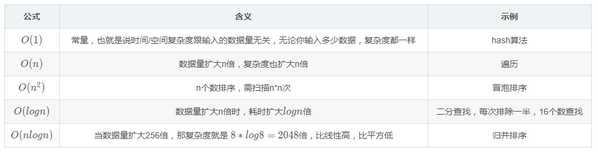
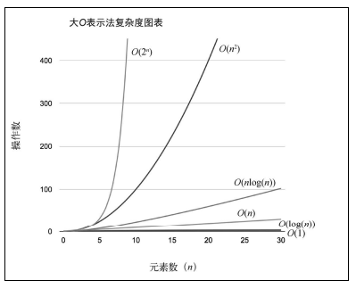

# 大 O 表示法: 用于描述算法的性能和复杂程度

## 时间/空间复杂度详解（O(1)、O(n)、O(logn)、O(nlogn)、O (n<sup>2</sup>)）

### 时间/空间复杂度可以表示为：T ( n ) = O ( f(n) )

其中 O 表示正比关系， f(n) 表示每行代码执行次数之和，该公式称为算法的渐进时间复杂度。

算法是随着 n 的变化而变化的，算法可以简化为：T ( n ) = O ( n ) 。




### 1、常数阶 O ( 1 )----表示无论执行多少次，复杂度都是 1。

```看上去消耗时间是3，简化后就是O(1)。
   let i=0;
   let j=1;
   console.log(i+j);
```

### 2、线性阶 O ( n ) ---- console.log 会执行 n 遍，消耗时间随着 n 的增长而增长。

```
    for(let i=0;i<n;i++){
		console.log(i);
	}
```

### 3、对数阶 O ( log n)

由于每次 count 乘以 2 之后，就距离 n 更近了一分。也就是说，有多少个 2 相乘后大于 n，则会退出循环。  
由 2^x=n 得到 x=log n。所以这个循环的时间复杂度为 O（log n）.

```
    let count = 1;
    while(count < n)
    {
        count = count*2;
        //时间复杂度O（1）的程序步骤序列
    }
```

### 4、线性对数阶 O (n log n)

结合上面说的对数阶和线性阶也就容易理解了，其实就是把时间复杂度为 O ( l o g O(logO(logn) ))的代码循环 n 遍。

```
    for(let i=0; j<n; i++){
		j=1;
		while(j < n){
   			j = j*2;
   		}
	}
```

### 5、平方阶 O ( n <sup>2</sup> )

就是把 O ( n ) 的代码再嵌套一遍。

```
    for(let i=0; i<n; i++){
		for(let j=0; j<n; j++){
			console.log(i+j);
		}
	}
```
