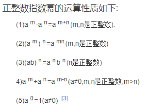

# 数据结构与算法--1 时间、空间复杂度说明

## 概念

- 底数、指数；幂、乘方、次方

  在数学上我们把 n 个相同的因数(a)相乘的积记做 a^n，这种运算叫做 `乘方`，乘方的结果叫做`幂`。 a 叫做`底数`，n 叫做`指数`。a^n 读作`a 的 n 次方`或`a 的 n 次幂`。

  

- 对数、底数、真数

  如果 a 的 x 次方等于 N（a>0，且 a≠1），那么数 x 叫做“以 a 为底 N 的对数”，记作 x=loga N。其中，a 叫做对数的“底数”，N 叫做“真数”。

- 时间复杂度： `T(n)= n3*10 =>T(n)= O(n ** 3)`

  常数阶 < 对数阶 < 线性阶 < 线性对数阶 < 平方阶 < 立方阶 < 乘方阶（幂阶） < 阶乘阶

  O(1) < O(log2n) < O(n) < O(nlog2n) < O(n2) < O(n3) < O(2n) < n!

  O(1) < O(log<sub>2</sub>n) < O(n) < O(nlog<sub>2</sub>n) < O(n<sup>2</sup>) < O(n<sup>3</sup>) < O(2<sup>n</sup>) < n!

### 时间/空间复杂度可以表示为：T ( n ) = O ( f(n) )

其中 O 表示正比关系，f(n) 表示每行代码执行次数之和，该公式称为算法的渐进时间复杂度。算法是随着 n 的变化而变化的，可以简化为：T(n) = O(n) 。


1. 常数阶 `O(1)` ----【hash 算法】

   表示无论执行多少次，复杂度都是 1。

   ```js 看上去消耗时间是3，简化后就是O(1)。
   let i = 0;
   let j = 1;
   console.log(i + j);
   ```

2. 对数阶 O(log<sub>2</sub> n) --- 【二分查找，每次排除一半】

   由于每次 count 乘以 2 之后，就距离 n 更近了一分。也就是说，有多少个 2 相乘后大于 n，则会退出循环。  
    由 2^x=n 得到 x=log n。所以这个循环的时间复杂度为 O（log n）.

   ```js
   let count = 1;
   while (count < n) {
     count = count * 2;
     //时间复杂度O（1）的程序步骤序列
   }
   ```

3. 线性阶 `O(n)` ---- 【遍历】

   console.log 会执行 n 遍，消耗时间随着 n 的增长而增长。

   ```js
   for (let i = 0; i < n; i++) {
     console.log(i);
   }
   ```

4. 线性对数阶 O(nlog<sub>2</sub> n) --- 【堆排序、归并排序】

   结合上面说的对数阶和线性阶也就容易理解了，其实就是把时间复杂度为 O ( l o g O(logO(logn) ))的代码循环 n 遍。

   ```js
   for (let i = 0; j < n; i++) {
     j = 1;
     while (j < n) {
       j = j * 2;
     }
   }
   ```

5. 平方阶 `O(n ** 2)` ---【冒泡排序】

   就是把 O ( n ) 的代码再嵌套一遍。

   ```js
   for (let i = 0; i < n; i++) {
     for (let j = 0; j < n; j++) {
       console.log(i + j);
     }
   }
   ```

6. 阶乘阶 `O(n!)` ---【快速排序】

### 数据结构：就是存储和组织数据的方式,分为: 线性结构 和 非线性结构
