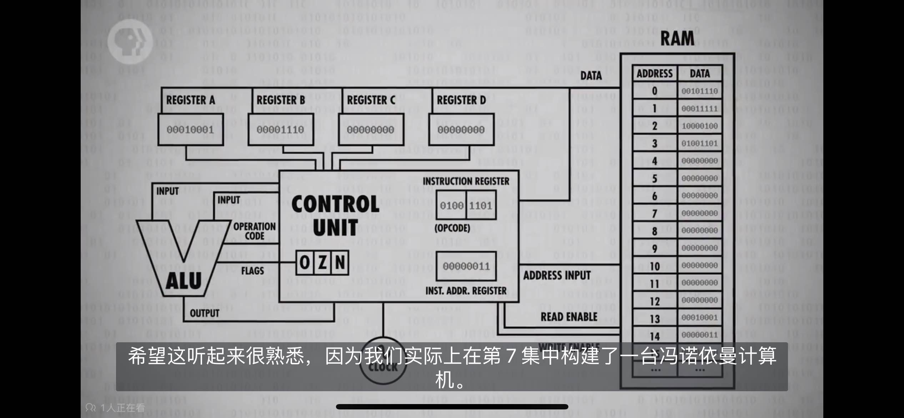

# 名词解释

计算机鼻祖--算盘：逢十进一
星盘：在海上计算维度；
计算尺：帮助计算乘法、除法；
制作各种工具：算日出、潮汐、天体的位置、或纯粹计算；

## 位(bit) / 字节(byte) / 字（word）

1.  位(bit)：音译为“比特”，表示二进制位。位是计算机内部数据储存的最小单位，11010100 是一个 8 位二进制数。

    一个二进制位只可以表示 0 和 1 两种状态；两个二进制位可以表示 00、01、10、11 四种状态；三位二进制数可表示八种状态……。

2.  字节(byte)：音译为“拜特”，习惯上用大写的“B”表示。字节是计算机中数据处理的基本单位。

    计算机中以字节为单位存储和解释信息，规定一个字节由八个二进制位构成，即 1 个字节等于 8 个比特(1Byte=8bit)。
    八位二进制数最小为 00000000，最大为 11111111；通常 1 个字节可以存入一个 ASCII 码，2 个字节可以存放一个汉字国标码。

3.  字（word）：计算机进行数据处理时，一次存取、加工和传送的数据长度称为字(word)。

    一个字通常由一个或多个(一般是字节的整数位)字节构成。例如 286 微机的字由 2 个字节组成，它的字长为 16；486 微机的字由 4 个字节组成，它的字长为 32 位机。

##

1.  bug（虫子）:程序出错为什么叫 bug

    早期计算机是巨大的，通过机械传动的，机械中容易出现虫子卡住机械转动，导致程序暂停/停止运行，需要清理虫子才能继续运行；
    出现 bug(虫子)代表机械停止了，程序出问题了；

2.  溢出：超出计算机（存储/处理）范围了；8bit 二进制相加结果超出 8 位，超出部分被舍弃；

    8bit 能存储 0~255 的数据；强行放 266 就超过了 255，会把第 0 个向前挤掉变成 1~266，出错；
    8 个位置想坐 9 个人，把第一个人向前挤掉；

3.  计算机底层只有加减，没有乘除和其他高级运算

    乘除和其他高级运算：用加减代替；例如 2 乘 5 实际上是 2 加了 5 次；

## CPU 与 RAM

1.  CPU（中央处理器单元）：ALU（计算逻辑单元）、控制器单元、一些储存器、时钟结合在一起

2.  RAM（内存）：地址、数据构成；例如：数据由 8 位构成（00010100），数据的前四位指定“操作码”，后四位指定“数据地址”或“寄存器地址”

3.  指令集：每个“操作码”指向“对应的指令”，

    例如：指令：从指令后四位指定的内存读取数据然后存到寄存器 A 中（ 处理“后四位数据”把“结果”保存到“指定的存储器”）

    **注：** 可以把 RAM（内存）的数据简化为指令或数据 更容易理解；根据地址找到对应的指令处理数据（指令中指向的寄存器中的）

4.  先进的 CPU 设计

    - 增加特殊电路处理特殊事情；特殊电路越多，指令越多，处理越快

      1、例如：以前除数用减法-慢，现在直接将除法作为 ALU（计算逻辑单元）可以在硬件中执行的指令之一；
      2、现在处理器具有图形操作、视频解码、文件加密之类的特殊电路，--硬解码？
      3、高“时钟速度”和花哨的指令集导致数据跟不上；处理的太快，数据加载的慢了

    - CPU 中增加缓存模块（cache）：CPU 与 RAM(内存)查找地址、检索数据、传输数据 速度低于处理数据速度；

      1、加载：计算机数据通常是按顺序排列和处理的，当 CPU 加载一条数据时，从 RAM 中拿当前数据及后面的一整块数据放缓存中；
      2、使用：命中缓存直接用，没有命中则从 RAM 中拿；
      3、保存：处理完的数据保存在缓存中（不是保存到 RAM 中），以便后续使用；同时标记缓存存储的每个内存块为脏位；
      缓存副本中的数据与 RAM 中的数据不一样，
      4、同步：缓存满时，处理器请求新内存块时，擦除旧块释放空间前，检测脏位写回 RAM；

    - 另一个提高 CPU 性能的技巧--指令流水线
      1、在 CPU 的连续循环中 执行顺序是 fetch-decode-execute（取来-解码-执行）；需要三个时钟周期来执行一条指令；
      2、多条指令时，decode（解码）第 N+1 条指令时，fetch(取来)部分加载第 N+1 条指令；
      execute（执行）第 N 条指令时，decode（解码）第 N+1 条指令，fetch(取来)第 N+2 条指令；
      **注：**修改了内容，管道中有可能是上一次的旧值；为了避免这一点，流水线处理器必须提前检查数据依赖关系，必要时停止其流水线。
      高性能处理器会动态的重新排序具有依赖性的指令，来减少停顿保证管道移动--乱序执行

    - 条件跳转指令--在看到跳转指令时会执行长时间的停顿，等待最终的值；只有知道最终结果时，CPU 才会开始重新填充其管道；
      1、高端 CPU 会猜测条件是否成立，走那哪路，并根据猜测开始用填充指令他们的流水线。---称为推测执行的技术
      2、猜对，流水线已经充满正确指令，毫无延时的继续执行；猜错，丢弃所有推测结果并执行管道刷新（有点像转错弯，必须掉头才能回到路线，并继续）；为了减少猜错，CPU 制造商开发了复杂方法来猜测分支的走向--称为分支预测，准确率 90%以上

    - 多核处理器一次运行多个指令

## 早期编成--程序如何进入计算机

程序必须加载到计算机内存中。

- 打孔卡片（机器里有个金属探针）--制表(功能单一)

  1. 打孔卡片被认为是易读的数据储存方式；
  2. 当一张卡片被送入“制表机”时，一个洞会导致该特定答案的运行总数加一。
  3. 早期的“制表机”不是计算机，只能制表；它的操作固定，不可编成。

- 控制面板：随着商业功能的增加，增加了减、乘、除功能，甚至可以决定何时执行某些操作，为了触发这些功能，以便执行不同计算，程序员创造了控制面板；

  1. 有一个面板布满小插座，程序员将电缆插入其中，以便在机器的不同部分之间传递值和信号。因此他们也被叫做插板；
  2. 不幸的是，每次需要运行不同的程序时都必须重新连接机器。
  3. 因此到 1920 年代，这些插接板变成可更换的。这不仅使编成更加舒服，还允许将不同程序插入机器。-- 一个计算工资，一个计算税收
  4. 但是插头板的程序非常复杂，一个缠结的电线是一个计算机利润损失汇总的程序

- 储存程序计算机--随着内存普及不再将程序放在物理插线板，放在计算机内存中。
- 冯诺依曼计算机的标志是包含：算术逻辑单元、数据寄存器、指令寄存器和指令地址寄存器的处理单元、一个储存数据和指令内存。

  

- 打孔卡片 --> 纸带（早期的硬盘） ：读取数据，计算结果再存到卡片或纸带上

## 第一种编辑语言
