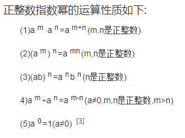

## 数据结构与算法--1（补课）

#### 底数、指数；幂、乘方、次方

1. 一般地，在数学上我们把 n 个相同的因数 a 相乘的积记做 a^n 。  
   这种求几个相同因数的积的运算叫做**乘方**，乘方的结果叫做**幂**。  
   在 a^n 中,a 叫做**底数**，n 叫做**指数**。a^n 读作“**a 的 n 次方**”或“**a 的 n 次幂**”。

#### 对数、底数、真数

如果 a 的 x 次方等于 N（a>0，且 a≠1），那么数 x 叫做**以 a 为底 N 的对数**（logarithm），记作 x=loga N。其中，a 叫做对数的**底数**，N 叫做**真数**
