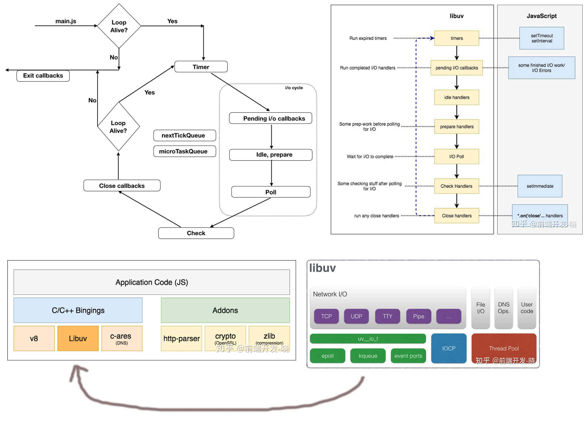

# 事件循环机制 -- nodeJS 端（由 libuv 库实现） [原文链接](https://zhuanlan.zhihu.com/p/35918797)

1. 把“JS 引擎源码"编辑成文件,作为库引进 C 中，异步则执行死循环挂起，回调;
2. 事件循环机制由宿主环境实现（有多个线程）, js 引擎（V8）只负责执行代码;
3. Node.js 不保证回调被触发的确切时间，也不保证它们的顺序，回调会在尽可能接近指定的时间被调用;
4. setTimeout 当 delay 大于 2147483647 或小于 1 时，则 delay 将会被设置为 1， 非整数的 delay 会被截断为整数;

```
  setImmediate(console.log, 1);
  setTimeout(console.log, 1, 2);
  Promise.resolve(3).then(console.log);
  process.nextTick(console.log, 4);
  console.log(5);
  结果：会打印 5 4 3 2 1 或者 5 4 3 1 2
```

## 事件循环的工作流程

1. 当在你的控制台运行 node main.js，node 设置事件循环然后运行你主要的模块（main.js） 事件循环的外部。
2. 一旦主要模块执行完，node 将会检查循环是否还活着（事件循环中是否还有事情要做）？
3. 如果没有，将会在执行退出回调后退出，process.on('exit', foo) 回调（退出回调）。
4. 但是如果循环还活着，node 将会从计时器阶段进入循环。



- event loop 的每个阶段都有一个任务队列(task)，当 event loop 进入给定的阶段时，将执行该阶段的任务队列，直到队列清空或执行的回调达到系统上限后，才会转入下一个阶段，当所有阶段被顺序执行一次后，称 event loop 完成了一个 (tick)。Javascript 可以在任何一个阶段执行（除了 idle & prepare）

- 你在图片中也能看到 nextTickQueue 和 microTaskQueue，它们不是循环的一部分，它们的回调可以在任意阶段执行。它们有更高的优先级去执行。

### 定时器（Timer）阶段 --- （执行 setTimeout、setInterval 回调）

A-->B-->C-->D-->E-->F
事件循环进入定时器阶段，检查是否有需要执行的；如果存在则把回调放到 timer 队列中等待执行;（这阶段有系统限制，达到系统最大限制数量，即使有未执行的回调也跳到下一阶段）  
例如：先检查 A，A 在执行时间内，执行 A 的回调；再检查 B 依次类推；如果 C 不在执行时间内，则不执行 C 的回调，停止 D 的检查；
定时器主要有两种

1. Immediate
2. Timeout
   Immediate 类型的计时器回调会在 check 阶段被调用，Timeout 计时器会在设定的时间过期后尽快的调用回调;但是,多次执行会发现打印的顺序不一样

   ```
       setTimeout(() => {
           console.log('timeout');
       }, 0);

       setImmediate(() => {
           console.log('immediate');
       });
   ```

### 即将发生的（Pending）i/o 回调（callback）阶段 ---上一轮循环中少数 callback/Io 会被延迟到这一阶段执行[执行 I/O（文件、网络等) 回调])

事件循环进入即将发生的 i/o 阶段，检查“对应队列”中是否有即将发生的任务的回调；有一个接一个执行，直到队列为空或者达到系统的最大限制；

### 空闲（Idle），准备（Prepare）阶段---(仅供系统内部调用)

Idle：libuv 一些内部操作；Prepare：在 I/O 轮询之前的一些准备工作;这两个阶段是 node 主要做一些内部操作的阶段

### 轮询（Poll）阶段 --获取新的 I/O 事件，执行相关回调，在适当条件下把阻塞 node

这是一个观察的阶段；这个阶段接受新传入的连接（新的 Socket 建立，http 连接等）和数据（文件读取等）。

poll 阶段主要有两个任务

1. 计算应该阻塞和轮询 I/O 的时间
2. 然后，处理 poll 队列里的事件

当 event loop 进入 poll 阶段且没有被调度的计时器时

- 如果 poll 队列不是空的 ，event loop 将循环访问回调队列并同步执行，直到队列已用尽或者达到了系统或达到最大回调数
- 如果 poll 队列是空的
  - 如果有 setImmediate() 任务，event loop 会在结束 poll 阶段后进入 check 阶段
  - 如果没有 setImmediate()任务，event loop 阻塞在 poll 阶段等待回调被添加到队列中，然后立即执行

一旦 poll 队列为空，event loop 将检查 timer 队列是否为空，如果非空则进入下一轮 event loop;

**注意：**上面提到了如果在不同的 I/O 里，不能确定 setTimeout 和 setImmediate 的执行顺序，但如果 setTimeout 和 setImmediate 在一个 I/O 回调里，肯定是 setImmediate 先执行，因为在 poll 阶段检查到有 setImmediate() 任务，event loop 直接进入 check 阶段执行 setImmediate 回调

```
  const fs = require('fs');
  fs.readFile(__filename, () => {
    setTimeout(() => {
      console.log('timeout');
    }, 0);
    setImmediate(() => {
      console.log('immediate');
    });
  });
```

### 检查（Check）阶段 --- 主要处理 setImmediate 的回调

它将会像其他阶段那样一个接着一个的执行，直到队列为空或者达到依赖系统的最大限制。

### 关闭（Close）回调 --- 处理所有的关闭 I/O 回调

- 回调的关闭(socket.on(‘close’, ()=>{})) 都在这里处理的，更像一个清理阶段;
- 这个阶段的队列执行完后，会检查“事件循环”是否还活着，如果没有则退出；如果还有工作要做，它会进行下一个循环；
- 因此在定时器阶段：如果前面的定时器 A,B 执行过了，侧从 C 开始检查

### nextTickQueue & microTaskQueue --- 当前阶段到下一个阶段之前 触发

不是在 libUV 中开发的，而是在 node.js 中
nextTickQueue：存储着 process.nextTick() 的回调；
microTaskQueue：存储着 Promise 的回调;
nextTickQueue 的优先级高于 microTaskQueue。

### 为什么 Promise.then 比 setTimeout 早一些

前端同学肯定都听说过 micoTask 和 macroTask，Promise.then 属于 microTask;

- 在浏览器环境下: microTask 任务会在每个 macroTask 执行最末端调用;
- 在 Node.js 环境下: microTask 会在每个阶段完成之间调用，也就是每个阶段执行最后都会执行一下 microTask 队列;

```
  setImmediate(console.log, 1);
  setTimeout(console.log, 1, 2);
  /****************** microTask 分割线 ********************/
  Promise.resolve(3).then(console.log); // microTask 分割线
  /****************** 下次 event loop tick 分割线 ********************/
  process.nextTick(console.log, 4);
  /****************** 同步任务和异步任务的分割线 ********************/
  console.log(5);
```

### setImmediate VS process.nextTick

setImmediate 听起来是立即执行，process.nextTick 听起来是下一个时钟执行，为什么效果是反过来的？这就要从那段不堪回首的历史讲起

最开始的时候只有 process.nextTick 方法，没有 setImmediate 方法，通过上面的分析可以看出来任何时候调用 process.nextTick()，nextTick 会在 event loop 之前执行，直到 nextTick 队列被清空才会进入到下一 event loop，如果出现 process.nextTick 的递归调用程序没有被正确结束，那么 IO 的回调将没有机会被执行

```
  const fs = require('fs');

  fs.readFile('a.txt', (err, data) => {
    console.log('read file task done!');
  });

  let i = 0;
  function test(){
    if(i++ < 999999) {
      console.log(`process.nextTick ${i}`);
      process.nextTick(test);
    }
  }
  test();
  执行程序将返回:
  nextTick 1
  nextTick 2
  ...
  ...
  nextTick 999999
  read file task done!

```

于是乎需要一个不这么 bug 的调用，setImmediate 方法出现了，比较令人费解的是在 process.nextTick 起错名字的情况下，setImmediate 也用了一个错误的名字以示区分。。。

### 进程池（Thread-pool）

nodejs 没有进程池，进程池是 libUV 库中的（nodejs 用来处理异步的第三方库）；并不是每个异步任务被进程池所处理的；
libUv 能够灵活地使用操作系统的异步 apis 来保持环境为事件驱动。然而操作系统的 api 不能做文件读取，dns 查询等，这些由进程池所处理。
