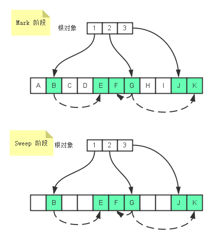

## 垃圾回收机制---1.标记清除--2.引用计数(不常见，循环引用有问题)

在垃圾回收的算法中，经常会出现 mutator 和 collector 两个名称。

（1）collector：指的就是垃圾收集器。

（2）mutator：指的是垃圾收集器之外的部分，比如当前的应用程序。它的功能是创建新对象，或者在内存读写内容。

（3）mutator roots（mutator 根对象）：通常是分配在堆内存之外，可以直接被 mutator 直接访问到的对象，一般是指静态/全局变量。

（4）可到达对象：所谓的可到达对象就是从根对象开始遍历，可以访问到的对象，也就是 mutator（应用程序）正在使用的对象。

#### 标记清除算法--可以拆分为两部分：标记(mark)和清除(sweep)

（1）标记阶段：  
在此阶段，垃圾回收器会从 mutator（应用程序）根对象开始遍历。

每一个可以从根对象访问到的对象都会被添加一个标识，于是这个对象就被标识为可到达对象。

（2）清除阶段：  
在此阶段中，垃圾回收器，会对堆内存从头到尾进行线性遍历；

如果发现有对象没有被标识为可到达对象，那么就将此对象占用的内存回收，并且将原来标记为可到达对象的标识清除，以便进行下一次垃圾回收操作

## V8 垃圾回收策略 [原链接](https://mp.weixin.qq.com/s/ESEogtcywtog26nXhnsCDA)

自动垃圾回收有很多算法，由于不同对象的生存周期不同，所以无法只用一种回收策略来解决问题，这样效率会很低。

##### V8 采用了一种代回收的策略，将内存分为两个生代：新生代（new generation）和老生代（old generation）。

1. 新生代中的对象为存活时间较短的对象（内存空间很小）
2. 老生代中的对象为存活时间较长或常驻内存的对象（内存空间较大）

新生代，老生代：采用不同的算法来提高效率；
对象最开始都会先被分配到新生代（如果新生代内存空间不够，直接分配到老生代），新生代中的对象会在满足某些条件后，被移动到老生代，这个过程也叫晋升

#### 新生代

新生代：主要使用 Scavenge 进行管理，主要实现是 Cheney 算法，将内存平均分为两块，使用空间叫 From，闲置空间叫 To；

新对象都先分配到 From 空间中，在空间快要占满时将存活对象复制到 To 空间中，然后清空 From 的内存空间，此时，调换 From 空间和 To 空间，继续进行内存分配；

##### 晋升

1.如果一个对象是第二次经历从 From 空间复制到 To 空间，那么这个对象会被移动到老生代中。

2.当要从 From 空间复制一个对象到 To 空间时，如果 To 空间已经使用了超过 25%，则这个对象直接晋升到老生代中（25%阈值防止占比过高，影响下次分配）

#### 老生代

老生代：主要采用 标记清除(Mark-Sweep) 和 标记整理(Mark-Compact) 算法;

Mark-Sweep：在垃圾回收后会产生碎片内存;

Mark-Compact：在清除前会进行一步整理，将存活对象向一侧移动，随后清空边界的另一侧内存，这样空闲的内存都是连续的，但是带来的问题就是速度会慢一些；

在 V8 中，老生代是 Mark-Sweep 和 Mark-Compact 两者共同进行管理的；优先 Mark-Sweep，当空间不足才使用 Mark-Compact。
