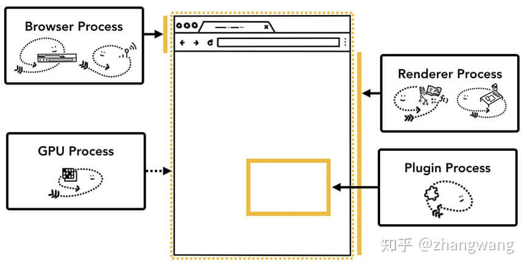

# 浏览器内核分成两部分：渲染引擎和 JS 引擎

苹果: 开源了 webkit -->webkit2 + JSCore 任务队列谁在维护;
chrome: 基于 webkit + V8 -->Blink + V8；
fireFox: 基于 Gecko + SpiderMonkey 引擎

渲染引擎:是一种对 HTML 文档进行解析并将其显示在页面上的工具。（说白了，就是按照 HTML 代码在界面上绘制各种控件图形）

- 线程和进程:

  1. 一个进程包含一个或多个线程；
  2. 当一个进程关闭后，操作系统会回收进程所占用的内存;
  3. 进程之间相互隔离，如果需要访问需要依赖进程间通讯机制（即 IPC）；

  4. 线程不能单独存在，它是由进程来启动和管理的;
  5. 多线程可以并行处理任务;
  6. 同一进程中，线程之间共享进程中的数据;
  7. 任意一线程执行出错，都会导致整个进程的崩溃;

- 当我们启动一个应用，计算机会创建一个进程，操作系统会为进程分配一部分内存，应用的所有状态都会保存在这块内存中，应用也许还会创建多个线程来辅助工作，这些线程可以共享这部分内存中的数据。如果应用关闭，进程会被终结，操作系统会释放相关内存。

- 一个进程还可以要求操作系统生成另一个进程来执行不同的任务，系统会为新的进程分配独立的内存，两个进程之间可以使用 IPC （Inter Process Communication）进行通信。很多应用都会采用这样的设计，如果一个工作进程反应迟钝，重启这个进程不会影响应用其它进程的工作。

## 浏览器的工作原理 [原文链接](https://zhuanlan.zhihu.com/p/47407398)

- 单进程浏览器:
  内存、页面线程、渲染线程、插件线程、网络线程 在同一进程；

  1. 不稳定。单进程中的插件、渲染线程出现错误 导致整个浏览器崩溃；必须重启浏览器。
  2. 不流畅。所有页面的功能模块在一个进程中，如果其中的一个页面卡住了，所有页面一起卡；
  3. 不安全。插件和渲染线程有很高的权限，包含各种第三方的脚本代码，恶意插件或网站，可以通过这些权限来读写本地数据并窃取；
  4. 内存泄露。单个页面编写代码导致内存泄露，关闭页面，内存并不会被回收；导致浏览器越来越卡。

- 多进程浏览器:

  每个页面有单独的 “渲染进程”和“插件进程”，并放一个单独的沙箱中，不能获取到系统权限；有关权限问题统一交给“浏览器主进程”来操作，不同进程间通过 IPC 通信。

  1. 解决不稳定。进程相互隔离，一个页面或者插件崩溃时，影响仅仅时当前插件或者页面，不会影响到其他页面。
  2. 解决不流畅。脚本阻塞当前页面渲染进程，不会影响到其他页面。多进程充分利用多核优势
  3. 解决不安全。采用多进程架构使用沙箱。 沙箱看成时操作系统给进程上来一把锁，沙箱的程序可以运行，但是不能在硬盘上写入任何数据，也不能在敏感位置读取任何数据。(页面 A 的渲染、插件进程 放一个沙箱，页面 B 的渲染、插件进程 放一个沙箱)
  4. 缺点：1、资源占用高。2、体系架构复杂。

多进程浏览器：由多个进程组成，每个进程都有自己核心的职责，它们相互配合完成浏览器的整体功能；每个进程中又包含多个线程，一个进程内的多个线程也会协同工作，配合完成所在进程的职责。(浏览器就相当于一个工厂；进程相当于一个车间；线程相当于车间内的一个个员工，可以自己做自己的事情，也可以相互配合做同一件事情；一个工厂可以有多个车间，浏览器可以有多个进程)

### Chrome 的主要进程及其职责

浏览器进程(1 个)、GPU 进程(1 个)、网络进程(1 个)、渲染进程(多个)、插件进程(多个)

Chrome 采用多进程架构，其顶层存在一个 “浏览器进程”(Browser Process) 用以协调浏览器的其它进程。
Chrome 浏览器的每个标签（tab）都分别对应一个渲染引擎实例。每个标签（tab）都是一个独立的进程（渲染进程）。

1. 浏览器进程(Browser Process) ：（只有一个，负责协调、主控）

   - 负责浏览器界面展示(标签页外除)。包括地址栏，书签栏，前进后退按钮等部分的工作。
   - 与用户交互。
   - 管理子进程。各个页面创建和销毁。与其他进程的协调工作
   - 提供存储功能。

2. 渲染进程(Renderer Process)：

   包括 JS 的 V8 引擎和排版引擎 Blink。
   主要功能是将 HTML、CSS、JS 转化为网页。

   默认情况下 Chrome 会为每个 Tab 标签页创建一个渲染进程。如果 2 个页面属于同一站点，并且从 a 页面中打开 b 页面，那么他们也会共用一个渲染进程，否则新开一个渲染进程

   包含：

   - GUI 渲染线程：
     GUI 渲染线程负责渲染浏览器界面 HTML 元素,当界面需要重绘(Repaint)或由于某种操作引发回流(reflow)时，该线程就会执行。在 Javascript 引擎运行脚本期间,GUI 渲染线程都是处于挂起状态的，也就是说被冻结了。

   - JavaScript 引擎线程：
     这就是我们常说的 js 单线程，主要是为了实现 JS 文件的解析和运行，包括执行用户的交互操作、dom 树修改、css 样式更新等操作。需要注意的是若 js 执行过程会导致 GUI 渲染线程阻塞，它们不可同步执行.

   - 定时触发器线程：
     浏览器定时计数器（setTimeout、setInterval ）并不是由 JS 引擎计数的, 因为 JS 引擎是单线程的, 如果处于阻塞线程状态就会影响记计时的准确, 因此通过单独线程来计时并触发定时是更为合理的方案。

   - 异步 Http 请求线程：
     通过 XMLHttpRequest 对象或 Fetch API 等机制发起的网络请求，负责发送网络请求(传递给“网络进程”)、(从“网络进程”)接收响应;
     当 JavaScript 执行线程中发起异步 HTTP 请求时，请求会经过网络进程处理，网络进程负责发送实际的网络请求，并接收响应数据。一旦有响应数据回来，网络进程将其传递给异步 HTTP 请求线程，从而触发异步回调、事件或者 Promise 解析。

   - 事件触发线程
     归属于渲染进程，不受 JS 引擎线程控制。
     负责处理 js 代码中的事件(click、mouse 等)。当事件被触发时，会把该事件的处理函数添加入到“任务队列”（消息队列）中，等待 JS 引擎线程空闲后执行；

3. GPU 进程(GPU Process)：
   主要负责网页绘制和 Chrome 的 UI 界面；Chrome 刚开始发布的时候是没有 GPU 进程的，而使用 GPU 的初衷是为了实现 3D CSS 效果，只是后面网页、Chrome 的 UI 界面都用 GPU 来绘制，这使 GPU 成为浏览器普遍的需求，最后 Chrome 在多进程架构上也引入了 GPU 进程。

   当 JavaScript 执行线程中发起异步 HTTP 请求时，请求会经过网络进程处理，网络进程负责发送实际的网络请求，并接收响应数据。一旦有响应数据回来，网络进程将其传递给异步 HTTP 请求线程，从而触发异步回调、事件或者 Promise 解析。

4. 网络进程:
   负责处理所有网络请求和响应，负责处理网络通信和资源加载等任务。它承担着建立 TCP 连接、发送和接收 HTTP 请求/响应、处理 SSL/TLS 安全加密等底层网络操作。
   以前是作为模块运行在“浏览器进程”里面的，后面才独立出来，成为一个单独的进程。

5. 插件进程(Plugin Process)：
   主要负责加载和运行页面上的插件，因为插件可能崩溃，所以需要通过插件进程来隔离，以保证插件崩溃也不会对浏览器和页面造成影响

   - 负责控制一个网页用到的所有插件，如 flash,
   - 每种类型的插件对应一个进程，仅当使用该插件时才创建

6. 任务管理器

### iframe 的渲染 -- Site Isolation

这种机制允许在同一个 Tab 下的跨站 iframe 使用单独的进程来渲染，这样会更为安全。

**注：** 在浏览器中打开一个网页相当于新起了一个进程（进程内有自己的多线程）。如果浏览器是单进程，那么某个 Tab 页或者第三方插件崩溃了，就影响了整个浏览器，体验有多差，而且多进程还有其它的诸多优势，当然，多进程内存等资源消耗也会更大，有点空间换时间的意思。。

### HTTP 请求流程：为什么很多站点第二次打开速度会很快

浏览器中的 HTTP 请求从发起到结束一共经历如下八个阶段：
构建请求、查找缓存、准备 IP 和端口、等待 TCP 队列、建立 TCP 连接、发起 HTTP 请求、服务器处理请求、服务器返回请求和断开连接；

1. 构建请求。浏览器构建请求行，构建好后，准备发起网络请求；
2. 查找缓存。在真正发起请求前浏览器会查询缓存中是否有请求资源副本，有则拦截请求，返回资源副本，否则进入网络请求；
3. 准备 IP 地址和端口。HTTP 网络请求需要和服务器建立 TCP 连接，而建立 TCP 连接需要准备 IP 地址和端口号，浏览器需要请求 DNS 返回域名对应的 IP，同时会缓存域名解析结果，供下次查询使用；
4. 等待 TCP 队列。Chrome 机制，同一个域名同时最多只能建立 6 个 TCP 连接；
5. 建立 TCP 连接。TCP 通过“三次握手”建立连接，传输数据，“四次挥手”断开连接；
6. 发送 HTTP 请求。建立 TCP 连接后，浏览器就可以和服务器进行 HTTP 数据传输了，首先会向服务器发送请求行，然后以请求头形式发送一些其他信息，如果是 POST 请求还会发送请求体；
7. 服务器处理请求。
8. 服务器返回请求和断开连接。首先服务器会返回响应行(协议版本、状态码、状态描述)，随后，服务器向浏览器发送响应头和响应体。通常服务器返回数据，就要关闭 TCP 连接，如果请求头或者响应头有 Connection:keep-alive TCP 保持打开状态；

## 从输入 URL 到页面呈现发生了什么

1. 构建请求（浏览器内部代码将 url 进行拆分解析）
2. 查找强缓存 （有-->结束请求）
3. DNS 解析 （域名-->IP :1.本地-->2.域名服务器）
4. 建立 TCP 连接
5. 发送 HTTP 请求
6. 网络响应
7. 是否关闭 TCP 连接 (看 请求头或响应头中包含 Connection: Keep-Alive)

### 导航流程：从输入 URL 到页面展示这中间发生了什么 （https://www.cnblogs.com/echo-hui/p/9298203.html）

浏览器 Tab 外的工作主要由 “浏览器进程”(Browser Process) 掌控,分为:

1. 用户输入 URL 或其他内容 并回车。
2. “浏览器进程”检查 是否符合 URL 规则；符合，浏览器自动给 URL 加协议；不符合，用默认引擎来合成带关键字的 URL。
3. “浏览器进程”通过进程通信（IPC）把 URL 请求发送给“网络进程”，并控制 tab 上的 图标开始转圈，但当前页面还是老页面。
4. “网络进程”接收到 URL 请求后，会检查本地是否有缓存资源，如果有则将该资源返回给浏览器进程并中断请求。
5. 如果没有，“网络进程”向 web 服务器发起 http 请求（网络请求），请求流程如下：

   - 进行 DNS 解析，获取服务器 IP 地址，端口；
   - 利用 IP 地址和服务器建立 tcp 连接；
   - 构建请求头和请求体；
   - 发送请求头和请求体；
   - 服务端接收到请求后，会生成响应数据并返回给“网络进程”；
   - 网络进程接收响应头和响应信息，并解析响应内容；

6. “网络进程”解析响应流程：

   检查状态码

   - 如果是 301/302：则需要根据响应头的 Location 的信息进行重定向，重新进行第 4 步；
   - 如果是 200：检查响应头的 Content-Type 类型，
     如果是字节流类型（zip、pdf 等），则将该请求提交给下载管理器，该导航流程结束，不再进行后续渲染。
     如果是 text/html 则通知“浏览器进程”准备一个“渲染进程”；
     (Safe Browsing（安全浏览） 检查也会在此时触发，如果域名或者请求内容匹配到已知的恶意站点，“网络进程” 会展示一个警告页)  
      (此外 CORB 检测也会触发确保敏感数据不会被传递给渲染进程)

7. 准备“渲染进程”

   视情况开启一个新的“渲染进程”，同一站点（根域名和协议相同）打开新页面，“渲染进程”是共用的，不开启用原来的；
   http://www.baidu.com 根域名：“baidu.com”，协议：http；
   从http://www.baidu.com打开http://wenku.baidu.com不会创建新的“渲染进程”

   - “浏览器进程”检查当前 URL 是否和之前打开的“渲染进程”的“根域名和协议”是否相同，如果相同，则复用原来的进程，如果不同，则开启新的渲染进程。

8. 传输数据、更新状态

   - “渲染进程”准备好后，“浏览器进程”向“渲染进程”发起“提交文档”的消息，“渲染进程”接收到消息和“网络进程”建立传输数据通道并读取详细数据；
   - “渲染进程”接收完毕后，向浏“览器进程”发送一个“确认提交”的消息；
   - “浏览器进程”接收到“确认提交”后，当前页面被白屏替代；等待“渲染进程”渲染；
   - “渲染进程”联合 “GPU 进程”开始渲染。渲染完毕页面返回给“浏览器主进程”进行展示。 更新 浏览器界面状态：安全、地址 URL、前进后退的历史状态、更新 web 页面；为了让关闭 tab 或者窗口后便于恢复，这些信息会存放在硬盘中。（导航过程结束，页面加载过程开始）

9. ==================================================================================

10. 额外的步骤：当 renderer process 渲染结束（渲染结束意味着该页面内的所有的页面，包括所有 iframe 都触发了 onload 时），会发送 IPC 信号到 Browser process， Browser process 会停止展示 tab 中的 spinner。当然上面的流程只是网页首帧渲染完成，在此之后，客户端依旧可下载额外的资源渲染出新的视图。  
    **注：** 所有的 JS 代码其实都由 renderer Process 控制的，所以在你浏览网页渲染内容的过程大部分时候不会涉及到其它的进程。  
     不过也许你也曾经监听过 beforeunload 事件，这个事件再次涉及到 Browser Process 和 renderer Process 的交互，当当前页面关闭时（关闭 Tab ，刷新等等），Browser Process 需要通知 renderer Process 进行相关的检查，对相关事件进行处理。  
     如果导航由 renderer process 触发（比如在用户点击某链接，或者 JS 执行 `window.location = "http://newsite.com" ` ） renderer process 会首先检查是否有 `beforeunload` 事件处理器，导航请求由 renderer process 传递给 Browser process；  
     如果导航到新的网站，会启用一个新的 render process 来处理新页面的渲染，老的进程会留下来处理类似 `unload` 等事件。

**例外：** Service Worker （服务工作线程）  
如果 Service Worker 被设置为从本地 cache 中加载数据，那么就没有必要从网上获取更多数据了；service worker 也是运行在渲染进程中的 JS 代码，因此对于拥有 Service Worker 的页面，上述流程有些许的不同。  
当有 Service Worker 被注册时，其作用域会被保存，当有导航时，network thread 会在注册过的 Service Worker 的作用域中检查相关域名，

- 如果存在对应的 Service worker，UI thread 会找到一个 renderer process 来处理相关代码，Service Worker 可能会从 cache 中加载数据，从而终止对网络的请求，也可能从网上请求新的数据。
- 如果 Service Worker 最终决定通过网上获取数据，Browser 进程 和 renderer 进程的交互其实会延后数据的请求时间 。Navigation Preload 是一种与 Service Worker 并行的加速加载资源的机制，服务端通过请求头可以识别这类请求，而做出相应的处理。
