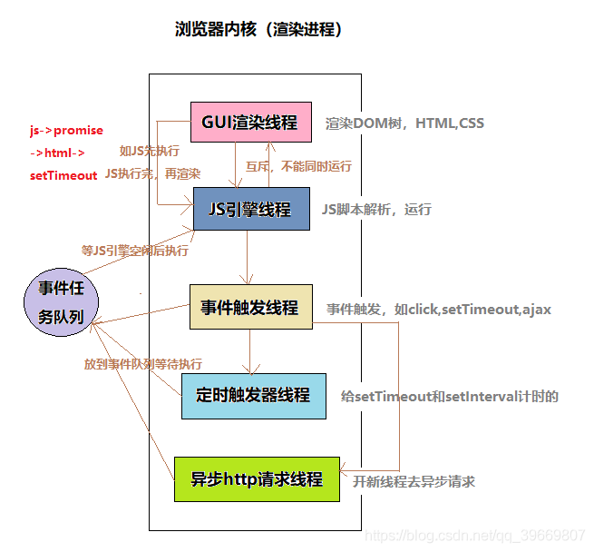
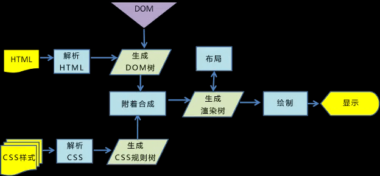

# 渲染进程是如何工作的 [1.原文链接](https://zhuanlan.zhihu.com/p/47407398) [2.参考链接](https://www.cnblogs.com/fogwind/p/6160456.html)

渲染进程几乎负责 Tab 内的所有事情，包括 JS 的 V8 引擎和排版引擎 Blink。主要功能是将 HTML、CSS、JS 转化为网页。

渲染进程 中主要包含以下线程：

1. GUI 渲染线程

   - 当浏览器收到响应的 html 后，该线程开始解析 HTML 文档构建 DOM 树，解析 CSS 文件构建 CSS 规则树，合并构成渲染树，并计算布局样式，绘制在页面上
   - 当界面样式被修改的时候可能会触发 reflow 和 repaint，该线程就会重新计算，重新绘制
   - GUI 渲染线程与 JS 引擎线程是互斥的，当 JS 引擎执行时 GUI 线程会被挂起（相当于被冻结了），GUI 更新会被保存在一个队列中等到 JS 引擎空闲时立即被执行。

2. JS 引擎线程

   - JS 内核，也称 JS 引擎（例如 V8 引擎），负责处理执行 javascript 脚本程序；
   - 由于 js 是单线程（一个 Tab 页内中无论什么时候都只有一个 JS 线程在运行 JS 程序），依靠任务队列来进行 js 代码的执行，所以 js 引擎会一直等待着任务队列中任务的到来，然后加以处理。
     **注意：**JS 引擎线程与 GUI 渲染线程是互斥的；当 JS 引擎执行时 GUI 线程会被挂起，GUI 更新则会被保存在一个队列中等到 JS 引擎线程空闲时立即被执行。

3. 定时器触发线程

   - 传说中的 setInterval 与 setTimeout 所在线程
   - 浏览器的定时器并不是由 JavaScript 引擎计数的，因为 JavaScript 引擎是单线程的, 如果处于阻塞线程状态就会影响计时的准确，因此通过单独的线程来计时并触发定时器，计时完毕后，满足定时器的触发条件，则将定时器的处理函数添加进“任务队列”（消息队列）中，等待 JS 引擎线程空闲后执行。
   - W3C 在 HTML 标准中规定，规定要求 setTimeout 中低于 4ms 的时间间隔算为 4ms

4. 异步 HTTP 请求线程

   - 当 XMLHttpRequest 连接后，浏览器会新开的一个线程，当监控到 readyState 状态变更时，如果设置了该状态的回调函数，则将该状态的处理函数推进“任务队列”（消息队列）中，等待 JS 引擎线程空闲后执行

   **注意：**浏览器对通一域名请求的并发连接数是有限制的，Chrome 和 Firefox 限制数为 6 个，ie8 则为 10 个。

5. 事件触发线程

   - 归属于渲染进程，不受 JS 引擎线程控制。
   - 负责处理 js 代码中的事件(click、mouse 等)。当事件被触发时，会把该事件的处理函数添加入到“任务队列”（消息队列）中，等待 JS 引擎线程空闲后执行；

**总结：2-5 四个线程参与了 JS 的执行，但是永远只有 JS 引擎线程在执行 JS 脚本程序，其他三个线程只负责将满足触发条件的处理函数推进“任务队列”（消息队列），等待 JS 引擎线程执行。**

## JS 阻塞页面加载

从上述的互斥关系，可以推导出，JS 如果执行时间过长就会阻塞页面。

譬如，假设 JS 引擎正在进行巨量的计算，此时就算 GUI 有更新，也会被保存到队列中，等待 JS 引擎空闲后执行。然而，由于巨量计算，所以 JS 引擎很可能很久很久后才能空闲，自然会感觉到巨卡无比。

所以，要尽量避免 JS 执行时间过长，这样就会造成页面的渲染不连贯，导致页面渲染加载阻塞的感觉。

## CSS 加载不会阻塞 DOM 树构建，但会阻塞 render 树渲染

1. css 是由单独的下载线程异步下载的，异步下载时 DOM 照常构建。

2. 阻塞 render 树渲染：构建 render 树时需要等 css 加载完毕； 因为 css 可能会修改 DOM 节点的样式，如果 css 加载不阻塞 render 树渲染的话，那么当 css 加载完之后，render 树可能又得重新重绘或者回流了，这就造成了一些没有必要的损耗。所以干脆就先把 DOM 树的结构先解析完，把可以做的工作做完，然后等你 css 加载完之后，在根据最终的样式来渲染 render 树，这种做法性能方面确实会比较好一点。

## 当渲染进程接收到导航的确认信息，开始接受 HTML 数据时

构建 DOM 树、计算样式、布局、分层、绘制、分块、光栅化、合成

渲染主线程：构建 DOM 树、计算样式、布局、分层、计算绘制列表；

1. 解析 HTML 文档，构建 DOM 树（浏览器不认识 HTML）：用入栈出栈解析；同时 preload scanner 会运行 “扫描文档”（不占据主线程）；
   当遇到 `` `<link>` 等标签，preload scanner 会把这些请求传递给 Browser process 中的 network thread 进行相关资源的下载。  
   当遇到 `<script>` 标签时，渲染进程会停止解析 HTML，而去加载、解析、执行 JS 代码，（`async` 或 `defer` 另算）；  
    defer(延迟脚本):立即下载，文档解析完成再执行（DOMContentLoaded 事件触发之前执行）  
    async(异步脚本):立即下载，下载完在“浏览器空闲时”再执行(互不依赖；在 load 前，在 DOMContentLoaded 前后执行都可以)

   chrome 优化-预解析操作：渲染引擎在接收字节流时，会先开启一个“预解析线程”用来查找 html 中有关 js 和 css 文件，提前下载；

   HTML 解析器并不是等整个文档加载完成之后再解析，而是网络进程加载流多少数据，便解析多少数据；
   字节流转换成 DOM 三个阶段：1、字节流转换为 Token；2、维护一个 Token 栈，遇到 StartTag Token 入栈，遇到 EndTag Token 出栈；3、为每个 Token 创建一个 DOM 节点；

2. 构建 CSS 规则树（浏览器不认识 css）:（把 CSS 放 head，防止 css 阻塞渲染，CSS 解析可以与 DOM 解析同时进行）;

3. 构建渲染树：将 DOM 节点与 CSS 关联起来（不可见节点忽略,header/display: none 不在渲染树中；visibility: hidden 在；伪元素也在）;  
   **注：** js 文件的下载不会阻塞其他线程（HTML 的解析，树的构建等）；js 的执行不会阻塞 CSS 的解析，但是会阻塞 HTML 文档的解析。  
    渲染树的构建又依赖 DOM 树和 CSS 规则树。所以 js 的执行会阻塞渲染树的构建。

4. 布局（根据渲染树） ：计算元素的位置和大小（输出盒子模型；float、absoulte、fixed 发生位置偏移；脱离文档流就是脱离渲染树）

5. 分层：为了实现层级操作，页面是图层叠加在一起，形成的平面图；遍历布局树创建图层树，一旦图层树被创建，渲染顺序被确定，就会通知合成器线程。
   比如 z-index、页面滚动、 3D 属性、添加了 `will-change` CSS 属性的元素（会被看做单独的一层）等；

6. 绘制：由“合成线程”接手，开始对每个图层的绘制操作；绘制步骤如下： 图层-->切片-->栅格化-->合成-->显示

   栅格化（光栅化）：“合成线程” 把图块（矢量图）转化为位图的操作 叫栅格化（光栅化）；

   有的图层比较大，栅格化整个层浪费 GPU 和内存，因此合成器线程将它们分成更小的切片（图块 256*256 / 512*512），在这些切片的基础上栅格化层；

   页面中浏览器可以展示的部分叫视口，“合成线程”会【优先】把视口附近的图块（矢量）转化为位图；（GPU 内存会根据切片的优先级，首先分配给高优先级切片）；

   一个页面的图块很多，一般并行处理，所以渲染进程有一个专门栅格化的线程池，栅格化一般由 GPU 加速（涉及跨进程操作），图块在 GPU 中被转化为位图，并保存在 GPU 的内存中，一旦所有图块被栅格化，合成线程会生成一个绘制图块的命令 ，给浏览器主进程；浏览器收到后就会把页面的内容绘制到内存中，最后将内存中的图片实现到屏幕。

   一旦切片被光栅化，合成器线程会收集切片信息以创建合成帧;合成帧随后会通过 IPC 消息传递给浏览器进程（浏览器的 UI 改变或者其它拓展的渲染进程也可以添加合成帧），如果滚动发生，合成器线程会创建另一个合成帧发送给 GPU。

7. 最后 Render 进程将结果传递给 Browser 进程，Browser 进程接收到结果并将结果绘制出来

### 重排 / 重绘 / 合成(单独一层好处) 效率：合成 > 重绘 > 重排

重排: 整个渲染流程再走一边（构建 DOM 树开始）

重绘: 跳过布局、分层；其余步骤也需要走一边（构建 DOM 树开始）

合成: 利用浏览器分层机制作一些优化（例如 css 的 transform），跳过了布局、分层、计算绘制列表，只进行栅格化的一些操作；

- 当需要 reflow（回流）repaint（重绘） 时，只需要 reflow repaint 本身，不会影响到其他的层
- 栅格化不占用主线程，

单独层创建的条件

1. 拥有具有 3D 变换的 CSS 属性:translate3d、translateZ（3D 或透视变换）
2. `<canvas><video><iframe><canvas><webgl>`等元素
3. 元素拥有 z-index
4. CSS3 动画的节点
5. 拥有 CSS 加速属性的元素(will-change)

### 渲染完毕后 JS 引擎开始执行 load 事件

DOMContentLoaded 事件与 load 事件的先后:

- 当 DOMContentLoaded 事件触发时，仅当 DOM 加载完成，不包括样式表，图片。(譬如如果有 async 加载的脚本就不一定完成)
- 当 onload 事件触发时，页面上所有的 DOM，样式表，脚本，图片都已经加载完成了。（渲染完毕了）
  所以，顺序是：DOMContentLoaded -> load

**注：**

- 生成各种树，包括 dom tree, css tree, render tree,layout tree, layer tree, 这些是 Render Process 中的 GUI 渲染线程做的事。
- js 脚本的解析执行是同进程下的 js 引擎线程来做的，也就是大名鼎鼎的 V8 引擎。
- 至于定时器回调，是定时器线程来计数，计数完毕会把回调推入“事件触发线程”维护的任务队列（消息队列，事件队列），当 js 线程空闲并且此线程维护的微任务队列无事件，才会去任务队列拿宏任务执行处理。
