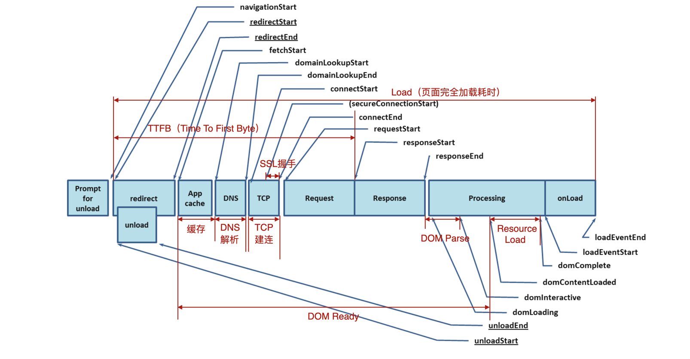

# 页面性能

## 性能指标与采集

- 初始化阶段

  1. navigationStart: 用户完成卸载前一个文档的时间点。
  2. redirectStart：页面重定向时的开始时间，或者是 0。
  3. redirectEnd：页面重定向的结束时间，或者是 0。

- 请求阶段

  1. fetchStart：浏览器发起资源请求时，有缓存时，则返回读取缓存的开始时间。
  2. domainLookupStart：查询 DNS 的开始时间。
  3. domainLookupEnd：查询 DNS 的结束时间。
  4. connectStart：浏览器开始与服务器连接时的时间。
  5. secureConnectionStart：如果页面使用 HTTPS，它的值是安全连接握手之前的时刻。
  6. connectEnd：当浏览器端完成与服务器端建立连接的时刻。
  7. responseStart：指客户端收到从服务器端（或缓存、本地资源）响应回的第一个字节的数据的时刻。
  8. responseEnd：指客户端收到从服务器端（或缓存、本地资源）响应回的最后一个字节的数据的时刻。

- 解析渲染阶段

  1. domLoading： 浏览器即将开始解析第一批收到的 HTML 文档字节，Document.readyState 变为 loading。
  2. domInteractive: 当前网页 DOM 结构结束解析、开始加载内嵌资源的时间点。Document.readyState 变为 interactive。
  3. domContentLoadedEventStart: 当解析器发送 DomContentLoaded 事件，所有需要被执行的脚本已经被解析。
  4. domContentLoadedEventEnd: 所有需要立即执行的脚本已经被执行。
  5. domComplete: 当前文档解析完成， Document.readyState 变为 complete。
  6. loadEventStart: 作为每个网页加载的最后一步，浏览器会触发 load 事件，以便触发额外的应用逻辑。如果这个事件还未被发送，它的值将会是 0。
  7. loadEventEnd:load 事件执行完成。如果这个事件还未被发送，或者尚未完成，它的值将会是 0。

## 指标 - 1、何时开始渲染 - FP & FCP

| 特性     | FP（First Paint - 首次绘制）       | FCP（First Contentful Paint - 首次内容绘制） |
| :------- | :--------------------------------- | :------------------------------------------- |
| 定义     | 浏览器首次渲染`像素`到屏幕的时间点 | 浏览器首次渲染`实际内容`的时间点             |
| 内容     | 可能是背景色、默认样式或占位符     | 实际内容（如文本、图片等）                   |
| 触发时机 | 页面开始渲染时                     | 页面中第一个实际内容渲染时                   |
| 用户感知 | 用户感知到页面开始加载             | 用户感知到页面内容出现                       |
| 优化重点 | 减少空白页面的时间                 | 加快实际内容的渲染速度（`早期指标`）         |

1. 白屏时间：FP 时间点之前，用户看到的都是没有任何内容的白色屏幕；
2. 首屏时间：FCP 反映当前 Web 页面的网络加载性能情况、页面 DOM 结构复杂度情况、inline script 的执行效率的情况；
3. 资源加载快、解析快、渲染快， FP 和 FCP 值越低，首屏渲染性能才会越优秀。
4. 通过这两个指标，就可以衡量页面何时开始渲染内容。
5. 官方推荐，FP 及 FCP 两指标在 2 秒内完成的话我们的页面就算体验优秀。

- 如何优化 FP（First Paint - 首次绘制） 和 FCP（First Contentful Paint - 首次内容绘制）

1. 优化 FP：

   - 减少“关键渲染路径的”阻塞资源，（例如：初始 HTML 加载速度，未优化的 CSS 或 js）；
   - 内联关键 CSS，延迟非关键 CSS；
   - 使用服务器端渲染（SSR）或预渲染；

2. 优化 FCP：

   - 优化图片和字体加载（如使用 loading="lazy" 或 preload）。
   - 减少 JavaScript 的执行时间（如代码拆分、异步加载）。
   - 使用 CDN 加速资源加载。

## 指标 - 2、何时渲染出主要内容 - FMP & LCP & SI

| 特性     | FMP（First Meaningful Paint-首次有效绘制） | LCP（Largest Contentful Paint-最大内容绘制） | SI（Speed Index-速度指数）                                          |
| :------- | :----------------------------------------- | :------------------------------------------- | :------------------------------------------------------------------ |
| 定义     | 主要内容首次渲染的时间点                   | 最大可见内容元素渲染完成的时间点             | 页面内容视觉填充速度的综合评分                                      |
| 触发时机 | 核心内容渲染时                             | 最大内容元素渲染时                           | 页面加载过程中视觉变化的综合计算                                    |
| 衡量重点 | 用户看到主要内容的时间                     | 用户看到最大内容的时间                       | 页面内容填充的视觉速度                                              |
| 优化目标 | 加快核心内容的渲染                         | 加快最大内容的渲染                           | 提高页面加载过程中视觉完整性的速度                                  |
| 推荐值   | 无明确标准（`逐渐被 LCP 取代`）            | 小于 2.5 秒                                  | 越低越好 （`因为计算复杂，指标难以解释，一般只在实验室环境下使用`） |

- 如何优化 FMP、LCP 和 SI

1. 优化 FMP：

   - 优先加载关键资源（如关键 CSS 和 JavaScript）。
   - 使用服务器端渲染（SSR）或静态站点生成（SSG）。
   - 延迟加载非关键资源。

2. 优化 LCP：

   - 优化图片和视频的加载（如使用 loading="lazy" 或 preload）。
   - 使用 CDN 加速资源加载。
   - 减少 JavaScript 的执行时间（如代码拆分、异步加载）。

3. 优化 SI：

   - 提高页面加载过程中视觉变化的连续性。
   - 优先渲染关键内容，避免布局抖动。
   - 使用骨架屏（Skeleton Screen）或占位符提升视觉完整性。

## 指标 - 3、何时可以交互 - TTI & TBT

| 特性     | TTI（Time to Interactive-可交互时间） | TBT（Total Blocking Time-总阻塞时间） |
| :------- | :------------------------------------ | :------------------------------------ |
| 定义     | 页面完全可交互的时间点                | FCP 到 TTI 之间主线程被阻塞的总时间   |
| 触发时机 | 页面可交互时                          | FCP 到 TTI 之间的长任务阻塞时间       |
| 衡量重点 | 用户何时可以正常使用页面              | 主线程在加载过程中的阻塞程度          |
| 优化目标 | 减少页面可交互的时间                  | 减少主线程的阻塞时间                  |
| 推荐值   | 小于 5 秒                             | 小于 200ms                            |

Long Task: 如果浏览器主线程执行的一个 task 耗时大于 50ms，那么这个 task 称为 long task。

如何优化 TTI 和 TBT

- 减少 JavaScript 执行时间：
  1. 代码拆分（Code Splitting）：按需加载 JavaScript。
  2. 延迟加载非关键 JavaScript（例：延迟到页面可交互后执行）。
- 优化主线程任务：
  1. 使用 Web Workers 将任务转移到后台线程。

1.  避免长任务（Long Tasks），将大任务拆分为小任务（例： setTimeout 或 requestIdleCallback）。

- 减少网络请求：

  1. 使用 HTTP/2 或 HTTP/3 加速资源加载。
  2. 压缩和缓存 JavaScript 文件。

- 优化渲染性能：
  1. 避免强制同步布局（Forced Synchronous Layout）。
  2. 使用 CSS 动画代替 JavaScript 动画。

通过优化 JavaScript 执行效率、减少长任务和优化网络请求，可以显著提升 TTI 和 TBT，从而改善用户体验。

## 指标 - 4、交互时是否有延迟 - FID & MPFID

| 特性     | FID（First Input Delay-首次输入延迟） | MPFID（Max Potential First Input Delay-最大潜在首次输入延迟） |
| :------- | :------------------------------------ | :------------------------------------------------------------ |
| 定义     | 用户首次交互的实际延迟时间            | 页面加载期间可能出现的最大输入延迟                            |
| 触发时机 | 用户首次交互时                        | 页面加载过程中主线程的长任务阻塞时间                          |
| 衡量重点 | 用户实际体验到的交互延迟              | 用户可能遇到的最差交互延迟                                    |
| 优化目标 | 减少用户首次交互的延迟                | 减少页面加载期间主线程的阻塞时间                              |
| 推荐值   | 小于 100ms                            | 无明确标准，越低越好                                          |

如何优化 FID 和 MPFID

- 减少主线程的阻塞：
  1. 避免长任务（Long Tasks），将大任务拆分为小任务（例：使用 setTimeout 或 requestIdleCallback 拆分任务。）。
  2. 使用 Web Workers 将任务转移到后台线程。
- 优化 JavaScript 执行：
  1. 延迟加载非关键 JavaScript（例：延迟到页面可交互后执行）。
  2. 使用代码拆分（Code Splitting）按需加载 JavaScript。
- 优化事件处理：
  1. 使用 debounce 或 throttle 减少事件处理函数的执行频率。
  2. 避免在事件处理函数中执行耗时操作。
- 优化资源加载：
  1. 使用 preload 或 prefetch 提前加载关键资源。
  2. 压缩和缓存 JavaScript 文件。

通过优化主线程任务、减少长任务和优化资源加载，可以显著降低 FID 和 MPFID，从而提升页面的交互性能。

## 指标 - 5、页面是否稳定 - CLS

CLS（Cumulative Layout Shift）: 累积布局偏移。量化了“在页面加载期间，视口中元素的移动程度”。

CLS 推荐值为低于 0.1，越低说明页面跳来跳去的情况就越少，用户体验越好。毕竟很少有人喜欢阅读或者交互过程中网页突然动态插入 DOM 的情况，比如说插入广告~

- 如何优化 CLS
  1. 图片和视频指定宽高;
  2. 无尺寸的广告、嵌入和 iframe--预留空间、避免在可视区域顶部放置广告、使用“占位符”或者预先计算足够的空间;
  3. 动态注入的内容--预留空间（例:评论、推荐列表）;
  4. 导致不可见文本闪烁 (FOIT)/无样式文本闪烁 (FOUT) 的网络字体 -- 预加载字体
  5. 在更新 DOM 之前等待网络响应的操作 -- 倾向于选择 transform 动画，而不是触发布局偏移的属性动画（CSS 触发器和高性能动画）
  6. 测试和监控；

优化 CLS 的核心方法是确保页面元素加载前后占位一致，避免动态内容插入导致的布局抖动。
通过优化图片、字体、动态内容以及使用 CSS 属性，可以显著降低 CLS，提升用户体验和 SEO 排名。

## 指标 - 6、Core Web Vitals 三核心指标

2020 年 5 月，Google 提出的衡量网站用户体验的核心数据指标，涵盖了页面的加载速度、可交互性和稳定性，会影响 SEO 的重要指标，包含一下三项：

1. LCP：衡量加载速度。代表了页面的速度指标。LCP 能体现的东西更多一些。一是指标实时更新，数据更精确，二是代表着页面最大元素的渲染时间，通常来说页面中最大元素的快速载入能让用户感觉性能还挺好。
2. FID：衡量交互性。代表了页面的交互体验指标。没有一个用户希望触发交互以后页面的反馈很迟缓，交互响应的快会让用户觉得网页挺流畅。
3. CLS：衡量稳定性。代表了页面的稳定指标。CLS 值一大的话会让用户觉得页面体验做的很差

## 如何系统优化页面

https://blog.csdn.net/qq_46143850/article/details/139323557

一个页面有三个阶段：加载阶段、交互阶段、视觉稳定、关闭阶段。

1. 加载阶段：

   - 减少关键资源个数; （超小的 js/css 内联；js 不操作 dom/css 用 async/defer 属性，css 媒体选择器取消加载）
   - 降低关键资源大小;（压缩；移除注释）
   - 降低关键资源的 RTT（Round Trip Time - 往返） 次数;（减少个数；减少大小；CDN）

     那什么是 RTT 呢？（当使用 TCP 协议传输一个文件时，比如这个文件大小是 0.1M，由于 TCP 的特性，这个数据并不是一次传输到服务端的，而是需要拆分成一个个数据包来回多次进行传输的。RTT 就是这里的往返时延。它是网络中一个重要的性能指标，表示从发送端发送数据开始，到发送端收到来自接收端的确认，总共经历的时延。通常 1 个 HTTP 的数据包在 14KB 左右，所以 1 个 0.1M 的页面就需要拆分成 8 个包来传输了，也就是说需要 8 个 RTT。

   首先是请求 HTML 资源，大小是 6KB，小于 14KB，所以 1 个 RTT 就可以解决了。至于 JavaScript 和 CSS 文件，这里需要注意一点，由于渲染引擎有一个预解析的线程，在接收到 HTML 数据之后，预解析线程会快速扫描 HTML 数据中的关键资源，一旦扫描到了，会立马发起请求，你可以认为 JavaScript 和 CSS 是同时发起请求的，所以它们的请求是重叠的，那么计算它们的 RTT 时，只需要计算体积最大的那个数据就可以了。这里最大的是 CSS 文件（9KB），所以我们就按照 9KB 来计算，同样由于 9KB 小于 14KB，所以 JavaScript 和 CSS 资源也就可以算成 1 个 RTT。也就是说，上图中关键资源请求共花费了 2 个 RTT。）

   

2. 交互阶段（渲染阶段）：尽量减少一帧的生成时间。

   - 减少 js 脚本执行时间。（函数分解为多任务，每次执行时间不要太久；采用 Web Workers）
   - 避免强制同步布局：js 强制将“计算样式”和“布局操作”提前到当前的任务中。
   - 避免布局抖动： 在一段 js 代码中，反复执行布局操作。
   - 合理利用 CSS 合成动画：标记 will-change。
     合成动画是在“合成线程”上执行的；如果主线程被 js 或者一些布局任务占用，CSS 动画依然能继续执行（它不会触发重排或者重绘）。
   - 避免频繁的垃圾回收。

   

3. 关闭阶段：清理操作

## 长任务

任何运行时间超过 50 毫秒的任务都被视为“长任务”。

50 毫秒基准基于以下条件确认的：设备必须每 16 毫秒 (60 fps) 创建一个新帧才能保持流畅的视觉体验。然而，设备还必须执行其他任务，例如响应用户输入和执行 JavaScript。50ms 基准测试允许设备将资源分配给渲染帧和执行其他任务，并为设备提供约 33.33ms 的额外时间来执行其他任务，同时保持流畅的视觉体验。

## 重绘 / 重排（回流）/ 合成(单独一层好处) 效率：合成 > 重绘 > 重排

- 重排: 整个渲染流程再走一边（构建 DOM 树开始）

  1. 当渲染树中 “部分/全部元素” 的`尺寸、结构、内容`发生变化时

- 重绘: 跳过布局、分层；其余步骤也需要走一边（构建 DOM 树开始）

  1. 某些元素的样式发生变化，但是不会影响其在文档流中的位置时;
  2. color、background 相关属性：background-color、background-image 等
  3. outline 相 关 属 性 ： outline-color 、outline-width、ext-decoration、 border-radius、visibility、box-shadow

- 合成: 利用浏览器分层机制作一些优化（例如 css 的 transform），跳过了布局、分层、计算绘制列表，只进行栅格化的一些操作；

* 当需要 reflow（回流）repaint（重绘） 时，只需要 reflow repaint 本身，不会影响到其他的层
* 栅格化不占用主线程，

单独层创建的条件

1. 拥有具有 3D 变换的 CSS 属性:translate3d、translateZ（3D 或透视变换）
2. `<canvas><video><iframe><canvas><webgl>`等元素
3. 元素拥有 z-index
4. CSS3 动画的节点
5. 拥有 CSS 加速属性的元素(will-change)

## 减少重绘、重排（回流）

- css:

  1. 避免使用 table 布局；
  2. 使用  visibility  替换  display: none；
  3. 避免设置多层内联样式；
  4. 避免使用 CSS 表达式（例如：calc()）；
  5. 使用  transform  替代  top;
  6. 将动画效果应用到 position 属性为 absolute 或 fixed 的元素上
  7. 将频繁重绘或者回流的节点设置为图层；
  8. will-change: transform 启用硬件加速；

- JavaScript:

  1. 避免频繁操作 DOM，使用 fragment 元素（createDocumentFragment）；
  2. 避免频繁操作样式；多次修改时，把 dom 离线 ，修改完再显示。(display:none)；
  3. 合并多次 DOM 操作。比如用 class 来改变多个样式。
  4. 尽可能在 DOM 树的最末端改变 class / 进行操作；
  5. 尽量不要在布局信息改变时做查询（会导致渲染队列强制刷新）。

- 使用采用虚拟 DOM 的库，如 Vue，React

- **注** 浏览器针对页面的回流与重绘，进行了自身的优化——渲染队列；

1. 浏览器会将所有的回流、重绘的操作放在一个队列中，当队列中的操作到了一定的数量或者到了一定的时间间隔，浏览器就会对队列进行批处理。这样就会让多次的回流、重绘变成一次回流重绘。
2. 上面，将多个读操作（或者写操作）放在一起，就会等所有的读操作进入队列之后执行，这样，原本应该是触发多次回流，变成了只触发一次回流。
