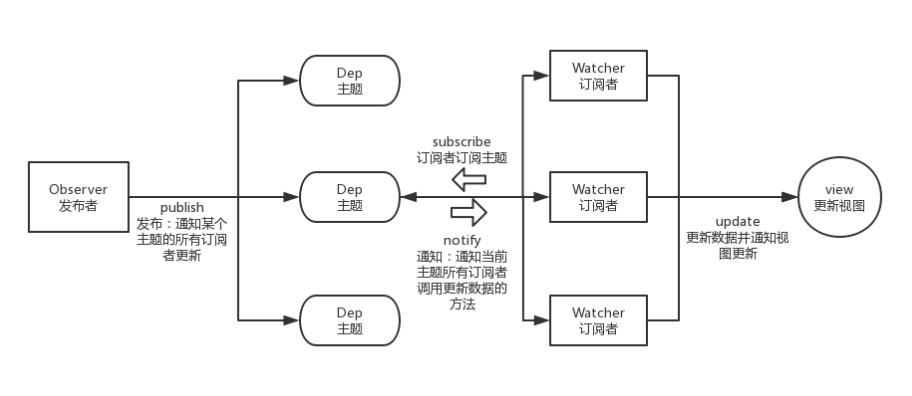

# JavaScript 设计模式和开发实践

## JS 常用事件（默认事件，自定义事件，观察者模式，发布订阅模式）

## 1.事件监听模式 (Event Listener Pattern)

```DOM 元素事件监听
const button = document.getElementById('myButton');
button.addEventListener('click', function(event) {
   console.log('按钮被点击了', event);
});
```

```自定义事件监听
const eventTarget = new EventTarget();
eventTarget.addEventListener('customEvent', (e) => {
    console.log('自定义事件触发', e.detail);
});
eventTarget.dispatchEvent(new CustomEvent('customEvent', { detail: { data: 'test' } }));

```

特点：

1. 支持多个监听器
2. 可以精确控制事件捕获和冒泡阶段
3. 使用 removeEventListener 移除监听

## 3.观察者模式---（目标对象-->观察者）

观察者模式:一对多的依赖关系，当目标对象（Subject ）的状态发生改变时，所有依赖于它的对象（Observer）都将得到通知，并自动更新。

一个目标对象（Subject），拥有方法：添加 / 删除 / 通知 观察者对象 （Observer）；  
多个观察者对象（Observer），拥有方法：接收 观察者对象 （Observer） 状态变更通知并处理；

```code
Subject 添加一系列 Observer， Subject 负责维护与这些 Observer 之间的联系，“你对我有兴趣，我更新就会通知你”。

// 目标对象
  class Subject(){
    constructor(){
        this.observers=[];//观察者列表
    }
    add(observer){
        this.observers.push(observer)
    }
    remove(observer){
        let idx = this.observers.findIndex(item=>item==observer);
        if(idx>-1){
            this.observers.splice(idx,1)
        }
    }
    notify(){
        for(let observer of this.observers){
            observer.update();
        }
    }
  }
  //观察者类
  class Observer{
       constructor(name){
        this.name = name;
    }
    update(){
        console.log(`目标对象通知我了，我是${this.name}`)
    }
  }
  //实例化目标对象
  let subject = new Subject();
  //实例化观察者
  let obs1 = new Observer('前端');
  let obs2 = new Observer('后端');
  subject.add(obs1);
  subject.add(obs2);
  subject.notify()
  //输出
  //目标对象通知我了，我是前端
  //目标对象通知我了，我是后端
```

## 2.发布订阅模式--（发布者-->消息代理/调度中心/中间件 -->订阅者）

发布订阅模式：发布者，并不会直接通知订阅者，换句话说，发布者和订阅者，彼此互不相识。  
由一个调度中心来做中间人，发布者更新(publish)主题，由主题(调度中心)来进行通知(noticy)订阅者更新(update)。


```code
    // 主题
    class Dep {
        constructor(callback) {
            this.subs = []; // 主题的订阅者
            this.callback = callback;
        }
        // 添加订阅者
        addSub(sub) {
            this.subs.push(sub);
            return this;
        }
        // 主题更新通知---调用订阅者update，通知所有订阅者
        notify() {
            this.subs.forEach(item => item.update(this.callback));
        }
    }

    // 订阅者
    class Sub {
        constructor(val) {
            this.val = val;
        }
        update(callback) {
            this.val = callback(this.val); // 执行订阅主题的函数
            console.log('更新之后:', this.val);
        }
    }

    // 发布者
    class Pub {
        constructor() {
            this.deps = []; // 发布的主题列表
        }
        // 添加主题
        addDep(dep) {
            this.deps.push(dep);
        }
        // 移除主题
        removeDep(dep) {
            let index = this.deps.indexOf(dep);
            if (index !== -1) {
              this.deps.splice(index, 1);
            }
        }
        // 更新主题
        publish(dep) {
            this.deps.forEach(item => item == dep && item.notify());
        }
    }
    // 新建主题，给主题中加订阅者
    let dep1 = new Dep(item => item * item);
    dep1.addSub(new Sub(1)).addSub(new Sub(2)).addSub(new Sub(3));

    // 新建发布者
    let pub = new Pub();
    // 添加主题
    pub.addDep(dep1);
    // 发布者发布，通知这个主题的所有订阅者更新
    pub.publish(dep1);

    // 输出结果
    // 更新之后结果:1
    // 更新之后结果:4
    // 更新之后结果:9
```

## 比较总结

| 模式                        | 耦合度 | 适用场景           | 特点                 |
| --------------------------- | ------ | ------------------ | -------------------- |
| 事件监听 （Event Listener） | 较高   | DOM 交互、简单事件 | 原生支持，简单直接   |
| 发布-订阅（Pub/Sub）        | 低     | 组件通信、全局事件 | 完全解耦，灵活       |
| Promise                     | 中     | 单次异步操作       | 链式调用，状态明确   |
| 观察者 （Observer）         | 中高   | 状态变化通知       | 目标维护观察者       |
| 异步迭代器（async-await）   | 中     | 异步数据流         | 流式数据处理         |
| 反应式编程（RxJS）          | 低     | 复杂事件流         | 功能强大，学习曲线陡 |

选择哪种事件模式取决于具体应用场景和复杂度。

1. 简单交互可用原生事件监听；
2. 组件通信适合发布-订阅；
3. 复杂异步流处理可考虑 RxJS 等反应式库；
