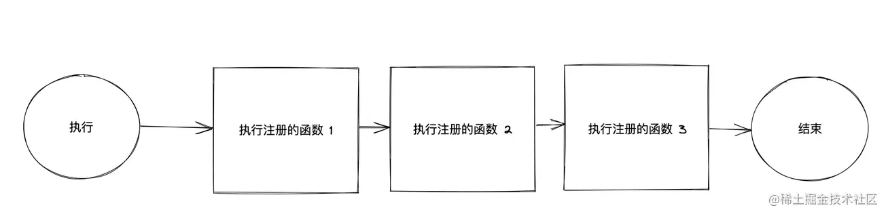

# webpack 插件示例

```code
    // MyPlugin.js
    function MyPlugin(options) {
        // Configure your plugin with options...
    }
    MyPlugin.prototype.apply = function (compiler) {
        compiler.plugin('compile', function (params) {
            console.log('The compiler is starting to compile...');
        });
        compiler.plugin('compilation', function (compilation) {
            console.log('The compiler is starting a new compilation...');
            compilation.plugin('optimize', function () {
                console.log('The compilation is starting to optimize files...');
            });
        });
        // 异步的事件钩子
        compiler.plugin('emit', function (compilation, callback) {
            console.log('The compilation is going to emit files...');
            callback();
        });
    };
    module.exports = MyPlugin;
```

**注：**entry 每个入口对应一个 chunk

## compiler & compilation 对象

通过对 webpack 插件的初步了解，我们注意到了一个 Webpcak 插件中出现了两个对象，一个是 compiler 对象, 一个是 compilation 对象，乍一看这两个对象肯定是一头雾水，compiler 和 compilation 对象是整个 webpack 最核心的两个对象，是扩展 webpack 功能的关键。为了更加利于后面对 webpack 插件机制的理解，先重点介绍一下这两个对象。

- compiler 对象 (负责整体编译流程的 Compiler 对象)

compiler 对象是 webpack 的编译器对象，前文已经提到，webpack 的核心就是编译器，compiler 对象会在启动 webpack 的时候被一次性的初始化，compiler 对象中包含了所有 webpack 可自定义操作的配置，例如 loader 的配置，plugin 的配置，entry 的配置等各种原始 webpack 配置等，在 webpack 插件中的自定义子编译流程中，我们肯定会用到 compiler 对象中的相关配置信息，我们相当于可以通过 compiler
对象拿到 webpack 的主环境所有的信息。

- compilation 对象 ( 代表这一次资源构建的过程 )

这里首先需要了解一下什么是编译资源，编译资源是 webpack 通过配置生成的一份静态资源管理 Map（一切都在内存中保存），以 key-value 的形式描述一个 webpack 打包后的文件，编译资源就是这一个个 key-value 组成的 Map。而编译资源就是需要由 compilation 对象生成的。
compilation 实例继承于 compiler，compilation 对象代表了一次单一的版本 webpack 构建和生成编译资源的过程。当运行 webpack 开发环境中间件时，每当检测到一个文件变化，一次新的编译将被创建，从而生成一组新的编译资源以及新的 compilation 对象。**一个 compilation 对象包含了 当前的模块资源、编译生成资源、变化的文件、以及 被跟踪依赖的状态信息。** 编译对象也提供了很多关键点回调供插件做自定义处理时选择使用。

由此可见，如果开发者需要通过一个插件的方式完成一个自定义的编译工作的话，如果涉及到需要改变编译后的资源产物，必定离不开这个 compilation 对象。

如果需要了解 compiler 和 compilation 对象的详情，可以通过在插件中 console.log(compilation) 的方式进行查看对象所包含的内容，然而如果还想了解的更加透彻的话，看源码是一个非常好的途径，将会使你对 webpack 的认识更加深刻。

- Note

通过阅读 webpack 源码，可以发现一个有意思的设计，webpack 的核心是 webpack 的 compiler 对象，而 compiler 对象本身就是一个 Tapable 实例。compiler 对象的职责是编译 webpack 的配置对象，并返回一个 Compilation 实例。当 Compilation 实例运行时，它会创建所需的 bundle（也就是编译结果了）。

## [compiler 事件钩子](https://webpack.docschina.org/api/compiler-hooks/#entryoption)

| 事件钩子      | 触发时机                                            | 得到的内容       | 类型 |
| ------------- | --------------------------------------------------- | ---------------- | ---- |
| entry-option  | 初始化 option                                       | -                | 同步 |
| run           | 开始编译                                            | compiler         | 异步 |
| compile       | 真正开始的编译，在创建 compilation 对象之前         | compilation 参数 | 同步 |
| compilation   | 生成好了 compilation 对象，可以操作这个对象啦       | compilation      | 同步 |
| make          | 从 entry 开始递归分析依赖，准备对每个模块进行 build | compilation      | 并行 |
| after-compile | 编译 build 过程结束                                 | compliation      | 异步 |
| emit          | 在将内存中 assets 内容写到磁盘文件夹之**前**        | compilation      | 异步 |
| after-emit    | 在将内存中 assets 内容写到磁盘文件夹之**后**        | compilation      | 异步 |
| done          | 完成所有的编译过程                                  | stats            | 同步 |
| failed        | 编译失败的时候                                      | error            | 同步 |

**compiler 的绑定事件钩子的方式**

```code
    // 前提是先要拿到 compiler 对象，apply 方法的回调中就能拿到，这里假设能拿到 compiler 对象
    compiler.plugin('emit', function (compilation, callback) {
        // 可以得到 compilation 对象，如果是异步的事件钩子，能拿到 callback 回调。
        // 做一些异步的事情
        setTimeout(function () {
            console.log("Done with async work...");
            callback();
        }, 1000);
    });
```

## [compilation 事件钩子](https://webpack.docschina.org/api/compilation-hooks/#seal)

compilation 对象代表了一次单一的版本 webpack 构建和生成编译资源的过程,compilation 对象可以访问所有的模块和它们的依赖（大部分是循环依赖）。在编译阶段，模块被 `加载，封闭，优化，分块，哈希 和 重建`等等

1. normal-module-loader:普通模块 loader，真实地一个一个加载模块图(分析之后的所有模块一种数据结构)中所有的模块的函数;
   模块，就是通常所说的 AMD, CMD 等模块化的模块。

   ```code
    // 前提是能先取到 complation 对象（可以通过 compiler 事件钩子取到）
    compilation.plugin('normal-module-loader', function (loaderContext, module) {
        // 这里是所有模块被加载的地方
        // 一个接一个，此时还没有依赖被创建，想拿到啥模块直接通过 module 取
    });
   ```

2. seal:编译的封闭已经开始，这个时候再也收不到任何的模块了，进入编译封闭阶段（参考 webpack 流程图）。

   ```code
    compilation.plugin('seal', function () {
        // 你已经不能再接收到任何模块
        // 回调没有参数
    });
   ```

3. optimize:优化编译，这个事件钩子特别重要，很多插件的优化工作都是基于这个事件钩子，表示 webpack 已经进入优化阶段。

   ```code
    compilation.plugin('optimize', function () {
        // webpack 已经进入优化阶段
        // 回调没有参数
    });
   ```

4. optimize-modules : 模块的优化

   ```code
    compilation.plugin('optimize-modules', function (modules) {
        // 等待处理的模块数组
        console.log(modules);
    });
   ```

5. optimize-chunks:这是个重要的事件钩子，webpack 的 chunk 优化阶段。可以拿到模块的依赖，loader 等，并进行相应的处理。

   ```code
    compilation.plugin('optimize-chunks', function (chunks) {
        //这里一般只有一个 chunk，除非你在配置中指定了多个入口
        chunks.forEach(function (chunk) {
            // chunk 含有模块的循环引用
            chunk.modules.forEach(function (module) {
                console.log(module);
                // module.loaders, module.rawRequest, module.dependencies 等。
            });
        });
    });
   ```

6. additional-assets:这是一个异步的事件钩子，在这个阶段可以为 compilation 对象创建额外的 assets，也就是说可以异步的在最后的产物中加入自己自定义的一些资源，可以看一下往 assets 里面新增一个 svg 资源的例子：

   ```code
   compiler.plugin('compilation', function (compilation) {
       compilation.plugin('additional-assets', function (callback) {
           download('https://some.host/some/path/some.svg', function (resp) {
               if (resp.status === 200) {
                   compilation.assets['webpack-version.svg'] = toAsset(resp);
                   callback();
               }
               else {
                   callback(new Error('[webpack-example-plugin] Unable to download the image'));
               }
           })
       });
   });
   ```

7. ....（等等等）

## Tapable & Tapable 实例 (Tapable 类似于 NodeJS 的 EventEmitter 类，专注于自定义事件的触发和操作。)

## Tapable 官方文档提供了这九种钩子

```code
    const {
        SyncHook, //同步基础钩子
        SyncBailHook, //同步--保险类型钩子
        SyncWaterfallHook,//同步--瀑布类型的钩子
        SyncLoopHook,//同步--循环类型钩子

        AsyncParallelHook, // 异步并行钩子
        AsyncParallelBailHook, // 异步并行钩子

        AsyncSeriesHook, //异步串行
        AsyncSeriesBailHook, //异步串行
        AsyncSeriesWaterfallHook //异步串行
    } = require("tapable");

```

1. Basic Hook(基本类型钩子) : 它仅仅执行钩子注册的事件，不关心每个被调用的事件(函数)返回值如何。

   

2. Waterfall(瀑布类型钩子) : 瀑布类型的钩子和基本类型的钩子基本类似，唯一不同的是瀑布类型的钩子会在注册的事件执行时将事件函数执行非 undefined 的返回值传递给接下来的事件函数作为参数。

   

3. Bail(保险类型钩子) : 保险类型钩子在基础类型钩子上增加了一种保险机制，如果任意一个注册函数执行返回非 undefined 的值，那么整个钩子执行过程会立即中断，之后注册事件函数就不会被调用了。

   

4. Loop(循环类型钩子) : 循环类型钩子稍微比较复杂一点。循环类型钩子通过 call 调用时，如果任意一个注册的事件函数返回值非 undefeind ,那么会立即重头开始重新执行所有的注册事件函数，直到所有被注册的事件函数都返回 undefined。

   
