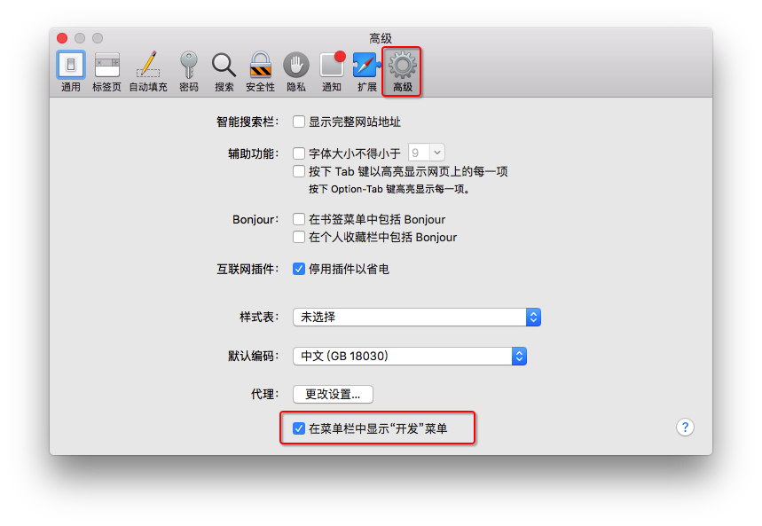
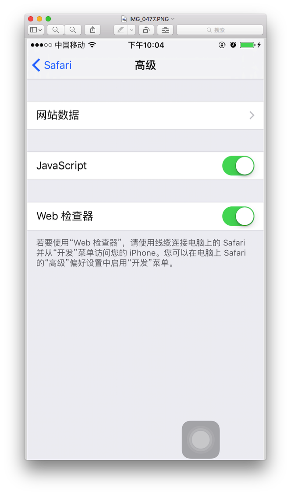
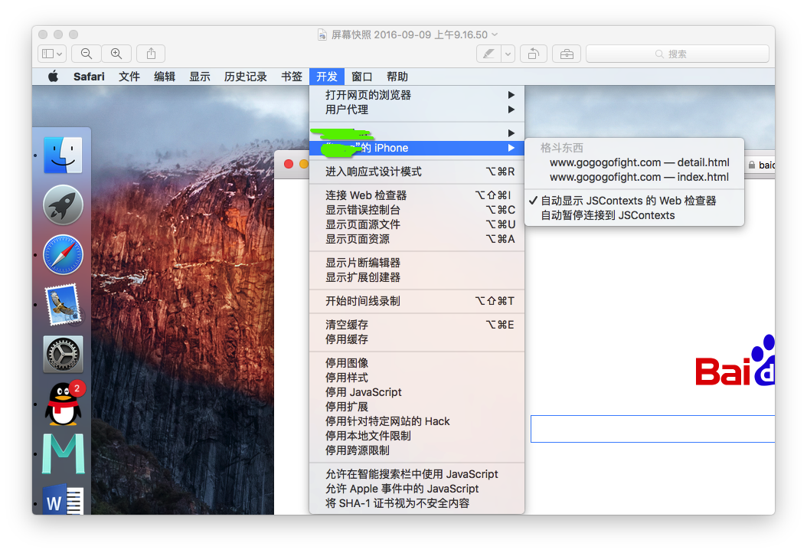
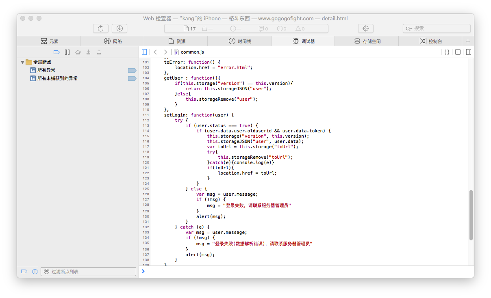

# 移动端 -- 页面

## 调试工具 -- vconsole

https://github.com/Tencent/vConsole/blob/dev/doc/tutorial_CN.md

## 用 Mac 调试 iPhone iPad 的 safari

1. Safari 设置

   打开 Safari“偏好者设置“，选中“高级菜单”，在页面最下方看到“在菜单中显示开发菜单”的复选框，在复选框内打钩，这样设置完毕就能在 Safari 菜单中看到开发菜单了

   

2. iPhone 设置

   打开 iPhone 手机设置 app 选择 Safari，找到高级选项，有 JavaScript 开关 web 检查器开关，讲两个开关都打开

   

3. 调试

   到此，准备工作完成。这时候用数据线将 iPhone 链接到 mac 上，同意 trut，打开 Safari 浏览器，运行手机 app 里面的 web 页面，在开发菜单中选择连接的手机，找到调试的网页，就能在 Safari 里面调试了

   

   - Safari 调试窗口

     

   - Safari 控制台

     在 Safari 中鼠标右键，选择检查元素，就可以看见 Safari 控制台了。如果看不到检查元素选项，依照上面 Safari 设置打开开发选项

## Android + Chrome 实现远程调试
