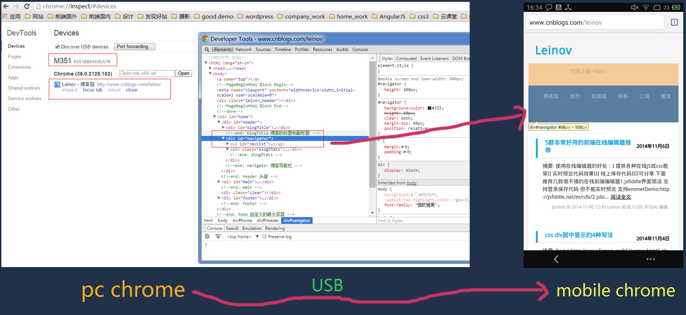
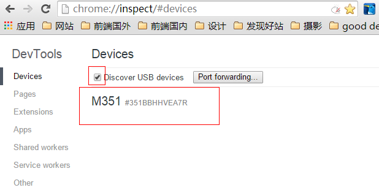
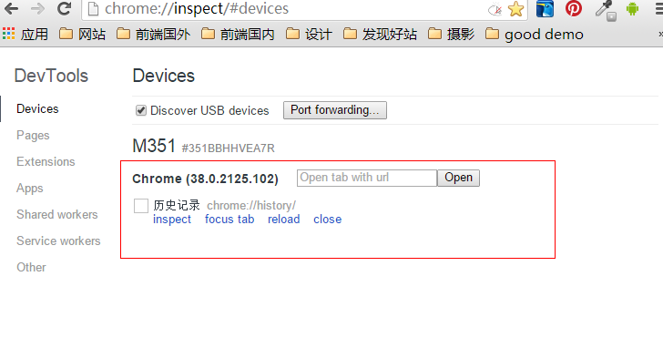
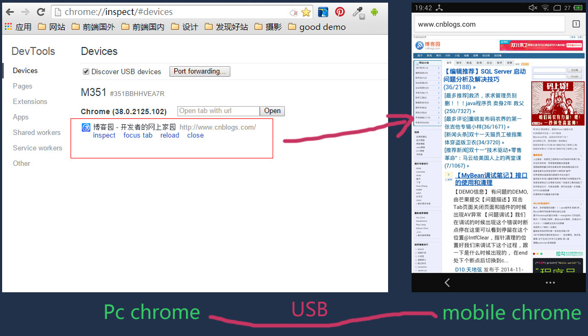
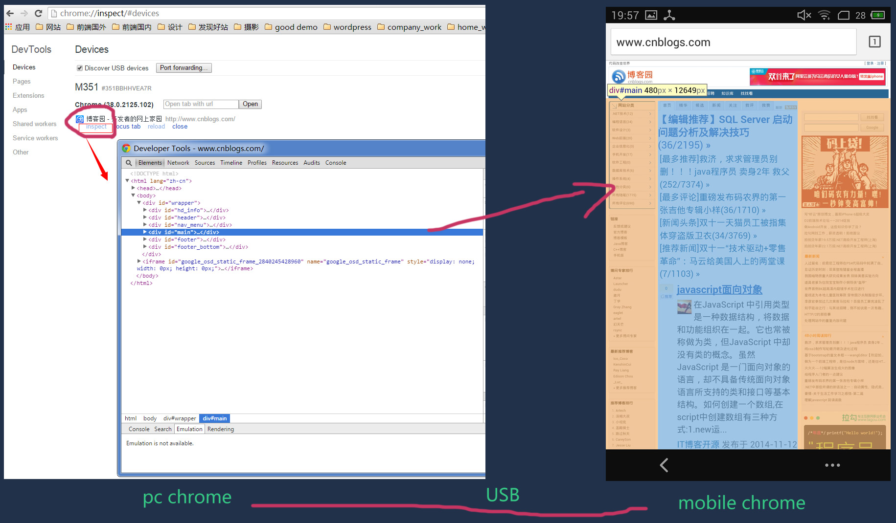
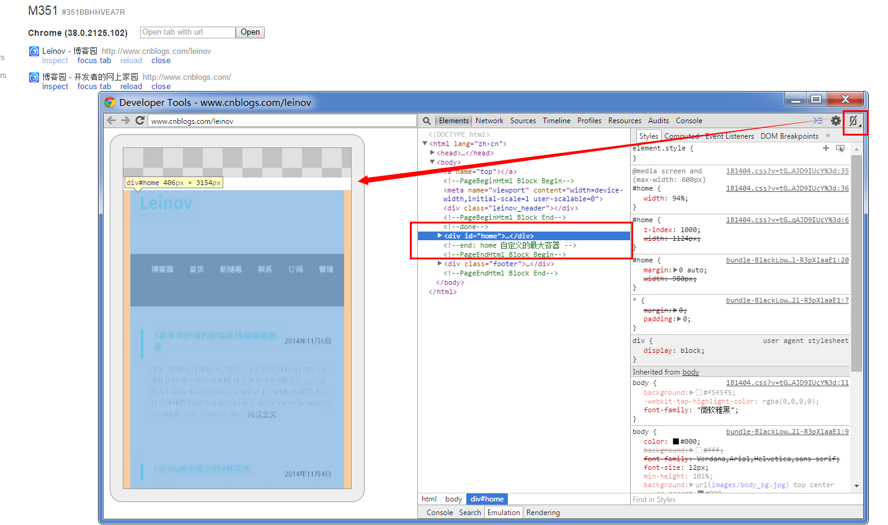

# 移动端 -- 页面

## 调试工具 -- vconsole

https://github.com/Tencent/vConsole/blob/dev/doc/tutorial_CN.md

## 用 Mac 调试 iPhone iPad 的 safari

1. Safari 设置

   打开 Safari“偏好者设置“，选中“高级菜单”，在页面最下方看到“在菜单中显示开发菜单”的复选框，在复选框内打钩，这样设置完毕就能在 Safari 菜单中看到开发菜单了

   

2. iPhone 设置

   打开 iPhone 手机设置 app 选择 Safari，找到高级选项，有 JavaScript 开关 web 检查器开关，讲两个开关都打开

   

3. 调试

   到此，准备工作完成。这时候用数据线将 iPhone 链接到 mac 上，同意 trut，打开 Safari 浏览器，运行手机 app 里面的 web 页面，在开发菜单中选择连接的手机，找到调试的网页，就能在 Safari 里面调试了

   

   - Safari 调试窗口

     

   - Safari 控制台

     在 Safari 中鼠标右键，选择检查元素，就可以看见 Safari 控制台了。如果看不到检查元素选项，依照上面 Safari 设置打开开发选项

## Android + Chrome 实现远程调试

要达到的效果, 上图的`左边是pc端的chrome`浏览器，`右边是手机上的chrome`  然后可以看到当鼠标移动到某个 div 上时 手机上的这个区域高亮显示 跟 pc 上调试某段代码效果一样 你可以修改代码 并直接在手机上反馈修改结果

- 准备

  为了完成这一亮骚的移动调试功能我们需要以下准备工作

  1. pc 端安装最新的 chrome
  2. 手机端安装最新的 chrome (Android 机)
  3. USB 连接线
     （感觉是不是 too simple）

  Tip：之前的的 chrome 如果要实现这种调试需要安装一个 ADB 插件（需要 FQ）  但是最新的 chrome 已经直接支持对 Android 的识别 所以也不用再在 chrome 上安装 ADB 插件了 但需要下载最新的 chrome

- 步骤 --下来我们逐步完成

  1. 假设你已经在电脑上下载了最新的 chrome 也在手机上下载了最新的 chrome

  2. USB 设置 在你的手机里打开"设置"->"开发人员工具"->"USB 调试" 打开 USB 调试。  因为 Android 手机型号众多 很多人找不到"USB 调试这个选项在哪" 而且大多数手机"开发者选项"默认是影藏的，你需要看下自己的手机说明然后将手机调到"开发者模式" 就可以找到 "USB 调试了"

  3. 假设你已经将手机设置为"USB 调试"打开的状态 将手机连接到电脑 手机会弹出是否链接 点击确定

  4. 打开电脑的 chrome 在地址栏输入  chrome://inspect   选中  Discover USB devices  可以检测到你的设备 可以看到监测到我的设备是 M351 魅族 X3

     

  5. 打开手机上的 chrome

     

     上图可以看到手机上 chrome 打开的页面 此时我手机上的 chrome 没打开任何网页 历史记录也么有 如果我们在手机  chrome 浏览器输入www.cnblogs.com 可以看到下图 ，也可以通过 inspect 里 chrome 后面那个输入框直接打开某个链接

     

  6. 点击 inspect 如下图 就看到了文章开始一样的效果 此时就是可以审查手机页面上的元素了

     

  7. 可以点击弹出的审查元素框右上角的方形小图标切换到视图模式 这时会把你手机打开的页面拉到 pc 上显示  
     

- 总结:
  基本上已经愉快的完成了 总结下整个流程 ：pc 端和 Android 手机端都下载最新的 chrome ，在手机设置里将"USB 调试"打开   链接到电脑 打开电脑 chrome 输入 chrome://inspect 打开手机 chrome 输入你想调试的页面 点击 inspect 开始调试 ,整个调试的过程都是要 FQ 的哦 。
