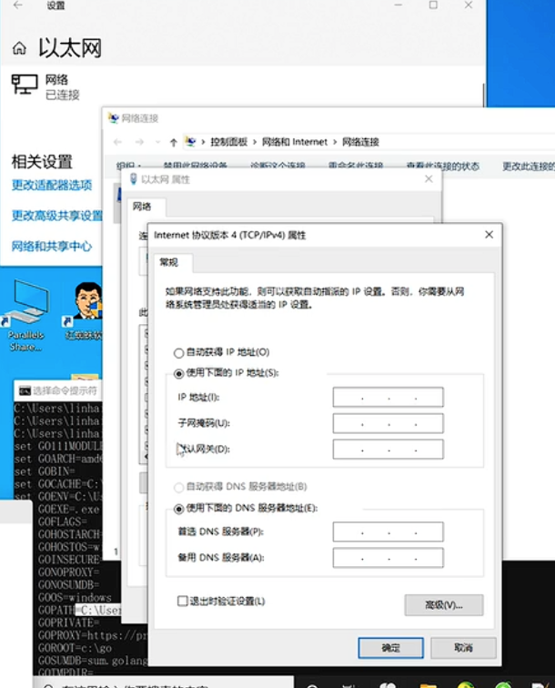
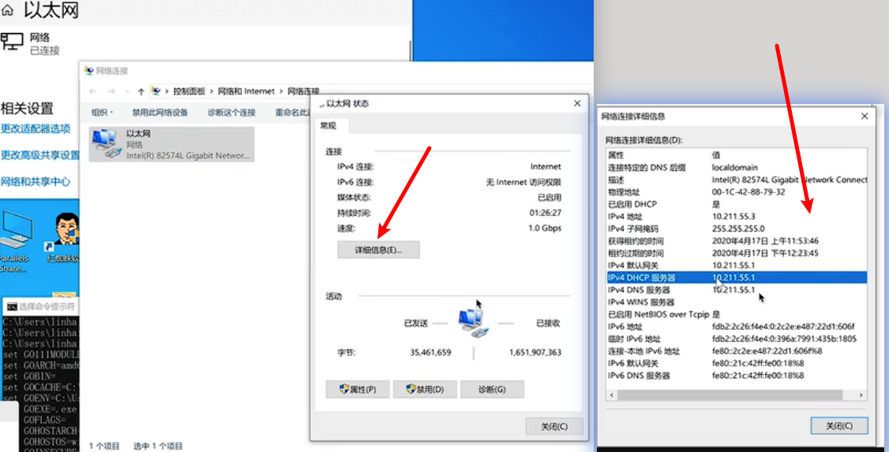

# TCP/IP

- ip:
  - 0,0,0,0: 监听所有网卡（是否能访问取决于网络环境）；
  - 127.x.x.x: “本地回环”，永远只在本机内部通信
  - 192.168.x.x: 局域网可访问

## 对比

1. 分层模型（统一理解），每一层“只做一件事”（最重要理解）

   ```code
   OSI（七层模型教学）    TCP/IP（五层实现）       工程理解（六层工程）        解决问题               核心概念
   -----------------------------------------------------------------------------------------------------
   应用(7)              应用层                  应用层                    干什么                 HTTP / DNS
   表示(6)
   会话(5)
   -----------------------------------------------------------------------------------------------------
   传输(4)              传输层                  传输层                    如何可靠传              TCP / UDP
   -----------------------------------------------------------------------------------------------------
   网络(3)              网络层                  寻址层 + 转发层            目标是谁 + 怎么过去      IP + 路由
   -----------------------------------------------------------------------------------------------------
   链路(2)              数据链路层               标识层                    下一跳是谁              MAC
   -----------------------------------------------------------------------------------------------------
   物理(1)              物理层                  设备层                    怎么发                 网卡/信号
   ```

   设备层 → 标识层 → 寻址层 → 转发层 → 传输层 → 应用层

2. 数据是怎么一步步封装的

   ```code
      应用层：  data
       ↓
      传输层：  TCP + data  → Segment（报文段）
       ↓
      网络层：  IP + Segment → Packet（包）
       ↓
      链路层：  MAC + Packet → Frame（帧）
       ↓
      物理层：  bit → 电信号
   ```

3. 网络三大核心机制（必须掌握）
   - 1️⃣ 寻址（IP）： 决定：目标是谁（最终目的地）
     → 提供源IP、目标IP

   - 2️⃣ 转发（路由）： 决定：下一跳是谁
     1. 查路由表（最长前缀匹配）
     2. 判断：
        - 同一网段 → 直接交付
        - 不同网段 → 交给网关（默认路由）

   - 3️⃣ 交付（MAC）： 决定：把数据交给谁
     - 如果不知道MAC：使用ARP：IP → MAC
     - 封装二层帧：目标MAC = 下一跳设备的MAC

   - 👉 精华总结：IP定终点，路由定路径，MAC做交付。  
      IP → 路由 → ARP → MAC

   - 👉 重要特性：
     - 每一跳都会重新封装 MAC（因为下一跳变了）
     - IP 一般不变（除非发生 NAT）

4. 局域网 vs 外网（本质）  
   🟢 局域网: ARP → 找MAC → 直接发  
   🔴 外网: 发给网关 → 路由 → NAT → 互联网
5. 默认路由链路

   ```code
     你的电脑
       ↓（DHCP给默认网关）
     你家路由器
       ↓（ISP给默认路由）
     运营商网络
       ↓（BGP全球路由）
     互联网
       ↓
     目标服务器
   ```

6. 🔥网络本质(只干三件事)：
   1. 找人（DNS / IP）
   2. 找路（路由 / 网关）
   3. 送达（MAC / TCP）

## 详情

### OSI 七层模型--开放式系统互联模型 ( 只是概念模型 -- 没有实际用 )

1. 应用层 ： 网络主机提供**方法和接口**，直接对应用户行为；例如 HTTP、FTP、SMTP；

2. 表示层（语法层） ：对数据 序列化，加密解密，压缩与解压；

3. 会话层：管理会话；例如 Open/Close/ReOpen/检查状态等；

4. 传输层：主机到主机的数据通信；
   - 建立连接保证数据封包发送、接受顺序一致；
   - 提供可靠性（发送者知道数据有没有完成送达）；
   - 提供流控制；
   - 提供多路复用

5. 网络层：提供数据在逻辑单元（IP 地址）之间的传递；
   - 路由：决定数据下一站在哪
   - 寻址：为数据封包增加头信息（地址等）

6. 数据链路层：提供数据在设备和设备间传输（网卡->路由器->路由器->防火墙->等等）；
   - 流控制：发送者和接收者之间同步数据的 收发速度和数据量；
   - 错误流程：可以检测错误（CRC），❌ 一般不负责重传（以太网不做）, 重传主要在 TCP（传输层）

7. 物理层：定义底层一个个位（bit）的数据怎么转化为物理信号；例如：二进制怎么转化电压高低，如何转化为其他物理介质上的信号；
   - 将数据传递行为转化为物理设备识别的信号；

#### 注

- 应用层 ------|
- 表示层 ------|-->用户数据
- 会话层 ------|
- 传输层 --------->报文段（Segment）
- 网络层 --------->数据包（Packet）
- 数据链路层------->数据帧（Frame）
- 物理层 --------->物理信号

### TCP/IP 协议模型（工程用）

```bash
应用层
  │
  │ HTTP / DNS / SSH
  ▼
传输层
  │
  │ TCP / UDP
  ▼
网络层
  │
  │ IP / ICMP
  ▼
数据链路层
  │
  │ Ethernet / MAC / ARP
  ▼
物理层
  │
  │ 网线 / 光纤 / 无线电波
  ▼
真正的物理网络
```

1. 应用层 ----> http/FTP/SMTP等
   - 功能: 应用间通信，定义数据格式
   - 数据形态: 原始数据（根据协议规定的数据格式，程序员自己填充的数据）

2. 传输层 ----> TCP/UDP 协议（主机到主机）
   - 提供端口号（例:80）；
   - UDP: 只管发送（无连接、不可靠、不保证顺序，但开销小、延迟低）；
   - TCP: 负责 分段（Segment）、排序（序列号）、重传（丢包补发）、流量控制、拥塞控制；
   - 数据结构:
     1. TCP Header: 为原始数据 增加头部信息；包括：源端口/目标端口，序列号/确认号，标志位（SYN/ACK/FIN）
     2. TCP Data: 应用层数据转换后的数据单元；
   - 数据单元: 报文段（Segment），此时数据被切割成适合传输的大小（Segment = TCP Header + 应用层数据）。

3. 网络层 ----> IP 协议（源IP地址‘从哪来’ --> 目标IP地址‘到哪去’）
   - 数据结构:
     1. IP Header: 为传输层的数据 再增加头部, 包括源IP地址和目标IP地址；
     2. IP 数据: 把传输层数据封装成 IP 包（Packet）；
   - 数据单元: 数据包（Packet）

   `网关`: 网关 = 默认出口（下一跳）；通常是路由器的一个接口IP;  
   👉 网关本质: 离开当前网络的“默认出口”

4. 链路层 ----> 多种底层网络协议，例: Ethernet（以太网）, wifi(设备-->设备), ⚠️ ARP协议(根据IP找MAC)；
   - ARP协议: 只在局域网内生效; 当只知道目标 IP，但不知道 MAC 时，通过 ARP 查询;
   - 作用: 同一局域网内: 设备 → 设备;
   - 数据结构:
     1. Frame Header: 为每个 IP 包添加头部【当前MAC地址、下一跳MAC地址】;
     2. Frame Data:
     3. Frame Footer: 为每个 IP 包添加尾部【差错检测（CRC）】;
   - 数据单元: 数据帧（Frame）;

   关联设备: 网卡（MAC 地址、以太网等）  
   每经过一个路由器: IP 不变, MAC 重写

5. 物理层 ----> 传输介质: 双绞线、同轴电缆、光纤
   - 功能: 将二进制数据（0/1）转换为电信号或光信号，进行物理传输
   - 数据单元: 比特（Bit）

### IPV4与IPV6 协议

#### IPV4 协议: 4 字节（32 位二进制）

1. 采用 4 个字节（32 位）来表示 IP 地址;
2. 1 个字节(8 位)：`2*2*2*2*2*2*2*2=2^8=256`; 取值范围: 0 ~ 255;
3. IPv4 协议理论上可以提供约 42 亿个独立的地址 `256*256*256*256 = 256^4 = (2^8)^4 = 2^32 =4,294,967,296`;

#### IPV6 协议

`2001:0db8:85a3:0000:0000:8a2e:0370:7334`

1. 每个十六进制字符：用 4 位二进制 表示（因为 `2**4=16`,刚好对应 0-9 和 a-f）。
2. 每组 4 个字符：4 字符 ×4 位/字符=16 位。
3. 总共 8 组：8 组 ×16 位/组=128 位。
4. `2**128 大约 3.4×10**38`

## ip地址与子网掩码地址

| 名字               | 地址              | 转义                                 |
| :----------------- | :---------------- | :----------------------------------- |
| IP地址             | 172.16.10.1       | 10101100.00010000.00001010.000000001 |
| 子网掩码           | 255.255 255.255.0 | 11111111.11111111.11111111.000000000 |
| （合成的）网络地址 | 172.16.10.0       | 10101100.00010000.00001010.000000000 |

- 确定可用主机范围：在这个子网中，所有 IP 地址的前三位都必须是 172.16.10。最后一位用来区分不同的设备，范围从 1 到 254（0 是网络地址，255 是广播地址，都不能用作主机地址）
  1. 同一个局域网：直接给目标电脑；
  2. 不同局域网：发给网关；

- 广播域：广播域是一个逻辑上的网络范围。在这个范围内，任何一个设备发出的广播信息，都会被域内的所有其他设备接收到。

- 通过路由器或虚拟局域网（VLAN）等技术将一个大的网络分割成多个更小的广播域，可以有效限制广播信息的传播范围，减少不必要的流量。

## 查路由表 与 默认路由

- 默认路由

  1️⃣ 手动配置（管理员写死）
  2️⃣ DHCP 自动下发（最常见）
  3️⃣ 路由协议学习（企业/运营商）

```code
  你的电脑
    ↓（DHCP给默认网关）
  你家路由器
    ↓（ISP给默认路由）
  运营商网络
    ↓（BGP全球路由）
  互联网
    ↓
  目标服务器
```




