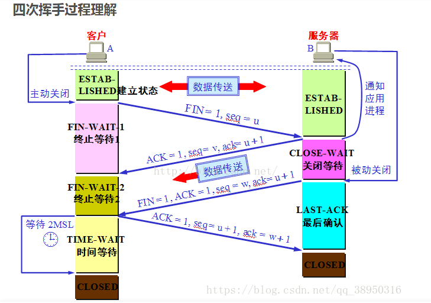

## 3 次握手

- 第一次握手：客户端发送一个 SYN 报文给服务器，表示请求建立连接。
- 第二次握手：服务器收到 SYN 报文后，发送一个 SYN+ACK 报文给客户端，表示同意建立连接。
- 第三次握手：客户端收到 SYN+ACK 报文后，发送一个 ACK 报文给服务器，确认连接建立成功

## 4 次挥手

- 第一次挥手：客户端发送一个 FIN 报文给服务器，表示客户端要关闭连接。
- 第二次挥手：服务器收到 FIN 报文后，发送一个 ACK 报文给客户端，确认收到关闭请求。
- 第三次挥手：服务器发送一个 FIN 报文给客户端，表示服务器也要关闭连接。
- 第四次挥手：客户端收到 FIN 报文后，发送一个 ACK 报文给服务器，确认连接关闭。

## 消息的绝对顺序用（SEQ,ACK）这一对元组描述：

- SEQ:这个消息发送前一共发送了多少字节；
- ACK：这个消息发送前一共收到了多少字节；
