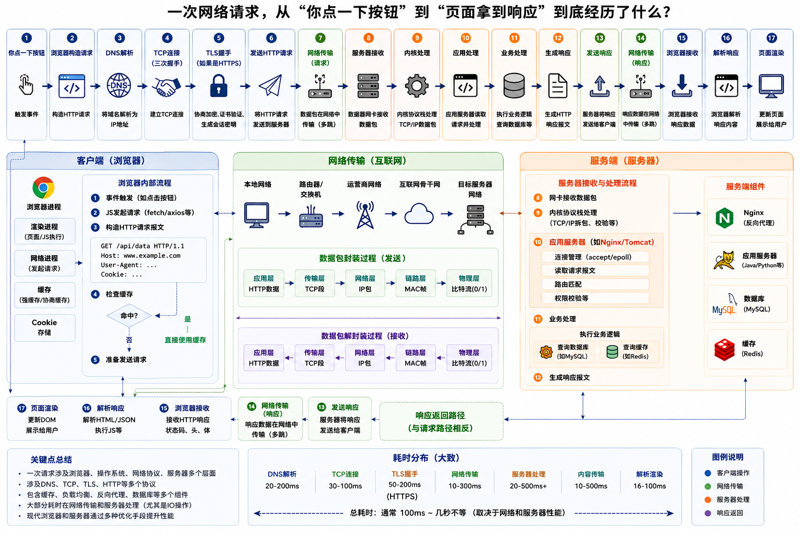

# 网络请求全流程

## 一次网络请求，从“你点一下按钮”到“页面拿到响应”到底经历了什么？

背后横跨：

- 浏览器
- 操作系统
- TCP/IP
- 网卡
- 路由器
- DNS
- Linux 内核
- epoll
- nginx
- 应用服务器
- 数据库
- 再一路返回

这是一条非常长的链路。

```bash
用户点击
  ↓
浏览器发起 HTTP 请求
  ↓
DNS 解析域名
  ↓
TCP 建立连接（三次握手）
  ↓
TLS/HTTPS 握手（如果 HTTPS）
  ↓
浏览器发送 HTTP 数据
  ↓
数据进入操作系统内核
  ↓
网卡发送数据包
  ↓
路由器/交换机/公网传输
  ↓
服务端网卡收到数据
  ↓
Linux 内核 TCP/IP 协议栈处理
  ↓
Socket 放入 accept 队列
  ↓
epoll/select 监听到事件
  ↓
应用服务器读取数据
  ↓
业务代码处理
  ↓
查询 Redis/MySQL
  ↓
生成 HTTP 响应
  ↓
响应数据写回 socket
  ↓
客户端收到响应
  ↓
浏览器解析数据
  ↓
页面更新
```



## 网络请求流程

### 第一阶段：用户操作（应用层）

1. 点击按钮
2. js发起请求（fetch/ajax等）
3. 浏览器构造HTTP请求报文【应用层协议】

```bash
   GET /api/user HTTP/1.1
   Host: xxx.com
   Cookie: ...
   User-Agent: ...
```

### 第二阶段：DNS 域名解析

浏览器发现：你访问的是 xxx.com,

但网络只能识别：IP地址,

所以先查：xxx.com → 112.80.xx.xx,

流程：

```bash
   浏览器缓存
     ↓
   系统缓存
     ↓
   hosts 文件
     ↓
   本地 DNS
     ↓
   根 DNS
     ↓
   顶级域 DNS
     ↓
   权威 DNS
```

最终得到：服务器 IP

### 第三阶段：TCP 建立连接（三次握手）

HTTP 本身不会传输数据。

真正传输的是：TCP, 所以客户端先建立 TCP 连接。

- 三次握手:
  1. 客户端：SYN
  2. 服务端：SYN + ACK
  3. 客户端：ACK

建立成功。

此时 OS 开始参与, 这里已经进入：内核态;

因为 TCP/IP 协议栈在："操作系统内核(Linux Kernel)"里实现。

### 第四阶段：HTTPS（TLS 握手）

如果是：`https://` 还需要：TLS 握手, 目的：协商加密密钥,否则网络传输是明文。

TLS 会：

1. 验证证书
2. 协商加密算法
3. 生成会话密钥

之后：HTTP 数据会被加密, 即：HTTP + TLS = HTTPS

### 第五阶段：客户端发送数据

现在浏览器真正发送：`GET /api/user HTTP/1.1`, 但这里不是直接发字符串。

- 会经历：
  1. HTTP 数据: `GET /api/user ...`
  2. TCP 分段，TCP 会：
     - 切分数据
     - 编号
     - 保证可靠性

  3. IP 包，加入：源IP、目标IP
  4. MAC 帧，加入：源MAC、目标MAC
  5. 网卡发送电信号,最终：`010101010101`发出去。

#### OSI / TCP-IP 分层（核心）

这里你会看到经典分层。

- TCP/IP 五层模型
  1. 应用层
  2. 传输层
  3. 网络层
  4. 数据链路层
  5. 物理层

- 数据封装过程
  1. 浏览器数据：HTTP 数据
  2. 传输层加 TCP Header：TCP + HTTP
  3. 网络层加 IP Header：IP + TCP + HTTP
  4. 链路层加 MAC Header：MAC + IP + TCP + HTTP
  5. 物理层：0101010101

### 第六阶段：网络传输过程

数据经过：

```bash
   交换机
   路由器
   运营商
   公网
   CDN
   负载均衡
```

不断转发。

- 路由器主要看：目标 IP, 决定下一跳。

### 九、服务端收到数据

服务器网卡收到："二进制数据", 然后："网卡 → DMA → 内存"🔥。

- DMA = Direct Memory Access

- 作用：
  1. 网卡直接写内存
  2. 不经过 CPU 搬运

否则 CPU 会累死。

### 十、Linux 内核处理数据

现在数据进入：Linux TCP/IP 协议栈

内核开始：

```bash
  拆 MAC
  拆 IP
  拆 TCP
  校验
  排序
  重传
```

最终还原：HTTP 请求

### 十一、Socket 登场（超级核心）

应用程序不会直接操作 TCP。

而是：Socket,

- socket 是：内核提供的网络编程接口
- 应用层：sock.recv(), 实际上是：从内核 socket 缓冲区读取数据

### 十二、accept 队列

服务端：server.listen() 之后：

内核维护：

- 半连接队列
- 全连接队列

TCP 完成三次握手后：连接进入 accept 队列

应用：conn, addr = server.accept()

本质：从 accept 队列取连接

### 十三、epoll/select 登场

现在问题来了：服务器有 `10万个连接` 怎么办？

Linux 提供：`IO 多路复用`，包括：

```bash
  select
  poll
  epoll
```

epoll 会：监听大量 socket, 哪个 socket 有数据：就通知应用

所以：

```bash
  nginx
  redis
  nodejs
  asyncio
```

底层都 heavily 依赖：epoll

### 十四、应用服务器处理请求

现在："应用代码终于开始执行", 例：'@app.get("/user"), app.get("/user")'

可能会：

```bash
  查 Redis
  查 MySQL
  调用微服务
  读文件
```

### 十五、数据库阶段

比如：`select * from user where id = 1`

又会重复：

```bash
  TCP
  IO
  epoll
  网络
```

这一整套。

### 十六、生成 HTTP 响应

最终：

```bash
  HTTP/1.1 200 OK
  Content-Type: application/json

  {
    "name": "Tom"
  }
```

### 十七、响应返回客户端

过程完全反向：

```bash
  应用层
  → socket
  → TCP
  → IP
  → MAC
  → 网卡
  → 公网
  → 客户端
```

### 十八、浏览器处理响应

浏览器收到后：

- 如果是 JSON: `fetch().then(res => res.json())`
- 如果是 HTML: 浏览器：

  ```bash
    解析 HTML
    构建 DOM
    解析 CSS
    构建 CSSOM
    生成 Render Tree
    Layout
    Paint
  ```

  最后页面显示。

## socket 是一切网络编程基础

所有：

```bash
  HTTP
  WebSocket
  Redis
  MySQL
  RPC
```

本质都基于：socket
