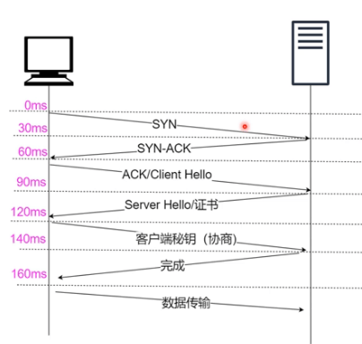

# HTTP1 / HTTP2 / HTTP3 / HTTPS / WebSocket / 状态码

## HTTP/0.9

基于 TCP 协议，三次握手建立连接，发送一个 GET 请求行（没有请求头和请求体），服务器接收请求之后，读取对应 HTML 文件，数据以 ASCII 字符流返回，传输完成断开连接；

## HTTP/1.0

1. 增加请求头和响应头来进行协商，在发起请求时通过请求头告诉服务器它期待返回什么类型问题、什么形式压缩、什么语言以及文件编码。
2. 引入来状态码，Cache 机制等；

## HTTP/1.1

- 改进持久化连接，解决建立 TCP 连接、传输数据和断开连接带来的大量开销，支持在一个 TCP 连接上可以传输多个 HTTP 请求，目前浏览器对于一个域名同时允许建立 6 个 TCP 持久连接；
- 引入 Chunk transfer 支持动态生成内容：服务器将数据分割成若干任意大小的数据块，每个数据块发送时附上上个数据块的长度，最后使用一个零长度的块作为发送数据完成的标志。在 HTTP/1.1 需要在响应头中设置完整的数据大小，如 Content-Length。
- **问题**：TCP 慢启动；同时开启多条 TCP 连接，会竞争固定宽带；对头阻塞问题；
- 在 HTTP/1.1 版中，报文的头信息必须是文本（ASCII 编码），数据体可以是文本，也可以是二进制。

## HTTP/2.0

- HTTP/2 则是一个彻底的二进制协议，头信息和数据体都是二进制，并且统称为"帧"，可以分为头信息帧和数据帧。帧的概念是它实现多路复用的基础。
- 多路复用：HTTP/2 实现了多路复用，HTTP/2 仍然复用 TCP 连接，但是在一个连接里，客户端和服务器都可以同时发送多个请求或回应，而且不用按照顺序一一发送，这样就避免了"队头堵塞"的问题。
- 数据流：HTTP/2 使用了数据流的概念，因为 HTTP/2 的数据包是不按顺序发送的，同一个连接里面连续的数据包，可能属于不同的请求。因此，必须要对数据包做标记，指出它属于哪个请求。HTTP/2 将每个请求或回应的所有数据包，称为一个数据流。每个数据流都有一个独一无二的编号。数据包发送时，都必须标记数据流 ID ，用来区分它属于哪个数据流;
- 头信息压缩：HTTP/2 实现了头信息压缩，由于 HTTP 1.1 协议不带状态，每次请求都必须附上所有信息。所以，请求的很多字段都是重复的，比如 Cookie 和 User Agent ，一模一样的内容，每次请求都必须附带，这会浪费很多带宽，也影响速度。HTTP/2 对这一点做了优化，引入了头信息压缩机制。一方面，头信息使用 gzip 或 compress 压缩后再发送；另一方面，客户端和服务器同时维护一张头信息表，所有字段都会存入这个表，生成一个索引号，以后就不发送同样字段了，只发送索引号，这样就能提高速度了。
- 服务器推送：HTTP/2 允许服务器未经请求，主动向客户端发送资源，这叫做服务器推送。使用服务器推送提前给客户端推送必要的资源，这样就可以相对减少一些延迟时间。这里需要注意的是 http2 下服务器主动推送的是静态资源，和 WebSocket 以及使用 SSE 等方式向客户端发送即时数据的推送是不同的。

- **TCP 问题**：如果在传输过程中，有一个数据因为网络故障或者其他原因丢失，那么整个连接会处于暂停状态，只有等到该数据重新传输；
- 防止对头阻塞（请求排队）；

**注：**不需要 1.雪碧图；2.js/css 合并；  
需要：1.GZIP 压缩；2.首屏优化

## Http/3.0

- HTTP/3 选择了一个折衷的方法，基于现有的 UDP 协议，实现类似 TCP 多路复用，传输可靠等功能，称为 QULC 协议；
- QULC 实现类似 TCP 流量控制，传输可靠功能；集成 TLS 加密功能；实现多路复用功能；快速握手；

http1.1/http2.0 ------|--------- http3.0
----------------------|--------- QUIC(谷歌出的优化)
-----TCP--------------|----------- UDP-------
--------------网络层-----------------------
--------------连接层-----------------------
--------------物理层-----------------------

## TCP vs UDP

UDP 好处：(不需要 3 次握手，直接发)

- 不需要建立连接；
- 封包体积更小
- 不关心数据顺序（不需要序号和 ACK）
- 不保证数据不丢失

## https

https：在 http 与 TCP/IP 之间增加了 TSL/SSL 层（ HTTP --> TSL/SSL --> TCP/IP ）

**运作方式：**

- SSL：安全套接层
- TSL：传输层安全协议(更安全些)
- 需要客户端安装证书；

1. 企业生成--非对称加密的（公钥 A 、私钥 B）和对称加密的 （I、J、K）;  
   企业自己生成的私有证书(公钥 A)----发送--->公信力组织----组织的私钥 签名（加密）------>加过密的签名（C）---->返回给企业；

2. 客户端请求 3 次握手后（此时不用证书加密），服务端将签过名的证书（C）发给客户端；
3. 客户端用“公信力组织的公钥（D）”解密证书（C），核对证书（C）是不是组织发布的；
   - 不是：完结；
   - 是：将证书（C）中的公钥（A）拿出来，加密数据（协商用哪个对称加密证书- I、J、K ）发给服务器，服务器用私钥（B）解密；
4. 私钥(B)解密失败：完结；成功，通信
   

- 证书：有公信力的组织颁布；（只当裁判，不踢球）
- 对称加密：客户端与服务端用同样的密钥加密解密；（例如：一把锁，两把钥匙）
- 非对称加密：公钥/私钥（一个只负责加密，一个只负责解密；不能都是“加密”或都是“解密”）
  公钥：公开的，每个人能可以用（可以负责加密，也可以负责解密--只能选择一种）  
  私钥：服务端（公司，组织）私有的（可以负责加密，也可以负责解密--只能选择一种）

**注：**2 种加密方式 理论上都可以暴力破解；对称加密破解的概率大点；

1. 在 TCP 和 HTTP 之间插入一个安全层，所有经过安全层的数据都会被加密或者解密；
2. 作用：1、保证数据传输的安全；2、确认网站的真实性。
3. HTTP 协议端口是 80，HTTPS 协议端口是 443；
4. 对称加密：
   浏览器发送加密套件列表和一个随机数 client-random，服务器会从加密套件中选取一个加密套件，然后生成一个随机数 service-random，返回给浏览器。这样浏览器和服务器都有相同 client-random 和 service-random，再用相同的方法将两者混合生成一个密钥 master secret，双方就可以进行数据加密传输了；
   - 缺点：client-random 和 service-random 的过程都是明文，黑客可以拿到协商的加密套件和双方随机数，生成密钥，数据可以被破解；
5. 非对称加密：
   浏览器发送加密套件列表给服务器，服务器选择一个加密套件，返回加密套件和公钥，浏览器用公钥加密数据，服务器用私钥解密；
   - 缺点：加密效率太低；初次通信黑客可以获取公钥。
6. 对称加密结合非对称加密：初次非对称，以后对称；

**注：**2 种加密方式 理论上都可以暴力破解；对称加密破解的概率大点；

## WebSocket

```
const client =new WebSocket("ws://chat.svc");

测试用 ws; 上线用 wss
ws -----> WebSocket 缩写
wss ----> WebSocket Secure（加密）
wss ----> tls-tcp/ip
https --> tls/ssl -->tcp/ip
```

1. WebSocket:握手和协议转换的过程很【自然】
2. socket(网络插座)：为客户端/服务端提供通信机制

## WebSocket 事件

- 事件:

  1. open：Socket.onopen-->连接建立时触发;
  2. message：Socket.onmessage -->客户端接收服务端数据时触发 ;
  3. error：Socket.onerror-->通信发生错误时触发;
  4. close：Socket.onclose-->连接关闭时触发;

- 方法：

  1. Socket.send()-->使用连接发送数据
  2. Socket.close()-->关闭连接

## http 协议 与 webSocket 协议

1. http 协议: http 协议建立链接也必须要有三次握手才能发送信息。（客户端是主动的，服务器是被动的）
2. webSocket 协议:只需建立一次 Request/Response 消息对，之后都是 TCP 连接 （客服端和浏览器可以同时发送信息）;
   - 好处：降低服务器的压力;减少部分多余的信息(不必带 head 的部分信息)。

## 状态码

- 301: 永久转移（和 308 对应；post 变 get）；
- 308: 永久重定向（和 301 对应；post 还是 post，不会变 get）；

- 302: Found 资源被找到-临时（以前是临时转移）--不建议使用；被拆成（303，307）;
- 303:（替代原来的 302）浏览器看到 303 自动用 get 跳转到对应的临时资源；（post 变 get）
- 307:（替代原来的 302）临时重定向（post 还是 post，不会变 get）；

- 304：资源没有修改（不返回资源，用缓存）；

- 401（未授权）：请求缺少有效的身份验证凭证 或 凭证是无效的【需要用户提供有效凭证】。
- 403（禁止访问）：服务器已经理解了请求，但拒绝执行它【即使用户提供了有效的身份验证凭证】。

1. 301：重定向--请求的资源已永久移动到新位置
2. 302：重定向--请求的资源临时从不同的 URI 响应请求
3. 303：对 POST 请求，请求已被处理，客户端自动使用 GET 方式请求
4. 304：缓存
5. 307：对 POST 请求，请求未被处理，客户端重新使用 POST 方式请求

- 响应代码：200 表示成功，3xx 表示重定向，4xx 表示客户端发送的请求有错误，5xx 表示服务器端处理时发生了错误；
- 1xx：信息，服务器收到请求，需要请求者继续执行操作；
- 2xx：成功，操作被成功接收并处理；
- 3xx：重定向，需要进一步的操作以完成请求；
- 4xx：客户端错误，请求包含语法错误或无法完成请求；
- 5xx：服务器错误，服务器在处理请求的过程中发生了错误；

## http 状态码

- 200：请求成功。一般用于 GET 和 POST 请求；
- 301：永久移动。请求的资源已被永久移动到新位置，并且将来任何对此资源的引用都应该使用本响应返回的若干个 URI 之一；
- 302：临时移动。请求的资源临时从不同的 URI 响应请求；
- 304：未修改。所请求的资源未修改，服务器返回此状态码时，不会返回任何资源；
- 400：错误请求。服务器无法理解请求的格式，客户端不应当尝试再次使用相同的内容发起请求；
- 401：未授权。请求要求身份验证。对于需要登录的网页，服务器可能返回此响应；
- 403：禁止。服务器拒绝请求；
- 404：未找到。服务器找不到请求的资源；
- 500：内部服务器错误。服务器遇到错误，无法完成请求；
- 502：错误网关。服务器作为网关或代理，从上游服务器收到无效响应；
- 503：服务不可用。服务器目前无法使用（由于超载或停机维护）；
- 504：网关超时。服务器作为网关或代理，但是没有及时从上游服务器收到请求；
