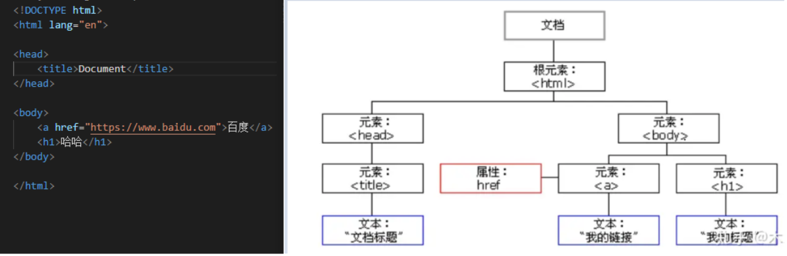

# HTML 与 Dom [原文链接](https://blog.csdn.net/weixin_44296929/article/details/103524070)

1. HTML（超文本标记语言）它不是一种编程语言，而是一种标记语言，通俗的来讲 HTML 就是来描述网页用的;

2. HTML 主要表现形式是 HTML 标签，HTML 元素其实和 HTML 标签通常描述的是一个意思；严格来讲 HTML 元素包含了 HTML 的开始标签和结束标签， HTML 文档就是由 HTML 元素组成的树状结构，HTML 元素也就是 HTML 节点（每个 HTML 元素都是一个 HTML 节点），由于 HTML 就是用来描述网页的标记语言，并且 HTML 文档又是由 HTML 节点组成，所以 HTML 文档也称为 web 页面。

3. DOM： 而我们要想操作这些 HTML 节点，就引出了 DOM 的概念，DOM 就是 HTML 和 XML 的编程接口，通俗的讲就是我们要想使用编程语言或脚本操作文档，就必须用到这些接口，即操作 HTML 文档就需要 HTML DOM，操作 XML 文档就需要 XML DOM，另外还有核心 DOM，它可以针对任何结构化文档的标准模型，所以有了 HTML DOM，我们可以间接的操作 HTML 文档。

## 那么 DOM 是怎么来的呢，它和 HTML 元素的关系是什么呢？我们又是如何通过 DOM 来操作 HTML 文档的呢？

1. 首先说下 DOM 是怎么来的，其实 HTML 文档加载到浏览器的时候，浏览器最终会载入 HTML 文档并解析 HTML，构建 DOM 模型，也就是说浏览器会解析 HTML 元素为 DOM 元素，HTML DOM 将 HTML 文档视作树结构，这种结构被称为节点树，通过 HTML DOM，节点树中的所有节点均可以通过 JavaScript 进行访问，所有 HTML 元素（节点）均可以被修改，也可以创建或删除节点，由此可见 DOM 模型是浏览器根据 HTML 文档构建出来的。

   **注：** 对于浏览器引擎而言，并不存在"HTML 标签"这回事，本质是 DOM 节点对象，也不存在"HTML 文档这回事"，其本质是 DOM 节点对象组成的文档树。

2. 在 JavaScript 中获取到的都是 DOM 元素，而不是 HTML 元素，JavaScript 中的 DOM 对象，仅仅是一种操作浏览器引擎中的 DOM 对象接口，JavaScript 中的 DOM 对象和浏览器引擎存储的 DOM 节点，本质上所指的不是一个东西，用户实际上仅仅有权操作 JavaScript 中提供的 DOM 对象。什么意思呢？就是说我们通过 JavaScript 操作的 DOM 对象并不是浏览器引擎存储的 DOM 节点也不是 HTML 元素，而 JavaScript 中的 DOM 对象其实是 JS 引擎和浏览器引擎协作，确保了 JavaScript 的 DOM 对象是引擎中 DOM 节点的一个原样映射，这样用户就能通过操作 JavaScript 的 DOM 对象，透明的修改引擎中储存的 DOM 节点。

3. 浏览器引擎本质上，仅仅负责 DOM 树更新时承担重新渲染，实际上并不关心 JS 的存在，也就是说 JS 如何操作如何修改并不关心，但是 JS 修改之后，浏览器会将 DOM 树更新并负责重新渲染到浏览器的页面中。

4. 小结：也就是说对于 HTML 文档、浏览器引擎、和 JavaScript 引擎他们各自有各自的作用；

   - 对于 HTML 文档来说，它本身是由 HTML 元素（HTML 节点）组成的一个 HTML 节点树，它主要是负责描述页面；
   - 对于浏览器引擎来说它主要是负责加载解析 HTML 文档并构建 DOM 树，DOM 树是由 DOM 节点组成；
   - 浏览器又和 JavaScript 相互协作，构建了浏览器引擎中 DOM 节点的一个原样映射供用户来进行操作，用户通过操作 JavaScript 的 DOM 对象，透明的修改引擎中的 DOM 节点，最后浏览器再更新 DOM 树并重新渲染完成修改。

5. HTML 元素和 DOM 节点对象是一 一对应的关系，HTML 属性和 JavaScript 的 DOM 对象属性，本质上都是影响 DOM 节点对象数据的众多理由之一，多个原因影响同一个 DOM 节点的实质数据，是多对一关系，请务必记住这个本质理由。

## HTML DOM 节点对象是何方神圣

1. 当浏览器载入 HTML 文档，它就会变成为 Document 对象，Document 对象是 HTML 文档的根节点，Document 对象使我们可以从脚本中对 HTML 页面中的所有元素进行访问（提示：Document 是 Window 对象的一部分，可以通过 window.document 属性对其进行访问），还记不记得我们使用 js 获取元素时都是 document.getElementById()等等，可见 document 对象非常的重要了

2. 在 HTML DOM 中，元素对象代表着一个 HTML 元素，

   - 元素对象的子节点可以是元素节点、文本节点、注释节点， NodeList 对象代表了节点列表，类似于 HTML 元素的子节点集合，
   - 元素可以有属性，属性属于属性节点，在 HTML DOM 中 Attr 对象代表一个 HTML 属性，HTML 属性总是属于 THML 元素，HTML 元素中只有标准特性才会以属性的形式添加到 DOM 对象中，所以如果你在元素中加入了自定义属性，通过 DOM 节点对象获取是获取不到的。

3. JavaScript DOM 对象属性名和 THML 属性名,近似是 JavaScript 给 Web 开发者的恩惠，选择只记忆 HTML 属性名，然后记忆（或者是采坑后再反查）JavaScript 属性中少量和 HTML 不同名的差异点，这是很自然的。
