# AI

思维导图 xmind、流程图 ProcessOn/draw.io、组织架构图

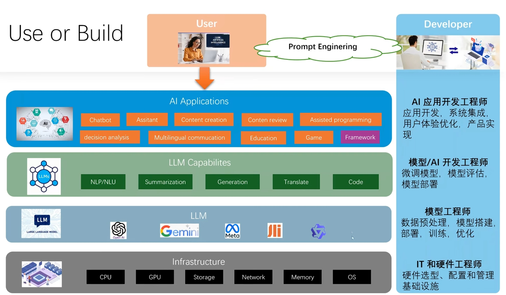

- 读取物料库；
- 检索-相关语句；
- LLM-大模型；
- 输入

## 大模型 2 类：1. RAG；2. 微调

1. 目前 LLM 的能力还不足以落地生产级应用
2. 怎么提高模型能力：评估：精确

## NLP、NLU、NLG

- Natural Language Processing(自然语言处理)：形式和结构，分词识别
- Natural Language Understanding(自然语言理解)：含义和上下文，理解
- Natural Language Generation(自然语言生成)：生成人类语言


1. AI（人工智能）：计算机科学下的一个学科；让计算机系统模拟人类智能，从而解决问题和完成任务；
2. 机器学习：是 AI 的一个子集；核心：不需要人类做显式编程，而是让计算机通过算法，自行学习和改进，去识别模式、做出预测和决策；

   - 给电脑大量玫瑰和向日葵的图片，让电脑自行识别模式、总结规律，从而能能对没见过的图片进行预测和判断；
   - 机器学习：包含 监督学习、无监督学习、强化学习；

3. 深度学习：是机器学习的一个方法，核心在于使用人工神经网络，模仿人脑处理信息的方式，通过层次化的方法，提取和表述数据特征；

   - 神经网络：有许多基本的计算和存储单元组成；
   - 这些单元被称为神经源；这些神经元通过层层连接起来处理数据，并且深度学习模型通常有很多层（称为深度），每一层都会对数据进行处理和转换，从而提取出更高层次的特征；

4. GAI（生成式 AI）：是深度学习的一个应用，能够生成新内容，如文本、图像、视频等；
5. LLM（大语言模型）：是深度学习的一个应用，专门用于自然语言处理任务；（特征“大”，GPT、LLaMA）

## 机器学习（Machine Learning）

- 监督学习（Supervised Learning）: 机器学习算法会接收有标签的训练数据，

  1. 标签就是期望的输出值；
  2. 每个训练数据点都包含输入特征和期望的输出值；
  3. 算法的目标是：学习输入和输出之间的映射关系，从而在给“新的输入特征”后能准确预测书相应的输出；

  - 数据集--》监督员打标签（模型训练）--》机器学习算法--》模型
  - 输入测试数据集--》模型--》预测输出

  应用：回归（预测房价）、分类

- 无监督学习：学习的数据是没有标签的；

  1. 算法的任务：自主发现数据里的模式或者规律；

  - AI 算法自动提取特征，自动分类；
  - 原始数据（无标签）--》机器学习算法（寻找规则）--》模型--》归类
  - 可以调整 机器学习算法 按不同规则输出

  应用：聚类（根据颜色/形状分类）、关联规则（推荐算法）

- 强化学习：让模型在环境中采取行动，获得结果反馈，从反馈里学习，从而能在给定情况下采取最佳行动，来最大化奖励或最小化损失；

  1. 机器学习算法自动学习，没有标签，只有奖励和惩罚（采纳和丢弃）；
  2. 逐渐向奖励方向倾斜；
  3. 专注于让智能体（Agent）通过与环境交互学习最优策略，以最大化累积奖励。其核心思想是“试错学习”，类似于人类或动物通过经验改进行为的过程。

  机器学习效果苹果：欠拟合（未达到效果）、最佳拟合、过拟合（没有泛化能力，只能基于训练数据）

## 深度学习

一种机器学习架构，使用多层人工神经网络，模仿人脑的工作方式来解决复杂的模式识别问题。能够从图像、语音、自然语言中自动提取高层次的特征。

- Transformer：一种基于`自‘注意力’机制`的深度学习模型，用于处理序列数据。它能够并行处理数据，并且能够捕捉长距离的依赖关系，因此在自然语言处理、计算机视觉等领域取得了显著的成果。
  1、从 “片段记忆” 到 “全局记忆”；
  2、从 “串行处理” 到 “高效并行”；

- GPT（Generative Pre-trained Transformer）：生成式预训练 Transformer
- GAI（Generative AI-生成式 AI）：一种能够生成新内容的 AI 技术，如文本生成、图像生成等。

  1. GAI 生成的内容就是 AIGC。
  2. 如 chatGPT、DALL-E 等。

- AIGC（AI-Generated Content）： AI 生成的内容（例文本、图像、视频等）。

- LLM（Large Language Model）：大型语言模型，如 GPT-3、GPT-4 等。

## LLM -- 大型语言模型

1. “大量文本”进行“无监督学习”；借助海量数据，模型能更好的了解单词与上下文之间的关系，从而更好地理解文本的含义，并生成更准确地预测；
2. 参数数量也是巨大；参数是模型内部的变量，可以理解为是模型在训练过程中学到的知识；
   - 参数决定了模型如何对输入数据做出反应，从而决定模型的行为；
   - 例如：做蛋糕时，允许 AI 调整（面粉、糖、蛋）与（面粉、糖、蛋、奶油、牛奶苏打粉、可可粉、时常、温度），可以调整的越多，蛋糕越好吃；
   - GPT-1：1.75 亿参数; GPT-2：15 亿参数; GPT-3：1750 亿参数; GPT-4：1000 万亿参数；
3. 可以完成：生成、分类、总结、改写等工作

## Transformer 架构（2017 年谷歌推出的）

- 自注意力机制

  1. Transformer 在处理每个词时，会注意输入序列中的所有词，而不仅仅是词本身和相邻的词。给予每个词不一样的注意力权重；
  2. 权重是模型在训练过程中通过大量文本逐渐习得的，因此 Transformer 有能力知道当前词和其他词的相关性有多强，然后专注输入里真正重要的部分。
  3. 即使 2 个词位置隔得很远 Transformer 也能捕捉到它们之间的依赖关系。从而更好地理解文本的含义。

  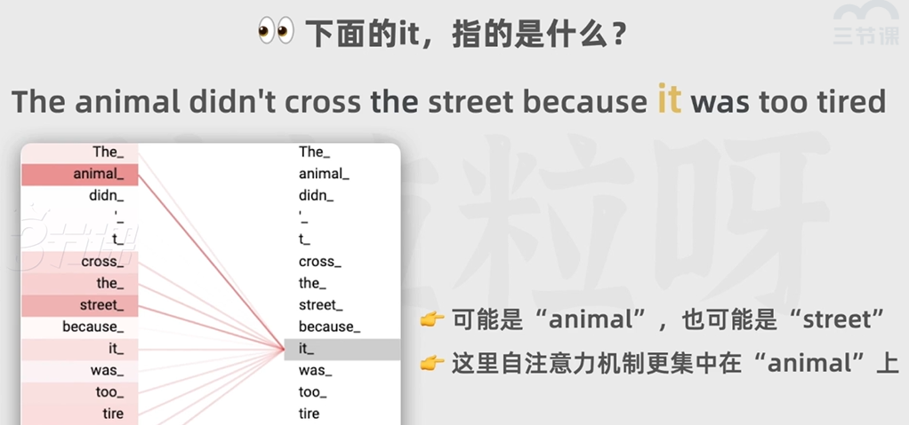

- 位置编码

  在把词输入给神经网络前，Transformer 会对词进行嵌入，转化为向量（也就是把词用成一串数字表示）；
  还会给每个词用一串数字表示，添加到输入序列的表示中；然后把这个结果给神经网络；
  大模型即可以理解每个词的意义，又可以捕获词在句子中的位置，从而理解不同词之间的顺序关系；
  借助位置编码，词可以不按顺序输入给 Transformer，模型可以同时处理输入序列里的所有位置，不需要像 RNN 那样一次处理；
  在计算时，每个输出都可以独立计算，不需要依赖其他位置的计算结果，从而大大提高了计算效率（训练速度）；

  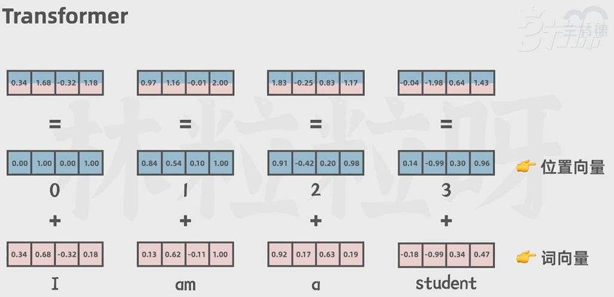

  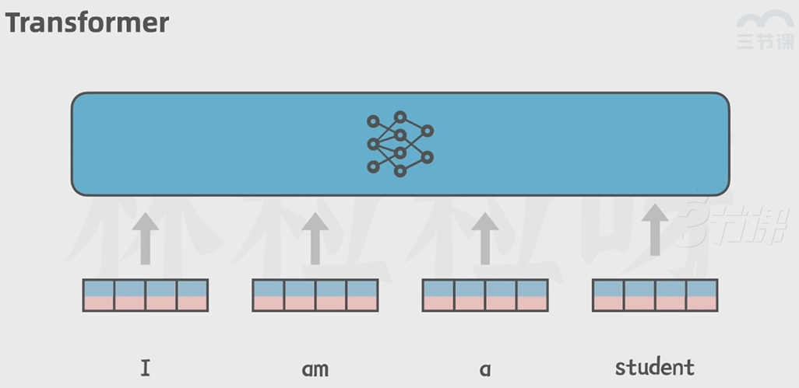

## Transformer 处理流程

chatGpt：通过预测出现概率最高的下一个词来实现文本生成的；

Transformer：主要分为 编码器（Encoder）和 解码器（Decoder）；

- 编码器：用来理解和表示输入序列； 将输入序列（如文本）转化为一系列向量（称为“上下文向量”），这些向量捕捉了输入序列中的信息；
- 解码器：用来生成输出学列； 将上下文向量转化为输出序列（如文本），通过预测下一个词来实现文本生成。

- 编码器

  1. token 化： 输入的文本先被 token 化（把输入拆分为各个 token）；

     - 短单词：可能每个词一个 token；
     - 长单词：可能拆分为多个 token；
     - 每个 token 会用一个整数表示，叫 token ID；

     * 原因：计算机内部无法储存文字，任何字符最终都得用数字表示，最终都会被转化为二进制

     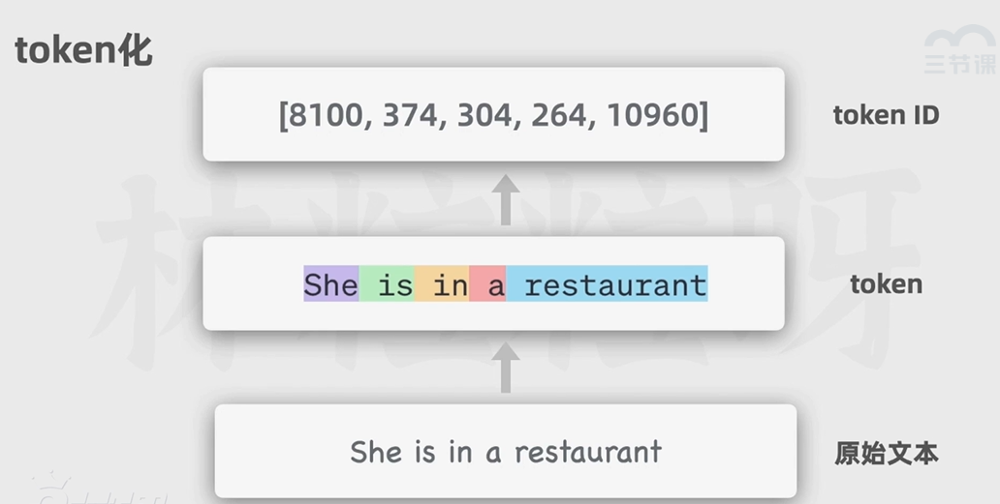

  2. 向量嵌入：嵌入层的作用是：让每个 token 都用向量表示；

     - 向量：可以简单的看做一串（组）数字；一串（组）数字能 表示的含义大于一个数字；
     - 将每个词（或子词）映射为一个高维向量（如 512 维），转化为模型可处理的数字形式。
     - 例如："cat" → [0.2, -0.5, 0.7, ...]（通过查找`预训练的嵌入表` 或 `随机初始化后学习`）。

     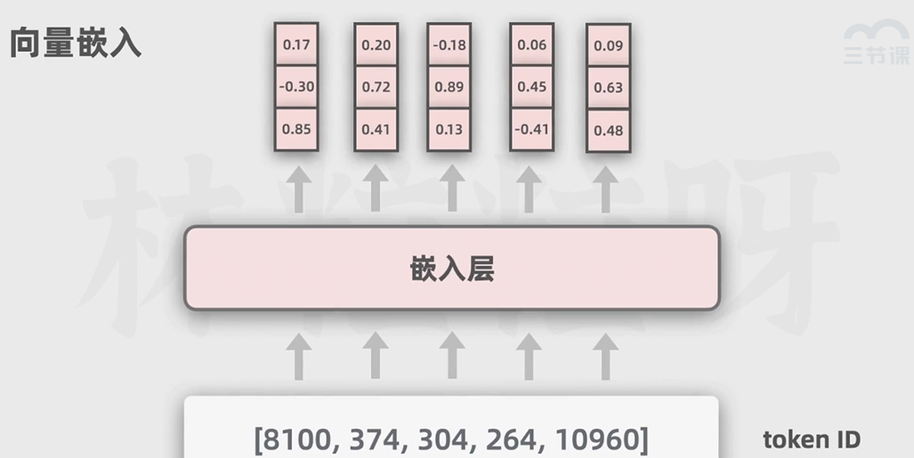

  3. 位置编码：把各个词在文本里的顺序向量化；

     - 例如：第 1 个位置的编码 → [sin(θ₁), cos(θ₁), sin(θ₂), cos(θ₂), ...]。

     - 位置编码的目的是：让模型知道词的顺序，因为词的顺序在自然语言中非常重要；
     - 位置编码是固定的（基于数学公式计算，不参与训练），不会随着训练过程改变；
     - 与词向量 相加后，输入既包含语义，又包含位置信息；模型即可以理解每个词的意义，又可以捕获词在句子中的位置，从而理解不同词之间的顺序关系。

     

     

  4. 编码器--核心部分：包括 2 部分：自注意力机制、前馈神经网络；

     - 把输入转换成一种更抽象的表示形式，也是向量，即一串（组）数字；
     - 里面即保留了输入文本的词汇信息和顺序关系，也捕捉了语法语义的关键特征；

     - 捕捉关键特征的核心是编码器的“自注意力机制”：

       1. 自注意力机制：模型在处理每个词时，不仅会关注这个词本身和相邻的词，还会关注输入序列中所有的其他词；
       2. 自注意力机制 通过计算每个词之间的相关性来决定“注意力权重”；如果 2 个词之间的相关性更强，它们之间的注意力权重就更高；
       3. 自注意力机制 对上下文的全面关注，在输入的结果里 不仅包含词本身的信息还融合了上下文中的相关信息；
       4. 有 N 个自注意力机制，每个头都有自己的自注意力机制，用来关注文本里不同特征或方面（例有的关注动词、有的关注修饰词等）；
       5. 每个自注意力头可以并行计算，互不影响；
       6. 每个自注意力头的权重：都是模型在之前的训练中 从大量文本里逐渐学习和调整的；

     - 前馈神经网络：对多头自注意力机制的输出进行进一步处理，增强模型的表达能力

     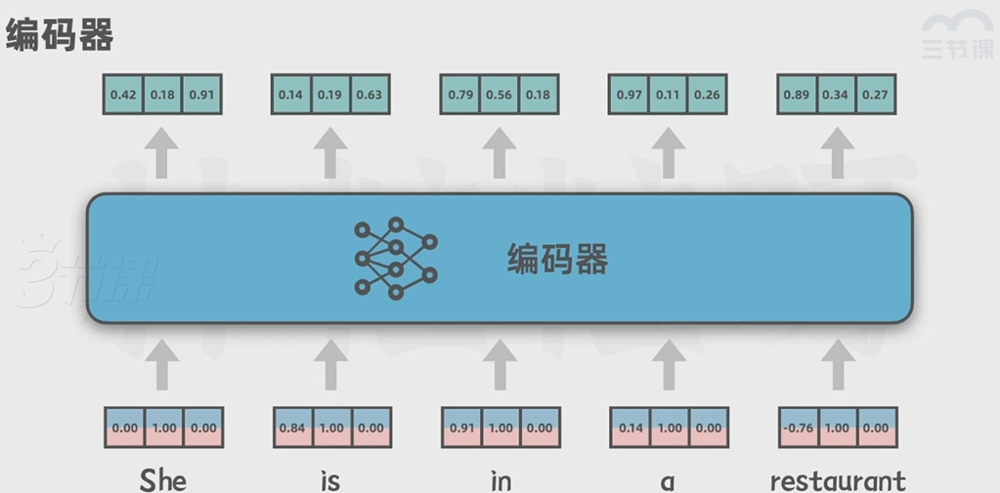

     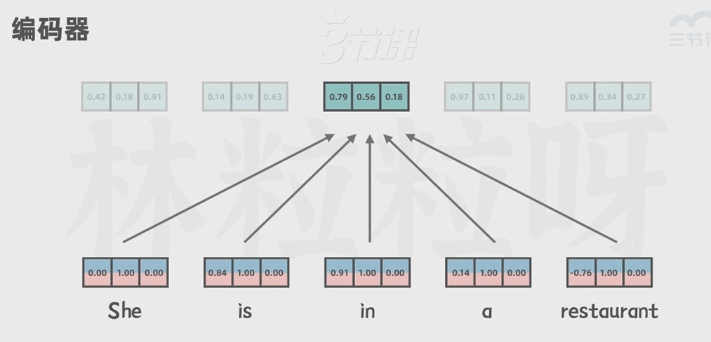

     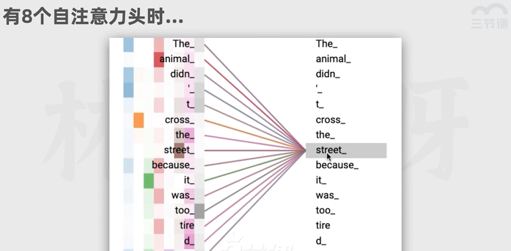

  5. 编码器在 Transformer 有 N 个；每个编码器内部结构一样，但不共享权重；这样模型能更深入理解数据，处理更复杂的文本语言内容；

通过 编码器 有了输入序列里 各个 token 的抽象表示，可以把它传给解码器；

- 解码器

  1. 先接收一个特殊值：表示输出序列的开头；

     - 解码器不仅会把来自编码器的输入序列的抽象表示作为输入，还会把之前已经生成的文本也作为输入，来保持输出的连贯性和上下文相关性；

  2. 文本经过嵌入层和位置编码，然后被输入进“带掩码的多头自注意力层”
  3. 解码器--核心部分：包括 3 部分：带掩码的多头自注意力层、多头注意力层、前馈神经网络；

     - 带掩码的多头自注意力：是针对已生成的输出序列的；只会关注这个词和它前面的词，后面的词要被遮住，不去关注；
     - 被遮住目的：确保解码器生成文本时遵守正确的时间顺序；在预测下一个词时：只使用前面的词作为上下文；

     - 后面的多头注意力层：处理“编码器”输出的输入序列的抽象表示；注意力会捕捉编码器的输出和解码器即将生成的输出之间的对应关系，从而将原始输入序列的信息融合到输出序列的生成过程中

     - 前馈神经网络：和编码器的类似，也是通过额外的计算，来增强模型的表达能力；

  4. 解码器也是多个(N 个)堆叠到一起的；增加模型的性能，有助于处理复杂的输入输出关系；
  5. 解码器的最后阶段：包含 1 个线性层和 1 个 Softmax 层；2 个合起来的作用：将解码层输出的表示 转换为词汇表的概率分布；
     - 词汇表的概率分布：代表下一个被生成的 token 的概率；
     - 有些 token 的概率比其他的高，大多少情况下，模型会选择概率高的 token 作为下一个输出；
     - 解码器本质是在猜下一个输出；
  6. 解码器的整个流程会重复多次，新的 token 会持续生成，直到生成的是一个用来表示输出序列结束的特殊 token;

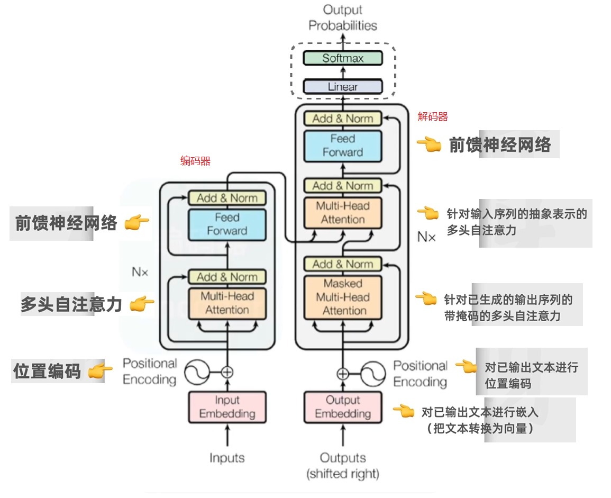

## 如何训练出一个 AI 聊天助手

1. 通过大量文本进行无监督学习预训练，得到一个能进行文本生成的“基座模型”；
2. 通过一些人类撰写的高质量的对话数据，对基座模型进行监督微调，得到一个“微调后的模型”。此时的模型 除了能续写文本之外，也会具备更好的对话能力；
3. 用“问题和多个对应回答”的数据，让人类标注员对“回答”进行质量排序，然后基于这些数据，训练出一个 `能对回答 进行评分预测的“奖励模型”`；
4. 让第 2 步得到的模型对问题生成回答，用奖励模型对回答进行评分，利用评分作为反馈，进行强化学习训练，就这样 chart GPT 就诞生了；

- 详细

1. 需要海量文本语料库 用来训练；
2. token：大语言模型的基本文本单位；短的英文单词 1 个词 1 个 token，长的英文单词可能被分为多个 token；中文 1 个字可能需要 1 个或者更多 token 来表示；
3. 预训练最烧钱，需要大量数据，大量算力；
4. 基座模型 --微调--》微调后的模型（sft 模型）--（奖励模型）强化--》
5. 奖励模型：提示词--》sft 模型--》生成多个答案，人类对答案进行质量排序，训练出一个奖励模型；

## python

python 代码 --》python 解释器 --》机器；
python 运行过程：翻译一行执行一行；
python 代码 --》编译器 --》机器码；

## Jupyter Notebook 介绍、安装及使用教程

## key : openai / 通义千问（Qwen 阿里云兼容 openai）

1. 密钥保存本地：

   - win: 电脑--》属性--》高级系统设置--》环境变量--》系统变量--》新建：OPENAI_API_KEY:"密钥";
   - mac: 终输入 ps -p $$ ; 查看 CMD 是 bash？还是 zsh？
     1. bash：配置类别位于: ~/.bash_profile “/” zsh：配置类别位于: ~/.zshrc
     1. 打开配置文件，添加：export OPENAI_API_KEY="密钥"
     1. source ~/.zshrc “/” source ~/.bash_profile

2. 代码：

   ```python
   import os
   from openai import OpenAI
   client = OpenAI() #调用 openai直接这样就可以
   #  client = OpenAI(api_key=os.getenv("ALI_API_KEY"),base_url="https://dashscope.ali.com/v1") #调用阿里的通义千问：传 api_key 和 base_url
   response  =client.chat.completions.create(
       model="XXXX", ## 模型版本类型；例如：gpt-3.5-turbo; qwen-1-1-turbo;
       response_format={"type":"json_object"}, ## 部分模型支持：返回格式；例如：json、yaml、xml；
       messages=[
           {
               "role":"user", ## system: 给系统提示；user:用户；assistant:chatGPT的回复；
               "content":"内容",
           }
       ],
       max_tokens=1024, ## 生成内容的最大 token 数量(到达直接截断)；
       temperature=0.9, ## 0-2 之间(默认:1)；改变的是各个token的概率分布；数值越大，越随机，创造性越高；数值越小，越确定，创造性越低；
       top_p=1, ## 0-1 之间(默认:1)，获取词汇表中概率有大到小之和，不超过设定值；数值越大，越随机；数值越小，越确定；
       ## temperature / top_p 二选一调整；
       frequency_penalty=0, ## -2~2 之间(默认:0)，惩罚重复出现的 token；数值越大，惩罚越重（出现过多，降低出现概率）；
       presence_penalty=0, ## -2~2 之间(默认:0)，惩罚不出现的 token；数值越大，惩罚越重（只看是否出现，出现了，就降低概率）；

   )
   print(response.choice[0].message.content)
   ```

3. tiktoken：计算 token 数量；

   ```python
   import tiktoken
   encoding = tiktoken.encoding_for_model("gpt-3.5-turbo")
   len(encoding.encode("内容"))  ## 长度就是token个数；
   ```

## 提示词工程

1. 使用最新的模型；
2. 把指令放在提示的开头，并且用###或者“”“来分割指令和上下文；例：“”“文本”“”；
3. 尽可能对上下文和输出的长度、格式、风格等给出具体、描述性、详情的要求；
4. 通过一些例子来阐明想要的输出“格式”；
5. 先从零样本提示开始，效果不好，则用小样本提示；
   - 零样本：不给 AI 任何示范；
   - 小样本：给 AI 一些参考例子；
6. 减少空洞和不严谨的描述；
7. 告诉应该做什么，而不是：不能做什么

- 限定输出格式：
- 小样本提示：给出一些例子，让 AI 按例子回答；、
- 思维链与分步骤思考：一步一步引导 AI 思考；

## LangChain 框架

AI 模型不会存储上次会话内容；

一个强大的 AI 应用不仅是调用模型 api,还能感知上下文，链接外部数据，并且借助外部工具与环境进行互动，来生成更好的回答；因此，LangChain 框架应运而生，它是一个开源的框架，用于构建和操作语言模型应用程序；它提供了一套工具和库，用于构建和管理语言模型应用程序，包括数据输入、模型调用、结果输出等环节，并且支持多种语言模型，包括 GPT-3、GPT-4 等；

- LangChain 提供了一系列组件和链来简化开发过程；

  例：如果希望 AI 有记忆，借助 LangChain 不需要手动维护一个储存消息的列表，而是创建一个 ConversationBufferMemory 实力，连同模型的实例一起作为对话链的参数，之后每次对话时，新消息都会自动被添加，全部传给模型，相当于模型被外接了记忆，帮助应用开发者管理对话状态；

- LangChain 为“不同模型”提供了统一的接口（抽象层）；
- ChatModal(聊天模型)

* Assistant API 与 LangChain 区别：

1. Assistant API：通过 Assistant API 发送文本提示给模型，然后接受模型生成的回应；
2. LangChain：利用 LangChain 提供的多种工具和组件，创建基于模型的应用；
3. 支持的范围不同：
   - Assistant API：仅支持 openAI 模型；
   - LangChain：支持多种模型，包括 openAI、文心一言、通义千问 等；

- LangChain 的核心组件：
  `pip install langchain`

1. 模型（Model）：语言模型，提供语言理解和生成能力，是 AI 应用的核心；（如 GPT-3、GPT-4、通义千问 等；）
2. 记忆（Memory）：用来储存和管理对话历史（相关的上下文信息）；这个组件是对话型 AI 应用中保持连贯性和上下文感知的关键
3. 链（Chain）：是把不同组件串联起来的结构，能让我们创建出复杂的流程，流程里的每个组件可以负责处理特定的任务
4. 检索器（Retriever）：负责从外部信息源检索信息，对增加模型的知识面和回答准确性很重要
5. agent（智能体/代理）：代表一个基于大模型的，能执行一系列动作的智能体；核心理念是利用 AI 模型的能力进行推理，根据任务，动态评估和确定行动路径

## RAG（Retrieval Augmented Generation - 检索增强生成）

应用空间：小众细分领域，例：公司内部数据、个人私密文件等；

检索增强生成：提供外部文档，让模型访问外部知识库，获得实时且正确的数据，生成更可靠和准确的回答；当用户提出和外部知识相关的问题后，AI 可以结合知识库里的内容，进行回答；

1. 准备外部数据；外部文档要先加载出来，并且切分成一个个文本块（因为大语言模型的上下文窗口有限，即一次能接收的文本长度有限），然后每个文本块会被转成一系列的向量（可以把向量看作一串固定长度的数字），文本块并不能随便转成数字，向量中要包含文本之间的语法语义等关系（例：相似的文本所对应的嵌入向量，在向量空间里的距离更近，而一些没关系的文本之间的距离就更远）；这有助于模型基于数学，计算向量空间里的距离，去捕捉不同文本在语义和语法等方面的相似； 这些向量都要被储存进向量数据库里，现在外部数据就准备好了；
2. 搜索；当用户提出问题时，这个提示也会被转换为向量，然后查找向量数据库里和用户的查询向量距离最近的段落向量（距离近就表示他们内容相似）；
3. 询问；上一步中和用户查询最为接近的段落被提取了出来，于是，这个段落会和用户的查询组合到一起，一块传给 AI 模型，这样 AI 就能把外部文档的段落作为上下文，基于里面的信息，返回更准确的回答；
4. 因此，借助 RAG，用户可以对外部文档里任何内容进行提问，即使 AI 模型从来没有受到过那些内容的训练； RAG 有利于搭建企业知识库或个人知识库

## ReAct（Reason and Action - 推理和行动）

AI 局限性：大模型天然受到训练数据日期的影响 - 知识截断；

模型持续更新：ReAct（推理和行动） 核心：让模型进行“动态推理”，并采取行动与外界环境互动；也就是我们会引导模型进行推理，并且让它知道可以根据外界环境采取哪些行动。

为了让模型实现 ReAct，我们可以借助思维链，用小样本提示展示给模型一个推理与行动结合框架；也就是针对问题 把步骤进行拆分，每个步骤要经过 推理、行动、观察；
推理：是针对问题或上一步观察的思考；
行动：是基于推理与外部环境的一些交互；例用搜索引擎对关键字进行搜索；
观察：是对行动得到的结果进行查看；

推理和行动：AI 模型可以基于当前状态，推理出下一步的行动，并执行这个行动；

## agent（智能体） 执行器

AI 既能根据用户的输入以及环境进行动态推理，也能基于推理采取合理的行动，并且在需要的时候借助合适的外部工具，通过结合不同的工具来增强模型的功能和效率，我们把这个能理解用户的查询或指令进行推理并执行特定任务，最后输出响应的服务叫做 agent（智能体或代理）

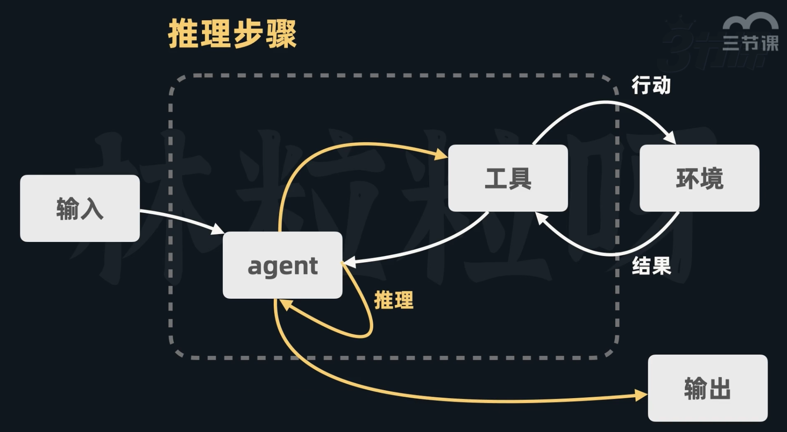
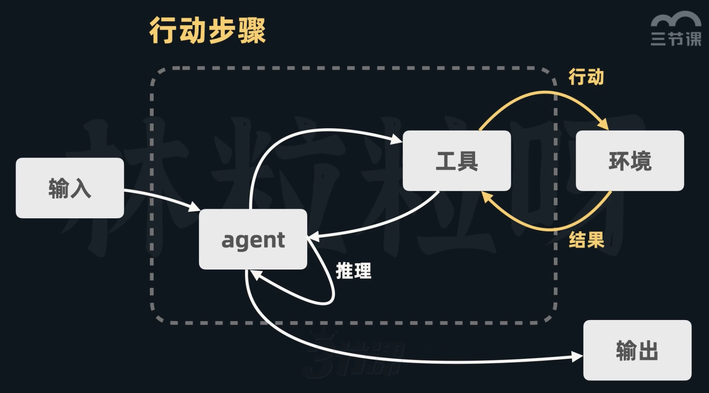
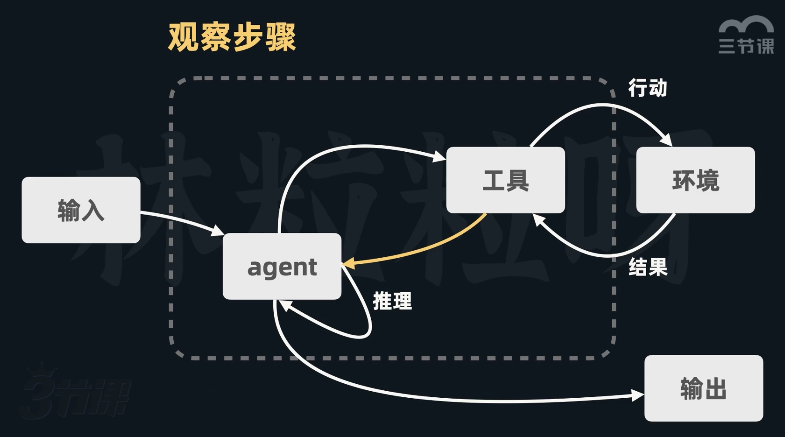


## PAL
