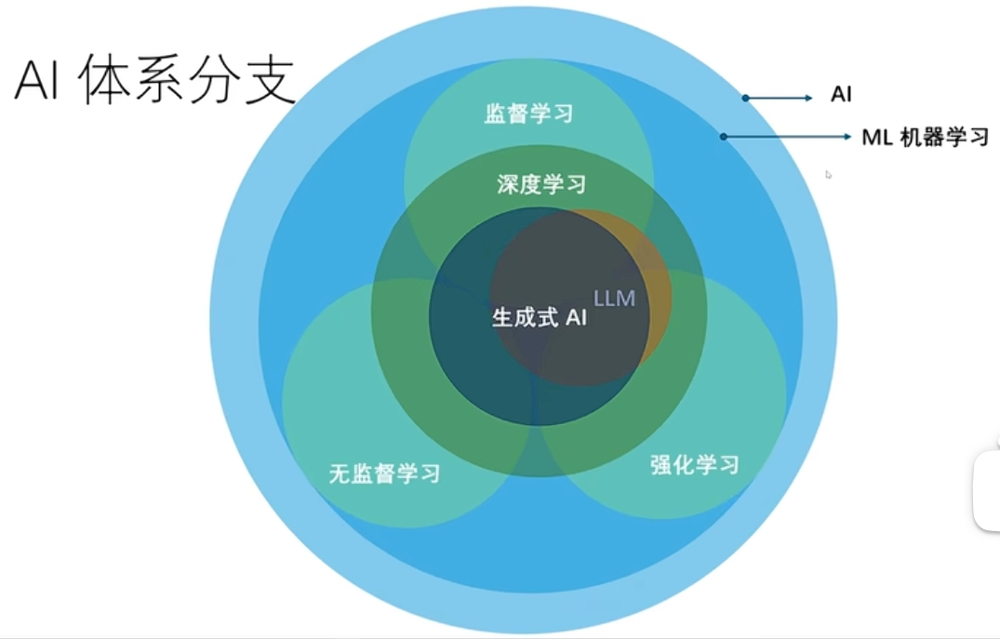

# AI

- 读取物料库；
- 检索-相关语句；
- LLM-大模型；
- 输入

## 大模型 2 类：1. RAG；2. 微调

1. 目前 LLM 的能力还不足以落地生产级应用
2. 怎么提高模型能力：评估：精确

## NLP、NLU、NLG

- Natural Language Processing(自然语言处理)：形式和结构，分词识别
- Natural Language Understanding(自然语言理解)：含义和上下文，理解
- Natural Language Generation(自然语言生成)：生成人类语言

## 机器学习（Machine Learning）

- 监督学习（Supervised Learning）:人类指导机器学习，打标签

  1. 数据集--》监督员打标签（模型训练）--》机器学习算法--》模型
  2. 输入测试数据集--》模型--》预测输出

  应用：回归、分类

- 无监督学习：

  1. AI 算法自动提取特征，自动分类；
  2. 原始数据（无标签）--》机器学习算法（寻找规则）--》模型--》归类
  3. 可以调整 机器学习算法 按不同规则输出

  应用：聚类（根据颜色/形状分类）、关联规则（推荐算法）

- 强化学习：

  1. 机器学习算法自动学习，没有标签，只有奖励和惩罚（采纳和丢弃）；
  2. 逐渐向奖励方向倾斜；
  3. 专注于让智能体（Agent）通过与环境交互学习最优策略，以最大化累积奖励。其核心思想是“试错学习”，类似于人类或动物通过经验改进行为的过程。

  机器学习效果苹果：欠拟合（未达到效果）、最佳拟合、过拟合（没有泛化能力，只能基于训练数据）

## 深度学习

一种机器学习架构，使用多层人工神经网络，模仿人脑的工作方式来解决复杂的模式识别问题。能够从图像、语音、自然语言中自动提取高层次的特征。

- Transformer：一种基于自注意力机制的深度学习模型，用于处理序列数据。它能够并行处理数据，并且能够捕捉长距离的依赖关系，因此在自然语言处理、计算机视觉等领域取得了显著的成果。
  1、从 “片段记忆” 到 “全局记忆”；
  2、从 “串行处理” 到 “高效并行”；

- GPT（Generative Pre-trained Transformer）：生成式预训练 Transformer
- 生成式 AI（Generative AI）：一种能够生成新内容的 AI 技术，如文本生成、图像生成等。
- AIGC（AI-Generated Content - AI 生成内容）：由 AI 生成的内容，如文本、图像、视频等。
- AIGC 生成器：生成 AIGC 的 AI 系统，如 GPT、DALL-E 等。
- LLM（Large Language Model）：大型语言模型，如 GPT-3、GPT-4 等。

## 第 5 集
